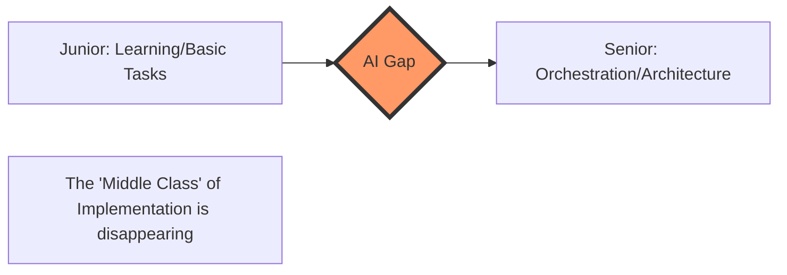

Software engineering is undergoing a seismic shift. For decades, the industry operated on a predictable, hierarchical pyramid: a broad base of junior developers learning the basics, a sturdy middle class of "implementation specialists" who translated Jira tickets into functional code, and a small peak of architects and staff engineers who designed the overarching systems.

  
  
 <a href="https://unsplash.com/@tinkerman">Immo Wegmann</a> on <a href="https://unsplash.com/photos/a-piece-of-cardboard-with-a-keyboard-appearing-through-it-vi1HXPw6hyw">Unsplash</a>

However, the advent of Large Language Models (LLMs) is punching a hole straight through the center of that pyramid. We are witnessing the "hollowing out" of the profession. The ability to simply *write code*—the act of translation from a requirement to a syntax—is becoming a commodity. This is creating a dangerous gap between those just entering the field and the elite engineers who steer the ship.

### 🛠️ The Death of the "Implementation Specialist"

For years, the "middle class" of software engineering consisted of developers who were proficient in specific frameworks and could reliably build features based on a technical specification. These engineers weren't necessarily designing distributed systems or optimizing cloud infrastructure, but they were the engines of production. They handled the boilerplate, wrote the unit tests, and constructed the API endpoints.

The problem is that this specific skill—taking a clear requirement and turning it into syntactically correct code—is precisely what LLMs do best. With the integration of tools like [GitHub Copilot](https://github.com/features/copilot) and [Cursor](https://cursor.com), coding is transitioning from a manual craft into a supervisory role. When a senior architect can prompt an AI to spin up a fully functional CRUD module in seconds, the need for three mid-level developers to spend a week on it vanishes.

As discussions on [Hacker News](https://news.ycombinator.com) frequently highlight, the industry is moving toward a reality where **one senior engineer wielding AI can produce the output of an entire small team**. The middle is being squeezed because value is no longer found in the *act* of typing; it is found in the *intent* behind the code. The "implementation specialist" is being replaced by a prompt and a verification loop.

### 🏗️ The Rise of the "AI Orchestrator"

As the middle tier evaporates, the top of the pyramid is evolving. We are seeing the emergence of the "AI Orchestrator." These developers act less like writers and more like editors-in-chief. They no longer spend their afternoons fighting with syntax or hunting for a missing semicolon; instead, they focus on high-level system design, security audits, and complex integration patterns.

The core metric of value has shifted from **generative capacity** (how much code can you churn out?) to **discernment capacity** (is this AI-generated code actually secure, scalable, and maintainable?). Research appearing on [ArXiv](https://arxiv.org) suggests that while AI drastically reduces the time spent on routine coding tasks, the "cognitive load" is shifting toward the verification and integration phases.

> "The bottleneck is no longer the speed of typing or the memory of API signatures, but the ability to architect a system that is robust enough to survive the rapid injection of AI-generated components."

In this new paradigm, the "Elite" are those who can manage the complexity of a codebase that is growing at AI speed. They handle the "Why" and the "How it fits together," while the AI handles the "What." This is a massive productivity win for the top **10% of engineers**, but it is a precarious position for those whose primary value was simply being "good at coding."

### 🪜 The Junior Crisis: A Broken Ladder

If the middle class vanishes, how do juniors ever become seniors? This is the most critical failure point in the current AI transition. Traditionally, junior developers climbed the career ladder by performing "middle-class" tasks: fixing simple bugs, building basic components, and grinding through boilerplate. This was the "training gym" where they built the intuition and mental models required to eventually become architects.

When the "easy" tasks are automated, the first rung of the ladder is removed. Juniors are now expected to possess a level of judgment and architectural intuition that used to take years of mid-level experience to develop. We are facing a paradox: **AI makes it easier to write code, but significantly harder to learn how to engineer software.**

Without that "missing middle," there is no safe space to fail and learn. If a junior relies on AI to solve every ticket, they aren't building the mental muscles for deep debugging or systemic thinking. They risk becoming "prompt operators" rather than engineers. This creates a pipeline crisis: if we stop training mid-level developers today, the industry will face a **catastrophic shortage of senior architects** within five years.

### 🔍 The New Skillset: Verification over Generation

To survive this shift, we must redefine what "software engineering" actually means. We are moving from a **Generation-Centric Model** to a **Verification-Centric Model**.

In the traditional workflow, the skill was *Generation*:
**Requirement $\rightarrow$ Thought $\rightarrow$ Code.**

In the AI-augmented workflow, the skill is *Verification*:
**Requirement $\rightarrow$ AI Generation $\rightarrow$ Critical Audit $\rightarrow$ Integration.**

This requires a completely different toolkit. Instead of obsessing over the latest syntax update in a specific language, the modern engineer must master:

1.  **Systemic Thinking**: Understanding how a change in one AI-generated module might create a regression in a distant part of a distributed system.
2.  **Security Forensics**: Spotting the subtle hallucinations or security vulnerabilities—such as [prompt injection](https://owasp.org/www-project-top-10-for-llm-applications/) or insecure defaults—that AI frequently introduces.
3.  **Product Engineering**: The ability to take a vague business goal and translate it into a precise technical specification that the AI can execute without "drifting" from the original intent.

Industry trends reported by [TechCrunch](https://techcrunch.com) and [The Verge](https://theverge.com) indicate that companies are increasingly valuing "Product Engineers"—individuals who can bridge the gap between user needs and technical execution—over "Pure Coders." The market is no longer paying for the *labor* of coding; it is paying for the *certainty* that the code is correct.

### 📉 The Money Side: Wage Polarization

When the middle class is removed from an economy, wages typically polarize. In a traditional market, mid-level developers earned stable, competitive salaries because they provided predictable, scalable output. However, when that output is commoditized by an LLM, the "market price" for a standard implementation specialist plummets.

We are likely heading toward a "Barbell Economy" for software engineering:

*   **The High End**: A small group of "super-engineers" who use AI to perform the work of **5 to 10 people**. Their compensation will likely skyrocket because they are the primary drivers of value and risk management.
*   **The Low End**: A large pool of "AI-assisted technicians" who can build basic applications and websites but cannot architect complex, mission-critical systems. Their wages will be pushed down by the sheer volume of AI-generated output.

Data from [Stack Overflow's Developer Survey](https://survey.stackoverflow.co) suggests that while overall productivity is increasing, the demand for "feature factories"—teams dedicated solely to churning out basic updates—is shrinking. We are moving from **large teams of average developers** to **tiny teams of elite orchestrators**.

### 🚀 How to Future-Proof Your Career

For those currently in the "middle" or just starting out, the strategy must shift from *mastering tools* to *mastering systems*.

**1. Stop Focusing on Syntax, Start Focusing on Patterns**
Don't just learn how to write a function in Python; learn *why* you would choose a microservices architecture over a monolith. Study [Design Patterns](https://refactoring.guru) and architectural trade-offs. The AI knows the syntax; you must know the strategy.

**2. Embrace the "Audit" Mindset**
Treat AI-generated code as if it were written by a brilliant but highly unreliable intern. Develop a rigorous process for code review. Learn to use [Static Analysis tools](https://sonarsource.com) and automated testing frameworks to validate AI output.

**3. Develop "Product Sense"**
The most secure engineers will be those who understand the business domain. If you understand *why* a feature is being built and *who* it is for, you become the bridge between the business and the AI. This makes you indispensable.

### 🏁 Conclusion: The Evolution of the Craft

AI is not "killing" software engineering, but it is killing the "software developer" as we have known them for thirty years. The loss of the middle class is a painful transition, but it is pushing the craft to become more cerebral and high-leverage.

To survive, engineers must stop identifying as "coders" and start identifying as "problem solvers." The future does not belong to those who can write the most code, but to those who can direct the machines to build the right things, safely and elegantly. The ladder may be broken, but for those who can leap the gap, the view from the top is more powerful than ever.

***

**References & Further Reading:**
- [OpenAI: GPT-4 Technical Report](https://openai.com/research/gpt-4)
- [Anthropic: Model Interpretability Research](https://www.anthropic.com)
- [IEEE Xplore: Software Engineering in the Age of AI](https://ieeexplore.ieee.org)
- [GitHub: The Economic Impact of AI Copilots](https://github.blog)

---

## 📖 Related Reading

- [⚖️ The Gavel and the Algorithm: Why the Supreme Court is Cracking Down on Fake Advocates and Digital Monetization](/supreme-court-seeks-unions-response-on-plea-for-cbi-probe-against-fake-advocates-curbs-on-monetisation-live-law/)
- [What Actually Happened During the IndiGo Emergency Landing in Chennai?](/indigo-flight-makes-emergency-landing-after-engine-failure-full-emergency-declared-at-chennai-airport-the-times-of-india/)
- [🌧️ The Price of a Downpour: Unmasking Mumbai's Urban Fragility](/2-dead-several-feared-trapped-after-landslide-in-mumbais-kurla-following-heavy-rain-india-news-hindustan-times/)
