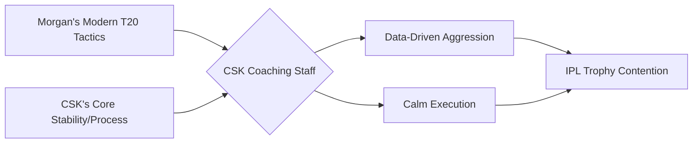

In the high-stakes ecosystem of the Indian Premier League (IPL), rumors are the primary currency. Most are mere noise, but occasionally, a suggestion emerges with genuine tactical weight. Recent insights from Shane Watson—a cornerstone of the Chennai Super Kings' (CSK) golden era—have sparked a fascinating conversation: could former England captain Eoin Morgan be the strategic mastermind to lead the Yellow Army from the dugout?

  
  
 <a href="https://unsplash.com/@mattartz">Matt Artz</a> on <a href="https://unsplash.com/photos/grayscale-photo-of-drill-bits-tXq2I0rLlag">Unsplash</a>

While CSK has enjoyed an unprecedented era of stability under the guidance of Stephen Fleming, Watson’s endorsement suggests that Morgan’s cerebral approach to the game could provide the exact evolution Chepauk requires. The prospect of integrating a World Cup-winning captain into the CSK machinery is not just a headline-grabber; it is a potential masterstroke in succession planning.

---

### 🎙️ The Watson Endorsement: Why it Matters

The speculation gained momentum after Shane Watson spoke candidly about Morgan’s leadership capabilities. Watson isn't just any commentator; he is a player who understands the unique psychological fabric of the CSK dressing room. He didn't simply praise Morgan’s pedigree; he highlighted a specific, rare ability: the capacity to identify a game's turning point several overs before it manifests.

According to reports via [Sportskeeda](https://www.sportskeeda.com), Watson believes Morgan possesses a "rare tactical mind" that aligns perfectly with the CSK ethos. The "Chennai Way" is defined by composure, an unwavering trust in veteran instincts, and a refusal to panic under pressure. For Watson, Morgan is the mirror image of this philosophy on a global scale.

---

### 🧠 The "Morgan Revolution": A Blueprint for Success

To understand why Morgan is being linked to CSK, one must analyze the transformation of English cricket under his stewardship. Morgan didn't just win the **2019 ICC Cricket World Cup**; he dismantled the traditional, conservative approach to limited-overs cricket. 

Under his leadership, England adopted a "fearless" brand of cricket, prioritizing aggression and risk-taking over safety. As noted by [ESPNcricinfo](https://www.espncricinfo.com), this shift fundamentally altered the global landscape of the game, forcing other nations to accelerate their scoring rates and rethink their bowling strategies.

Morgan's approach is characterized by "calculated aggression." Whether it is an unconventional field placement to stifle a set batter or a gut-instinct bowling change that defies data, Morgan plays the game like a high-stakes chess match.

> "Morgan's ability to remain unflappable under extreme pressure is perhaps his greatest asset. He views the game as a chessboard, always thinking three moves ahead, often ignoring the crowd noise to focus on the tactical void the opposition has left open."

This intellectual rigor is precisely what CSK has utilized since the MS Dhoni era. The synergy between a calm captain and a strategic coach (like the Dhoni-Fleming partnership) is the gold standard for the franchise.

---

### 🟡 Synergizing "The Process" with Modern Aggression

CSK operates on a philosophy known internally as "The Process." This methodology focuses on backing players through lean patches, maintaining a level head during collapses, and adhering to a long-term strategic vision. 

Morgan’s leadership style mirrors this. He is renowned for creating "psychologically safe" environments where players feel empowered to take risks because the captain absorbs the pressure of potential failure. If you merge Morgan’s modern T20 tactical aggression with CSK's structural stability, the result is a formidable hybrid.

As the [IPL official records](https://www.iplt20.com) show, the game is evolving toward hyper-specific "match-ups" and data-driven decision-making. Having a leader like Morgan—who can blend hard analytics with an intuitive "feel" for the game—would give CSK a competitive edge in an era where margins of victory are razor-thin.

---

### 🔄 The Fleming Factor and Succession Planning

The inevitable question is whether there is a vacancy. Stephen Fleming has been the architectural backbone of CSK, delivering **5 IPL titles** and an unmatched level of consistency. However, the nature of professional sports dictates that evolution is inevitable. 

While the [Chennai Super Kings official management](https://www.chennaisuperkings.com) has not announced any changes, the timing of Watson's comments is telling. Morgan has already transitioned into a sophisticated analyst role in the commentary box, where he frequently breaks down the intricacies of T20 strategy on platforms like [Cricbuzz](https://www.cricbuzz.com). He remains deeply engaged with the game's tactical evolution.

Whether Morgan enters as a head coach, a strategic consultant, or a mentor, his presence would add a layer of international tactical sophistication to the squad.

---

### 🏁 Final Analysis: A Match Made in Cricket Heaven?

There is no official confirmation that Eoin Morgan will be stepping into the M. A. Chidambaram Stadium in a coaching capacity. However, Shane Watson has planted a seed that is difficult to ignore. 

If CSK successfully blends the "fearless" energy of Morgan’s England with their own methodical, process-driven approach, they would create a tactical behemoth. The transition from the "Dhoni Era" to the next chapter of CSK history requires a leader who understands both the art of winning and the science of the game. In Eoin Morgan, they might have found the perfect candidate. For now, the cricket world watches to see if the England blue will eventually turn into Chennai yellow.

**Key Takeaways:**
*   **Strategic Alignment:** Morgan's calm leadership fits the "CSK Process."
*   **Proven Pedigree:** Leading England to the **2019 World Cup** proves his tactical ceiling.
*   **Watson's Influence:** A former CSK star acts as the bridge for this potential move.
*   **Modernization:** Morgan brings a "fearless" T20 philosophy to a stable franchise.

---

## 📖 Related Reading

- [⚖️ The Gavel and the Algorithm: Why the Supreme Court is Cracking Down on Fake Advocates and Digital Monetization](/supreme-court-seeks-unions-response-on-plea-for-cbi-probe-against-fake-advocates-curbs-on-monetisation-live-law/)
- [What Actually Happened During the IndiGo Emergency Landing in Chennai?](/indigo-flight-makes-emergency-landing-after-engine-failure-full-emergency-declared-at-chennai-airport-the-times-of-india/)
- [Importance Of Life](/importance-of-life/)
