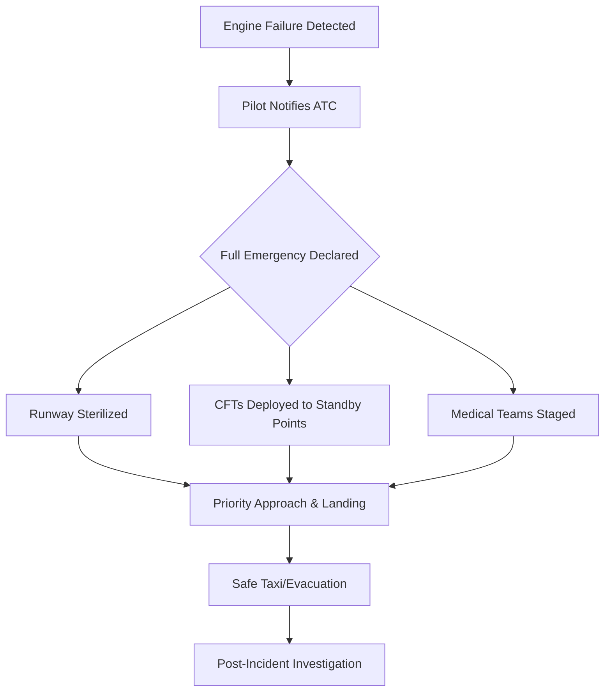

Imagine being on a routine flight from Bengaluru to Chennai—a short hop that usually takes less than an hour, often treated as a mere commute. You are settled in, perhaps glancing at your phone or preparing for a meeting, when the steady, comforting hum of the engines suddenly shifts. For the passengers on IndiGo flight 6E 2134 on October 3, 2024, this wasn't a hypothetical exercise in a safety briefing; it was a sudden reality. One of the engines suffered a critical failure, instantly transforming a mundane trip into a high-stakes emergency.

The flight crew was forced to declare a "Full Emergency" at Chennai International Airport, a signal that triggers an immediate, city-wide mobilization of emergency services. While the event ended with everyone landing safely and without injury, the incident serves as a masterclass in modern aviation safety. It was not a matter of luck, but rather the culmination of rigorous pilot training, redundant engineering, and a global safety culture designed to ensure that a single point of failure does not lead to a catastrophe.

---

## 🚨 The Timeline: From Bengaluru to the Tarmac

  
  
 <a href="https://unsplash.com/@shafinur686rs">Md Shafinur Rahman</a> on <a href="https://unsplash.com/photos/a-large-jetliner-sitting-on-top-of-an-airport-runway-4-MSW1OwSz4">Unsplash</a>

Flight 6E 2134 departed Bengaluru as part of the relentless shuttle service between two of South India's primary economic hubs. However, the routine was shattered when the cockpit crew detected a significant technical malfunction in one of the engines. According to reporting by [The Times of India](https://timesofindia.indiatimes.com/city/chennai/indigo-flight-makes-emergency-landing-after-engine-failure-full-emergency-declared-at-chennai-airport/articleshow/114185634.cms), the failure was identified early, allowing the pilots to transition immediately into emergency checklists.

In aviation, timing is the most critical variable. While losing an engine during the cruise phase—where the aircraft has significant altitude and airspeed—is a manageable scenario, losing power during the descent and approach phase significantly reduces the margin for error. The crew had to maintain a delicate balance: descending quickly to reach the safety of the ground while maintaining enough stability and airspeed on a single engine to avoid a stall.

When the pilots contacted Air Traffic Control (ATC), they used the term "Full Emergency." In the structured language of the [International Civil Aviation Organization (ICAO)](https://www.icao.int), this is a specific declaration. It tells the airport that the aircraft has a serious problem that will likely require the full deployment of emergency services upon landing.

For the passengers in the cabin, the experience was likely one of confusion and mounting anxiety. While the cabin crew focused on maintaining order and preparing the passengers for a possible evacuation, the aircraft—an **Airbus A320**—began an expedited descent. As the plane broke through the clouds over Chennai, the ground teams were already in position. The aircraft touched down safely, ending a high-tension sequence of events.

---

## ⚙️ Engineering Resilience: Can a Plane Really Fly on One Engine?

The most common question following such an incident is: *Can a plane actually stay airborne with only one engine?* The answer is a definitive **yes**. In fact, every single commercial twin-engine aircraft is certified to climb, cruise, and land safely using only one engine.

The [Airbus A320 family](https://en.wikipedia.org/wiki/Airbus_A320_family), which forms the backbone of the [IndiGo fleet](https://en.wikipedia.org/wiki/IndiGo), is built around the concept of "redundancy." Redundancy means that for every critical system, there is a backup. The engines—typically the CFM56 or the more modern LEAP-1A—are designed so that the remaining engine can provide more than enough thrust to maintain altitude, provided the aircraft is not at its maximum takeoff weight.

### The Physics of Asymmetric Thrust
When one engine fails, the aircraft experiences "asymmetric thrust." Because the working engine is still pushing forward on one side while the failed engine is creating drag on the other, the plane naturally wants to "yaw" or pivot toward the dead engine. 

To counter this, pilots use the rudder—the movable flap on the vertical stabilizer at the tail. By applying opposite rudder, the pilot "trims" the aircraft, keeping it flying straight. In the A320, this process is aided by a sophisticated **fly-by-wire system**, which uses computers to translate the pilot's inputs into smooth control surface movements, reducing the physical workload on the crew during a crisis.

### Understanding ETOPS
While this flight was a short domestic trip, the principle is rooted in [ETOPS (Extended-range Twin-engine Operational Performance Standards)](https://skybrary.aero/articles/etops). ETOPS certification allows twin-engine planes to fly long distances over oceans, far from the nearest diversion airport. If a plane can be certified to fly for **180 minutes** on one engine over the Atlantic, a short flight from Bengaluru to Chennai is well within the safety envelope.

> "The design philosophy of modern aviation is not to prevent all failures—because some are inevitable—but to ensure that no single failure results in a catastrophic outcome."

---

## ✈️ Inside the "Full Emergency" Protocol

When a pilot declares a "Full Emergency," the airport transforms from a transit hub into a coordinated rescue operation. At Chennai International Airport, this declaration triggered the Airport Emergency Plan (AEP), a rehearsed sequence designed to eliminate any delay in response.

### The Ground Response Hierarchy
Aviation emergencies are usually categorized into three levels:
1. **Local Standby**: Minor issues where fire services are alerted but stay near their stations.
2. **Full Emergency**: A serious problem is suspected, and full deployment is required.
3. **Aircraft Accident**: An actual crash or fire has occurred.

For flight 6E 2134, the "Full Emergency" status triggered the following actions:

*   **Runway Sterilization**: ATC immediately cleared the runway. All other arriving flights were put into holding patterns or diverted. The emergency aircraft is given "priority handling," meaning it is the only priority in the sky.
*   **Crash Fire Tenders (CFTs)**: Specialized fire trucks, capable of spraying massive amounts of foam and water, are positioned at strategic "standby points" along the runway. The goal is to reach any point of the runway within **two to three minutes**.
*   **Medical Staging**: Ambulances and paramedics are moved to the runway perimeter. They are briefed on the nature of the emergency and are ready to treat passengers the moment they egress the aircraft.
*   **Air Traffic Coordination**: ATC provides a "straight-in" approach, reducing the time the pilots spend maneuvering and allowing them to focus entirely on the landing.

Many passengers find the sight of fire trucks following a plane upon landing to be terrifying. However, in aviation safety, this is known as a "precautionary follow." It is always better to have a fire truck waiting for a plane that doesn't need it than to have a plane that needs a fire truck and finds none.

---

## 🛡️ The Safety Net: Predictive Maintenance and the "Swiss Cheese" Model

IndiGo's operational model relies on a standardized fleet of Airbus A320s. This standardization is a safety feature in itself, as it ensures that every pilot and mechanic is an expert on the exact same machine. However, the real secret to safety lies in how the industry handles "snags."

### Predictive Maintenance (PdM)
Modern aircraft are essentially flying data centers. Every single rotation of the turbine, every temperature spike, and every vibration is recorded. According to research available via [ArXiv on AI in Aviation](https://arxiv.org/search/?query=aircraft+engine+failure&searchtype=all), the industry is moving toward **Predictive Maintenance**. 

Instead of fixing a part every 500 hours (scheduled maintenance), AI algorithms analyze real-time sensor data to find "signatures" of wear. If a bearing is vibrating **0.01%** more than normal, the system flags it for replacement before it ever fails in flight.

### The Swiss Cheese Model
Aviation safety is often explained using James Reason's "Swiss Cheese Model." Each safety measure—pilot training, aircraft design, ATC protocols, and maintenance—is a slice of cheese. Each slice has holes (weaknesses). A disaster only happens when the holes in every single slice line up perfectly.

In the case of flight 6E 2134, several "holes" existed:
*   **Slice 1 (Maintenance)**: The engine had a technical snag. (Hole)
*   **Slice 2 (Training)**: The pilots were trained for this exact failure. (Solid)
*   **Slice 3 (Engineering)**: The A320 is capable of one-engine flight. (Solid)
*   **Slice 4 (ATC)**: Chennai Airport executed a Full Emergency response. (Solid)

Because the other slices were solid, the failure of the engine was stopped from becoming an accident.

---

## 📈 The Data: Is Flying Actually Getting Safer?

While headlines about emergency landings create a perception of risk, the statistical reality is the opposite. Aviation is the safest mode of long-distance transport in human history.

### Bold Stats on Aviation Safety
*   **Engine Failure Probability**: The chance of a total loss of power in both engines on a modern commercial jet is estimated at less than **one in a billion** flight hours.
*   **Fatality Rates**: According to [IATA (International Air Transport Association)](https://www.iata.org), the global accident rate has plummeted over the last two decades due to better materials and cockpit automation.
*   **Training Frequency**: Commercial pilots undergo simulator training every **six months**, where they are forced to handle total engine failures, hydraulic losses, and electrical fires in a virtual environment.

In India, the [Directorate General of Civil Aviation (DGCA)](https://www.dgca.gov.in) has tightened its oversight. If a "technical snag" occurs, the aircraft is grounded and subjected to a rigorous Airworthiness Directive (AD) process. This zero-tolerance approach ensures that a systemic flaw in one aircraft is fixed across the entire global fleet.

---

## 🧠 The Human Element: "Aviate, Navigate, Communicate"

The Airbus A320 is a marvel of engineering, but the ultimate safety layer is the human in the cockpit. During flight 6E 2134, the pilots adhered to the most fundamental mantra in aviation: **Aviate, Navigate, Communicate**.

### 1. Aviate (Fly the Plane)
The moment the engine failed, the pilots' first priority was not the radio or the passengers—it was the aircraft. They had to ensure the plane didn't lose airspeed and that the asymmetric thrust didn't pull the plane into a dive. Until the plane was stable, nothing else mattered.

### 2. Navigate (Find a Way Out)
Once the aircraft was stable, the crew determined the safest and fastest path to a suitable airport. They calculated their glide path and fuel consumption on a single engine to ensure they had enough margin to reach Chennai safely.

### 3. Communicate (Ask for Help)
Only after the plane was under control and the path was set did the pilots contact ATC. By declaring a "Full Emergency," they offloaded the stress of ground coordination to the airport, allowing the cockpit crew to focus 100% of their attention on the landing.

This hierarchy prevents "channelized attention," a psychological phenomenon where a pilot becomes so focused on a minor detail (like a flashing light or a radio call) that they forget to actually fly the aircraft. This discipline is taught through [Crew Resource Management (CRM)](https://en.wikipedia.org/wiki/Crew_Resource_Management), which emphasizes communication and teamwork between the Captain and the First Officer.

---

## Conclusion: A Win for the System

The emergency landing of IndiGo flight 6E 2134 was a frightening experience for those on board, but from a systemic perspective, it was a total victory. It demonstrated that the layers of protection we rely on—from the physics of the A320 to the readiness of the Chennai airport fire crews—work as intended.

A "Full Emergency" declaration is not a sign of failure; it is a sign of a functioning safety system. It means a problem was identified, communicated, and managed before it could escalate. We are safer in the air today not because machines have become perfect, but because we have become experts at managing their imperfections.

## References

- [The Times of India: IndiGo flight makes emergency landing after engine failure](https://timesofindia.indiatimes.com/city/chennai/indigo-flight-makes-emergency-landing-after-engine-failure-full-emergency-declared-at-chennai-airport/articleshow/114185634.cms)
- [ICAO Official Website: International Standards and Recommended Practices](https://www.icao.int)
- [Wikipedia: Airbus A320 Family Technical Specifications](https://en.wikipedia.org/wiki/Airbus_A320_family)
- [Wikipedia: IndiGo Airline Operations](https://en.wikipedia.org/wiki/IndiGo)
- [DGCA India: Civil Aviation Requirements and Safety Guidelines](https://www.dgca.gov.in)
- [Skybrary: ETOPS Operational Concepts](https://skybrary.aero/articles/etops)
- [ArXiv: Machine Learning for Aircraft Engine Health Monitoring](https://arxiv.org/search/?query=aircraft+engine+failure&searchtype=all)
- [IATA: Global Aviation Safety Reports](https://www.iata.org)
- [Wikipedia: Crew Resource Management (CRM)](https://en.wikipedia.org/wiki/Crew_Resource_Management)
- [FAA: Pilot's Handbook of Aeronautical Knowledge](https://www.faa.gov)

---

## 📖 Related Reading

- [⚖️ The Gavel and the Algorithm: Why the Supreme Court is Cracking Down on Fake Advocates and Digital Monetization](/supreme-court-seeks-unions-response-on-plea-for-cbi-probe-against-fake-advocates-curbs-on-monetisation-live-law/)
- [🌧️ The Price of a Downpour: Unmasking Mumbai's Urban Fragility](/2-dead-several-feared-trapped-after-landslide-in-mumbais-kurla-following-heavy-rain-india-news-hindustan-times/)
- [Air India A320 Flight-Control Event: What Caused the 300-Foot Drop?](/not-turbulence-air-india-a320-suffered-rare-flight-control-event-before-300-foot-altitude-drop-the-hindu/)
