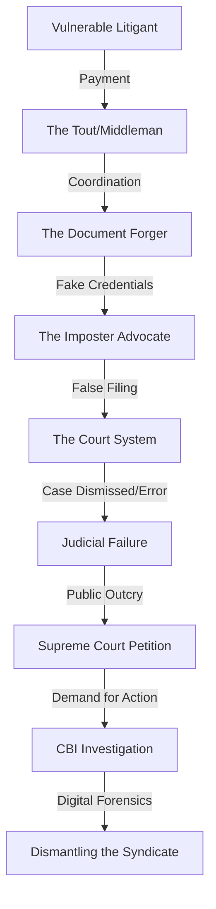

You know, there's always been this unspoken agreement when you walk into a courtroom: the person in the black robe standing before the judge actually has the degree, the license, and the ethics to handle someone's life, liberty, or property. This trust is the invisible glue that holds the judicial system together. But lately, that trust is being thrown out the window. Between the chaotic, overcrowded hallways of district courts and the polished, high-energy feeds of Instagram and YouTube, we're seeing the rise of a new kind of "legal expert." Some are simply masters of marketing, but others are straight-up frauds operating in the shadows of the law.

The Supreme Court of India has finally stepped in to address this systemic rot. In a move that has sent ripples through the legal community, the Court is seeking a response from the Union Government regarding a plea to allow the Central Bureau of Investigation (CBI) to probe the wave of fake advocates. But this isn't just a manhunt for imposters; it is a broader, more complex conversation about the "commercialization" of a noble profession. The plea seeks strict limits on how the legal profession is "monetized" in the digital age. 

Essentially, the prestige of the legal world is being auctioned to the highest bidder—often by people who have never stepped foot in a law school, or by licensed lawyers who treat the law like a lifestyle brand. This clash between the strict, non-commercial rules of Indian law and the hunger for "likes" and ad revenue marks a turning point in Indian jurisprudence.

---

## 🏛️ The Legal Battle: A Plea for Central Intervention

  
  
📸 <a href="https://unsplash.com/@finephotographics">Fine Photographics</a> on <a href="https://unsplash.com/photos/a-large-white-building-with-columns-with-united-states-supreme-court-building-in-the-background-osJUjMNpcak">Unsplash</a>

The crux of the matter lies in a petition arguing that the current regulatory frameworks are not just leaking—they are broken. The [Supreme Court's decision to seek the Union's response](https://www.livelaw.in) indicates that the judiciary views this not as a series of isolated "professional mistakes," but as a potential criminal conspiracy. The petitioner argues that the number of fake advocates—individuals practicing law without a degree or any registration with a state bar council—has reached an epidemic level, creating a "parallel legal system" that preys on the ignorant.

For decades, the Bar Council of India (BCI) has been the primary gatekeeper of the profession. However, the plea posits a harsh reality: the BCI is a regulatory body, not a law enforcement agency. It is equipped to handle disciplinary hearings and license suspensions, but it lacks the investigative machinery to track down professional impersonators who hide within the anonymity of overcrowded lower courts. By demanding a **CBI probe**, the petitioner is signaling that this has evolved into an organized crime ring involving forged documents, identity theft, and financial fraud—crimes that require a powerhouse investigative agency.

The Court is now forced to examine a systemic failure. Are the state bar councils being negligent in their verification processes? Or is the entire system of enrollment too archaic to survive in an era of sophisticated digital forgery? When a fake lawyer represents a client, the crime is three-fold: they defraud the client, they deceive the court, and they undermine the state's authority. While the [Advocates Act, 1961](https://www.indiacode.nic.in) clearly defines who is entitled to practice law, the enforcement has historically been reactive. We wait for a scam to be exposed before we act. The current plea suggests that without a high-level, proactive investigation, this "cancer" will continue to erode public confidence in the judiciary.

---

## 👤 The Shadow Bar: The Menace of the Imposter

To understand the scale of the problem, one must look at what insiders call the "Shadow Bar." This is a hidden layer of "fixers," "touts," and middlemen who haunt the corridors of district courts. They don't have offices; they have "spots" near the filing counters. They target the most vulnerable—the rural poor, the illiterate, and those desperate for quick results—tricking them into believing they are qualified legal practitioners.

The operation is surgically simple but devastating. These imposters charge exorbitant "processing fees," draft petitions filled with errors, and use their intimate knowledge of court routines to mimic the behavior of a lawyer. Then, the moment a case hits a critical junction or a judge asks a technical question, these "lawyers" vanish, leaving the client to face the consequences.

**The statistics are sobering.** While official data is often suppressed to protect the image of the courts, reports from various state raids suggest that **hundreds of unregistered practitioners** have been operating in single district complexes across North India. In some instances, syndicates have been found selling "fake enrollment certificates" that look identical to those issued by state bar councils.

> "When a fake advocate represents a client, it is not just a fraud against the individual; it is a fraud upon the court. The judicial process relies on the authenticity of the representation to ensure a fair trial. To allow an imposter in the well of the court is to admit that the gateway to justice is unguarded."

The primary tool of the imposter is the robe. In the Indian social psyche, the black coat is more than clothing; it is a symbol of authority and intellect. By wearing the robe, the imposter bypasses the client's skepticism. The Supreme Court plea highlights a disturbing trend: these frauds often steal the identities of retired lawyers or those who have passed away, using **stolen enrollment numbers** to pass basic checks. This transforms the courthouse into a marketplace for lies, where the price of admission is a fake ID and the cost is the client's legal rights.

---

## 💰 The "Law-Influencer" Paradox: Ethics vs. Engagement

While the fake lawyers operate in the shadows, a new breed of legal professional is stepping into the spotlight: the "Law-Influencer." On platforms like Instagram, TikTok, and YouTube, creators are now providing "legal hacks" and "law tips" to millions of viewers. On the surface, this is democratizing legal knowledge. However, the line between "public legal education" and "client solicitation" has become dangerously blurred.

According to [Rule 36 of the Bar Council of India Rules](http://www.barcouncilofindia.org), lawyers are strictly prohibited from advertising. You cannot run a billboard, you cannot send out brochures, and you certainly cannot "hunt" for clients. The philosophy is that law is a "noble profession," not a trade. But the internet operates on the logic of the algorithm, not the logic of professional ethics. A viral reel explaining a loophole in tenant law is, for all intents and purposes, a giant advertisement. 

The plea argues that "digital solicitation" is a backdoor for commercialization. By building a personal brand through "educational" content, lawyers (and fake lawyers) are creating a funnel to drive paid consultations, bypassing the BCI's restrictions. When the plea discusses "monetization," it targets three specific revenue streams:

1.  **AdSense and Platform Monetization**: Generating revenue from views on videos that often oversimplify complex laws to fit a 60-second format, potentially misleading the public.
2.  **Sponsorships and Brand Partnerships**: Promoting legal software, insurance products, or financial tools under the guise of "professional advice," creating a massive conflict of interest.
3.  **Premium "Consultation Funnels"**: Using social media to lure clients into paid services that are not regulated by any bar association, often promising "guaranteed results" which is a direct violation of professional ethics.

This creates a constitutional tension between **Freedom of Speech** (Article 19(1)(a)) and the **Regulatory Power of the State** to maintain professional standards. If the Supreme Court restricts this, it could hinder legal literacy. But if it doesn't, the law becomes a commodity. The risk is that the nuance of the law—the "it depends" that defines legal practice—is sacrificed for a "click-worthy" headline.

---

## 🛡️ BCI vs. CBI: Why a Central Agency?

To the casual observer, bringing in the CBI—India's premier investigative agency—to deal with "fake lawyers" might seem like overkill. Why not let the Bar Council of India (BCI) handle it? The answer lies in the difference between **regulation** and **investigation**.

The BCI is a regulatory body. Its powers are primarily administrative: it can cancel a license, issue a fine, or suspend a member. It does not have the authority to conduct raids, intercept communications, or track money laundering trails across state lines. The "Shadow Bar" is not a collection of individuals; it is a networked syndicate.

The plea argues that this is a **multi-state criminal conspiracy**. Fake advocates often operate in cells; they might move from a district court in Uttar Pradesh to one in Haryana to avoid local police detection. A CBI probe provides three critical advantages:
- **Digital Forensics**: The ability to trace the digital trail of fake certificates and the financial flow of "consultation fees" through bank accounts.
- **Inter-state Coordination**: A single agency that can coordinate arrests across multiple jurisdictions simultaneously, preventing the "leakage" of syndicate members.
- **Systemic Audit**: A deep dive into the enrollment process of various State Bar Councils to identify exactly where the verification gaps exist.

Without a central agency, the crackdown remains fragmented. A fake lawyer caught in one district can simply relocate to another, change their name slightly, and start the scam again because there is no synchronized, national database accessible to local law enforcement.

---

## 🌍 Global Perspectives: Transparency vs. Prohibition

India's absolute ban on legal advertising is a relic of an era where the profession was viewed as a priesthood. Many other democracies have taken a different path, recognizing that transparency is a better deterrent than prohibition.

In the United States, the [American Bar Association (ABA)](https://www.americanbar.org) allows lawyers to advertise, provided the claims are truthful and not misleading. The logic is that competition drives quality and makes legal help more accessible to the average citizen. However, the US doesn't just allow ads; it mandates **radical transparency**. Every state has a publicly searchable registry where a client can instantly verify a lawyer's license and see a full history of their disciplinary actions.

In the United Kingdom, the [Solicitors Regulation Authority (SRA)](https://www.sra.org.uk) allows marketing but maintains a strict "truth in advertising" standard. They don't care if a lawyer markets themselves; they care that the marketing isn't deceptive.

The Indian Supreme Court is now at a crossroads. It can either:
1.  **Double down on prohibition**, trying to kill the "influencer" culture and the "shadow bar" through sheer force.
2.  **Modernize the rules**, moving toward a system of regulated transparency.

The global trend suggests that by banning ads, India may have accidentally created a vacuum. When legitimate, ethical lawyers are forbidden from speaking to the public, the only voices left in the digital space are the ones who don't care about ethics—the imposters and the opportunists.

---

## ⚖️ The Impact on Access to Justice: The Human Cost

While the debate over CBI probes and BCI rules feels academic, the real-world impact is visceral. For a wealthy litigant, a fake lawyer is a financial loss or a frustrating delay. But for a marginalized person—a farmer fighting a land grab, a laborer seeking unpaid wages, or a woman fighting for custody—a fake lawyer is a life-altering catastrophe.

These scammers specialize in the "shortcut." They promise the desperate that they have "connections" inside the court or know a "secret procedure" to expedite the case in exchange for a lump sum. Because the [Bar Council's verification tools](http://www.barcouncilofindia.org) are not intuitive for the average citizen, the victim trusts the black robe.

When the scam is finally revealed—usually after the statute of limitations has passed or a critical deadline has been missed—the damage is often irreversible. The victim doesn't just lose their money; they lose their legal remedy. 

**The psychological toll is even deeper.** The victim rarely blames the imposter, who has long since disappeared. Instead, they blame the "system." They conclude that the courts are a place where only the cunning survive and the honest are cheated. This creates a dangerous alienation between the citizen and the state, turning the "temple of justice" into a place of trauma.

---

## 🔮 The Future of the Profession: Integrity in the Age of Influence

If the Supreme Court authorizes a CBI probe, we are likely to see a "Great Purge" of the lower courts. This would be a necessary shock to the system, signaling that the black robe is a badge of verified competence, not a costume for a con artist.

However, the fight over "monetization" will be more nuanced. Many young lawyers, struggling with low entry-level pay and a saturated market, use social media to build a niche. If the Court defines all legal education as "solicitation," it could inadvertently kill legal literacy in India. The challenge for the judiciary is to distinguish between **commercial solicitation** (which degrades the profession) and **public legal empowerment** (which serves the people).

We can expect several structural shifts in the coming years:
- **Blockchain-Verified IDs**: The implementation of a national, decentralized ledger of all enrolled advocates. Clients could scan a QR code on a lawyer's ID to instantly verify their status and disciplinary record.
- **Revised BCI Guidelines**: A new framework that allows "informative" content (explaining the law) but strictly bans "promotional" content (promising results or soliciting clients).
- **Criminalization of Impersonation**: Moving "unauthorized practice of law" from a professional misconduct issue to a serious criminal offense with mandatory jail time to deter the "Shadow Bar."

Ultimately, this is a battle for the **Rule of Law**. If the identity of the legal representative can be forged, the entire adversarial system collapses. The Supreme Court is reminding us that the integrity of the law is non-negotiable.

---

## 🏁 Conclusion: Beyond the Robe

The legal profession in India currently stands at a crossroads between tradition and transformation. On one side is the legacy of the "noble profession," where the lawyer is an officer of the court, dedicated to justice above profit. On the other is the 21st-century reality, where visibility is currency and the algorithm dictates who gets heard.

The call for a CBI probe and the push to limit monetization are not merely administrative requests; they are attempts to save the soul of the legal system. Whether it takes the investigative muscle of the CBI or a complete overhaul of BCI rules, the goal remains the same: ensuring that when a citizen reaches out for legal help, they find a professional, not a polished imposter.

The law is not a viral clip, a "hack," or a forged certificate. It is the foundation upon which a democracy stands. As the Supreme Court awaits the government's response, the message is clear: the robe is just a symbol; the integrity of the person wearing it is what actually delivers justice.

---

## 📚 References

- [Live Law: Supreme Court Seeks Union's Response On Plea For CBI Probe Against Fake Advocates](https://www.livelaw.in) - Primary report on the current petition and SC proceedings.
- [The Advocates Act, 1961 - India Code](https://www.indiacode.nic.in) - The statutory framework governing legal practice in India.
- [Bar Council of India - Official Rules and Regulations](http://www.barcouncilofindia.org) - The regulatory guidelines on professional conduct and solicitation.
- [American Bar Association (ABA) - Model Rules of Professional Conduct](https://www.americanbar.org) - Comparison of US legal advertising and ethics standards.
- [Solicitors Regulation Authority (SRA) - Guidance on Marketing](https://www.sra.org.uk) - UK standards for transparency in legal marketing.
- [Bar and Bench - Reports on Legal Ethics and Court Malpractice](https://www.barandbench.com) - Analysis of systemic issues in Indian district courts.
- [Constitution of India - Article 19(1)(a)](https://www.india.gov.in/my-government/constitution-india) - The legal basis for freedom of speech and expression.
- [Supreme Court of India - Official Case Status and Judgments](https://main.sci.gov.in) - Official repository for tracking the progress of the current plea.

---

## 📖 Related Reading

- [Air India A320 Flight-Control Event: What Caused the 300-Foot Drop?](/not-turbulence-air-india-a320-suffered-rare-flight-control-event-before-300-foot-altitude-drop-the-hindu/)
- [How Claude Leaves "Invisible" Fingerprints on Everything It Writes 🧬](/how-claude-marks-ai-generated-content/)
- [📱 Pixel 9 is Crashing on Flipkart: Is it a Steal, or Should You Hold Out for the Pixel 10?](/google-pixel-10-gets-big-price-drop-in-flipkart-sale-before-pixel-11-launch/)
