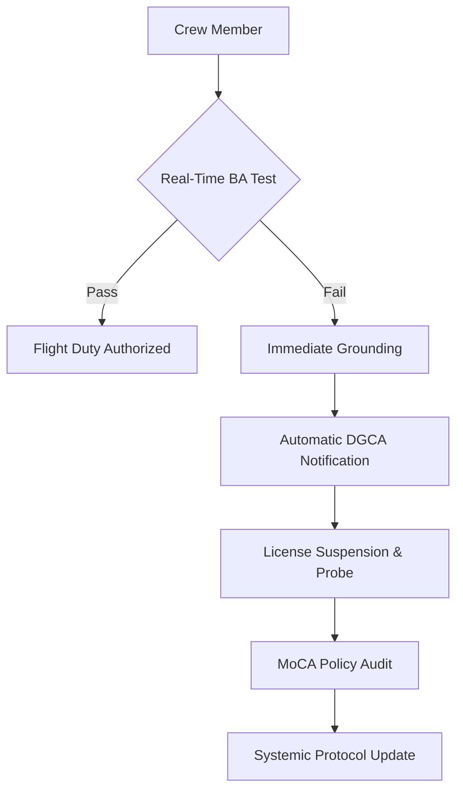

The Indian government is sending a stark directive to the national carrier: aviation safety is non-negotiable. In a decisive move to tighten security protocols, the Ministry of Civil Aviation (MoCA) has explicitly instructed [Air India](https://www.airindia.com) to "take full responsibility" for the conduct and discipline of its crew. Simultaneously, the Directorate General of Civil Aviation (DGCA) has been ordered to completely overhaul its approach to "dope checks"—the mandatory screenings for prohibited substances.

  
  
 <a href="https://unsplash.com/@praveentcom">Praveen Thirumurugan</a> on <a href="https://unsplash.com/photos/white-and-red-passenger-plane-on-airport-during-daytime-PC9DxtSH4GE">Unsplash</a>

This regulatory crackdown follows concerning reports of flight crew members failing mandatory Breath Analyzer (BA) tests. Such lapses are not merely disciplinary issues; they are systemic red flags that raise critical questions about how India’s flagship carrier manages its human capital and how the regulator ensures oversight in an era of rapid privatization.

---

### 🧪 The Science of the ‘Dope Check’: BA Tests Explained

In the high-stakes environment of aviation, a "dope check" is the industry vernacular for the mandatory pre-flight Breath Analyzer (BA) test. These screenings serve as a primary safety barrier, ensuring that pilots and cabin crew are not under the influence of alcohol or narcotics before assuming control of an aircraft. According to [DGCA regulations](https://dgca.gov.in), the permissible limit for alcohol in the aviation sector is **0.0% BAC (Blood Alcohol Concentration)**. Any detection, regardless of how minute, results in immediate grounding.

However, the government’s current push for "improved" checks suggests that the existing framework may have developed blind spots. The primary concern is "predictability." When tests are scheduled or follow a rigid pattern, it creates a window of opportunity for crew members to temporarily clear their systems. To counter this, the government is advocating for a transition toward **random, unannounced, and high-frequency screenings**.

By eliminating the predictability of these checks, the MoCA aims to move from a culture of "compliance for the test" to a culture of "permanent readiness." This aligns with the [ICAO (International Civil Aviation Organization)](https://www.icao.int) standards, which emphasize that safety management systems (SMS) must be proactive rather than reactive.

---

### ✈️ Air India’s Accountability: Beyond Privatization

Since the Tata Group's acquisition of Air India, the airline has undergone a massive operational metamorphosis—investing billions in new aircraft, upgrading lounges, and retraining staff. Yet, corporate restructuring and aesthetic upgrades cannot mask gaps in safety culture. When the government demands that Air India "take responsibility," it is addressing the internal behavioral norms of the airline.

> "The safety of passengers is paramount, and any lapse in crew discipline is a systemic failure that the airline must address internally before it becomes a catastrophe. A new livery does not equal a new safety culture."

To remedy these failures, Air India is under immense pressure to revitalize its **Employee Assistance Program (EAP)**. Substance abuse in aviation is often a symptom of deeper issues, such as chronic fatigue, burnout, or mental health struggles associated with irregular flight schedules. A "zero tolerance" policy is necessary for enforcement, but a robust EAP is necessary for prevention.

As the [national flag carrier](https://www.economictimes.com/industry/transportation/airlines), Air India represents India on the global stage. Any perceived laxity in crew discipline doesn't just risk lives; it damages the "Brand India" image as the country strives to become a global aviation hub competing with the likes of Dubai and Singapore.

---

### 📋 The DGCA Mandate: From Randomness to Vigilance

The DGCA is the primary watchdog of Indian skies. However, the recent government directive suggests that the watchdog has been too passive. The mandate to "improve dope checks" implies that the DGCA must evolve from a recording agency—which simply logs failures—into a preventative agency.

To achieve this, the government is pushing for the digitalization of the BA process. The goal is a system where test results are uploaded in **real-time** to a centralized, tamper-proof server. This eliminates the possibility of local manipulation or "delayed reporting" by airline management.

Furthermore, the DGCA is being urged to employ data analytics to identify "high-risk" patterns. By analyzing failures across specific bases, routes, or shift timings, the regulator can deploy targeted surveillance. This shift toward **predictive oversight** mirrors the approach taken by the [FAA (Federal Aviation Administration)](https://www.faa.gov) in the United States, where data-driven safety audits are the norm.

---

### 🛡️ The Safety Stakes: Why This Matters

For the average passenger, a "dope check" might seem like an administrative detail. However, in aviation, the margin for error is zero. Impaired judgment in the cockpit can lead to **Controlled Flight Into Terrain (CFIT)**, where a functional aircraft is flown into the ground due to pilot disorientation or delayed reaction times.

In an emergency, a pilot must make **split-second decisions**. Even a slight impairment in cognitive function can turn a manageable incident into a disaster. This is the essence of the "Swiss Cheese Model" of accident causation—where multiple small failures (a missed check, a tired pilot, a faulty sensor) align perfectly to cause a crash. By tightening dope checks, the government is effectively closing one of those "holes" in the cheese.

Beyond the immediate safety risks, there are significant economic implications:
*   **Insurance Premiums:** Repeated safety lapses can lead to higher insurance costs for all domestic carriers.
*   **International Ratings:** Poor safety audits from ICAO can lead to the downgrading of a country's aviation safety category, potentially restricting the expansion of flight rights.
*   **Passenger Trust:** In a competitive market, safety records are a primary driver of consumer choice.

For more on global safety benchmarks, the [IATA (International Air Transport Association)](https://www.iata.org) provides the IOSA (IATA Operational Safety Audit), which remains the gold standard for airline safety management.

---

### 🌍 Global Context and the Path Forward

India is not alone in this struggle, but it is at a critical juncture. The [European Union Aviation Safety Agency (EASA)](https://www.easa.europa.eu) employs rigorous, multi-layered screening processes that integrate physical tests with psychological evaluations. India's move toward more aggressive BA testing is a step in the right direction, but it must be paired with a holistic approach to crew wellness.

The integration of **biometric monitoring** and **fatigue risk management systems (FRMS)** could be the next step. By monitoring sleep patterns and stress levels via wearables, airlines can predict when a crew member is at a higher risk of making an error, moving the conversation from "punishing the failure" to "preventing the risk."

---

### 🏁 Conclusion

This government intervention is a necessary and overdue wake-up call. By forcing Air India to own its internal disciplinary lapses and demanding that the DGCA adopt a more aggressive, tech-driven oversight model, India is signaling that it will not sacrifice safety for the sake of rapid growth.

The success of these measures will not be found in the number of memos issued by the MoCA, but in a measurable **drop in BA test failures** and a fundamental shift in cockpit culture. Safety is not a checkbox; it is a state of constant vigilance. For the Indian aviation sector, the message is clear: the skies are open for business, but only for those who are **100% fit for duty**.

For those tracking the evolution of aviation safety, the [Aviation Safety Network](https://aviation-safety.net) provides a comprehensive database of how similar regulatory failures have historically led to accidents, serving as a grim reminder of why these "dope checks" are a lifeline for millions of passengers.

---

## 📖 Related Reading

- [What Actually Happened During the IndiGo Emergency Landing in Chennai?](/indigo-flight-makes-emergency-landing-after-engine-failure-full-emergency-declared-at-chennai-airport-the-times-of-india/)
- [⚖️ The Gavel and the Algorithm: Why the Supreme Court is Cracking Down on Fake Advocates and Digital Monetization](/supreme-court-seeks-unions-response-on-plea-for-cbi-probe-against-fake-advocates-curbs-on-monetisation-live-law/)
- [Importance Of Life](/importance-of-life/)
