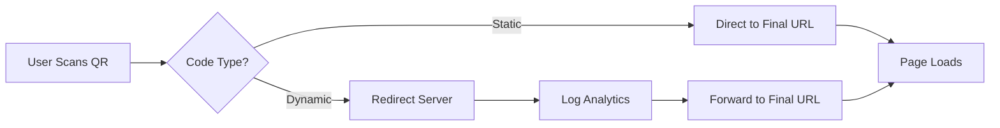

QR codes are one of those "invisible" technologies that we all use but rarely think about. When they work, they're seamless—you scan, and you're instantly transported to a menu, a payment gateway, or a registration form. When they fail, they’re just annoying, pixelated squares that leave users frustrated and brands looking unprofessional.

  
  
 <a href="https://unsplash.com/@ben_robbins">Ben Robbins</a> on <a href="https://unsplash.com/photos/silver-paper-clip-on-yellow-textile-I0iaRFzFJZM">Unsplash</a>

They’ve been around since 1994, when Masahiro Hara at Denso Wave invented them to track automotive parts. Today, they have evolved from industrial tools into a global standard for bridging the gap between physical and digital worlds [wikipedia.org](https://en.wikipedia.org/wiki/QR_code). However, because it is so easy to generate a code using a free online tool, many businesses fall into a dangerous trap: assuming that any random square of black dots will work. In reality, the success of a QR code depends on a delicate intersection of mathematics, optics, and human behavior.

---

### 🎨 The Visual Failures: Contrast, Quiet Zones, and Density

The biggest mistake most marketers make is treating a QR code as a graphic design element rather than a data carrier. A QR code is essentially a grid that a camera must "decode." If you prioritize "brand aesthetics" over machine readability, you are designing a failure.

#### The Sacred Quiet Zone
First and foremost, you must respect the **Quiet Zone**. This is the empty margin (usually white) that surrounds the QR code. Without this buffer, the scanning software cannot distinguish where the code ends and the rest of the design begins. If you jam your code right up against a dark edge, a busy photo, or a text block, many scanners—especially those on older devices—will simply fail to trigger [qrcode-monkey.com](https://www.qrcode-monkey.com/blog/how-to-create-a-qr-code-that-actually-works/).

#### The Contrast Crisis
Contrast is the heartbeat of scannability. A light blue code on a white background might look "on brand," but it's a nightmare for a camera's image sensor. For a code to be universally reliable, you need high contrast—ideally a ratio of **at least 4:1** [marketingland.com](https://www.marketingland.com/qr-code-design-tips-for-better-conversion/214567/). 

Furthermore, be extremely cautious with inverted colors (white dots on a dark background). While modern iOS and Android native cameras can often handle "inverted" codes, many third-party scanning apps and older devices cannot. By inverting your colors, you are effectively locking out a percentage of your audience.

#### The Density Trap
Data density is the most overlooked technical hurdle. A common error is attempting to cram a massive amount of text or an incredibly long URL into a **static** code. The more information you encode, the smaller and more crowded the modules (the dots) become. 

High-density codes are significantly harder to scan, particularly in low-light environments or when the user is standing several feet away. If your code looks like a vibrating gray mesh instead of sharp, distinct blocks, you've exceeded the optimal density for your physical print size.

---

### 🔄 The Strategic Blunder: Static vs. Dynamic

Choosing between a static or dynamic QR code is the difference between a flexible marketing campaign and a permanent printing error. To make the right choice, you need to understand how they function under the hood.

**Static QR codes** encode the information directly into the pattern. The URL *is* the pattern. This means the destination is hard-coded. If you print a static code on **50,000 brochures** and then realize there is a typo in the link or your website domain changes, those brochures are now expensive pieces of scrap paper. Static codes are only appropriate for information that will truly never change, such as a permanent Wi-Fi password or a fixed corporate ID.

**Dynamic QR codes** are significantly more powerful. Instead of encoding the final destination, they encode a "short URL" that acts as a redirect. This architectural shift provides two critical advantages:
1. **Total Flexibility:** You can change the destination URL in the backend at any time without ever needing to re-print the physical code.
2. **Granular Analytics:** Because the user must hit a redirect server first, you can track **exactly how many people scanned the code, their geographic location, their device type, and the exact time of the scan** [qr-code-generator.com](https://www.qr-code-generator.com/blog/static-vs-dynamic-qr-codes/).

**⚠️ A Warning on Provider Dependency:** Be wary of "free" dynamic generators. Many of these services are predatory; they allow you to create a code for free, but once it reaches a certain number of scans, they "lock" the link and demand a monthly subscription to reactivate it. If you stop paying, your printed materials lead to a 404 error. For professional deployments, always use a reputable provider or host your own redirect infrastructure.

---

### 🛠️ Production: Escaping the "Raster Trap"

A QR code that looks perfect on a 4K monitor can still fail miserably on a glossy menu or a vinyl banner. The most common technical failure at the production stage is the **Rasterization Trap**.

Most designers export QR codes as PNGs or JPGs. These are "raster" files composed of a fixed grid of pixels. When you upscale a raster image for a large-scale print, the edges become blurry or "anti-aliased" because the software is attempting to smooth the transition between pixels. A QR scanner requires a binary state: a module is either "on" (dark) or "off" (light). If the edges turn into a fuzzy gray gradient, the scanner fails.

To prevent this, **always use vector formats such as SVG, EPS, or PDF** [beaconstac.com](https://www.beaconstac.com/blog/why-qr-code-not-scanning). Vector graphics use mathematical paths rather than pixels, ensuring that whether the code is on a business card or a billboard, the edges remain razor-sharp.

#### Understanding Error Correction (Reed-Solomon)
QR codes are built with a mathematical safety net called **Reed-Solomon error correction**. This allows a code to remain scannable even if part of it is smudged, torn, or covered. There are four standard levels of error correction, as defined by the ISO/IEC 18004 standard [iso.org](https://www.iso.org/standard/62020.html):
* **Level L (Low):** Recoverable if **7%** of data is lost.
* **Level M (Medium):** Recoverable if **15%** of data is lost.
* **Level Q (Quartile):** Recoverable if **25%** of data is lost.
* **Level H (High):** Recoverable if **30%** of data is lost.

While Level H allows you to place a logo in the center of the code, be careful: higher error correction increases the density of the dots, making the code harder to scan if the print quality is low.

> "The most common reason for a QR code failing in the wild isn't the code itself, but the environment: poor lighting, specular glare from lamination, or a user attempting to scan a low-resolution print from an impossible angle."

---

### 🛡️ The Security Gap: Quishing and Malicious Overlays

Even a perfectly designed QR code can be a liability. Because humans cannot "read" a QR code by looking at it, these squares are the perfect delivery mechanism for **Quishing (QR Phishing)** [techtarget.com](https://www.techtarget.com/searchsecurity/tip/QR-Code-Security-What-You-Need-to-Know-and-How-to-Stay-Safe).

#### The Sticker Overlay Attack
One of the most pervasive threats is the **Sticker Overlay**. Scammers print a malicious QR code on a high-quality sticker and place it directly over a legitimate one. This is common on parking meters, public charging stations, and restaurant tables. A user thinks they are paying for parking, but they are actually submitting their credit card details to a fraudulent site [bleepingcomputer.com](https://www.bleepingcomputer.com/news/security/quishing-scams-target-parking-meters-restaurants/).

#### The Authentication Risk
Never use static QR codes for sensitive **Authentication** (e.g., "Scan this to log in to your account"). A QR code is simply text in a visual format. If an attacker takes a photo of that code, they possess your credential. Secure authentication requires dynamic codes that rotate every **30-60 seconds**, similar to the logic used by Google Authenticator.

To build trust with your users, avoid using generic URL shorteners like `bit.ly` or `tinyurl.com`. Instead, use a custom, branded domain (e.g., `qr.yourbrand.com/menu`). When the phone's camera previews the link, a branded URL provides immediate legitimacy and reduces the fear of phishing.

---

### ✅ The "No-Fail" Deployment Checklist

To ensure your QR code remains an asset rather than a liability, move beyond "generate and print." Every deployment should pass this three-layer audit.

#### 1. The UX Layer: No "Naked" Codes
A random QR code sitting on a wall is suspicious and uninviting. In an era of high security awareness, people are hesitant to scan unknown squares. Never leave a code "naked." Always accompany it with a **Clear Call to Action (CTA)**.
* **Bad:** [Just a QR code]
* **Good:** "Scan to View our Seasonal Menu" or "Scan for 10% Off Your First Order."
Providing the "why" significantly increases conversion rates and reduces user anxiety [nngroup.com](https://www.nngroup.com/articles/qr-codes/).

#### 2. The Technical Audit
Before sending files to the printer, verify these four specifications:
* **Contrast Ratio:** Is there a stark difference between the foreground and background (minimum 4:1)?
* **Quiet Zone:** Is there a generous white border surrounding the entire code?
* **File Format:** Is the final asset a vector (SVG/EPS) to prevent pixelation?
* **Density Check:** If using a static code, is the URL shortened to keep the dot pattern clean?

#### 3. The "Worst-Case Scenario" Stress Test
The final and most critical step: do not test your code only with the latest iPhone 15 Pro. Your customers use a diverse range of hardware. You must test your physical printout with:
* **A budget Android device:** Test with a phone that has a low-resolution camera and poor autofocus.
* **Low-light environments:** Simulate the lighting of a dim bar, cafe, or parking garage.
* **Specular Glare:** Place the code under bright overhead lights or apply a glossy laminate to see if glare "blinds" the scanner.
* **Extreme Angles:** Determine the maximum angle at which the code remains scannable.
* **Diverse Apps:** Test using the native camera app as well as third-party scanners (like Google Lens).

---

### 🏁 Conclusion

QR codes are a powerful bridge between the physical and digital worlds, but they are surprisingly fragile. There is a thin line between a seamless user experience and a useless smudge of ink. By focusing on high contrast, utilizing dynamic URLs for flexibility, insisting on vector graphics, and implementing strict security protocols, you will outperform the vast majority of your competitors. 

Just remember the golden rule of physical-digital integration: **If you haven't tested your code on the crappiest phone you can find in the worst lighting possible, you haven't actually tested it at all.**

---

## 📖 Related Reading

- [🏆 The Architecture of Excellence: Scaling Indian Sports Coaching for the Podium Era](/neeraj-chopra-gopichand-launch-initiative-to-strengthen-indias-coaching-system/)
- [🛡️ Safety First: Why the Govt is Pushing Air India and DGCA on ‘Dope Checks’](/govt-asks-air-india-to-take-responsibility-tells-dgca-to-improve-dope-checks/)
- [⚖️ The Gavel and the Algorithm: Why the Supreme Court is Cracking Down on Fake Advocates and Digital Monetization](/supreme-court-seeks-unions-response-on-plea-for-cbi-probe-against-fake-advocates-curbs-on-monetisation-live-law/)
