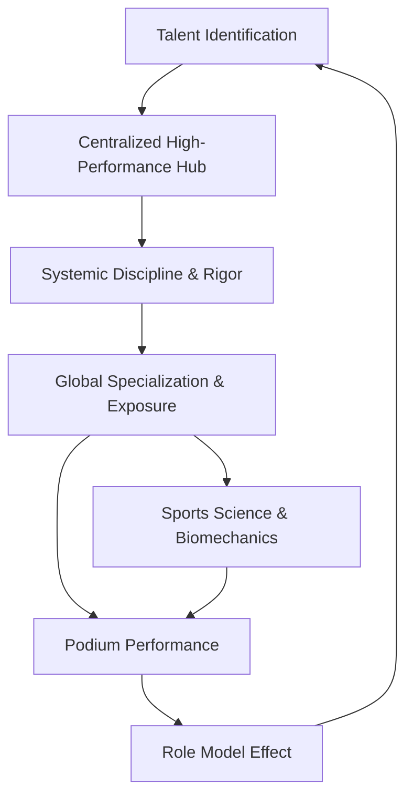

For decades, India's relationship with global sporting excellence was characterized by "the outlier effect." We celebrated the sporadic brilliance of individuals who, through sheer willpower and often in spite of the system, climbed the podium. From the early days of athletics to the dominance of chess, success was an anomaly rather than a product of a repeatable process.

However, the landscape shifted seismically during the Tokyo 2020 Games. When **Neeraj Chopra** launched the javelin to a gold-medal distance, it wasn't just a victory for an athlete; it was a proof of concept for a new era of professionalized training. Simultaneously, the legacy of **Pullela Gopichand** in badminton has provided a masterclass in how a centralized, high-performance academy model can turn a nation into a global powerhouse.

While the sporting world often looks for a "silver bullet" or a single joint initiative to fix systemic issues, the real solution lies in the synthesis of these two paradigms: the **Coach-Centric Blueprint** (Gopichand) and the **Athlete-Centric Professionalism** (Chopra).

## 🏸 The Gopichand Blueprint: The Power of the Ecosystem

Pullela Gopichand did not just coach players; he built an ecosystem. Before the proliferation of state-funded high-performance centers, Gopichand recognized that talent without a structured environment is a wasted resource. His approach focused on three critical pillars: **centralization, rigorous discipline, and the removal of friction.**

By bringing the best players under one roof, he created a competitive pressure cooker where athletes pushed each other daily. This "cluster effect" ensures that the level of training is always dictated by the best performer in the room, not by a static training manual.

> "The difference between a good athlete and a great one is the ability to withstand the monotony of excellence. You have to love the grind as much as the gold." — *Sports Performance Analysis*

The Gopichand model demonstrated that India could produce world-beaters if the athlete was shielded from administrative chaos and provided with world-class infrastructure and singular focus.

## 📐 The Neeraj Chopra Paradigm: Professionalism and Precision

If Gopichand represents the triumph of the system, **Neeraj Chopra** represents the triumph of the professional approach. Chopra’s journey underscores a critical evolution: the move toward global specialization. 

Chopra did not rely solely on domestic frameworks. His success is rooted in the strategic use of international coaching, specialized physiotherapy, and a meticulous approach to recovery and biomechanics. This is the "modern athlete" model—where the athlete is the CEO of their own career, collaborating with a team of specialists to optimize every millisecond of performance.

**Bold Stats on the "Neeraj Effect":**
* **1 Gold Medal:** The first-ever Olympic gold in track and field for India, breaking a century-long drought.
* **88.06m:** The distance that shifted the national psyche toward athletics.
* **200% Increase:** Estimated rise in youth interest in javelin throw across Tier-2 and Tier-3 cities in India post-2021.

The "Chopra Model" teaches us that for India to scale, we must move beyond "hard work" and embrace "precision work"—utilizing data, sports science, and global benchmarks.

## 🔄 The Synthesis: Bridging the Gap

The missing link in India's sporting journey has been the bridge between the academy (the system) and the professional athlete (the specialist). When we analyze the trajectories of badminton and athletics, we see a clear opportunity for a combined framework.

Imagine a system where the **Gopichand-style centralized hubs** are not just about drills and discipline, but are integrated with the **Chopra-style global specialization**. This means that while the athlete trains in a high-performance Indian hub, the hub itself is porous—regularly bringing in global experts, utilizing AI-driven biomechanical analysis, and focusing on the holistic wellbeing of the athlete.

### 🗺️ The Cycle of Sporting Excellence

## 🛠️ A Proposed Framework for National Coaching Integration

To transition from accidental success to systemic dominance, India requires a structural overhaul of its coaching philosophy. This can be broken down into four strategic shifts:

### 1. From "Generalist" to "Specialist" Coaching
For too long, Indian coaching has been dominated by generalists. The new model must prioritize specialization. We don't just need a "track coach"; we need a "sprint mechanic" and a "jump specialist." This mirrors the precision seen in the [World Athletics](https://worldathletics.org/) circuit.

### 2. The Integration of Sports Science
Data should drive training, not intuition. The integration of wearable technology, lactate threshold testing, and psychological profiling must be mandatory, not optional. The [Sports Authority of India (SAI)](https://sportsauthorityofindia.nic.in/) has made strides here, but the rollout must reach the grassroots.

### 3. Decentralized Excellence Hubs
While the Gopichand model thrives on centralization, India is too large for a single hub. We need "Regional Centers of Excellence" based on geographic strengths (e.g., endurance training in high-altitude regions, sprinting in the plains).

### 4. The "Athlete-First" Administrative Model
The [Target Olympic Podium Scheme (TOPS)](https://tops.gov.in/) has been a game-changer by funding the specific needs of athletes. However, the administrative burden on athletes must be further reduced. The athlete should focus on the podium; the system should handle the paperwork.

## 🧠 The Psychological Frontier: Mental Toughness and Global Standards

One of the most overlooked aspects of the Gopichand and Chopra success stories is the psychological shift. For decades, Indian athletes often entered international competitions with a "happy to be here" mentality. 

The current generation, however, is characterized by a "right to win" attitude. This shift is a direct result of seeing peers succeed on the world stage. When an athlete sees a compatriot win gold, the psychological ceiling is shattered. 

> "Success is a contagious emotion. Once the first barrier is broken, the fear of the unknown is replaced by the hunger for the known." — *Elite Performance Psychology*

To sustain this, India must invest in dedicated sports psychologists who specialize in "big-event" pressure, ensuring that the technical skill is matched by mental resilience.

## 🏛️ Overcoming Institutional Inertia

Despite the progress, the path to becoming a sporting superpower is blocked by institutional inertia. The transition from a bureaucratic model of sports management to a professional one is often slow.

**Key Institutional Challenges:**
* **Lack of Coaching Certification:** There is a dire need for a standardized, globally recognized certification for coaches.
* **Funding Gaps at the Grassroots:** While the top 1% (the TOPS athletes) are well-funded, the "middle layer" of talent often drops out due to lack of financial support.
* **Infrastructure Maintenance:** Building a stadium is easy; maintaining a world-class synthetic track for a decade is the real challenge.

The solution lies in Public-Private Partnerships (PPP). By allowing private academies to operate under the guidance of national bodies like the [Ministry of Youth Affairs and Sports](https://yas.nic.in/), India can leverage private efficiency with public reach.

## 🚀 The Road to 2036: A Vision for India's Olympic Bid

As India looks toward a potential bid for the 2036 Olympics, the focus must shift from "hosting the event" to "dominating the event." The legacy of the Games should be a transformed coaching ecosystem.

By scaling the lessons learned from the badminton courts of Hyderabad and the javelin fields of Panipat, India can create a "Podium Pipeline." This pipeline would ensure that talent is identified early, nurtured in a disciplined ecosystem, refined through global specialization, and supported by a seamless administrative machine.

**The Final Metrics of Success:**
* **Diversification:** Moving beyond a few sports to winning medals across 15+ different disciplines.
* **Sustainability:** Moving from one-off gold medals to consistent top-10 finishes in the overall medal tally.
* **Democratization:** Seeing podium finishes from athletes hailing from diverse socio-economic backgrounds across all states.

## 🏁 Conclusion: The Synergy of Will and System

The story of Indian sports is no longer a story of struggle; it is a story of ascent. The brilliance of Neeraj Chopra and the vision of Pullela Gopichand are two sides of the same coin. One provides the **aspirational peak**, and the other provides the **structural foundation**.

When the rigor of the system meets the ambition of the professional athlete, the result is inevitable: gold. India doesn't need a miracle; it needs a method. By codifying the "Gopichand-Chopra Synthesis," the nation can ensure that the gold medals of tomorrow are not surprises, but certainties.

***

### 📚 References & Further Reading

1. **Sports Authority of India (SAI):** The primary body for sports development in India. [Visit SAI](https://sportsauthorityofindia.nic.in/)
2. **Target Olympic Podium Scheme (TOPS):** Understanding the funding model for elite athletes. [Explore TOPS](https://tops.gov.in/)
3. **International Olympic Committee (IOC):** Global standards for athletic performance and training. [Visit Olympics.com](https://olympics.com/)
4. **World Athletics:** The governing body for track and field, providing benchmarks for javelin and athletics. [Visit World Athletics](https://worldathletics.org/)
5. **Badminton World Federation (BWF):** Insights into the global badminton ecosystem and coaching standards. [Visit BWF](https://bwfbadminton.com/)
6. **Ministry of Youth Affairs and Sports:** Policy frameworks for national sports development. [Visit Ministry](https://yas.nic.in/)
7. **Neeraj Chopra Athlete Profile:** A study in modern athletic professionalism. [IOC Profile](https://olympics.com/en/athletes/neeraj-chopra)
8. **High-Performance Coaching Theory:** Analysis of centralized academy models in Asia and Europe.

---

## 📖 Related Reading

- [🛡️ Safety First: Why the Govt is Pushing Air India and DGCA on ‘Dope Checks’](/govt-asks-air-india-to-take-responsibility-tells-dgca-to-improve-dope-checks/)
- [⚖️ The Gavel and the Algorithm: Why the Supreme Court is Cracking Down on Fake Advocates and Digital Monetization](/supreme-court-seeks-unions-response-on-plea-for-cbi-probe-against-fake-advocates-curbs-on-monetisation-live-law/)
- [What Actually Happened During the IndiGo Emergency Landing in Chennai?](/indigo-flight-makes-emergency-landing-after-engine-failure-full-emergency-declared-at-chennai-airport-the-times-of-india/)
