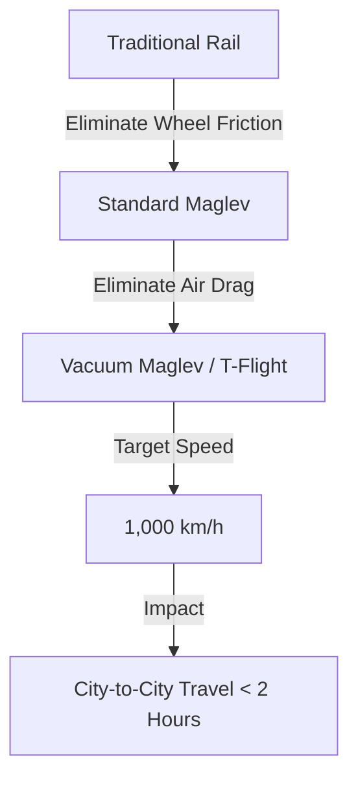

China has long dominated the global landscape of high-speed rail (HSR), boasting the most extensive network on the planet. However, the Chinese Academy of Sciences (CAS) is now pivoting toward a frontier that borders on science fiction. They are developing the **T-Flight**, a "high-speed flying train" designed to shatter current speed ceilings. While current bullet trains are impressive, the T-Flight targets an initial operating speed of **800 km/h**, with an ambitious long-term goal of reaching **1,000 km/h**. 

  
  
 <a href="https://unsplash.com/@itsseyed">Seyed Amir Mohammad Tabatabaee</a> on <a href="https://unsplash.com/photos/a-close-up-of-a-speedometer-in-a-vehicle-j-bOUNFZJOs">Unsplash</a>

According to reports by [Hindustan Times](https://www.hindustantimes.com), this is not merely an incremental upgrade to existing Maglev technology. It is a fundamental paradigm shift in transport architecture, combining magnetic levitation with low-vacuum tube environments to effectively eliminate the primary enemy of speed: air resistance.

---

### 🌪️ The Physics of the "Flying Train"

To understand why the T-Flight is necessary, one must understand the "drag wall." In traditional high-speed rail, aerodynamic drag increases quadratically with speed. This means that doubling your speed doesn't just double the resistance; it quadruples it. At speeds exceeding **400 km/h**, the energy required to push through the atmosphere becomes prohibitively expensive and mechanically taxing.

The T-Flight project solves this by placing the vehicle inside a **low-vacuum tube**. By mechanically removing the majority of the air from the transit corridor, the system reduces the air density ($\rho$) to a fraction of atmospheric levels. 

As detailed in research on [high-speed vacuum transport](https://arxiv.org) and aerodynamic studies in [Nature](https://www.nature.com), reducing the pressure allows the vehicle to achieve near-supersonic speeds without the massive energy expenditure or the catastrophic sonic booms associated with breaking the sound barrier in open air. Essentially, the T-Flight creates a simulated space environment on the ground.

---

### 🚄 Maglev vs. T-Flight: The Evolutionary Leap

China already utilizes sophisticated Maglev (Magnetic Levitation) systems, but the T-Flight represents a distinct evolutionary branch. Standard Maglev trains, such as the [L0 Series](https://en.wikipedia.org/wiki/Maglev) in Japan, use powerful electromagnets to lift the train above the guide-way, eliminating rolling friction (the friction caused by wheels on rails).

However, while Maglev eliminates **surface friction**, it remains captive to **air friction**. The T-Flight integrates both solutions:

1.  **Magnetic Levitation:** Removes contact with the track.
2.  **Vacuum Environment:** Removes contact with the air.

To put this in perspective, Japan's current Maglev record stands at **603 km/h**. The T-Flight aims to nearly double this, potentially rendering short-to-medium haul commercial flights obsolete.

---

### 🛠️ The Engineering Everest: Challenges and Risks

Achieving these speeds in a controlled test environment is one thing; deploying them across thousands of kilometers of rugged terrain is another. Engineers on platforms like [Hacker News](https://news.ycombinator.com) frequently cite the "Hyperloop Paradox": the pursuit of a perfect vacuum creates an exponential increase in infrastructure complexity.

#### 1. The Vacuum Seal Integrity
Maintaining a **near-perfect vacuum** across hundreds of kilometers is a monumental civil engineering challenge. Any breach—whether caused by seismic activity, material fatigue, or sabotage—could lead to a catastrophic decompression event. This requires the development of advanced, self-healing materials and redundant air-lock systems.

#### 2. Thermal Expansion
Steel and concrete expand and contract with temperature changes. In a vacuum tube, even a few millimeters of shift can disrupt the precise alignment required for a train traveling at **800 km/h**. The T-Flight must utilize sophisticated expansion joints that can maintain a vacuum seal while allowing the tube to "breathe."

#### 3. The Human Factor (G-Force)
Accelerating to **800 km/h in seconds** places immense physical stress on the human body. To prevent passengers from experiencing severe nausea or blackout, the T-Flight will require precision-engineered acceleration curves and advanced suspension systems to dampen the vibrations that become violent at transonic speeds.

---

### 🌍 A New Era of Continental Connectivity

If successfully deployed, the T-Flight will redefine the geography of China. The Beijing-to-Shanghai corridor, one of the busiest travel routes in the world, currently takes several hours via high-speed rail. With the T-Flight, that journey could drop to **under two hours**, effectively merging these two massive economic hubs into a single "mega-city" region.

> "The T-Flight represents a leap from high-speed rail to 'ultra-high-speed' transport, blurring the line between a train and a commercial aircraft while maintaining the convenience of ground-based boarding."

Beyond domestic travel, this technology positions China as the global standard-setter for 21st-century mobility. As discussed by the [World Economic Forum](https://www.weforum.org), the transition to vacuum-based transport could significantly reduce the carbon footprint of regional travel by shifting passengers from kerosene-burning jets to electricity-powered vacuum tubes.

---

### ⚖️ Global Competition: T-Flight vs. Hyperloop

The T-Flight is often compared to Elon Musk's Hyperloop concept. While the theoretical physics are similar, the execution differs. Where Hyperloop was largely a series of venture-backed prototypes and white papers, the T-Flight is being driven by the [Chinese Academy of Sciences](http://www.cas.cn) and state-backed industrial power.

According to data from [Reuters](https://www.reuters.com), China's ability to mobilize massive capital and land rights gives it a distinct advantage in building the thousands of kilometers of tubing required for a viable network. While Western projects have struggled with regulatory hurdles and funding, the T-Flight is moving rapidly from theoretical models to physical test tracks.

---

### 🏁 Conclusion: The End of Distance?

China’s pursuit of the **1,000 km/h** mark is more than just a record-breaking exercise; it is a high-stakes bet on the future of human movement. By synthesizing the frictionless glide of Maglev with the void of a vacuum tube, the T-Flight is attempting to transition the world from the "bullet train" era into the era of "flying trains."

The hurdles are significant—ranging from the physics of decompression to the economics of tube maintenance—but the potential reward is a world where the size of a continent no longer dictates the time it takes to traverse it. For the first time in history, we are seeing the possibility of ground transport that can truly compete with the speed of flight.

### 📚 References & Further Reading

*   **Hindustan Times**: Reports on T-Flight development and target speeds.
*   **arXiv.org**: Theoretical frameworks for vacuum-tube transport and fluid dynamics.
*   **Wikipedia**: Technical specifications of the [L0 Series Maglev](https://en.wikipedia.org/wiki/Maglev).
*   **Nature**: Research on aerodynamic drag and supersonic flow in confined spaces.
*   **South China Morning Post**: Analysis of China's infrastructure spending on ultra-high-speed rail.
*   **IEEE Xplore**: Standards for superconducting magnets in Maglev applications.
*   **World Economic Forum**: The impact of high-speed transit on urban centralization.
*   **Chinese Academy of Sciences (CAS)**: Official project goals for the T-Flight initiative.
*   **Reuters**: Global statistics on high-speed rail expansion.
*   **Hacker News**: Engineering critiques of the Hyperloop and vacuum-tube paradoxes.

---

## 📖 Related Reading

- [Is the iPhone "Plus" Dying? Apple’s Move Toward an "iPhone 17 Slim"](/apple-again-reported-to-skip-launching-the-iphone-18-this-year-gsmarenacom-news-gsmarenacom/)
- [🏆 The Architecture of Excellence: Scaling Indian Sports Coaching for the Podium Era](/neeraj-chopra-gopichand-launch-initiative-to-strengthen-indias-coaching-system/)
- [🏁 The QR Code Survival Guide: How Not to Mess Up Your Scannability](/guide-to-not-fucking-up-qr-codes/)
