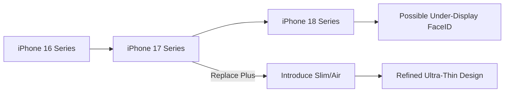

You know how rumors about Apple are always flying around? Well, the latest word from industry analysts and outlets like [GSMArena](https://www.gsmarena.com) suggests we might be seeing a significant shake-up in how the iPhone lineup is organized. While Apple isn't skipping a release cycle, they may be "skipping" a specific tier of hardware: the **Plus model**.

  
  
 <a href="https://unsplash.com/@stm_2790">Sumudu Mohottige</a> on <a href="https://unsplash.com/photos/apple-logo-on-blue-surface-bIgpii04UIg">Unsplash</a>

Instead, the buzz is that Apple plans to phase out the Plus in the 2025 iPhone 17 lineup and replace it with something entirely different—a super-thin, high-end "iPhone 17 Slim" (some insiders are already calling it the "Air"). It seems Apple is pivoting away from simply offering "bigger screens" and is instead positioning "extreme thinness" as the new premium status symbol.

---

### 📱 The "Slim" Pivot: From Plus to Air

For several years, Apple’s lineup has followed a predictable four-tier pattern: the standard model, a larger Plus, a Pro, and a massive Pro Max. However, the [iPhone 17 Slim](https://www.macrumors.com) is expected to shatter this mold. Unlike the Plus, which was essentially a standard iPhone with a stretched display, the "Slim" is rumored to be its own unique architectural category.

Reports suggest this model will be significantly thinner than any previous iPhone, possibly utilizing a new aluminum alloy to maintain structural integrity and prevent the dreaded "bending" issues of the past. This isn't just a cosmetic change; it's a strategic move to create a "halo" product. Apple wants a device for users who find the Pro Max too bulky but want something that feels more exclusive and sophisticated than the base model. By dropping the Plus, Apple eliminates a product that has historically struggled to find a distinct identity.

---

### 📉 The "Plus" Problem: Why it’s Being Phased Out

So, why ditch the Plus? The answer lies in the data. While the Pro and Pro Max models have seen explosive growth, the Plus has consistently underperformed. Market analysis suggests that users wanting a larger screen typically opt for the [Pro Max](https://en.wikipedia.org/wiki/Iphone) to gain access to superior camera systems and ProMotion displays.

In some quarters, the Plus model has accounted for **less than 10%** of total iPhone shipments, making it the weakest link in the portfolio.

> "The Plus model has lived in a precarious middle ground—too large for some, but not powerful enough for the power user. It offered size without the prestige of the Pro features."

By pivoting, Apple can streamline its supply chain and refocus its marketing on the "Slim" philosophy. This mirrors the evolution of the [MacBook Air](https://www.apple.com/macbook-air/)—prioritizing a "thin-and-light" form factor to make the hardware feel futuristic and premium.

---

### 📅 Clearing Up the Timeline

To avoid common misconceptions: Apple is not skipping a year of releases. The **iPhone 16** remains the primary focus for late 2024, and the **iPhone 17** is slated for 2025. When you hear analysts talking about "skipping," they are referring to the removal of the Plus tier in the 2025 lineup, not the omission of a yearly update.

Here is how the projected hardware roadmap looks:

As [Bloomberg's Mark Gurman](https://www.bloomberg.com) and [9to5Mac](https://9to5mac.com) have noted, while the iPhone 17 handles the design shift, the iPhone 18 (expected in 2026) is where we will likely see more aggressive technical leaps, such as sensors moving entirely under the display to eliminate the Dynamic Island.

---

### 🛠️ What Makes the "Slim" Different?

If the reports are accurate, the iPhone 17 Slim won't just be a thinner version of an existing phone; it will be a design showcase. One of the most controversial rumors suggests it might feature only a **single rear camera** to accommodate the ultra-thin chassis. 

While removing lenses from a high-end phone sounds like a downgrade, it indicates that Apple is betting on a specific consumer segment: those who value aesthetics, portability, and "stealth wealth" over professional-grade photography. This is a gamble, but Apple has a track record of success with this approach. The [iPad Pro M4](https://www.apple.com/ipad-pro/), with its record-breaking **5.1mm thickness**, proved that there is a massive appetite for powerful devices that defy traditional bulk.

---

### 🌐 The Broader Market Context

Apple isn't the only player chasing the "slim" trend. Competitors like Samsung are rumored to be exploring their own "Slim" variants of the Galaxy S series to combat the stagnation of smartphone design. As [The Verge](https://www.theverge.com) has highlighted, the industry is currently in a "plateau" phase where raw specs (RAM and CPU) no longer excite consumers. Consequently, industrial design—how a phone feels in the pocket and looks on a table—becomes the primary driver for upgrades.

### Conclusion

Ultimately, Apple isn't skipping a generation; they are skipping an outdated philosophy. By replacing the Plus with a "Slim" or "Air" variant, they are moving beyond the binary of "big vs. small" and chasing "elegance." While the iPhone 18 may bring the raw tech breakthroughs, the iPhone 17 Slim could redefine the visual language of smartphones for the next decade.

---

## 📖 Related Reading

- [🏆 The Architecture of Excellence: Scaling Indian Sports Coaching for the Podium Era](/neeraj-chopra-gopichand-launch-initiative-to-strengthen-indias-coaching-system/)
- [🏁 The QR Code Survival Guide: How Not to Mess Up Your Scannability](/guide-to-not-fucking-up-qr-codes/)
- [🛡️ Safety First: Why the Govt is Pushing Air India and DGCA on ‘Dope Checks’](/govt-asks-air-india-to-take-responsibility-tells-dgca-to-improve-dope-checks/)
