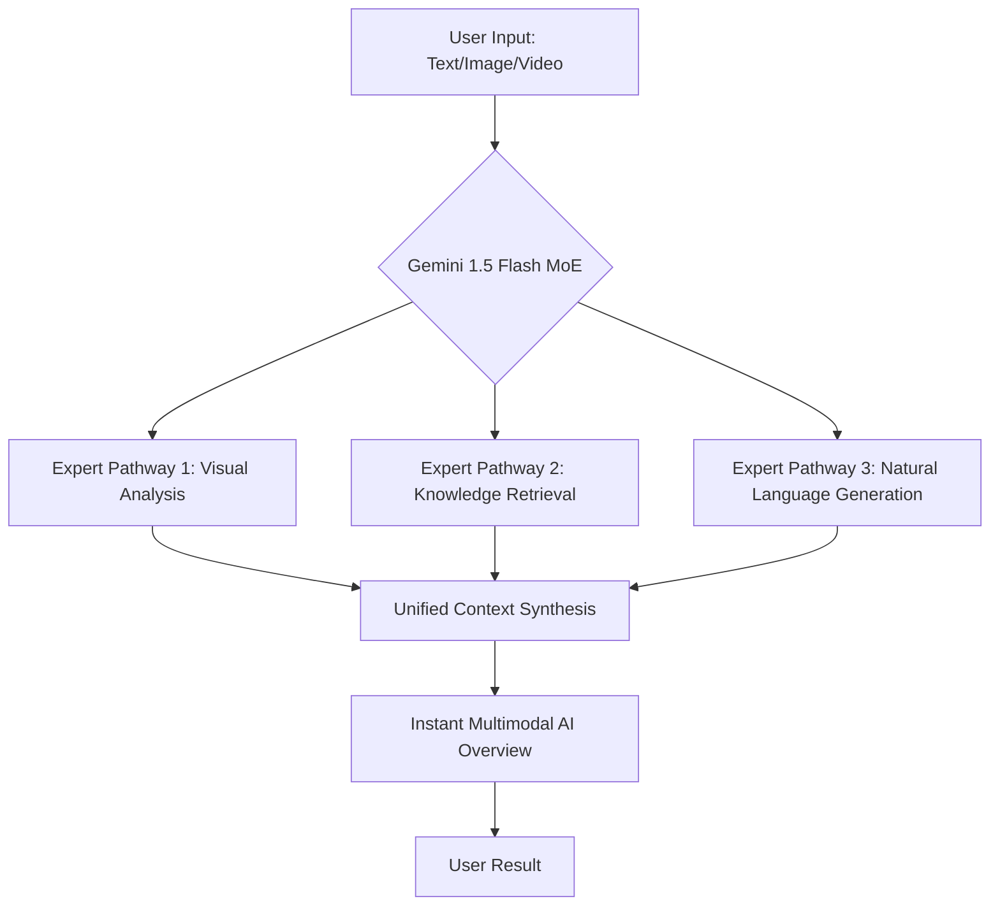

Google is effectively giving its search engine a shot of espresso. By integrating **Gemini 1.5 Flash**, the company is optimizing "AI Overviews"—those synthesized responses appearing at the top of Search Engine Results Pages (SERPs)—to eliminate the clunkiness that plagued early iterations. The primary objective is the eradication of latency: that frustrating "thinking" pause where users wait for the AI to generate a response. 

By swapping out heavier, computationally expensive models for the streamlined Flash version, Google aims to make the transition from a traditional list of blue links to a fully generated, multimodal answer feel nearly instantaneous. In the competitive landscape of AI-powered search, where [Perplexity AI](https://www.perplexity.ai) and [OpenAI's SearchGPT](https://openai.com) are pushing for real-time speed, Google cannot afford a sluggish user experience.

---

### 🛠️ The Architecture of Speed: What is Gemini 1.5 Flash?

To understand why this update matters, we have to look at the engine under the hood. Gemini 1.5 Flash is not just a "smaller" model; it is a highly optimized version of the Gemini family, designed specifically for high-volume, low-latency tasks. While Gemini 1.5 Pro is the "powerhouse" meant for complex reasoning and deep coding, Flash is the "sprinter."

The secret to its efficiency lies in a process called **knowledge distillation**. In this framework, a larger, more capable "teacher" model (Gemini Pro) transfers its reasoning capabilities and world knowledge to a smaller "student" model (Flash). This allows the smaller model to mimic the intelligence of its larger counterpart without requiring the same massive amount of compute power.

Furthermore, Google utilizes a **Mixture-of-Experts (MoE)** architecture. Instead of activating every single parameter in the neural network for every single search query—which would be an astronomical waste of energy and time—MoE only triggers the specific "experts" (sub-networks) relevant to the prompt.

> "The goal of Gemini 1.5 Flash is to provide a lightweight model that maintains a high level of intelligence while drastically reducing the time to first token (TTFT), making AI-driven search feel like a natural extension of the browsing experience." — *Industry Analysis on LLM Latency*

**Key Technical Stats:**
* **Latency Reduction:** Significant decrease in "Time to First Token" compared to 1.0 Ultra.
* **Efficiency:** Optimized for **sub-second response times** on standard queries.
* **Scaling:** Designed to handle **billions of concurrent requests** across Google's global infrastructure.

---

### 🔍 Redefining the "AI Mode" in Search

This architectural shift fundamentally changes how users interact with "AI Mode." In previous versions, the AI Overview often felt like a separate "app" loading inside a search page, often accompanied by a shimmering loading animation that broke the user's cognitive flow. With Gemini 1.5 Flash, the goal is **seamless integration**.

One of the most disruptive features of this update is its **multimodal native capability**. Unlike older systems that had to pass an image to a vision model, then pass that text to a language model, Gemini 1.5 Flash processes text, images, and video simultaneously.

Imagine searching for a fix for a leaking sink. Instead of typing a description, you upload a 5-second video of the leak. Gemini 1.5 Flash can analyze the video frames, identify the specific valve type, and generate a step-by-step repair guide—all within the AI Overview—without the latency of switching between specialized models.

---

### 📚 The Million-Token Edge and RAG Evolution

Perhaps the most significant technical advantage of Gemini 1.5 Flash is its massive **1 million token context window**. To put this in perspective, most standard LLMs can only "remember" or "read" a few dozen pages of text before they start forgetting the beginning of the conversation. A million tokens allow the model to process hours of video, thousands of lines of code, or massive document sets in one go.

For Google Search, this is a game-changer for **Retrieval-Augmented Generation (RAG)**. 

Standard RAG typically works by grabbing the top 3-5 snippets of text from the web and feeding them to the AI. However, this often leads to "fragmented" answers. With a million-token window, Gemini 1.5 Flash can ingest entire web pages, long-form PDFs, and comprehensive guides before synthesizing the answer. 

**Why this matters for accuracy:**
1. **Reduced Hallucinations:** By having a larger "fact pile" to draw from, the AI is less likely to fill in gaps with fabricated information.
2. **Better Nuance:** The model can understand the context of an entire article rather than just a highlighted sentence.
3. **Cross-Referencing:** It can compare information across multiple long-form sources simultaneously to find contradictions or consensus.

According to [Google DeepMind](https://deepmind.google), this capability allows the model to retrieve a specific piece of information from a massive dataset with **near-perfect accuracy**, a phenomenon known as the "needle in a haystack" test.

---

### 📉 The Publisher's Dilemma: SEO and the Zero-Click Crisis

While the speed and accuracy of Gemini 1.5 Flash are triumphs of engineering, they represent an existential threat to the traditional web ecosystem. As noted by [Search Engine Journal](https://www.searchenginejournal.com) and [Moz](https://moz.com), the rise of high-speed AI Overviews accelerates the **"zero-click search"** trend.

A zero-click search occurs when the user's query is answered directly on the SERP, eliminating the need to click through to the source website. When the AI Overview is instant and comprehensive, the incentive to visit the original publisher vanishes.

**The impact on digital creators is stark:**
* **CTR Erosion:** Click-through rates (CTR) for informational "how-to" or "what is" queries are plummeting.
* **Traffic Devaluation:** Websites are becoming "training data" for Google's AI rather than destinations for human readers.
* **Revenue Loss:** For ad-supported publishers, fewer clicks mean a direct hit to the bottom line.

**Bold Stats on the Shift:**
* **Up to 60%** of searches may result in zero clicks as AI Overviews become the primary interface.
* **Informational queries** are the most vulnerable, while **transactional queries** (e.g., "buy leather boots") remain more resilient.

#### How to Survive the AI Overview Era
To remain visible, SEO strategies must shift from "keyword targeting" to "entity and experience targeting." According to [Ahrefs](https://ahrefs.com), the focus should now be on **E-E-A-T (Experience, Expertise, Authoritativeness, and Trustworthiness)**.

> "AI can summarize facts, but it cannot simulate lived experience. The future of SEO isn't about answering the question—it's about providing the unique perspective that only a human expert can offer."

**Winning Strategies for 2024-2025:**
* **First-Person Narratives:** Use phrases like "In my 10 years of testing..." or "When I visited this location..."
* **Original Data:** Conduct original surveys and publish proprietary data that AI cannot find elsewhere.
* **Deep-Dive Analysis:** Move beyond "Top 10" lists into complex, opinionated critiques.
* **Interactive Content:** Build tools, calculators, and community forums that provide value beyond a text summary.

---

### 🚀 Final Verdict: Efficiency as the Ultimate Feature

The transition to Gemini 1.5 Flash marks a pivotal moment in the evolution of the internet. For Google, this isn't just about "better AI"—it's about **frictionless utility**. By prioritizing speed, multimodal processing, and a massive context window, Google is attempting to make the AI Overview the "default" way humans access information.

The technical achievements are undeniable. Reducing the latency of a million-token model to a sub-second response is a feat of infrastructure. However, the social contract between search engines and content creators is fraying. As we move toward a world where the answer arrives before the page even finishes loading, the value of the "click" is changing.

Efficiency is indeed the new feature, but for the publishers of the web, it is a feature that comes with a heavy price. The winners of this new era will be those who stop competing with the AI on speed and start competing on **humanity**.

#### References & Further Reading
* [Google Gemini Official Documentation](https://ai.google.dev)
* [Understanding Mixture-of-Experts (MoE) Architecture](https://arxiv.org)
* [The State of Zero-Click Searches - SparkToro](https://sparktoro.com)
* [Google Search Central: E-E-A-T Guidelines](https://developers.google.com/search/docs/fundamentals/creating-helpful-content)

---

## 📖 Related Reading

- [Students Aren't Lawyers Yet: Why CJI D.Y. Chandrachud Blocked the BCI's Overreach ⚖️](/who-are-they-to-raise-issue-cji-slams-bar-councils-order-against-nalsar-students/)
- [🚀 Qwen 2.5 32B: The New Gold Standard for Local Dense LLMs](/qwen-38-27b-is-out-open-weights-best-local-dense-model-yet/)
- [Is the iPhone "Plus" Dying? Apple’s Move Toward an "iPhone 17 Slim"](/apple-again-reported-to-skip-launching-the-iphone-18-this-year-gsmarenacom-news-gsmarenacom/)
