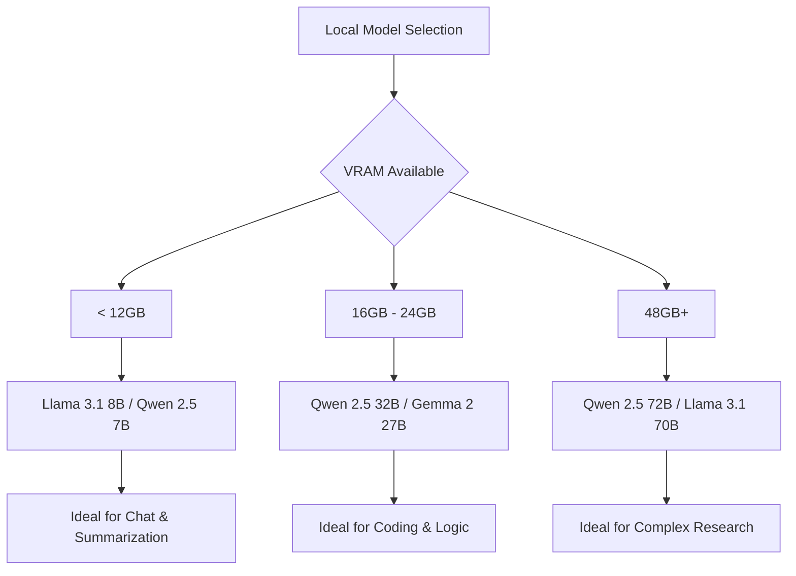

The local Large Language Model (LLM) landscape has historically been split into two uncomfortable extremes. On one side, you have the "lightweights"—models like Llama 3.1 8B or Mistral 7B—which are lightning-fast and run on almost any modern laptop but often struggle with complex logical reasoning and deep coding tasks. On the other side, you have the "behemoths"—the 70B+ parameter giants—which offer staggering intelligence but require enterprise-grade hardware or multiple A100 GPUs to run with acceptable latency.

Enter the [Qwen 2.5 series](https://qwenlm.github.io/blog/qwen2.5/) from Alibaba Cloud. Specifically, the **Qwen 2.5 32B** has emerged as the "Goldilocks" model. By occupying the precise middle ground, it offers a level of cognitive density that was previously unthinkable for consumer-grade hardware. It is an open-weights powerhouse designed to dominate in coding, mathematics, and instruction following, effectively democratizing high-tier AI for developers and researchers worldwide.

---

### ⚡ The "Sweet Spot" for Local Hardware

The appeal of the Qwen 2.5 32B isn't just about its intelligence; it's about its **architectural efficiency**. Unlike Mixture-of-Experts (MoE) models, which activate only a fraction of their parameters per token and can be finicky with VRAM caching, the 32B is a **dense model**. This ensures consistent performance and more predictable memory usage across diverse tasks.

For the average enthusiast, the 32B parameter count is a strategic masterstroke for those utilizing high-end consumer GPUs. 

#### 🧠 The VRAM Equation
To understand why this model is a game-changer, we have to look at the math of quantization. A full-precision (FP16) 32B model would require roughly **64GB of VRAM** just to load the weights, making it inaccessible to most. However, thanks to quantization techniques like GGUF, EXL2, and AWQ, we can compress these weights without significant intelligence loss.

*   **4-bit Quantization:** A 4-bit version of Qwen 2.5 32B occupies approximately **18-20 GB of VRAM**.
*   **The 24GB Advantage:** For users with an **RTX 3090 or 4090 (24GB VRAM)**, this is the perfect fit. It leaves **4-6 GB of VRAM** available for the KV cache (context window), allowing for substantial document analysis or long coding sessions without hitting "Out of Memory" (OOM) errors.

By optimizing for the 24GB VRAM ceiling, Alibaba has created a model that allows a single desktop GPU to rival the performance of much larger, fragmented systems.

---

### 📊 Benchmarks: Coding and Math Mastery

The Qwen 2.5 32B doesn't just fill a gap in size; it sets a new bar for performance. In rigorous evaluations, it significantly outperforms Llama 3.1 8B and begins to encroach on the territory of models in the 70B range.

#### 💻 Coding Proficiency
On the [HumanEval benchmark](https://huggingface.co/spaces/open-llm-leaderboard/open_llm_leaderboard), which tests a model's ability to solve coding problems from scratch, the Qwen 2.5 series shows dominant proficiency in **Python, JavaScript, C++, and Java**. Its ability to understand complex software architecture and generate boilerplate-free, functional code makes it a premier choice for a local Copilot alternative.

#### 🧮 Mathematical Reasoning
One of the most striking improvements is seen in the **GSM8K** (grade school math) and **MATH** benchmarks. The model handles multi-step logical reasoning with a far lower hallucination rate than previous iterations. 

**Key Performance Stats:**
*   **MMLU (General Knowledge):** Consistently ranks at the top of the 30B-40B weight class.
*   **Coding Accuracy:** Shows a **~15-20% improvement** over predecessors in complex logic tasks.
*   **Multilingual Support:** Exceptional performance across 29+ languages, far exceeding the English-centric focus of many Western models.

> "Qwen 2.5 32B provides a level of reasoning and coding proficiency that was previously only available in models twice its size, effectively democratizing high-tier AI for local developers."

---

### 🛠️ Open Weights and the Ecosystem

The "Open Weights" nature of Qwen 2.5 32B is its greatest strength. Because the weights are hosted on [Hugging Face](https://huggingface.co/Qwen), the community has been able to optimize, quantize, and fine-tune the model within hours of release.

#### 🚀 Deployment Pathways
The integration ecosystem for Qwen is currently the most robust in the local AI space. Users can deploy the model via several industry-standard tools:

1.  **[Ollama](https://ollama.com):** The gold standard for ease of use. A single command (`ollama run qwen2.5:32b`) handles the download and deployment on macOS, Linux, or Windows.
2.  **[vLLM](https://vllm.ai):** For developers building production-grade local applications, vLLM provides high-throughput PagedAttention, making the 32B model viable for multi-user local API services.
3.  **[LM Studio](https://lmstudio.ai):** For those who prefer a GUI, LM Studio allows users to cherry-pick different quantization levels (from Q2_K to Q8_0) to find the perfect balance between speed and precision.
4.  **[llama.cpp](https://github.com/ggerganov/llama.cpp):** The foundation for GGUF support, enabling the model to run on Apple Silicon (M1/M2/M3) using unified memory.

Because the model is open, we are already seeing the rise of "specialized" versions. Fine-tunes focusing on roleplay, medical terminology, and specific legal frameworks are appearing daily, ensuring the model evolves faster than any closed-source API.

---

### 🥊 Qwen 2.5 32B vs. The Competition

To understand where Qwen 2.5 32B fits, we must compare it to its primary rivals: Llama 3.1 and Google's Gemma 2.

| Feature | Llama 3.1 8B | Qwen 2.5 32B | Gemma 2 27B | Llama 3.1 70B |
| :--- | :--- | :--- | :--- | :--- |
| **VRAM Req.** | $\approx$ 5-8 GB | **$\approx$ 18-22 GB** | $\approx$ 16-20 GB | $\approx$ 40 GB+ |
| **Reasoning** | Basic/Moderate | **High** | High | Very High |
| **Coding** | Moderate | **Exceptional** | Strong | Exceptional |
| **Speed** | Instant | **Fast** | Fast | Slow (Local) |
| **Hardware** | Entry-level | **Prosumer (RTX 3090/4090)** | Prosumer | Enterprise/Multi-GPU |

While **Llama 3.1 8B** is faster and can run on a smartphone or basic laptop, it lacks the "cognitive depth" required for complex software engineering or nuanced academic writing. Conversely, **Gemma 2 27B** is a formidable competitor, but Qwen 2.5 32B generally edges it out in raw coding benchmarks and multilingual versatility.

---

### 🏁 Final Verdict: The New Local Standard

The release of Qwen 2.5 32B marks a pivotal shift in the accessibility of high-performance AI. For years, the community felt forced to choose between a "fast but shallow" 8B model and an "intelligent but impossible to run" 70B model. 

By hitting the 32B mark with a dense, open-weights architecture, Alibaba has provided a professional-grade tool that fits on a standard office desk. It offers the highest **"intelligence-per-gigabyte"** ratio currently available in the open-weights ecosystem. 

For developers who need a local coding assistant that actually understands context, researchers who require private data processing, and AI hobbyists with a 24GB GPU, the Qwen 2.5 32B is currently the **best local dense model** on the market. It isn't just a incremental update; it is the new baseline for what local AI can achieve.

---

### 📚 References & Further Reading

*   **Official Blog:** [Qwen 2.5 Release Notes](https://qwenlm.github.io/blog/qwen2.5/)
*   **Model Weights:** [Qwen Hugging Face Collection](https://huggingface.co/Qwen)
*   **Benchmark Data:** [Open LLM Leaderboard](https://huggingface.co/spaces/open-llm-leaderboard/open_llm_leaderboard)
*   **Inference Engine:** [vLLM Documentation](https://docs.vllm.ai/)
*   **Local Deployment:** [Ollama Library](https://ollama.com/library)

---

## 📖 Related Reading

- [Students Aren't Lawyers Yet: Why CJI D.Y. Chandrachud Blocked the BCI's Overreach ⚖️](/who-are-they-to-raise-issue-cji-slams-bar-councils-order-against-nalsar-students/)
- [Is the iPhone "Plus" Dying? Apple’s Move Toward an "iPhone 17 Slim"](/apple-again-reported-to-skip-launching-the-iphone-18-this-year-gsmarenacom-news-gsmarenacom/)
- [🚀 800 km/h in Seconds: Inside China’s Record-Breaking Vacuum Train](/800-km-an-hour-in-5-seconds-chinas-bullet-train-breaks-its-own-world-record-world-news-hindustantimescom/)
