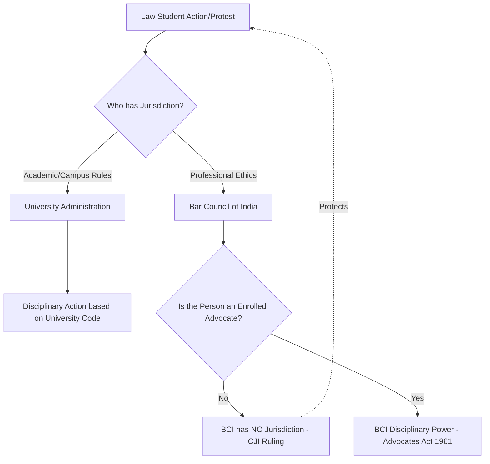

The intersection of academic freedom and professional regulation is often a volatile space, particularly within the legal fraternity. Recently, a significant confrontation emerged between the Bar Council of India (BCI) and the student body of NALSAR University of Law. At the heart of the dispute was a fundamental question of jurisdiction: Can a regulatory body designed to police licensed practitioners also discipline students who have yet to enter the profession?

  
  
 <a href="https://unsplash.com/@brett_jordan">Brett Jordan</a> on <a href="https://unsplash.com/photos/brown-wooden-puzzle-game-board-D44kHt8Ex14">Unsplash</a>

The Chief Justice of India (CJI), D.Y. Chandrachud, provided a definitive answer. By intervening to protect NALSAR students, the court reinforced a critical legal boundary: a law student is not a licensed advocate, and the rules governing the latter cannot be weaponized to stifle the former.

### 🚨 The Spark: Student Activism vs. Professional "Dignity"

The conflict ignited when students at NALSAR engaged in protests and expressed critical opinions regarding institutional policies and social issues. In the eyes of the Bar Council of India, these actions were not merely expressions of student dissent; they were viewed as "unprofessional" and a violation of the "dignity" expected of the legal profession.

As the statutory body responsible for both the regulation of legal education and the standards of professional conduct in India, the BCI viewed the students' activism through the lens of professional ethics. Rather than treating the situation as a campus disciplinary matter, the BCI issued a notice to the NALSAR administration, demanding that the university punish the students for their behavior.

To observers and legal scholars, this move appeared to be a strategic attempt to instill a "chilling effect" within one of India's premier law schools. By threatening the future professional standing of students, the BCI was effectively signaling that dissent in law school could lead to professional blacklists before a degree is even conferred. This tension highlights a broader struggle in Indian academia: the balance between maintaining institutional order and upholding the right to free speech as guaranteed under [Article 19 of the Constitution](https://www.constitutionofindia.net).

### ⚠️ The BCI's "Super-University" Ambition

The BCI's directives were not mere suggestions; they represented an attempt to hijack the university's internal disciplinary mechanisms. By instructing NALSAR to act against its students based on BCI's standards of "professionalism," the regulator was essentially attempting to position itself as a supervisory authority over university governance.

To understand why this was legally untenable, one must look at the [Advocates Act, 1961](https://www.indiacode.nic.in/handle/123456789/1631). This Act is the primary legislation governing the legal profession in India. While the BCI does indeed have the power to regulate legal education, its disciplinary powers are specifically calibrated for those who are **enrolled as advocates**.

**The legal distinction is binary:**
1.  **Law Students:** Subject to the statutes, ordinances, and disciplinary codes of their respective universities.
2.  **Advocates:** Subject to the BCI’s disciplinary jurisdiction regarding "professional misconduct."

By attempting to apply the standards of "professional misconduct" to students, the BCI was acting *ultra vires*—beyond its legal authority. If the BCI were permitted to discipline students, it would effectively create a shadow disciplinary system, where a student could be penalized for "misconduct" despite having no legal status as a professional.

### ⚖️ The CJI’s Response: Defining Jurisdiction

When the matter reached the judiciary, CJI D.Y. Chandrachud questioned the very foundation of the BCI's intervention. The court's reasoning was based on a strict, textual reading of the law, stripping away the BCI's attempt to expand its reach through administrative notices.

The CJI's observation was succinct and powerful:
> "Students are not advocates. The BCI cannot exercise disciplinary jurisdiction over someone who is not an advocate under the Advocates Act."

The court clarified that while the BCI sets the curriculum and standards for legal education, it does not possess the authority to act as a "super-university" or a secondary disciplinary committee. Law students are governed by the academic and behavioral codes of their institutions. The professional "leash" of the BCI only tightens once an individual is enrolled on the State Roll of Advocates.

### 🎓 The Broader Implications for Academic Freedom

This ruling is a landmark victory for academic freedom in India. The implications extend far beyond the halls of NALSAR. If the BCI's overreach had been validated, it would have established a precedent where any professional regulator could potentially blacklist students based on their political or social views.

**The critical takeaways from this judicial intervention include:**

*   **Strict Separation of Powers:** There is an immutable line between *educational regulation* (setting standards) and *professional discipline* (punishing misconduct).
*   **Protection of the "Learning Curve":** Law school is intended to be a space for critical inquiry. Students must be able to critique the legal system, the judiciary, and the government without fearing that their future license to practice will be revoked before they even apply for it.
*   **Statutory Limitation:** The **Advocates Act, 1961**, serves as a boundary. Administrative notices cannot override statutory definitions. The BCI cannot expand its jurisdiction through "guidelines" or "notices" if the parent Act does not grant such power [Bar and Bench](https://www.barandbench.com).

Furthermore, this decision protects the autonomy of National Law Universities (NLUs). By preventing the BCI from dictating disciplinary outcomes, the court ensured that universities remain autonomous spaces for intellectual exploration rather than mere training centers for blind compliance [Scroll.in](https://scroll.in).

### 📉 Analysis: The Risk of Regulatory Overreach

The BCI's attempt to police students reflects a recurring trend in professional regulation where the line between "ethics" and "obedience" becomes blurred. In a democratic society, the legal profession requires individuals who can think critically and challenge the status quo.

**Key statistics and legal markers surrounding this tension:**
*   **1961:** The year the Advocates Act was passed, creating a unified bar and providing a clear framework for disciplinary action.
*   **Section 35:** The specific section of the Advocates Act that deals with the punishment of advocates for professional or other misconduct.
*   **Zero:** The number of provisions in the Advocates Act that grant the BCI disciplinary power over non-enrolled students.

When regulators attempt to bridge this gap, they risk transforming professional standards into tools of political control. The CJI's intervention acts as a judicial firewall, ensuring that the "professional gown" is not used as a straitjacket while a student is still earning their degree [The Hindu](https://www.thehindu.com).

### 🏁 Conclusion: The Path to the Bar

The intervention by the Supreme Court serves as a vital reminder that the rule of law applies equally to the regulators. By pushing back against the BCI, the court protected the sacred relationship between the student and the academic institution, upholding the principle that universities must be sanctuaries for dissent and debate.

The message to the legal community is clear: the path to becoming an advocate involves learning *how* to think, not just *what* to think. The Bar Council's role is to ensure that once a lawyer enters the courtroom, they adhere to the highest standards of professional ethics. However, until that moment of enrollment, the student belongs to the realm of academia—a realm where questioning is not "misconduct," but a requirement for growth [Indian Express](https://indianexpress.com).

The "professional" leash only tightens after the oath is taken; until then, the freedom to learn, protest, and critique remains inviolable.

---

## 📖 Related Reading

- [Is the iPhone "Plus" Dying? Apple’s Move Toward an "iPhone 17 Slim"](/apple-again-reported-to-skip-launching-the-iphone-18-this-year-gsmarenacom-news-gsmarenacom/)
- [🚀 800 km/h in Seconds: Inside China’s Record-Breaking Vacuum Train](/800-km-an-hour-in-5-seconds-chinas-bullet-train-breaks-its-own-world-record-world-news-hindustantimescom/)
- [🏆 The Architecture of Excellence: Scaling Indian Sports Coaching for the Podium Era](/neeraj-chopra-gopichand-launch-initiative-to-strengthen-indias-coaching-system/)
