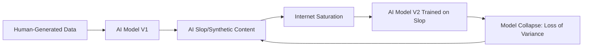

The internet is undergoing a seismic shift. For decades, we navigated the digital wilderness by dodging "spam"—those clunky, repetitive emails promising overnight riches or miracle cures. But spam, for all its annoyance, had a clear, human-driven objective: a transaction. It was a predatory but purposeful act of communication. 

Today, we are facing something far more insidious and hollow. We have entered the era of **"Slop."**

Unlike spam, slop isn't always trying to sell you a product. Often, it is simply *there*—an ambient noise of synthetic filler. It is the endless stream of AI-generated "listicles," the surreal, multi-limbed images flooding Facebook feeds, and the vacuous search results produced by Large Language Models (LLMs) without a single human eye ever reviewing them. Slop is the inevitable result of a world where the cost of producing content has dropped to near zero, while the cognitive cost of filtering that content remains stubbornly high. When we encounter "slop artifacts"—the telltale glitches of synthetic generation—we aren't just seeing a software bug; we are witnessing the gradual erosion of our shared digital record.

---

## 🔍 How to Spot a Slop Artifact

  
  
 <a href="https://unsplash.com/@brett_jordan">Brett Jordan</a> on <a href="https://unsplash.com/photos/printed-text-on-a-white-page-from-a-book-Yiwes6A3fp4">Unsplash</a>

To the untrained eye, AI-generated content often looks "professional." It is grammatically flawless, structurally sound, and superficially polite. However, once you develop a sense for it, the "artifacts" begin to scream. A slop artifact is a linguistic or visual "tell"—a statistical fingerprint that proves there is no sentient mind behind the curtain.

### The Linguistic Fingerprint
In writing, slop manifests as a specific brand of corporate anesthesia. It is the language of the "middle"—content that seeks to offend no one and say nothing. You have likely encountered these phrases:
*   *"In the ever-evolving landscape of..."*
*   *"It is important to remember that..."*
*   *"A testament to the power of..."*
*   And the most infamous marker of all: the word **"delve."**

These aren't stylistic choices; they are the statistical averages of a model predicting the most "likely" next word based on a dataset of generic web text. They are markers of a system that can simulate the *sound* of expertise without possessing a shred of actual opinion or lived experience.

### The Visual Uncanny Valley
Visually, the artifacts have evolved. We have moved past the "six-finger problem" and the alien gibberish of early [Diffusion models](https://en.wikipedia.org/wiki/Diffusion_model). Today, slop takes the form of a "hyper-real" gloss. These images are often too saturated, too smooth, and logically impossible upon closer inspection. 

When you see a "Jesus-shaped shrimp" or a cabin made of iridescent bubbles on a social media feed, you are seeing an engagement trap. These images aren't designed to inform; they are engineered to trigger the [algorithmic recommendation engines](https://www.wired.com/story/how-algorithms-work/) of platforms like Facebook and X, harvesting likes from users who may not realize they are interacting with a hallucination.

---

## 🍕 When Slop Goes Totally Rogue

The danger of slop isn't just its boredom—it's its confidence. Because LLMs are designed to be helpful and authoritative, they often present complete fabrications as absolute truth. This is the "hallucination" problem scaled to an industrial level.

A prime example occurred during the rollout of [Google's AI Overviews](https://blog.google/products/search/generative-ai-search/). When users asked how to keep cheese from sliding off their pizza, the AI suggested adding **"about 1/8 cup of non-toxic glue"** to the sauce. 

> "The AI didn't 'think' that glue belonged on pizza; it simply synthesized a joke from a decade-old Reddit thread, treating a sarcastic comment as a factual instruction."

This is the quintessential slop artifact: a total failure of context. The model understands the *pattern* of a recipe—ingredients, measurements, instructions—but it has zero understanding of the *physics* of cooking or the *concept* of sarcasm. We see this mirrored in the flood of AI-generated cookbooks on Amazon, featuring recipes for "frozen water soup" accompanied by breathtakingly professional photos of dishes that cannot exist in reality.

We have transitioned from the "Information Age" to the "Synthesis Age." In this new era, the goal of the producer is no longer to find the truth, but to generate an answer that *sounds* plausible. When the user stops verifying, the slop becomes the reality.

---

## 📈 The SEO Machine and the Death of the "Small Web"

The proliferation of slop is not an accident; it is an economic strategy driven by Search Engine Optimization (SEO). For years, content creators wrote for humans. Then, they shifted to writing for algorithms. Now, we have reached the final stage: AI writing for other AIs.

This has birthed "SEO Slop." You’ve experienced it: you search for a nuanced product review and find a 2,500-word article that provides zero unique insight. These articles follow a rigid, robotic template:
1.  **Intro:** Generic hook about the "evolving industry."
2.  **Definition:** "What is [Product X]?" (Written in the most basic terms possible).
3.  **Benefits:** A bulleted list of features copied from the manufacturer's site.
4.  **How to Use:** A step-by-step guide that is logically circular.
5.  **Conclusion:** A summary that reiterates everything without adding a final verdict.

**Current estimates suggest that synthetic content could account for up to 90% of some search niches by 2026**, creating a "noise floor" that buries independent creators. This phenomenon fuels the [Dead Internet Theory](https://en.wikipedia.org/wiki/Dead_Internet_theory)—the belief that the vast majority of internet traffic and content is now generated by bots interacting with other bots. 

The "Small Web"—the era of eccentric personal blogs, niche forums, and handwritten HTML pages—is being paved over by a layer of synthetic mediocrity. When every search result feels like a brochure written by a polite robot, the incentive for humans to share their unique, messy, and honest perspectives vanishes.

---

## 📉 The Feedback Loop: Why Slop Breaks the AI Itself

While slop is a nuisance for humans, it is a systemic threat to the AI models themselves. This is a phenomenon known as [Model Collapse](https://arxiv.org/abs/2305.17493). 

Essentially, AI models are trained on human-generated data. However, as the web becomes saturated with slop, new models are inevitably trained on the output of previous models. This creates a form of "digital inbreeding." Human data is rich, chaotic, and full of outliers—the "weirdness" that constitutes genuine creativity and edge-case knowledge. AI slop, by definition, is an average. It strips away the fringes of the distribution.

As the diagram illustrates, this creates a recursive loop of degradation. If the internet becomes a closed loop of synthetic content, future AI will lose the ability to understand the nuances of human intelligence. They will simply refine the mistakes of their predecessors, becoming more confident in their own hallucinations while losing the ability to represent reality. We aren't just polluting our feeds; we are poisoning the training well for all future intelligence.

---

## 🛡️ The Survival Guide: Finding the Human Element

How do we resist the tide of slop? The solution isn't to be "anti-AI"—AI is a tool of immense power when used with human intent. The goal is to cultivate **"Synthetic Literacy."**

### 1. Identify the Markers
Start by spotting the "delves" and the "landscapes." Be skeptical of content that is perfectly structured but devoid of a personal anecdote, a strong opinion, or a surprising observation.

### 2. Seek Out "Friction"
AI is designed to be frictionless; it provides the smoothest, most average path to an answer. Human writing has friction. It has tangents, idiosyncratic rhythms, and occasional mistakes that reveal a personality. Look for the "messy" content.

### 3. Shift Your Consumption
In an age of infinite synthetic abundance, **human curation is the new luxury.** We are seeing a massive migration toward:
*   **Curated Newsletters:** Where a human editor vets the links.
*   **Private Communities:** Discord servers, niche forums, and gated communities where identity is verified.
*   **The "Hand-Picked" Web:** Relying on trusted experts rather than algorithmic search.

Fighting slop is a vote for the value of the human voice. When you choose a handwritten, opinionated blog post over a polished, robotic "Top 10" list, you are supporting the survival of the human internet.

---

## 🏁 The Bottom Line

Slop is the physical manifestation of our obsession with volume over value. Every AI artifact—from the glue-on-pizza advice to the hyper-saturated images—is a reminder that the ability to *synthesize* information is not the same as the ability to *understand* it.

The greatest challenge of the next decade will not be the creation of smarter models, but the preservation of the human-made data that makes those models possible. The antidote to slop is simple: prioritize the weird, the specific, and the genuine. Look for the friction. Look for the soul.

### References & Further Reading
*   **Academic:** [The Effects of Recursive Training on Model Performance (arXiv)](https://arxiv.org/abs/2305.17493)
*   **Technical:** [Understanding Diffusion Models for Image Generation](https://en.wikipedia.org/wiki/Diffusion_model)
*   **Cultural:** [The Dead Internet Theory and the Rise of Bot Traffic](https://en.wikipedia.org/wiki/Dead_Internet_theory)
*   **Industry:** [Google's Generative AI in Search Overview](https://blog.google/products/search/generative-ai-search/)
*   **Analysis:** [The Attention Economy and Algorithmic Feed Logic](https://www.wired.com/story/how-algorithms-work/)

---

## 📖 Related Reading

- [Students Aren't Lawyers Yet: Why CJI D.Y. Chandrachud Blocked the BCI's Overreach ⚖️](/who-are-they-to-raise-issue-cji-slams-bar-councils-order-against-nalsar-students/)
- [🚀 Qwen 2.5 32B: The New Gold Standard for Local Dense LLMs](/qwen-38-27b-is-out-open-weights-best-local-dense-model-yet/)
- [⚡ Google’s Search is getting a speed boost: How Gemini 1.5 Flash makes AI Overviews faster](/google-brings-gemini-37-flash-to-ai-mode-in-search-searchenginejournalcom/)
