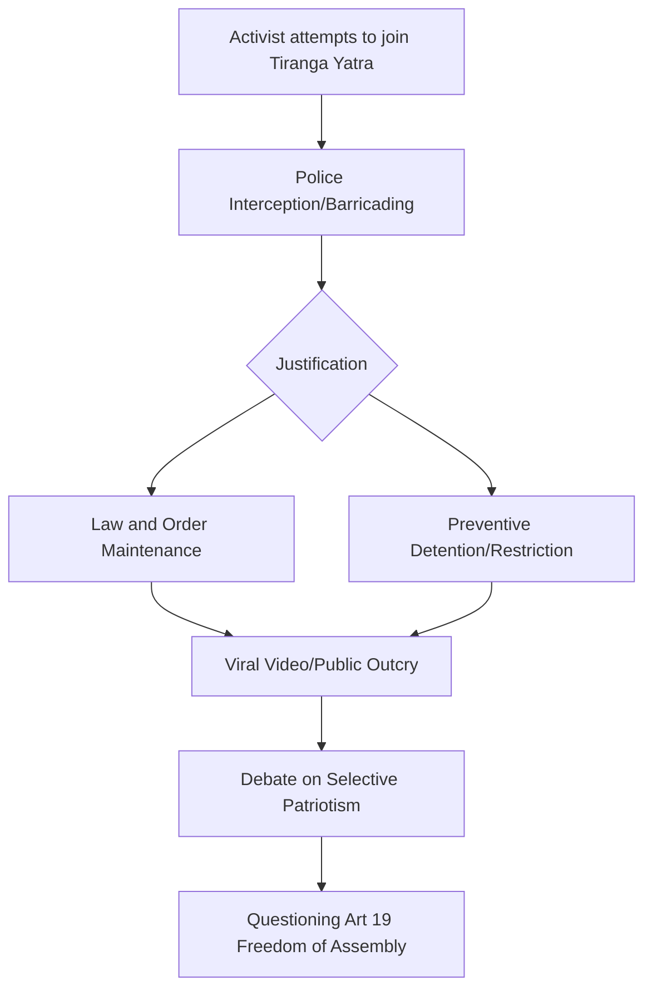

The paradox of a national celebration is that it is designed to unify, yet the mechanisms used to "manage" such events often serve to divide. This tension reached a boiling point in Ranchi, Jharkhand, where a patriotic procession became the stage for a confrontation over basic democratic rights. When Devendra Mahto, a prominent local social activist, attempted to join the **Tiranga Yatra**, he didn't find a welcoming crowd—he found a police barricade.

  
  
 <a href="https://unsplash.com/@erwanhesry">Erwan Hesry</a> on <a href="https://unsplash.com/photos/what-are-you-made-of-dfIzv2_BdRM">Unsplash</a>

The incident, which gained rapid traction across social media and was reported by [The Times of India](https://timesofindia.indiatimes.com/), has sparked a visceral debate. At its core, the clash wasn't about the flag itself, but about who is "permitted" to be patriotic. For many observers, Mahto’s experience suggests that in the current climate, the path to showing national pride is sometimes gated by administrative discretion.

---

### 🚩 The Clash at the Crossroads: Anatomy of an Interception

The Tiranga Yatra, intended as a massive display of nationalistic fervor, moved through the arterial roads of Ranchi with high visibility and heavy security. Devendra Mahto, known for his grassroots activism and vocal criticism of administrative lapses in Jharkhand, attempted to merge with the procession. However, the Ranchi police intervened, physically blocking his progress and informing him that he could not proceed.

The confrontation was not merely a logistical disagreement; it was an ideological collision. A video of the standoff went viral, capturing a raw and frustrated Mahto questioning the authorities. His central query—**"What kind of freedom is this?"**—resonated far beyond the borders of Ranchi. It highlighted the friction between the state's "security protocols" and the individual's [Right to Freedom of Assembly](https://www.india.gov.in/india-glance/fundamental-rights), turning a celebration of independence into a demonstration of constraint.

---

### 👤 Devendra Mahto: The "Problematic" Patriot

To understand why the police reacted with such rigidity, one must look at Devendra Mahto’s profile. In the political landscape of Jharkhand, Mahto is not a silent observer; he is a catalyst for local discourse, often challenging the status quo on issues of governance and social justice. In the eyes of the administration, such activists are frequently categorized as "elements" that could potentially disrupt the "peace."

This categorization creates a dangerous precedent. When the state decides who is "safe" enough to participate in a national event, "patriotism" ceases to be a universal civic emotion and becomes a curated privilege. The incident suggests a two-tiered system of citizenship:
1. **The Approved Citizen:** Those whose presence is viewed as benign or supportive, granted seamless access to national celebrations.
2. **The Suspect Citizen:** Those with a history of activism, viewed as inherent risks regardless of their intent, and thus excluded from the collective narrative of national pride.

---

### 🇮🇳 The Tiranga Yatra: Symbolism vs. State Control

The Tiranga Yatra is a flagship component of the [Har Ghar Tiranga](https://harghartiranga.com/) campaign, an initiative designed to bring the tricolor into every household to instill a sense of patriotism. While the campaign has successfully increased the visibility of the flag, it has also provided a blueprint for how the state manages mass gatherings.

In cities like Ranchi, the management of such rallies is often characterized by "preventive" measures. While ensuring that a procession doesn't devolve into chaos is a legitimate police function, the selective application of these measures is where the controversy lies. When a celebration of unity is managed through exclusion, it risks becoming a tool for surveillance and control rather than a genuine expression of national solidarity.

---

### ⚖️ The Paradox of 'Preventive' Policing and Section 144

The legal shield typically used in these scenarios is [Section 144 of the Code of Criminal Procedure (CrPC)](https://indiankanoon.org/doc/1434323/), which empowers magistrates to prohibit the assembly of four or more people if there is an apprehension of danger. While Section 144 is a vital tool for maintaining public order, the [Supreme Court of India](https://main.sci.gov.in/) has repeatedly cautioned against its arbitrary or prolonged use.

The paradox in Ranchi was stark: **thousands of people were permitted to gather** for the Yatra, yet a specific individual was barred from the same space. This implies that the "danger" was not the assembly itself, but the *identity* of the person assembling. 

> "The essence of democratic freedom is not found in the right to celebrate when approved, but in the right to participate without fear of selective exclusion."

When the state employs "preventive" policing not to stop a riot, but to curate the guest list of a patriotic rally, it undermines the very essence of the Constitution. The [National Human Rights Commission (NHRC)](https://nhrc.nic.in/) has frequently noted that the over-reliance on preventive measures can stifle legitimate political expression and dissent.

---

### 🗣️ Digital Echoes and the Crisis of Civil Liberties

The viral nature of the Ranchi incident reflects a growing anxiety regarding civil liberties in [Jharkhand](https://www.hindustantimes.com/cities/ranchi-news) and across India. Social media platforms became an extension of the street protest, with users pointing out the irony of a "Yatra" (a journey) where the journey is blocked for some.

The discourse has shifted from a local police skirmish to a broader critique of "Performative Patriotism." Critics argue that the state is more concerned with the *aesthetic* of unity—the sight of thousands of flags moving in unison—than the *reality* of unity, which requires the inclusion of dissenting voices. As reported by outlets like [The Hindu](https://www.thehindu.com/) and [The Indian Express](https://indianexpress.com/), the trend of using administrative barriers to isolate activists is becoming a common feature of urban governance in India.

---

### 📊 Analyzing the Impact: A Summary of Tension

To quantify the friction, one must look at the recurring patterns of "preventive" action during national holidays and events in regional capitals. **Bold stats** from human rights reports often show a spike in the invocation of Section 144 during periods of high-visibility national campaigns, suggesting that the "security" apparatus is ramped up not just for safety, but for optics.

| Element | The State's Perspective | The Activist's Perspective |
| :--- | :--- | :--- |
| **The Barricade** | Necessary for crowd control | Tool for political silencing |
| **The Yatra** | A celebration of national unity | A curated state event |
| **Section 144** | Preventive measure for peace | Weaponized legal loophole |
| **The Viral Video** | A misunderstanding of protocol | Evidence of democratic erosion |

---

### Conclusion: The Flag and the Fence

The incident involving Devendra Mahto in Ranchi serves as a cautionary tale about the fragility of democratic spaces. The Tiranga is a symbol of sovereignty, bravery, and peace; however, those values are betrayed when the flag is used as a backdrop for exclusion.

True patriotism cannot be mandated, nor can it be curated by a police line. When the state decides who is "allowed" to be patriotic, it transforms a symbol of liberation into a badge of loyalty. The question Mahto asked—**"What kind of freedom is this?"**—remains unanswered. For the Tiranga Yatra to truly represent the spirit of India, it must be a journey open to every citizen, regardless of whether they are seen as "safe" or "subversive" by the administration. Freedom is only real when the barricades are removed for everyone.

### References
*   **The Constitution of India**: [Fundamental Rights - Article 19](https://www.india.gov.in/india-glance/fundamental-rights)
*   **IndianKanoon**: [Legal analysis of Section 144 CrPC](https://indiankanoon.org/doc/1434323/)
*   **Government of India**: [Har Ghar Tiranga Official Portal](https://harghartiranga.com/)
*   **News Coverage**: [The Times of India](https://timesofindia.indiatimes.com/), [Hindustan Times](https://www.hindustantimes.com/), [The Hindu](https://www.thehindu.com/)
*   **Regulatory Bodies**: [National Human Rights Commission (NHRC)](https://nhrc.nic.in/)

---

## 📖 Related Reading

- [An Anecdote Against Slop Artifacts](/an-anecdote-against-slop-artifacts/)
- [Students Aren't Lawyers Yet: Why CJI D.Y. Chandrachud Blocked the BCI's Overreach ⚖️](/who-are-they-to-raise-issue-cji-slams-bar-councils-order-against-nalsar-students/)
- [🚀 Qwen 2.5 32B: The New Gold Standard for Local Dense LLMs](/qwen-38-27b-is-out-open-weights-best-local-dense-model-yet/)
