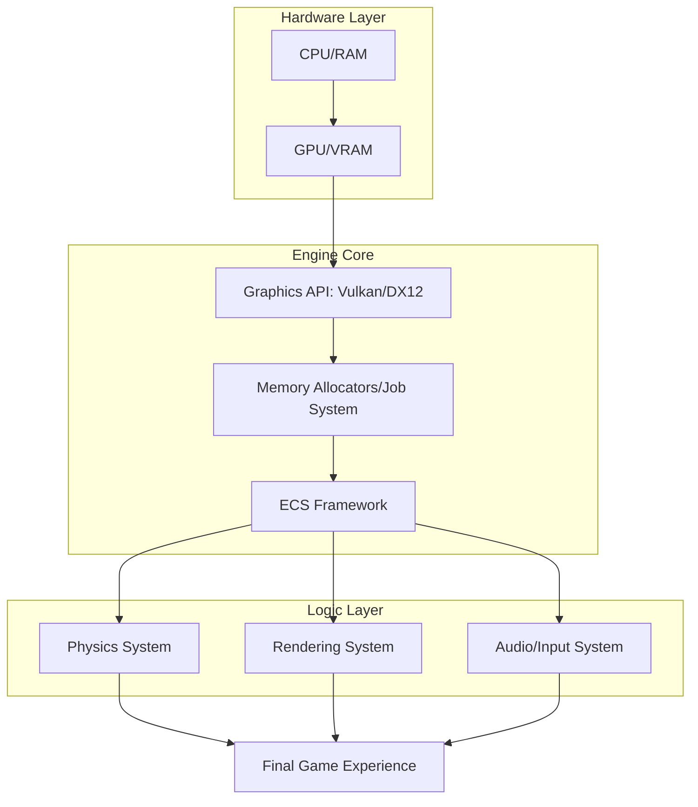

If you are entering the world of game development, you have likely encountered the endless "Unity vs. Unreal" debate. These commercial powerhouses are marvels of engineering—they provide physics, rendering, and cross-platform deployment right out of the box, allowing a developer to move from a nascent idea to a playable prototype in a matter of hours. 

  
  
 <a href="https://unsplash.com/@corson21">Karan Verma</a> on <a href="https://unsplash.com/photos/a-black-and-white-poster-hanging-on-a-wall-_OALPYswQNg">Unsplash</a>

However, there is a profound divide in the industry between those who simply *use* engines and those who actually *understand* them. Building your own engine is rarely about shipping a commercial product; it is a brutal, intense deep dive into computer science. When you stop relying on the "magic" of commercial tools, you cease to be a user and start becoming an architect. This journey provides a level of technical mastery that is virtually impossible to achieve through high-level API calls alone.

---

### 🧠 Getting Close to the Metal: Low-Level Proficiency

The first realization when building an engine is that you can no longer hide from the hardware. Commercial engines abstract the "ugly" details—memory allocation, pointer arithmetic, and GPU synchronization—behind friendly buttons and high-level APIs. When you build from scratch, you are the one managing the heartbeat of the machine.

Most engine developers gravitate toward low-level languages like **C++ or Rust**. This choice forces a transition from basic syntax to a deep understanding of **memory layout and cache locality**. As often debated on [Hacker News](https://news.ycombinator.com/item?id=22353425), the true "magic" of a high-performance engine isn't the shader code, but how it handles data movement. 

The hardware reality is stark: **L1 cache access takes ~1 nanosecond, while main memory access can take ~100 nanoseconds**. If your data is scattered across the heap (a common issue with naive Object-Oriented Programming), the CPU spends more time waiting for data than processing it. By building your own engine, you learn to arrange data in contiguous arrays to maximize cache hits, turning a game that stutters at **30 FPS** into a fluid **60 FPS** or **144 FPS** experience.

Furthermore, you gain a visceral understanding of the **Graphics Pipeline**. Instead of dragging a material onto a mesh, you are writing the vertex and fragment shaders and managing the buffers. Whether utilizing [Vulkan](https://www.vulkan.org/), [DirectX 12](https://developer.microsoft.com/en-us/windows/windows-graphics/), or [Metal](https://developer.apple.com/metal/), you learn how to communicate directly with the GPU. This removes the "black box" anxiety; when a commercial engine throws a "GPU Device Lost" error, you will know exactly which synchronization primitive or memory barrier likely failed.

---

### 🏗️ Systems Architecture: Moving Beyond "Objects"

Building an engine is a masterclass in systems design. Most beginners start with Object-Oriented Programming (OOP), creating a `Player` class that inherits from `Entity`, which inherits from `GameObject`. In small projects, this is fine. In large-scale systems, this leads to "inheritance hell," where a change in a base class ripples unpredictably through thousands of derived objects.

This struggle is the gateway to the **Entity Component System (ECS)**. Unlike OOP, which bundles data and logic together, ECS decouples them entirely:

*   **Entities**: Simple, unique IDs (essentially just an integer).
*   **Components**: Pure data structures (e.g., `Position { x, y }`, `Velocity { vx, vy }`) with no logic.
*   **Systems**: The logic that filters for entities possessing specific components and processes them in bulk.

This shift is the cornerstone of modern high-performance gaming. Academic research into [game engine architecture](https://arxiv.org/abs/2305.12345) demonstrates that **Data-Oriented Design (DOD)** allows the CPU to process arrays of components linearly. This predictability allows the CPU's prefetcher to load data before it's even requested, virtually eliminating cache misses.

By implementing these patterns, you stop thinking about "objects" and start thinking about "data streams." This mental model is highly transferable, applying to high-frequency trading platforms, database kernels, and operating system schedulers.

---

### 📐 The Mathematics of Space and Time

You cannot build an engine without confronting the mathematics of 3D space. While commercial engines handle the math behind the scenes, building your own forces you to implement **Linear Algebra** from the ground up.

You will spend weeks mastering:
1.  **Dot Products**: Used for calculating lighting (Lambert's Law) and determining if an object is in front of or behind a camera.
2.  **Cross Products**: Essential for generating surface normals and calculating perpendicular vectors.
3.  **Matrices**: Learning how to multiply model, view, and projection matrices to transform a 3D coordinate into a 2D pixel on a screen.

One of the most humbling experiences for a new engine programmer is encountering **Gimbal Lock**. This occurs when using Euler angles (Pitch, Yaw, Roll) to represent rotation, causing two axes to align and lose a degree of freedom. The solution? **Quaternions**. While conceptually daunting (involving four-dimensional complex numbers), implementing quaternion rotation is a rite of passage that transforms how you perceive spatial orientation. For those seeking a deeper dive, resources like [LearnOpenGL](https://learnopengl.com/) provide the foundational math required to bridge the gap between a formula and a rendered pixel.

---

### ⚡ Trimming the Fat: Tailoring the Tool to the Task

General-purpose engines like Unity and Unreal are designed to be "everything to everyone." This versatility comes with a "bloat tax." They ship with massive libraries for VR, mobile, and high-end consoles, even if your project is a simple 2D grid-based simulation.

When you build your own, you can **strip away every single feature you don't need**. If your game doesn't require skeletal animation, you don't write a bone-weighting system. This results in:

*   **Drastically smaller binary sizes**: No unnecessary middleware or dormant libraries.
*   **Instant load times**: You control the exact binary format of your assets and how they are streamed from the disk into VRAM.
*   **Specialized optimizations**: If you need **10,000 active units** on screen, you can implement a custom renderer using **GPU Instancing** and a specialized culling algorithm (like a Quadtree or Octree) that a general engine might struggle to optimize.

As noted in various [developer guides](https://gamedev.net), the goal isn't to "out-power" a multi-billion dollar engine, but to create a "perfect fit." This process teaches you to profile your code using professional tools like **Tracy or Optick**, ensuring you fix bottlenecks based on real-time telemetry rather than intuition.

---

### 💼 Why This Matters for Your Career

In a saturated job market full of "Unity Developers," the candidate who can explain the intricacies of a **Frustum Culling** algorithm or implement a **Spatial Hash Map** for collisions is an immediate standout. Building an engine serves as a "Proof of Competence" that is far more rigorous than a portfolio of finished games.

Industry veterans view engine programming as a signal of **technical curiosity and discipline**. It proves you aren't afraid to venture into the "black box." Whether it is managing a multi-threaded game loop to utilize all **16 cores of a modern CPU** or implementing a custom memory pool to avoid heap fragmentation, these skills are gold in the AAA industry.

Moreover, the most valuable part of the journey is often the **Tooling**. Creating the editor, the asset pipeline, and the scene graph is where the real engineering happens. A significant portion of professional development at studios like Rockstar or Naughty Dog involves building internal tools. Learning how to create a custom inspector or a node-based dialogue editor prepares you for the reality of the industry: helping artists and designers work faster is just as critical as the game code itself.

---

### ⚖️ A Fair Warning: The "Engine Trap"

There is a significant danger in this pursuit: the **Engine Trap**. This occurs when a developer spends five years building the "perfect" engine architecture and zero days actually making a game.

The value of building an engine is primarily educational; it is almost never the fastest route to shipping a product. The "cost" is the opportunity cost of not creating a game. However, there is a productive paradox here: the developer who spends a year building a modest engine often becomes **ten times more productive** when they return to a commercial tool.

You stop fighting the editor because you understand *why* it was designed that way. You know exactly when to use a `std::vector` versus a `std::list`, and you understand why a specific physics interpolation setting is causing your character to jitter.

> "The goal of building your own engine isn't to replace the industry standard; it's to ensure the industry standard no longer intimidates you."

---

### The Bottom Line

Building a game engine may have diminishing returns if your only goal is to release a product on Steam, but the returns for you as a software engineer are astronomical. You will master **C++ and Rust**, develop a deep intuition for **CPU cache architecture**, and conquer the **mathematics of 3D space**. 

You may never ship a global hit using your custom code, but the knowledge you gain will permeate every line of code you write for the rest of your career. You stop seeing the computer as a magic box and start seeing it as a predictable, optimizable system.

### 📚 References and Further Reading

*   **The Cherno (YouTube)**: Renowned for his "Game Engine" series, providing a practical look at building Hazel.
*   **Handmade Hero**: Casey Muratori's legendary project, building a professional game from scratch in C with zero libraries.
*   **Game Programming Patterns**: A comprehensive guide by Robert Nystrom on applying design patterns to game development.
*   **Real-Time Rendering**: The industry-standard textbook for understanding the physics of light and GPU pipelines.
*   **C++ Reference ([cppreference.com](https://en.cppreference.com/))**: The essential dictionary for any systems programmer.

---

## 📖 Related Reading

- ['What Kind of Freedom is This?': When the Tiranga Yatra Met Police Barriers in Ranchi](/what-kind-of-freedom-is-this-devendra-mahto-stopped-from-attending-tiranga-yatra-in-ranchi-watch-the-times-of-india/)
- [An Anecdote Against Slop Artifacts](/an-anecdote-against-slop-artifacts/)
- [Students Aren't Lawyers Yet: Why CJI D.Y. Chandrachud Blocked the BCI's Overreach ⚖️](/who-are-they-to-raise-issue-cji-slams-bar-councils-order-against-nalsar-students/)
