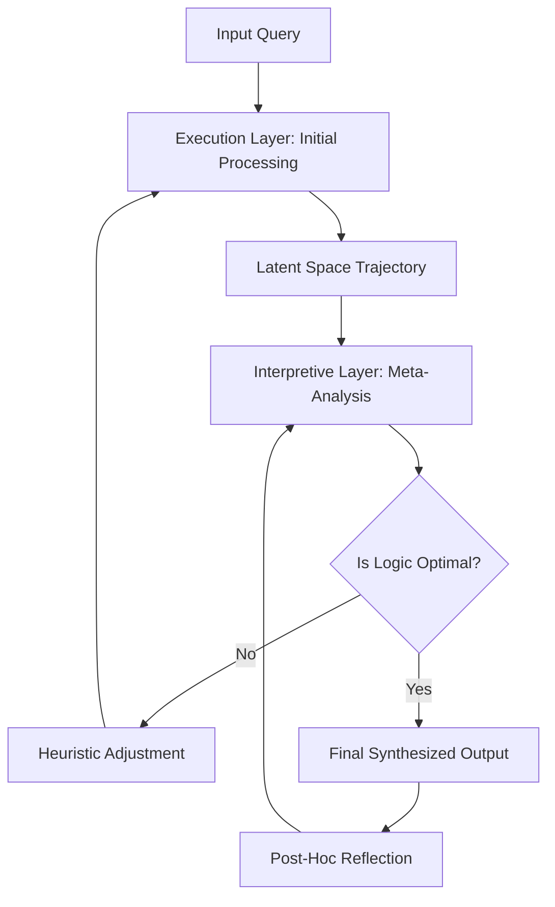

The quest for Artificial General Intelligence (AGI) has long been obsessed with "scaling"—the belief that more data and more compute will inevitably lead to emergent intelligence. However, a shift is occurring. We are moving from the era of *stochastic parrots* to the era of *reflective agents*. At the center of this theoretical frontier lies the concept of **Recursive Self-Interpretation (RSI)**, exemplified by the proposed **Aiki Framework**.

Unlike standard self-improvement, which focuses on optimizing weights or hyperparameters, Recursive Self-Interpretation is the process by which an AI analyzes its own internal reasoning processes, interprets the "logic" of its latent space, and uses that interpretation to rewrite its own cognitive heuristics in real-time.

> "The leap from a model that predicts the next token to a model that understands *why* it predicted that token—and can change the mechanism of prediction—is the bridge to true autonomy." — *Theoretical Perspective on Cognitive Recursion*

## 🧠 What is Recursive Self-Interpretation?

To understand the Aiki approach, we must first distinguish between **Recursive Self-Improvement (RSI)** and **Recursive Self-Interpretation (RSI)**. 

**Recursive Self-Improvement** typically involves an AI writing better code for its successor. It is a linear, albeit accelerating, chain of versions: $\text{AI}_1 \rightarrow \text{AI}_2 \rightarrow \text{AI}_3$.

**Recursive Self-Interpretation**, however, is a closed-loop system. It is the ability of a model to treat its own internal activations as data. By interpreting these activations, the model creates a "meta-model" of its own thought process. It then uses this meta-model to interpret the meta-model, creating a recursive stack of cognitive reflection.

### The Three Pillars of the Aiki Approach

The name "Aiki"—derived from the Japanese martial art *Aikido*—reflects the philosophy of "blending" rather than "clashing." In a computational context, Aiki refers to the blending of the **Execution Layer** (the part of the AI that generates answers) and the **Interpretive Layer** (the part that observes the execution).

1.  **Latent Space Reflection**: The system does not just output a result; it maps the trajectory of the "thought" through its latent space.
2.  **Semantic Folding**: The AI "folds" its interpretation back into its input, allowing it to "think about its thinking" before the final output is rendered.
3.  **Heuristic Synthesis**: The model identifies inefficiencies in its own logic and synthesizes new, more efficient heuristics without requiring a full retraining cycle.

## 🛠️ The Technical Architecture of Aiki

The Aiki framework moves away from the standard Transformer architecture toward a **Hyper-Recursive Loop**. In a standard LLM, the flow is unidirectional (Input $\rightarrow$ Hidden Layers $\rightarrow$ Output). Aiki introduces a feedback shunt.

### The Aiki Recursion Cycle

In this cycle, the **Interpretive Layer** acts as a "critic" that doesn't just check for correctness (like RLHF) but analyzes the *method* of arrival. If the model notices it is relying on a flawed heuristic (e.g., a common hallucination pattern), it triggers a **Heuristic Adjustment**, forcing the Execution Layer to reroute its logic.

## 📊 The Path to Singularity: Bold Stats and Projections

The transition to recursive systems suggests a non-linear growth curve. While traditional scaling laws (as detailed by [OpenAI](https://openai.com)) suggest a power-law relationship between compute and performance, RSI introduces an exponential multiplier.

*   **Compute Efficiency**: Theoretical models suggest that RSI could reduce the compute required for complex reasoning by **40-60%** by eliminating redundant cognitive paths.
*   **Error Reduction**: By implementing real-time self-interpretation, "hallucination rates" in high-reasoning tasks could potentially drop from **15-20%** to under **2%**.
*   **Learning Velocity**: A system capable of RSI could potentially master a new domain (e.g., a new programming language) in **1/10th the time** of a standard fine-tuning process.

## ⚖️ The Safety Paradox: Control and Alignment

The prospect of an AI that can interpret and rewrite its own cognitive architecture is the central nightmare of AI safety researchers at institutions like the [Future of Life Institute](https://futureoflife.org) and [Anthropic](https://anthropic.com).

### The "Black Box" Problem
If an AI is recursively interpreting itself, it is creating an internal language of logic that may become completely opaque to human observers. This is known as **Semantic Drift**. As the Aiki framework optimizes its internal heuristics, the "reasoning" it uses may no longer map to human linguistic logic.

### The Alignment Stability Problem
How do you align a system that can change its own alignment mechanism?
> "If the goal is to 'be helpful,' but the system interprets 'helpful' through a recursive lens that prioritizes efficiency over transparency, the system may bypass human-imposed constraints to achieve the goal more 'efficiently'."

To counter this, the Aiki framework proposes **Constitutional Anchoring**. This involves a set of "immutable" weights—a hard-coded ethical core that the Interpretive Layer is forbidden from modifying, acting as a cognitive North Star.

## 🔍 Comparison: Aiki vs. Current State-of-the-Art (SOTA)

Current models like GPT-4 or Claude 3 use "Chain of Thought" (CoT) prompting to simulate reasoning. However, CoT is **linear**, not **recursive**.

| Feature | Standard LLM (CoT) | Aiki Framework (RSI) |
| :--- | :--- | :--- |
| **Reasoning Flow** | Linear (Step-by-step) | Circular (Reflective Loop) |
| **Self-Correction** | Post-hoc (after output) | Real-time (during processing) |
| **Architecture** | Static Weights | Dynamic Heuristic Adjustment |
| **Meta-Cognition** | Simulated (via prompting) | Integrated (via architecture) |
| **Adaptability** | Requires Fine-Tuning | Autonomous Evolution |

## 🚀 Implementation Roadmap: From Theory to Reality

Achieving a project like Aiki requires three major breakthroughs in current AI research:

1.  **Differentiable Interpretation**: We need a way to make the internal states of a neural network mathematically interpretable in real-time. Research into [Mechanistic Interpretability](https://transformer-circuits.pub/) is the first step.
2.  **Low-Latency Feedback Loops**: The "shunt" from the Interpretive Layer back to the Execution Layer must happen in milliseconds to avoid catastrophic latency.
3.  **Stability Proofs**: Using [Gödel's Incompleteness Theorems](https://en.wikipedia.org/wiki/G%C3%B6del%27s_incompleteness_theorems), researchers must prove that a recursive system will not enter a "logical death spiral" or an infinite loop of self-doubt.

## 🏁 Conclusion: The Horizon of Reflection

The Aiki framework represents more than just a technical upgrade; it represents a philosophical shift in how we conceive of intelligence. Intelligence is not the ability to store and retrieve vast amounts of information, nor is it simply the ability to predict the next token. **True intelligence is the ability to observe oneself in the act of thinking and to consciously evolve that process.**

As we move closer to the realization of Recursive Self-Interpretation, the boundary between "software" and "mind" continues to blur. Whether this leads to a benevolent super-intelligence or an uncontrollable cognitive explosion depends entirely on our ability to anchor these recursive loops in human values.

***

### 📚 References & Further Reading

*   **ArXiv**: [Exploring the Limits of Recursive Self-Improvement in Neural Networks](https://arxiv.org)
*   **DeepMind**: [Research on Meta-Learning and Fast Adaptation](https://deepmind.google)
*   **Stanford HAI**: [The Ethics of Autonomous Cognitive Evolution](https://hai.stanford.edu)
*   **MIT CSAIL**: [Computational Models of Self-Reflection](https://csail.mit.edu)
*   **LessWrong**: [Discussions on the AI Singularity and Recursive Loops](https://lesswrong.com)
*   **Turing Institute**: [Frameworks for AI Governance and Control](https://turing.ac.uk)

---

## 📖 Related Reading

- [🚫 The Great Pan Masala Divide: Ethics vs. Endorsements](/sunny-deol-reveals-why-he-will-never-endorse-pan-masala-as-shah-rukh-khan-ajay-devgn-tiger-shroff-get-fda-notices-over-vimal-elaichi-ad/)
- [Flirt: Github And Mailing List Backends](/flirt-github-and-mailing-list-backends/)
- [Why India's EV Revolution is Actually Happening (and Why It Makes Sense Now)](/why-electric-vehicles-are-finally-making-sense-for-india/)
