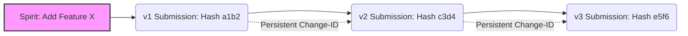

Code review is where the real engineering happens. It is the critical filter where architectural flaws are caught, style guides are enforced, and knowledge is transferred from senior maintainers to newcomers. Yet, for all its importance, the tooling remains a fragmented mess. On one end of the spectrum, you have the polished, web-centric experience of [GitHub Pull Requests](https://docs.github.com/en/pull-requests), where comments are anchored to lines of code in a sleek UI. On the other end lies the "Old Guard": the massive, text-heavy archives of the [Linux Kernel Mailing List (LKML)](https://lkml.org/), where changes are submitted as raw patches via email.

  
  
 <a href="https://unsplash.com/@lukechesser">Luke Chesser</a> on <a href="https://unsplash.com/photos/github-website-on-desktop-LG8ToawE8WQ">Unsplash</a>

The gap between these two worlds is not just a matter of UI; it is a fundamental architectural divide. This is the problem **Flirt** seeks to solve. Flirt is an experimental tool designed to provide a single, "native" experience for code review, regardless of whether the backend is a modern corporate API or a 40-year-old email protocol. By attempting to unify these disparate systems, Flirt exposes the deep-seated architectural headaches that still plague modern version control.

---

### 🛠️ The GitHub Gap: The Ghost of Force-Pushes

To the average developer, GitHub is the gold standard. Its interface makes commenting intuitive and the integration with CI/CD pipelines seamless. However, for a tool like Flirt—which aims to be a sophisticated layer sitting *on top* of version control—GitHub’s API presents a frustrating limitation: it is designed for the "final state" rather than the "evolutionary process."

The primary friction point is the "force-push." In a professional Git workflow, developers frequently use `git push --force` to clean up their commit history, squash intermediate "work-in-progress" commits, or rebase their branch onto the latest `main`. While this creates a clean, linear history for the final merge, it effectively wipes out the intermediate versions of the code. 

For a reviewer, this is a nightmare. Imagine reviewing **v1** of a feature, leaving ten detailed comments, and then seeing the developer force-push **v2**. In a perfect world, the tool would provide an **interdiff**—a precise comparison between the last version the reviewer saw and the current state. Because GitHub’s API does not reliably expose the full history of those deleted, force-pushed commits, Flirt cannot easily "see" the ghost versions of the code.

To circumvent this, Flirt implements a local caching mechanism, remembering the last version reviewed on the user's specific machine. But this introduces a synchronization paradox: if a developer switches from a desktop to a laptop, that local memory vanishes, and the API offers no way to fill the blanks. Furthermore, Flirt struggles with the "attachment" problem. GitHub anchors comments to specific lines, but Flirt views comments as attached to a specific *state* of the code. When a line is deleted in a new push, the "anchor" disappears. The proposed solution—treating deleted lines as "headers" for comment blocks—is a necessary hack to bridge the gap between a static diff and an evolving codebase.

---

### ✉️ The Mailing List Labyrinth: Parsing the "Unmanageable Forest"

If GitHub is a walled garden, mailing lists are the Wild West of software engineering. For projects of immense scale and criticality, such as the [Linux kernel](https://www.kernel.org/) or [Git itself](https://git-scm.com/), the primary medium of exchange remains `git format-patch` and email. 

Flirt attempts to modernize this by integrating with [public-inbox](https://github.com/nojb/public-inbox), the high-performance archive tool used by [lore.kernel.org](https://lore.kernel.org/). By leveraging `public-inbox`, Flirt can treat a stream of emails as a queryable SQLite database, turning a chaotic inbox into a structured data source. However, the "structure" of an email is an illusion.

The "standard" for sending patches is notoriously leaky. For instance, the `--base` flag in `git format-patch`—which explicitly tells the reviewer which commit the patch was built upon—is not enabled by default. Without this metadata, Flirt is forced to guess whether to apply a patch to the current `HEAD` or the `master` branch. In a project with **millions of lines of code** and thousands of daily commits, a wrong guess leads to merge conflicts that break the review flow entirely.

Then there is the "threading" crisis. To track iterations (v1, v2, v3), some developers reply to the previous version's email. While this creates a logical chain, the [Linux kernel submission guidelines](https://docs.kernel.org/process/submitting-patches.html#explicit-in-reply-to-headers) explicitly warn against this for large patch series, as it creates an "unmanageable forest of references" that can crash traditional email clients. Flirt is caught in a catch-22: it requires the very structure that humans are intentionally stripping away to keep their inboxes functional.

---

### 🧬 The Jujutsu Blueprint: Tracking the "Logical Change"

At the heart of Flirt's philosophy is the concept of the **"Spirit"** of a change. This is the idea that a single logical modification to a codebase evolves over time, regardless of how many times it is rewritten, rebased, or resubmitted. This approach is heavily inspired by [Jujutsu (jj)](https://jjgit.org/), a next-generation version control system.

In traditional Git, a commit is identified by a **160-bit SHA-1 hash**. The moment you change a single comma or rebase a commit to move it in the history, that hash changes. To the computer, the identity of the change is gone; it is now a brand-new, unrelated entity. This makes tracking the "evolution" of a feature across different versions a manual, human task.

Jujutsu solves this by introducing a **change-id**. The change-id is a persistent identifier that stays with the logical change no matter how many times it is edited.

For Flirt, the `change-id` is the "soul" of the review process. It allows the tool to link v1 of a patch to v2 automatically, ensuring that comments and context persist across iterations. The struggle, however, is that `git format-patch` does not support these custom headers by default. This forces Flirt to rely on "heuristics"—educated guesses based on subject lines and author names—to reconnect the dots. It highlights a fundamental tension in software engineering: the need for the safety of immutable hashes versus the need for the flexibility of persistent identities.

---

### 💭 The Heuristic Struggle and "Unfit Technology"

When a reliable `change-id` is missing, Flirt must act as a digital detective. It employs tools like `git range-diff`, which attempts to match commits by comparing their "patch-id" (a hash of the actual diff content) and the subject line [as documented in the Git manual](https://git-scm.com/docs/git-range-diff).

While powerful, this is a probabilistic game. If a developer performs a significant rewrite between **v1 and v2**, the patch-id changes, and the logical link is severed. The tool then has to fall back on parsing email quotes—one of the most frustrating tasks in software automation. Reviewers frequently use `[...]` to excise irrelevant parts of a quote. Parsing these "snips" to figure out which specific line of code a reviewer is criticizing is a nightmare of regex and guesswork.

Developing Flirt is more than a technical exercise; it is a critique of the status quo. The creator of Flirt observes a staggering irony in the Linux kernel workflow: developers are actively omitting structured information to prevent their tools from breaking.

> "Shouldn't it be an indication that the technology you're using is unfit for the task, if you intentionally choose to omit clearly relevant, structured information, in order to work around its limitations?" [blog.buenzli.dev](https://blog.buenzli.dev/flirt-github-and-mailing-list)

This sentiment captures the essence of the project. Whether it is the GitHub API's inability to track force-pushes or the fragility of email threads, Flirt is colliding with the "legacy debt" of the entire industry. We have built our most critical infrastructure on tools that were designed for a different era of collaboration.

---

### 🚀 Conclusion: Toward a Unified Review Layer

Flirt is currently in its early stages, moving steadily toward an open-source release. Its ultimate goal is to decouple the *interface* of code review from the *backend* of version control. By bridging the gap between the "Spirit" of a change and the messy reality of APIs and archives, Flirt envisions a world where a developer can contribute to the Linux kernel with the same fluidity they experience on a corporate GitHub repository.

The path is fraught with "unmanageable forests" and missing data, but the mission is clear: the tools should adapt to the developer, not the other way around. As we move toward more complex, distributed systems, the need for a unified, identity-aware review layer is no longer just a luxury—it is a necessity for the health of open-source software.

---

## 📖 Related Reading

- [Why India's EV Revolution is Actually Happening (and Why It Makes Sense Now)](/why-electric-vehicles-are-finally-making-sense-for-india/)
- [Beyond the Black Box: Why You Should Build Your Own Game Engine](/what-you-gain-by-building-your-own-game-engine/)
- ['What Kind of Freedom is This?': When the Tiranga Yatra Met Police Barriers in Ranchi](/what-kind-of-freedom-is-this-devendra-mahto-stopped-from-attending-tiranga-yatra-in-ranchi-watch-the-times-of-india/)
