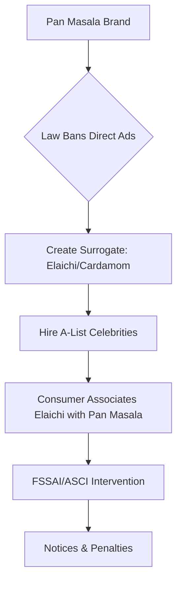

In the glitzy world of Bollywood, where a single endorsement deal can net a superstar tens of crores, the line between brand ambition and public health often becomes blurred. The recent uproar surrounding "surrogate advertising" for pan masala brands—most notably the Vimal Elaichi campaigns—has sparked a fierce debate about the moral responsibility of influencers. While several A-list stars have embraced these lucrative contracts, others, like Sunny Deol, have drawn a hard line in the sand.

## 🌟 Sunny Deol's Principled Refusal

While the industry trend leaned toward accepting massive payouts from mouth-freshener brands, Sunny Deol has consistently maintained a stance of refusal. Deol, known for his "strongman" persona on screen, has applied that same strength to his professional ethics, publicly distancing himself from products that serve as proxies for tobacco and pan masala.

Deol’s refusal isn't just a personal preference; it is a statement on the health crisis facing millions of Indians. By rejecting these deals, he highlights a growing tension in the industry: the conflict between immediate financial gain and long-term societal impact. For Deol, the risk of promoting a product that leads to addiction and oral cancer far outweighs the **crores of rupees** offered by corporate giants.

## 📉 FSSAI vs. The Superstars: The Vimal Controversy

The controversy reached a boiling point when the [Food Safety and Standards Authority of India (FSSAI)](https://www.fssai.gov.in/) and various state Food and Drug Administrations (FDA) began scrutinizing the "Elaichi" (cardamom) ads. Superstars like **Shah Rukh Khan, Ajay Devgn, and Tiger Shroff** became the faces of Vimal Elaichi, a product marketed as a mouth freshener but widely recognized as a surrogate for Vimal Pan Masala.

The FSSAI issued notices to these celebrities, questioning the legality of promoting a product that essentially lures consumers toward a banned category. The core of the issue is "surrogate advertising"—the practice of advertising a banned product (tobacco/pan masala) under the guise of a legal one (cardamom).

> "The use of celebrity influence to bypass health regulations is not just a legal loophole; it is a breach of trust with the public, especially the youth who idolize these figures." — *Industry Ethics Observer*

## ⚖️ The Legal Loophole: What is Surrogate Advertising?

Surrogate advertising is a strategic maneuver used by brands to maintain "top-of-mind awareness" without violating the [Cigarettes and Other Tobacco Products Act (COTPA)](https://www.consumeraffairs.nic.in/). By using the same brand name and visual cues for a legal product, the company ensures that the consumer subconsciously associates the "Elaichi" with the "Pan Masala."

The [Advertising Standards Council of India (ASCI)](https://www.ascionline.org/) has repeatedly flagged these ads for being misleading. According to data, **nearly 70% of consumers** recognize that "mouth freshener" ads are actually promoting tobacco products, rendering the "Elaichi" label a mere formality.

### The Surrogate Cycle Explained

## 🛡️ Consumer Protection and the Way Forward

The Indian government has tightened the screws through the [Consumer Protection Act 2019](https://consumeraffairs.nic.in/acts), which allows for penalties against celebrities who endorse misleading advertisements. Under these rules, if an endorsement is found to be deceptive, the celebrity can be barred from endorsing any product for up to **one year**, and in repeat cases, up to **three years**.

The crackdown on Vimal's ads, reported extensively by outlets like [The Times of India](https://timesofindia.indiatimes.com) and [NDTV](https://www.ndtv.com), signals a shift in how regulatory bodies view celebrity liability. It is no longer enough for a star to claim they were "just the face of the brand"; they are now expected to perform due diligence on the nature of the product.

**Key Statistics at a Glance:**
*   **₹ Thousands of Crores:** The estimated annual revenue of the pan masala industry in India.
*   **10,000+:** Estimated complaints filed with ASCI regarding surrogate ads over the last few years.
*   **Zero Tolerance:** The increasing stance of the FSSAI regarding "misleading" health claims in food-based surrogates.

## 🏁 Final Thoughts

The contrast between Sunny Deol's principled stand and the "surrogate" path taken by other superstars serves as a case study in celebrity ethics. While the legal battle between the FDA/FSSAI and the Vimal empire continues, the public's perception is shifting. In an era of conscious consumption, the legacy of a star may soon be measured not by their net worth, but by the integrity of their endorsements.

---

## 📖 Related Reading

- [Flirt: Github And Mailing List Backends](/flirt-github-and-mailing-list-backends/)
- [Why India's EV Revolution is Actually Happening (and Why It Makes Sense Now)](/why-electric-vehicles-are-finally-making-sense-for-india/)
- [Beyond the Black Box: Why You Should Build Your Own Game Engine](/what-you-gain-by-building-your-own-game-engine/)
