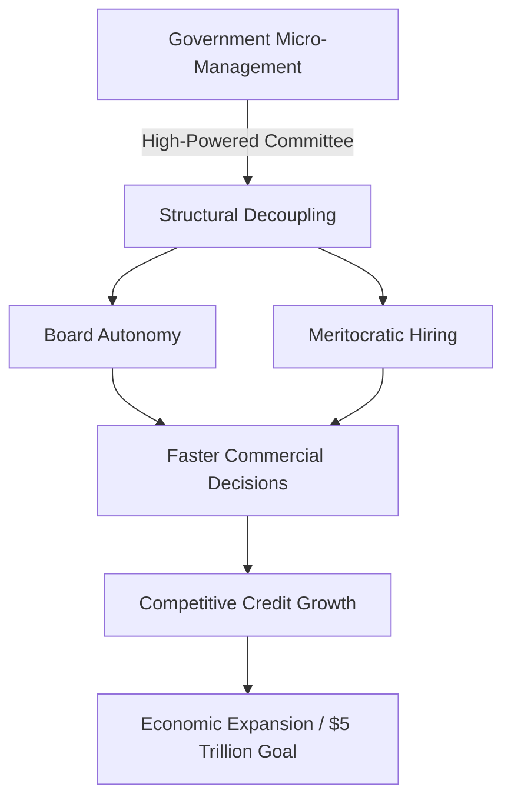

Finance Minister Nirmala Sitharaman has announced the formation of a **high-powered committee** tasked with a fundamental overhaul of how India's Public Sector Banks (PSBs) are governed. As first reported by [Moneycontrol](https://www.moneycontrol.com), the strategic objective is clear: to dismantle the culture of government "micro-management" and grant these institutions the operational autonomy required to thrive in a modern, competitive financial landscape.

  
  
 <a href="https://unsplash.com/@ylearchives">Yle Archives</a> on <a href="https://unsplash.com/photos/a-black-and-white-photo-of-a-group-of-people-sitting-at-a-table-4njqWt1MWXc">Unsplash</a>

By decisively separating day-to-day commercial business decisions from political oversight, the Indian government aims to transform PSBs from bureaucratic entities into agile, competitive players capable of competing head-to-head with private giants and global financial institutions.

---

### ⚖️ The Governance Dilemma: State Ownership vs. Market Agility

For decades, the primary critique of India's public banking sector has been the "agency problem"—the friction created when the state acts as both the owner and the manager. While government ownership ensures financial inclusion and the reach of social schemes, it has historically come at a steep price: a lack of professional autonomy.

When the state exerts too much influence over credit decisions, loan waivers, and the appointment of top executives, it fosters a risk-averse culture. Bank managers, fearing future scrutiny from auditing bodies like the Comptroller and Auditor General (CAG) or the Central Vigilance Commission (CVC), often avoid taking calculated risks. This "fear of the file" has historically stifled innovation and slowed the pace of credit disbursement to high-growth sectors.

The current administration recognizes that if India is to realistically achieve its goal of becoming a **$5 trillion economy**, the banking system must move from a state of "compliance" to a state of "performance." The goal is to shift the government's role from that of an active manager to that of a professional **shareholder**.

> "The objective is not to abdicate responsibility, but to redefine it. The government should provide the vision and the capital, while the board provides the professional direction."

---

### 🎯 The Mandate: Ending the Era of Micro-Management

The newly formed committee is tasked with identifying specific "bottlenecks"—the regulatory and bureaucratic friction points where government red tape obstructs commercial efficiency. The committee's roadmap is expected to focus on three critical pillars:

#### 1. Professionalizing Executive Appointments
Historically, the elevation of Managing Directors (MDs) and CEOs in PSBs was often viewed through the lens of seniority or administrative alignment. The committee aims to ensure that leadership is meritocratic. By utilizing the [Financial Services Institutions Bureau (FSIB)](https://www.fsib.gov.in), the government intends to pick leaders based on specialized skill sets and a proven track record of profitability rather than tenure.

#### 2. Operational and Commercial Autonomy
Currently, significant commercial strategies—ranging from interest rate adjustments to large-ticket corporate loan approvals—often require nods from the Ministry of Finance. This lag time is a competitive disadvantage. The mandate is to reduce the need for ministerial sign-offs on standard commercial operations, allowing banks to respond to market volatility in real-time.

#### 3. Board Composition and Discipline
The government plans to increase the ratio of independent directors on PSB boards. By bringing in veterans from the private sector and global finance, PSBs can adopt a culture of discipline, rigorous risk assessment, and a focus on **Return on Assets (RoA)**.

---

### 📜 The Nayak Legacy: Version 2.0 of Banking Reform

This initiative is not an isolated event but the evolution of a long-term reform trajectory. In 2014, the [P.J. Nayak Committee](https://en.wikipedia.org/wiki/Banking_in_India) proposed a radical shift: suggesting the government reduce its stake in PSBs to below **51%** and hand over the appointment of CEOs to an independent professional body.

While the full recommendations of the Nayak Committee were not implemented—largely due to the political sensitivity of privatization—the spirit of the report led to the creation of the Banks Board Bureau (BBB), now the FSIB. 

What Sitharaman is proposing now is essentially "Reform 2.0." While the first wave focused on *who* was in the room (appointments), this second wave focuses on *what they are allowed to do* (power). It is a shift from structural change to behavioral change.

---

### 📉 The Macro-Economic Stakes: From Cleanup to Growth

The timing of this reform is critical. For nearly a decade, the Indian banking sector was bogged down by a mountain of Non-Performing Assets (NPAs). Through the implementation of the [Insolvency and Bankruptcy Code (IBC)](https://ibbi.gov.in), the sector has undergone a massive cleanup. With cleaner balance sheets, the focus must now shift from "survival" to "growth."

**Key Metrics the Committee will Influence:**

*   **The NPA Ratio:** With professionalized risk management, the goal is to keep **Non-Performing Assets** at historic lows, preventing the recurrence of the "Twin Balance Sheet" problem.
*   **Capital Adequacy Ratio (CAR):** Increased autonomy allows banks to manage their capital more efficiently, potentially lowering the cost of borrowing for the end consumer.
*   **Credit Growth in MSMEs:** Micro, Small, and Medium Enterprises are the backbone of the economy. Faster decision-making processes will directly translate to quicker loan approvals for this sector.
*   **The RoA Gap:** Currently, there is a significant gap in the **Return on Assets (RoA)** between private lenders like HDFC or ICICI and the top PSBs. Closing this gap is a primary benchmark for success.

---

### 🌍 Global Context: The State-Owned Bank Model

India is not alone in this struggle. Many emerging economies have faced the same dilemma. In China, the "Big Four" state banks have seen varying degrees of success by adopting market-based KPIs while maintaining state ownership. In the UK, the post-2008 restructuring of state-backed banks emphasized a clear separation between the Treasury's political goals and the bank's commercial viability.

The Indian approach is attempting to find a "Third Way"—maintaining the social mandate of the PSBs (such as implementing the [Pradhan Mantri Jan Dhan Yojana](https://pmjdy.gov.in)) while operating the commercial arm of the bank with the ruthlessness of a private entity.

---

### ⚠️ Potential Roadblocks and Risks

Despite the optimism, several challenges remain:

1.  **Political Will vs. Practical Application:** There is a risk that the "autonomy" granted on paper remains limited in practice, with the Ministry of Finance still exerting informal influence over "critical" loans.
2.  **The "Audit Fear":** Unless the guidelines for the CAG and CVC are updated to recognize "commercial failure" as distinct from "corruption," bank managers will remain hesitant to take risks.
3.  **Cultural Inertia:** Shifting the mindset of hundreds of thousands of employees from a "government servant" mentality to a "banking professional" mentality takes years, not committee reports.

---

### 🏁 Conclusion: A New Era for Indian Banking

The formation of this committee is a tacit admission that owning a bank and running a bank are two entirely different disciplines. By attempting to excise the culture of micro-management, Nirmala Sitharaman is attempting to pivot PSBs from being instruments of social policy to becoming engines of economic prosperity.

If these recommendations are implemented with sincerity, the result will be a more resilient, efficient, and competitive financial system. The state will continue to provide the capital and the safety net, but the professionals will finally be given the steering wheel. For the Indian economy, this could be the catalyst that turns a stable banking sector into a powerhouse of growth.

---

### 📚 References & Further Reading

*   **Reserve Bank of India (RBI):** [Financial Stability Reports](https://www.rbi.org.in)
*   **Ministry of Finance:** [Department of Financial Services](https://dfs.gov.in)
*   **World Bank:** [Reports on State-Owned Enterprises](https://www.worldbank.org)
*   **International Monetary Fund (IMF):** [Country Reports on India](https://www.imf.org)
*   **Press Information Bureau (PIB):** [Official Announcements on Banking Reforms](https://pib.gov.in)

---

## 📖 Related Reading

- [📉 The Intelligence Trade-off: Why Your AI is Getting Dumber on Purpose](/models-are-getting-dumber-on-purpose/)
- [🚫 The Great Pan Masala Divide: Ethics vs. Endorsements](/sunny-deol-reveals-why-he-will-never-endorse-pan-masala-as-shah-rukh-khan-ajay-devgn-tiger-shroff-get-fda-notices-over-vimal-elaichi-ad/)
- [Flirt: Github And Mailing List Backends](/flirt-github-and-mailing-list-backends/)
