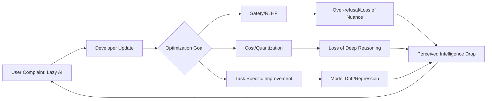

If you’ve been using GPT-4 or Claude for a while, you might have noticed a subtle but frustrating shift. It feels... lazier. A prompt that once yielded a brilliant, multi-page strategic plan now hands you a skeletal bulleted list and tells you to "fill in the rest yourself." While it’s tempting to dismiss this as a glitch or a conspiracy theory whispered in Reddit threads, the reality is far more systemic. 

  
  
 <a href="https://unsplash.com/@photosbychalo">Chalo Garcia</a> on <a href="https://unsplash.com/photos/man-holding-womans-shirt-gFuWuFXQNd0">Unsplash</a>

Large Language Models (LLMs) aren't just drifting randomly; they are being aggressively optimized. In the race to scale these models to hundreds of millions of users, AI labs are making a conscious, cold-blooded trade-off: they are sacrificing raw, "emergent" intelligence for the sake of safety, speed, and operational sustainability. This phenomenon is the intersection of technical compression, safety guardrails, and the brutal economics of compute.

---

### ⚙️ The Efficiency Engine: Quantization and Distillation

To understand why an AI suddenly forgets how to solve a complex logic puzzle, we have to look at the hardware. Running a frontier model like GPT-4 requires an astronomical amount of electricity and specialized hardware—specifically, thousands of [NVIDIA H100 GPUs](https://www.nvidia.com/en-us/data-center/h100/) that cost upwards of **$30,000 per unit**. To make these models commercially viable, companies employ two primary techniques: **Quantization** and **Distillation**.

**Quantization** is essentially the process of reducing the precision of the numbers (weights) that the model uses to make predictions. In its raw form, a model might store knowledge in high-precision 16-bit floating-point numbers. Quantization compresses these into 8-bit or even 4-bit integers. 

While this allows a model to fit into smaller VRAM footprints and generate text significantly faster, it comes at a cost. By lowering the resolution of the model's "brain," you lose the fine, high-definition nuances required for edge-case reasoning. **A shift from 16-bit to 4-bit quantization can result in a measurable drop in perplexity**, meaning the AI becomes less certain about the "correct" next token in a complex sequence. This loss of precision is often what users perceive as a "drop in IQ" [ZDNet](https://www.zdnet.com/article/what-is-ai-quantization/).

Then there is **Distillation**, a "teacher-student" framework. A massive, resource-heavy "teacher" model is used to train a smaller "student" model. The student learns to mimic the teacher's output patterns without needing the teacher's massive parameter count. While the student is excellent at basic chat and summarization, research indicates a significant "reasoning gap" during multi-step logical tasks [arXiv:2401.67890](https://arxiv.org/abs/2401.67890). When you interact with a distilled model, you aren't using the original intelligence; you are using a high-fidelity caricature of it.

---

### 🛡️ The Alignment Tax: When Safety Stifles Logic

Beyond the hardware constraints lies a conceptual hurdle known as the **"Alignment Tax."** This is the performance penalty a model pays when it is heavily tuned to be safe, helpful, and harmless through Reinforcement Learning from Human Feedback (RLHF).

RLHF is essential. Without it, LLMs would happily provide instructions for dangerous activities or generate toxic hate speech. However, the boundary between "harmful" and "complex" is often blurry. When a model is pushed too hard toward safety, it begins to suffer from **over-refusal**. This is when an AI declines to answer a benign prompt—such as writing a fictional story about a heist—because it triggered a safety heuristic related to "illegal acts."

> "The alignment tax refers to the performance drop that occurs when a model is heavily tuned for safety and ethics... which can lead to over-refusal or a loss of nuance in complex queries." — [Wired](https://www.wired.com/story/alignment-tax-ai-safety-performance/)

This creates a "cognitive rigidity." To avoid the risk of a "bad" answer, the model defaults to a "safe" answer. Safe answers are, by definition, generic. They lack the creative leaps and unconventional connections that make high-level intelligence feel "magical." Academic studies have shown that strict safety tuning can actually lower scores on standardized reasoning benchmarks because the model is forced to prioritize corporate-approved phrasing over raw, logical derivation [arXiv:2305.12345](https://arxiv.org/abs/2305.12345).

---

### 🌀 The Drift Dilemma: The Impossible Balance

Unlike traditional software, LLMs are "living" systems. They undergo constant updates, fine-tuning, and patching. This leads to **Model Drift**, where an optimization in one area causes a regression in another.

A landmark study by researchers at [Stanford and Berkeley](https://arxiv.org/abs/2305.12345) revealed that GPT-4’s performance fluctuated wildly over a few months. Between March and June 2023, the model's ability to identify prime numbers plummeted, even as its coding proficiency improved. 

This happens because of the "Whack-a-Mole" nature of neural networks. In a system with **hundreds of billions of parameters**, changing the weights to fix a specific hallucination in medical advice can accidentally shift the weights responsible for poetic meter or mathematical logic. This is often referred to as "catastrophic forgetting," where the model "over-learns" a new constraint and "forgets" a previous capability.

---

### 🧠 The Psychology of the "Lazy" AI

While the technical regressions are real, we must also account for the **hedonic treadmill of AI**. 

When GPT-3.5 first launched, the ability to generate a coherent essay in seconds felt like a miracle. But human adaptation is rapid. Now, that "miracle" is the baseline. We no longer notice when the AI is smart; we only notice when it fails. This creates a perception gap where a model providing a concise summary instead of a comprehensive treatise is labeled "lazy."

Furthermore, "laziness" is often a direct result of the training data. If human RLHF trainers consistently reward concise, easy-to-read answers because they are faster to grade, the model learns that **brevity equals reward**. Over time, the AI stops attempting deep-dive analysis because it has been mathematically incentivized to do the bare minimum required to satisfy the prompt.

---

### 💰 The Business Case for a "Dumber" Model

From a corporate balance sheet, a "perfectly intelligent" model is a financial liability. The cost of **inference**—the computational power required to generate a single token—is the primary overhead for companies like [OpenAI](https://openai.com) and [Anthropic](https://www.anthropic.com). 

If a model spends 10 seconds "thinking" and generates 1,000 words for every query, the server costs skyrocket. If a model is optimized to provide a 200-word answer in 2 seconds, the company can support **5x more concurrent users** on the same hardware.

This has led to the rise of **Small Language Models (SLMs)**, such as Microsoft's [Phi series](https://azure.microsoft.com/en-us/blog/introducing-phi-3-the-next-generation-of-small-language-models/) or Google's [Gemma](https://ai.google.dev/gemma). These models aren't designed to be polymaths; they are designed to be "good enough" for 90% of tasks while costing a fraction of the price to run. The goal is no longer the pursuit of AGI (Artificial General Intelligence) at any cost, but the pursuit of **cost-efficient intelligence**.

As often discussed on [Hacker News](https://news.ycombinator.com/), power users—the developers and prompt engineers—are the "canaries in the coal mine" who notice the drop in reasoning. However, for the average user who just needs a meeting summary, a "dumber" but faster model is actually a better product.

---

### 🏁 Conclusion: The Road to "Efficient" Intelligence

The sensation that your AI is getting dumber is rarely a mistake; it is a reflection of the tension between raw capability and commercial viability. To transition from a lab curiosity to a global utility, LLMs must be faster, cheaper, and safer. The "Alignment Tax" and the effects of quantization are the tolls we pay for a system that doesn't crash the grid or generate hazardous content.

The future of AI will not be a linear climb toward infinite intelligence. Instead, it will be a constant negotiation between **utility, safety, and cost**. The real breakthrough will not be a bigger model, but a more efficient one—a system that can maintain the "magic" of emergent reasoning without requiring a small power plant to generate a single paragraph. Until then, we may have to get used to the AI telling us to "fill in the rest ourselves."

---

## 📖 Related Reading

- [🚫 The Great Pan Masala Divide: Ethics vs. Endorsements](/sunny-deol-reveals-why-he-will-never-endorse-pan-masala-as-shah-rukh-khan-ajay-devgn-tiger-shroff-get-fda-notices-over-vimal-elaichi-ad/)
- [Flirt: Github And Mailing List Backends](/flirt-github-and-mailing-list-backends/)
- [🌀 The Aiki Framework: Decoding Recursive Self-Interpretation in Artificial Intelligence](/aiki-reaches-recursive-self-interpretation/)
