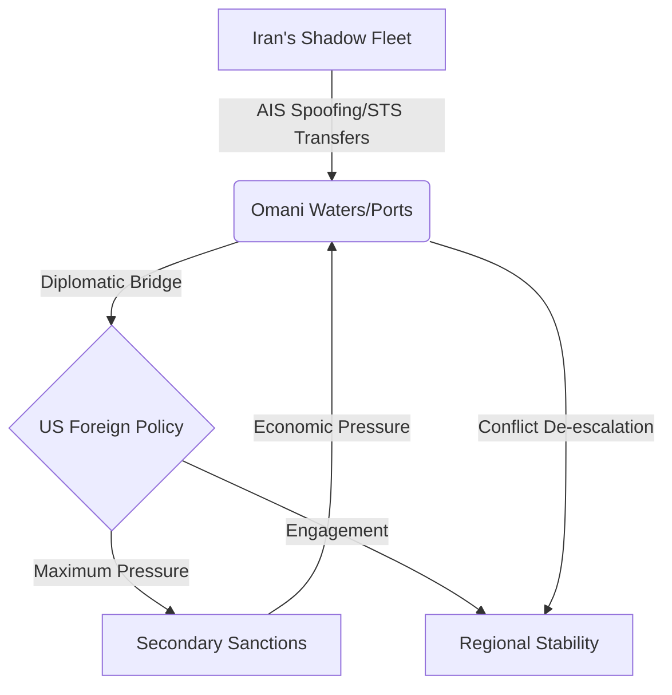

The Strait of Hormuz is more than a geographical feature; it is the world's most volatile energy bottleneck. Currently, this narrow waterway serves as the epicenter of a high-stakes geopolitical gamble involving three primary actors: a sanctioned Iranian regime, a strategically neutral Oman, and a U.S. political landscape shifting toward renewed aggression. 

  
  
 <a href="https://unsplash.com/@hbsun2013">Hongbin</a> on <a href="https://unsplash.com/photos/a-view-of-a-city-with-mountains-in-the-background-4cOPPN3wVvI">Unsplash</a>

As Iran expands its "ghost fleet" of tankers to bypass international restrictions, the burden of stability falls increasingly on Oman, the region's traditional peacemaker. However, with the prospect of a return to the **"Maximum Pressure"** campaign—a hallmark of Donald Trump's foreign policy—the diplomatic space for Oman is evaporating. The central tension is clear: if the international community perceives Oman not as a mediator, but as a conduit for Iranian sanctions evasion, Muscat risks evolving from a strategic partner into a target for U.S. economic coercion.

---

### 🚢 Iran's "Ghost Fleet" and the Shipping Gambit

To understand the current tension, one must first understand the mechanics of Iran's survival. Despite crippling U.S. sanctions designed to bankrupt the regime, Tehran has successfully maintained oil exports through a sophisticated "shadow fleet." 

This network consists of aging tankers with opaque ownership structures, often registered under "flag of convenience" states. These vessels employ a tactic known as **AIS spoofing**, where they manipulate their Automatic Identification System (AIS) to broadcast false locations or turn off tracking entirely to avoid detection by Western regulators.

This is not merely a financial necessity; it is a calculated strategic tool. By keeping oil flowing primarily to China via the [Strait of Hormuz](https://en.wikipedia.org/wiki/Strait_of_Hormuz), Iran achieves two goals:
1. **Economic Resilience:** Ensuring a steady stream of hard currency to fund its domestic operations and regional proxies.
2. **Strategic Leverage:** Reminding the global community that Tehran possesses the "kill switch" for the world's oil supply.

According to [Lloyd's List](https://lloydslist.maritimeintelligence.informa.com/), these "dark" tankers frequently engage in ship-to-ship (STS) transfers in the open ocean. By transferring crude from an Iranian tanker to a non-sanctioned vessel in deep water, Tehran effectively "washes" the origin of the oil, creating a diplomatic and regulatory nightmare for the [U.S. Treasury's Office of Foreign Assets Control (OFAC)](https://home.treasury.gov/policy-issues/office-of-foreign-assets-control-sanctions-programs-and-information).

---

### 🗺️ Oman: The Strategic Gatekeeper

Oman occupies a unique position in the Persian Gulf. While its neighbors have often oscillated between confrontation and cautious engagement with Iran, Oman has adhered to a steadfast policy of "friend to all, enemy to none." This neutrality is not passive; it is a sophisticated diplomatic strategy that makes Muscat an indispensable bridge between Tehran and Washington.

The physical geography of Oman reinforces this role. The **Musandam Peninsula**, an exclave that looms over the narrowest point of the Strait of Hormuz, provides Oman with an unparalleled vantage point and operational control over maritime traffic.

> "Oman’s diplomatic utility lies in its ability to speak the language of both the Islamic Republic and the White House, operating as a discreet channel when formal diplomacy fails."

Historically, this has allowed Oman to facilitate critical breakthroughs, such as [prisoner swaps](https://www.aljazeera.com/news/2023/9/25/us-and-iran-reach-deal-to-swap-prisoners) and the secret groundwork for the JCPOA (Iran Nuclear Deal). However, the [Oman Ministry of Foreign Affairs](https://www.mfa.gov.om) now faces a paradox: the more effective they are as a mediator, the more they are suspected of providing a "safety valve" for Iranian shipping. If a U.S. administration decides that neutrality is a euphemism for complicity, Oman's strategic assets could become liabilities.

---

### ⚡ The Trump Factor: The Return of Maximum Pressure

The potential return of Donald Trump to the presidency signals a seismic shift for the region. His first term was defined by **"Maximum Pressure,"** a strategy aimed at total economic isolation of Iran. Unlike traditional sanctions, this approach relied heavily on **secondary sanctions**, which target third-party countries or companies that continue to trade with the sanctioned entity.

If this policy is revived, the threshold for what constitutes "helping Iran" will likely drop. For Oman, which allows Iranian vessels to dock for essential supplies and maintains open commercial ties, the risks are existential. The choice becomes binary: 
* **Full Alignment:** Adopt a hardline stance against Iranian shipping, thereby destroying their role as a neutral mediator.
* **Economic Exposure:** Maintain neutrality and risk being hit by U.S. secondary sanctions, which would devastate Oman's own banking and trade sectors.

The [Council on Foreign Relations (CFR)](https://www.cfr.org) has noted that such a policy often creates a "pressure cooker" effect, where the lack of diplomatic off-ramps increases the likelihood of kinetic conflict.

---

### ⛽ The Economic Stakes of the Chokepoint

The global economy is fundamentally allergic to instability in the Strait of Hormuz. The statistics are staggering: **approximately 20% of the world's total liquid petroleum consumption** passes through this waterway daily. 

As highlighted by the [U.S. Energy Information Administration (EIA)](https://www.eia.gov/international/analysis/special-topics/StraitOfHormuz), the flow of oil through the Strait is the lifeblood of Asian economies. A sustained disruption would not just raise prices at the pump; it would trigger a systemic shock to the global supply chain.

**Key Economic Risks:**
* **Price Volatility:** Even a perceived threat of closure can add a "risk premium" of **$5 to $10 per barrel** to global Brent crude prices.
* **Asian Vulnerability:** Nations like China, India, and Japan are heavily dependent on these lanes; a blockade would force a rapid, chaotic search for alternative energy sources.
* **Insurance Spikes:** According to [Bloomberg](https://www.bloomberg.com), maritime insurance premiums for tankers entering the Gulf skyrocket during periods of high tension, increasing the cost of oil before it even leaves the port.

The [International Energy Agency (IEA)](https://www.iea.org) emphasizes that while some oil can be diverted via pipelines in Saudi Arabia and the UAE, the sheer volume of the Strait's traffic makes it an irreplaceable artery of global trade.

---

### 🏁 Conclusion: The Fragility of Neutrality

Oman is currently walking an impossibly thin tightrope. To its east, Iran is emboldening its "ghost fleet," using the Strait as a weapon of economic survival. To its west, the United States is drifting back toward a transactional and aggressive foreign policy that views neutrality as an obstacle.

The stability of the global energy market depends on Oman's ability to remain a credible, neutral middleman. However, in an era where "Maximum Pressure" is a viable political tool and secondary sanctions are weaponized, the traditional Omani shield of diplomacy may no longer be sufficient. 

As reported by [Reuters](https://www.reuters.com), the intersection of maritime law, sanctions, and geopolitical ambition in the Strait of Hormuz has reached a tipping point. One miscalculation—a seized tanker, a missed diplomatic signal, or a misplaced sanction—could trigger a global energy shock that no amount of diplomacy can quickly resolve. The world is watching the Strait, not because of what is flowing through it, but because of what might happen if the flow stops.

---

### 📚 References
* **U.S. Energy Information Administration (EIA):** Analysis of the Strait of Hormuz as a global chokepoint.
* **International Energy Agency (IEA):** Reports on global oil trade and supply chain resilience.
* **U.S. Treasury (OFAC):** Guidelines on secondary sanctions and the Iranian "Shadow Fleet."
* **Council on Foreign Relations (CFR):** Analysis of "Maximum Pressure" and its regional impacts.
* **Lloyd's List:** Intelligence on AIS spoofing and ship-to-ship (STS) transfers.
* **Oman Ministry of Foreign Affairs:** Official statements on regional neutrality and diplomacy.

---

## 📖 Related Reading

- [📉 The Intelligence Trade-off: Why Your AI is Getting Dumber on Purpose](/models-are-getting-dumber-on-purpose/)
- [🏛️ Breaking the Chains: Why Sitharaman Wants to Change How Public Banks Work](/high-powered-committee-on-banking-to-be-announced-soon-says-nirmala-sitharaman-moneycontrolcom/)
- [🚫 The Great Pan Masala Divide: Ethics vs. Endorsements](/sunny-deol-reveals-why-he-will-never-endorse-pan-masala-as-shah-rukh-khan-ajay-devgn-tiger-shroff-get-fda-notices-over-vimal-elaichi-ad/)
