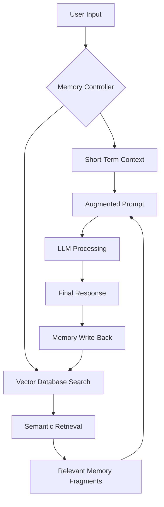

For years, the primary limitation of Large Language Models (LLMs) has not been their reasoning capabilities, but their "goldfish memory." While a model might possess the collective knowledge of the internet, it possesses no inherent memory of *you*—the specific user it is interacting with—once the session expires. This is known as the **Context Window Constraint**.

Every time you start a new chat, the LLM begins with a blank slate. To simulate memory, developers have relied on passing previous conversation turns back into the prompt. However, as conversations grow, they hit a hard ceiling: the token limit. When the limit is reached, the model must either truncate the oldest information or summarize the history, leading to a loss of nuance and "hallucinations" where the AI forgets a detail mentioned only ten minutes prior.

To solve this, the industry is shifting from simple context windows to **Cognitive Architectures**—systems that decouple processing (the LLM) from storage (the memory layer).

# 🧠 The Architecture of AI Memory

True AI memory is not a single feature but a tiered system designed to mimic human cognition, dividing information by its utility and duration.

### 1. Short-Term Memory (Working Memory)
This is the **Context Window**. It is the immediate "RAM" of the LLM. Everything currently loaded into the prompt—the system instructions, the current query, and the last few exchanges—resides here. 
*   **Strength:** Instant access, high coherence.
*   **Weakness:** Extremely expensive in terms of compute and limited in size.

### 2. Episodic Memory (The Log)
Episodic memory records specific events or interactions. In AI, this is often implemented as a structured database of past conversations. Instead of loading the entire history, the system retrieves only the "episodes" relevant to the current query.

### 3. Semantic Memory (The Knowledge Base)
This is the "world knowledge" the model learned during training, supplemented by **RAG (Retrieval-Augmented Generation)**. Semantic memory allows the AI to pull facts from external documents or vector databases without needing that information to be part of its original training set.

> "The goal of AI memory is to transform LLMs from stateless functions into stateful agents capable of evolving their understanding of a user over months, not just minutes." — *Industry Consensus on Agentic Workflows*

# 🛠️ Implementing Long-Term Memory via RAG

The most effective way to implement long-term memory today is through a combination of **Vector Databases** and **Semantic Search**.

### The Vectorization Process
To "remember" a piece of information, the system converts text into a numerical vector (an embedding). These vectors are plotted in a high-dimensional space where mathematically similar concepts are physically close to one another.

When a user asks a question, the system:
1.  Converts the query into a vector.
2.  Searches the vector database for the closest matching vectors (**Cosine Similarity**).
3.  Injects those specific "memories" into the context window as a reference.

### The Memory Flow Logic
The following diagram illustrates how a modern memory-augmented LLM handles a request:

# 📈 The Stats: Context Windows vs. Retrieval Efficiency

There is a constant tug-of-war between increasing the context window and improving retrieval. While models like Gemini 1.5 Pro have pushed boundaries, the efficiency of retrieval remains paramount.

| Feature | Standard Context | Long-Context LLM | RAG-Based Memory |
| :--- | :--- | :--- | :--- |
| **Capacity** | ~4k - 8k tokens | **1M - 2M tokens** | Virtually Infinite |
| **Latency** | Low | High (increases with input) | Medium (search overhead) |
| **Cost** | Low | Very High | Optimized |
| **Accuracy** | High (within window) | Medium (Lost-in-the-Middle) | **High (Targeted)** |

**Key Statistics to Consider:**
*   **The "Lost-in-the-Middle" Phenomenon:** Research shows that LLMs are significantly less likely to retrieve information located in the middle of a massive context window, with accuracy dropping by up to **40%** compared to the beginning or end.
*   **Token Efficiency:** Using a vector database for memory can reduce the required prompt size by **80-90%**, drastically lowering API costs for enterprise applications.
*   **Retrieval Speed:** Modern vector DBs like [Pinecone](https://www.pinecone.io/) or [Weaviate](https://weaviate.io/) can query millions of records in **<100ms**, making "infinite memory" feel instantaneous to the user.

# ⚖️ The Trade-offs: Latency, Cost, and Privacy

Building an AI with memory isn't without its challenges. Developers must balance three competing priorities:

### 1. Latency vs. Precision
The more "memories" you retrieve and inject into the prompt, the more precise the answer will be. However, larger prompts increase the **Time to First Token (TTFT)**. 

### 2. The Cost of Persistence
Storing embeddings for millions of users requires significant infrastructure. While [Milvus](https://milvus.io/) offers open-source scalability, the compute cost of constantly updating embeddings (Write-Back) can scale quickly.

### 3. The Privacy Paradox
For an AI to be truly useful, it needs to remember personal preferences. However, this creates a security risk. Implementing **Role-Based Access Control (RBAC)** within the memory layer is critical to ensure the AI doesn't accidentally leak a "memory" from User A to User B.

# 🔮 The Future of Cognitive Architectures

We are moving toward a world of **Autonomous Agents**. Unlike a chatbot, an agent doesn't just respond; it plans and executes. For this to work, the agent needs a "scratchpad"—a place to store intermediate thoughts and long-term goals.

Projects like [MemGPT](https://memgpt.ai/) are pioneering this by treating the LLM as the CPU and the external storage as the Hard Drive. This allows the AI to consciously decide *when* to save a memory and *when* to recall one, rather than relying on a passive retrieval system.

### Emerging Trends:
*   **Graph Memory:** Moving beyond vectors to Knowledge Graphs, allowing AI to understand complex relationships (e.g., "Person A is the CEO of Company B, which is a competitor of Company C").
*   **Self-Correcting Memory:** AI that can identify and "overwrite" outdated memories when new, conflicting information is presented.
*   **Local Memory Layers:** Utilizing [LlamaIndex](https://www.llamaindex.ai/) to run memory retrieval locally on-device, ensuring total privacy for the user.

# 📚 References & Further Reading

To dive deeper into the technical implementation of AI memory, explore the following resources:

*   **[LangChain Memory Modules](https://python.langchain.com/docs/modules/memory/):** The industry standard for implementing conversation buffers and summary memory.
*   **[OpenAI Embeddings Guide](https://platform.openai.com/docs/guides/embeddings):** Understanding how to turn text into vectors.
*   **[Attention Is All You Need (arXiv)](https://arxiv.org/abs/1706.03762):** The foundational paper on the Transformer architecture that created the context window.
*   **[Retrieval-Augmented Generation (RAG) Survey](https://arxiv.org/abs/2312.10997):** A comprehensive academic look at how retrieval improves LLM performance.
*   **[Anthropic Context Window Analysis](https://www.anthropic.com/news/claude-3):** Insights into handling 200k+ token windows.
*   **[Google DeepMind's Long-Context Research](https://deepmind.google/):** Exploring the limits of the 1M+ token horizon.
*   **[Pinecone Learning Center](https://www.pinecone.io/learn/):** A deep dive into vector similarity search and indexing.
*   **[Weaviate Documentation](https://weaviate.io/docs):** Implementing hybrid search (keyword + vector) for better memory.
*   **[LlamaIndex Documentation](https://docs.llamaindex.ai/):** The premier framework for connecting LLMs to external data.
*   **[MemGPT Research Paper](https://arxiv.org/abs/2310.08560):** How to manage LLM memory like an operating system.

---

## 📖 Related Reading

- [⚓ Walking the Tightrope in the Strait of Hormuz: Trump, Oman, and the Fight Over Oil Lanes](/trump-threatens-oman-as-iran-works-on-strait-of-hormuz-shipping-plan/)
- [📉 The Intelligence Trade-off: Why Your AI is Getting Dumber on Purpose](/models-are-getting-dumber-on-purpose/)
- [🏛️ Breaking the Chains: Why Sitharaman Wants to Change How Public Banks Work](/high-powered-committee-on-banking-to-be-announced-soon-says-nirmala-sitharaman-moneycontrolcom/)
