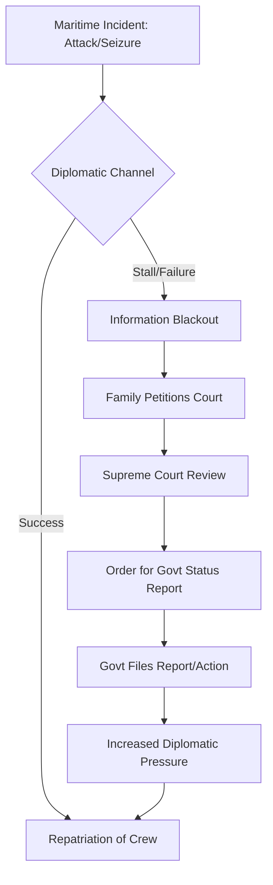

The Strait of Hormuz is more than just a geographical narrow; it is the jugular vein of the global economy. Measuring only **21 miles wide** at its narrowest point, this corridor facilitates the transit of approximately **20% to 30% of the world's total oil consumption**. However, beneath the surface of this economic necessity lies a volatile cocktail of geopolitical rivalry, asymmetric warfare, and a recurring human tragedy: the vulnerability of the merchant mariner.

When a ship captain or a crew is attacked, detained, or caught in the crossfire of a regional skirmish, the transition from "commercial voyage" to "diplomatic crisis" is instantaneous. For the families left behind, the ensuing silence from government agencies is often more agonizing than the attack itself. This silence is where the judiciary steps in, transforming a maritime incident into a constitutional battle for transparency and accountability.

## ⚖️ The Legal Vacuum: When Diplomacy Fails

  
  
 <a href="https://unsplash.com/@ourselp">Philippe Oursel</a> on <a href="https://unsplash.com/photos/man-standing-on-boat-aW6KY6735Lw">Unsplash</a>

In the immediate aftermath of a maritime seizure or attack in the Strait of Hormuz, the primary mechanism for resolution is diplomacy. Governments engage in "quiet diplomacy" to negotiate the release of crew members, often avoiding public statements to prevent the escalating of tensions with regional powers like Iran.

However, "quiet diplomacy" can easily mutate into "administrative opacity." Families of detained captains frequently report a complete blackout of information from their respective Ministries of Foreign Affairs. It is in this void that the legal system becomes the only viable tool for discovery.

> "The right to know the status of a citizen detained abroad is not merely a familial courtesy; it is a fundamental aspect of the Right to Life and Personal Liberty, as enshrined in most democratic constitutions." — *International Maritime Law Review*

### The Role of the Supreme Court: The Mandamus of Truth

In several high-profile instances involving the detention of sailors, the Supreme Court has been approached via *Habeas Corpus* petitions or Writs of Mandamus. The core of these legal battles is rarely about the geopolitics of the Strait itself, but about the **government's failure to provide a status report**.

When the Court asks the government for a report, it is exercising its oversight function to ensure that the State is fulfilling its protective obligations to its citizens. The "Report" requested by the Court typically demands answers to three critical questions:
1. **What is the current location and health status of the detained personnel?**
2. **What specific diplomatic channels have been exhausted?**
3. **What is the timeline for the repatriation of the crew?**

By forcing the government to file a formal report, the Court strips away the shield of "national security" and forces a public acknowledgment of the crisis.

## 🗺️ The Crisis Lifecycle: From Attack to Adjudication

The path from a maritime incident to a judicial order is a complex web of failures and interventions. The following diagram illustrates the typical escalation path when a maritime crisis occurs in a volatile zone.

## ⛽ Geopolitical Friction and the "Tanker War"

To understand why these attacks happen, one must understand the strategic utility of the Strait. For regional powers, the ability to disrupt traffic in the Strait is a potent tool of "coercive diplomacy." 

**Bold Stats on the Strait of Hormuz:**
*   **Daily Transit:** Over **20 million barrels of oil** pass through the strait every single day.
*   **Economic Impact:** A full closure of the Strait could spike global oil prices by **$50 to $100 per barrel** within weeks.
*   **Risk Density:** Over **60% of maritime security incidents** in the Persian Gulf are concentrated within the vicinity of the Strait.

The "Tanker War" tactics—which include the use of limpet mines, drone strikes, and "boarding actions" by fast-attack craft—often target vessels based on their perceived affiliation with opposing geopolitical blocs. The captain of the ship, regardless of their nationality, becomes a pawn in a larger game of brinkmanship.

## 📜 International Law vs. Regional Reality

The legal framework governing these waters is the **United Nations Convention on the Law of the Sea (UNCLOS)**. Under UNCLOS, the "Right of Transit Passage" is supposed to be guaranteed. However, the application of these laws is often skewed by regional interpretations of "security threats."

### The UNCLOS Conflict
While the international community views the Strait as an international waterway, certain regional actors view it as internal waters subject to their sovereign security requirements. This discrepancy creates a "grey zone" where:
*   **Boarding actions** are justified as "environmental inspections."
*   **Detentions** are framed as "legal arrests" for alleged maritime violations.
*   **Attacks** are dismissed as "misidentifications" or "third-party provocations."

For the shipping company, this ambiguity is a nightmare. The insurance premiums for "War Risk" in the Hormuz region can fluctuate by **300% to 500%** in a single week following a reported attack, making the financial cost of the crisis as staggering as the human cost.

## 🛡️ Risk Mitigation: Beyond the Legal Battle

While the Supreme Court can force a government report, it cannot physically retrieve a captain from a foreign port. Therefore, the industry has pivoted toward proactive risk mitigation.

### 1. Private Maritime Security Companies (PMSCs)
The use of Armed Guards on Board (AGOB) has become standard for high-value assets. However, the legality of carrying weapons in territorial waters remains a contentious issue, often giving the seizing power a pretext for "illegal arms" charges.

### 2. The Role of the IMO
The **International Maritime Organization (IMO)** provides guidelines on "Best Management Practices" (BMP). These include:
*   **Hardening the ship:** Installing razor wire and water cannons.
*   **Citadel creation:** A reinforced safe room where the crew can retreat, cutting off power to the engines to prevent the hijackers from steering the ship.

### 3. Kidnap and Ransom (K&R) Insurance
The financial architecture of the Strait is built on K&R insurance. These policies not only provide the funds for ransom but often provide the "Crisis Management" teams that act as intermediaries between the government and the captors.

## 📢 The "Right to Information" as a Human Right

The struggle for a government report in the Supreme Court is, at its heart, a struggle for the **Right to Information (RTI)**. When a state claims that disclosing the status of a citizen would "jeopardize diplomatic relations," it is effectively prioritizing the state's image over the citizen's life.

> "National security is often used as a blanket to cover administrative incompetence. The judiciary's role is to lift that blanket and ensure that 'security' is not a synonym for 'silence'." — *Legal Counsel, Maritime Rights Initiative*

The precedent set by courts demanding status reports has forced governments to be more transparent. It has led to the creation of dedicated "Crisis Cells" within foreign ministries and a more systematic approach to consular access.

## 🚩 Conclusion: A Call for Multilateralism

The recurring cycle of attack, silence, and judicial intervention is a symptom of a broken international security architecture. As long as the Strait of Hormuz is used as a tool for political leverage, the merchant mariner will remain at risk.

The solution does not lie solely in the courts or in the arms of private security, but in a **multilateral maritime security framework** that transcends bilateral disputes. Only when the "Right of Transit" is decoupled from geopolitical grievances can the captains of the world's fleet sail without the fear that their only hope for rescue lies in a Supreme Court petition.

***

### 📚 References and Further Reading

1.  **International Maritime Organization (IMO)**: [Guidelines on Maritime Security](https://www.imo.org)
2.  **United Nations Convention on the Law of the Sea (UNCLOS)**: [Text of the Convention](https://www.un.org/depts/los/)
3.  **Reuters Maritime News**: [Analysis of Persian Gulf Tensions](https://www.reuters.com/world/middle-east/)
4.  **Al Jazeera**: [Reporting on Hormuz Seizures](https://www.aljazeera.com)
5.  **Supreme Court of India**: [Case Archives on Fundamental Rights](https://main.sci.gov.in)
6.  **Center for Strategic and International Studies (CSIS)**: [Maritime Security Reports](https://www.csis.org)
7.  **Lloyd's List**: [Shipping Insurance and War Risk Data](https://www.lloydslist.com)
8.  **Human Rights Watch**: [Rights of Detained Foreign Nationals](https://www.hrw.org)
9.  **The Nautical Institute**: [Best Practices for Ship Captains](https://www.nautinst.org)
10. **World Shipping Council**: [Global Trade and Choke Point Analysis](https://www.worldshipping.org)

---

## 📖 Related Reading

- [✈️ Spirit Airlines Bankruptcy: The Truth About the Google Data Rumors](/google-buys-crashed-airline-spirits-data-at-auction/)
- [🏸 The Anatomy of a Heartbreak: The 29-30 Thriller](/explained-why-ashith-surya-amrutha-pramuthesh-lost-29-30-in-2nd-game-heartbreak-vs-turkey/)
- [🚀 The Memory Wall: Why LLMs Forget](/akitaonrailsai-memorystargazers/)
