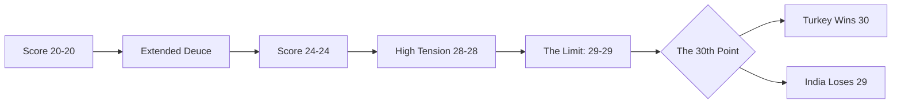

In the high-octane world of professional badminton, a single match can be decided by a microscopic error, a momentary lapse in concentration, or a gust of wind from an arena's ventilation system. However, it is exceedingly rare to witness a contest as emotionally draining and statistically anomalous as the clash between India's **Ashith Surya and Amrutha Pramuthesh** and their opponents from Turkey at the [BWF World Junior Championships 2024](https://bwf.tournamentsoftware.com/).

The match reached a crescendo of tension that few athletes ever experience. The Indian duo fought through a grueling second game, only to fall in the most agonizing way possible: a score of **29-30**. To the uninitiated, this may look like a close game; to a badminton enthusiast, it represents the absolute physical and legal limit of the sport's scoring system.

---

### 📜 Understanding the BWF Scoring Ceiling: Why 29-30?

To appreciate the gravity of a **29-30** scoreline, one must first understand the intricate laws governing the game. According to the [BWF Laws of Badminton](https://corporate.bwfbadminton.com/statutes/), the standard game is played to **21 points**. However, the path to victory is rarely a straight line.

When a game reaches a **20-20** tie (known as a "deuce"), the rules dictate that a side must win by two clear points to claim the game. This can lead to extended rallies where the score climbs to 22-22, 25-25, or even higher. But the BWF does not allow games to continue indefinitely. To prevent matches from lasting several hours and exhausting the athletes, a hard ceiling is implemented at **30 points**.

**The "Golden Point" Rule:**
Once the score reaches **29-29**, the requirement for a two-point lead is waived. The very next point decided the winner. This transforms the match from a test of endurance into a "sudden-death" scenario. For Surya and Pramuthesh, surviving the climb to 29-29 meant they had navigated a massive psychological battlefield, only to find themselves facing a singular, unforgiving point where there was zero margin for error.

---

### 📉 Tactical Breakdown: The Rollercoaster Second Game

The second game was not merely a contest of skill, but a strategic chess match played at lightning speed. The Indian pair exhibited exceptional chemistry, utilizing aggressive net-play and devastating smashes to maintain early momentum. Their ability to rotate positions—a hallmark of elite [mixed doubles strategy](https://www.badmintonworldfederation.com)—kept the Turkish pair on the defensive for significant stretches.

However, the Turkish duo displayed remarkable resilience. By employing deep clears and sharp, angled drops, they forced the Indian pair into longer rallies, effectively draining their energy reserves.

As the score crept toward the ceiling, the tactical nature of the game shifted. When a match reaches **28-28** or **29-29**, the technical gap between players often vanishes. It ceases to be about who has the better smash and becomes a test of who can maintain their composure under extreme physiological stress.

---

### 🧠 The Psychology of "Sudden Death" in Badminton

The transition from a "win by two" mindset to a "sudden death" mindset is where many matches are won or lost. In sports psychology, this is often referred to as the "fear of failure" versus the "will to win."

> "In sudden-death points, the player who plays 'not to lose' often loses to the player who plays 'to win'. The hesitation of a millisecond is the difference between a winner and an unforced error."

For Ashith Surya and Amrutha Pramuthesh, the heartbreak occurred in this final psychological transition. At **29-29**, the court can feel smaller, and the shuttlecock can feel heavier. The pressure to avoid a mistake often leads players to play "safe" shots—lifting the shuttle too high or hitting it too centrally.

In this specific encounter, the Turkish pair managed to maintain a sliver more aggression. By forcing a high-pressure return, they capitalized on a moment of hesitation, grabbing the **30th point** to seal the game and the match.

---

### 🇮🇳 The Silver Lining: The State of Indian Junior Badminton

While a **29-30** loss is a bitter pill to swallow, the performance of Surya and Pramuthesh provides a glimpse into the bright future of [Indian Junior Badminton](https://www.badmintonindia.org/). Pushing a world-class opponent to the absolute limit of the scoring system is a testament to their elite conditioning and technical proficiency.

The growth of mixed doubles in India has been exponential, following the success of pairs at the [BWF World Tour](https://bwfworldtour.bwfbadminton.com/). The grit shown in this match highlights several key strengths of the current Indian developmental pipeline:
1. **Physical Conditioning:** Sustaining high-intensity rallies up to 30 points requires immense cardiovascular fitness.
2. **Mental Fortitude:** Refusing to buckle at 20-20 and fighting through to 29-29 shows a championship mentality.
3. **Technical Adaptability:** The ability to shift gears from defensive lifting to aggressive attacking under pressure.

This loss was not a failure of talent; it was a brutal lesson in the volatility of top-tier sports.

---

### 🚀 Looking Ahead: Lessons from the 30th Point

For young athletes, losses like these are often more valuable than easy wins. The experience of playing a **29-30** game provides a level of "pressure-testing" that cannot be replicated in training.

To evolve from this result, the focus for the pair will likely shift toward **clutch performance training**—learning to maintain aggressive intent even when the stakes are at their absolute peak. As they move toward the [Olympic qualification cycles](https://olympics.com/en/sports/badminton), the ability to close out games decisively will be the difference between a podium finish and a heartbreaking exit.

---

### 📚 References & Further Reading

To better understand the nuances of the sport and the competitive landscape, explore these resources:

*   **Official BWF Statutes:** [Detailed rules on scoring and game limits](https://corporate.bwfbadminton.com/statutes/).
*   **Badminton India:** [Profiles and rankings of upcoming Indian stars](https://www.badmintonindia.org/).
*   **BWF Tournament Software:** [Live draws and match results for World Juniors](https://bwf.tournamentsoftware.com/).
*   **World Badminton Guide:** [Deep dive into Mixed Doubles rotations and tactics](https://www.badmintonworldfederation.com).
*   **Sports Psychology Insights:** [Managing pressure in high-stakes athletics](https://www.psychologytoday.com).

### Conclusion

A **29-30** loss is one of the rarest and most painful outcomes in all of sports. For Ashith Surya and Amrutha Pramuthesh, the match came down to the final heartbeat. While the scoreboard records a loss, the resilience they displayed serves as a powerful indicator of their potential. In the grand theater of badminton, sometimes you do everything right and still lose by a hair—but it is exactly these kinds of trials that forge the hunger necessary to eventually conquer the world stage.

---

## 📖 Related Reading

- [🚀 The Memory Wall: Why LLMs Forget](/akitaonrailsai-memorystargazers/)
- [⚓ Walking the Tightrope in the Strait of Hormuz: Trump, Oman, and the Fight Over Oil Lanes](/trump-threatens-oman-as-iran-works-on-strait-of-hormuz-shipping-plan/)
- [📉 The Intelligence Trade-off: Why Your AI is Getting Dumber on Purpose](/models-are-getting-dumber-on-purpose/)
