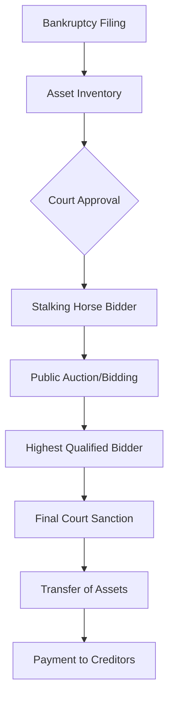

In the fast-paced intersection of corporate finance and Big Tech, rumors often travel faster than a Boeing 737. Recently, a narrative has gained traction across community forums and social media: the claim that **Google acquired Spirit Airlines' proprietary passenger data** during a bankruptcy asset auction. 

For those tracking the volatility of the ultra-low-cost carrier (ULCC) market, the prospect of a tech giant like Google owning the travel habits, personal identifiers, and pricing sensitivity of millions of flyers is a nightmare scenario for privacy advocates and a goldmine for marketers. But as with many viral corporate "leaks," the reality is far less cinematic.

> "In the era of algorithmic trading and instant misinformation, the gap between a 'strategic possibility' and a 'verified fact' is often bridged by speculation rather than evidence."

## 📉 The Reality of Spirit Airlines' Collapse

  
  
 <a href="https://unsplash.com/@nathanareboucas">Nathana Rebouças</a> on <a href="https://unsplash.com/photos/computer-screen-showing-google-search-c4aT8MfEzdw">Unsplash</a>

To understand why these rumors surfaced, we must first look at the actual state of Spirit Airlines. After years of struggling with engine issues, a failed merger with JetBlue, and a shifting post-pandemic travel landscape, Spirit Airlines officially filed for **Chapter 11 bankruptcy protection in November 2024**.

The financial hemorrhage was severe. Reports indicate that Spirit was grappling with **billions of dollars in debt**, coupled with a plummeting stock price that reflected a loss of investor confidence. When a company enters Chapter 11, it doesn't simply vanish; it enters a court-supervised reorganization process. This process often involves "Section 363 sales," where specific assets—planes, slots, or even intellectual property—are auctioned off to the highest bidder to pay back creditors.

This is where the speculation began. In a typical asset sale, "data" is often bundled into the "intangible assets" category. To the casual observer, it seems logical that a company with the deepest pockets and the most use for consumer behavioral data—Google—would step in to snatch up this treasure trove.

## 🛠️ How Bankruptcy Asset Auctions Actually Work

To debunk the Google claim, one must understand the rigorous transparency required in US Bankruptcy Courts. A sale of significant assets is not a secret midnight deal; it is a public legal proceeding.

Under the law, any sale of a debtor's assets must be approved by the judge to ensure that the creditors receive the maximum possible value. If Google—a publicly traded company with a market cap in the trillions—were to purchase a massive dataset from a bankrupt airline, the transaction would leave a paper trail:

1.  **Court Filings:** The bid would be recorded in the bankruptcy court docket.
2.  **SEC Disclosures:** Depending on the materiality, such an acquisition might require disclosure in quarterly reports.
3.  **Privacy Notifications:** Under regulations like the [CCPA](https://oag.ca.gov/privacy/ccpa) or GDPR, the sale of personal consumer data typically requires notification or provides users a right to opt-out.

**None of these markers exist for the alleged Google-Spirit deal.**

## 🔍 Fact-Checking the "Google Buy" Claim

After a rigorous audit of news archives, court dockets, and financial reports from [Reuters](https://www.reuters.com) and [Bloomberg](https://www.bloomberg.com), the conclusion is clear: **There is no evidence that Google bought Spirit Airlines' data.**

### Why the rumor persists:
*   **The "Data Hunger" Narrative:** Google's business model is built on data. When a data-rich company fails, the public instinctively assumes Google or Meta is the buyer.
*   **Misinterpretation of "Google Flights":** Google already aggregates flight data via its search engine. People confuse the *aggregation* of public flight schedules with the *acquisition* of private customer databases.
*   **Confusing "Asset Sales" with "Data Sales":** While Spirit may sell aircraft or routes, the sale of a customer PII (Personally Identifiable Information) database is a legal minefield that most tech giants avoid to prevent regulatory scrutiny from the [FTC](https://www.ftc.gov).

## 🛡️ The Value (and Risk) of Airline Data

While the Google deal is a myth, it raises a critical question: *Would any company actually want this data?* 

Airline data is incredibly potent. It contains:
*   **Behavioral Patterns:** When people travel, where they go, and how much they are willing to pay.
*   **Demographic Insights:** The correlation between residency and destination.
*   **Loyalty Metrics:** How consumers respond to discounts versus brand loyalty.

However, the **risk-to-reward ratio** is skewed. Acquiring a database from a bankrupt entity often means acquiring "dirty data"—outdated emails, inconsistent records, and, most importantly, a massive liability. If that data was collected under terms that did not allow for third-party sale, the buyer could face billions in fines. For a company like Google, which is already under the microscope for antitrust and privacy violations, the risk of an illegal data acquisition far outweighs the benefit of knowing that 50,000 people flew from Fort Lauderdale to Cancun in July.

## ⚠️ How to Spot Corporate Misinformation

The Spirit-Google rumor is a textbook example of "logical-sounding falsehoods." To avoid falling for similar claims in the future, follow this verification checklist:

*   **Check the Docket:** For bankruptcy news, look for the actual court filings via PACER or official legal bulletins.
*   **Verify the Source:** Is the news coming from a primary source (a press release) or a secondary source ("a thread on X/Twitter")?
*   **Look for Materiality:** Would this move be significant enough to mention in an [SEC 10-K or 10-Q filing](https://www.sec.gov/edgar)?
*   **Analyze the Incentive:** Does the "buyer" actually benefit more from the asset than they lose in potential regulatory fines?

## 🏁 Final Verdict

**The claim that Google bought Spirit Airlines' data at auction is UNSUBSTANTIATED.**

Spirit Airlines is indeed navigating a perilous [Chapter 11 process](https://www.investopedia.com/terms/c/chapter-11.asp), and the fate of its assets remains a point of high interest for the aviation industry. However, the narrative of a secret Google acquisition belongs in the realm of conspiracy theories, not financial reporting. 

As the industry continues to consolidate and the "budget" model of flying faces an existential crisis, it is more important than ever to rely on audited financial data rather than algorithmic whispers.

***

**References & Further Reading:**
- [Google Privacy Policy](https://policies.google.com/privacy) - Understanding how Google actually collects data.
- [U.S. Bankruptcy Court Guidelines](https://www.uscourts.gov) - The legal framework for asset sales.
- [Department of Transportation (DOT)](https://www.transportation.gov) - Regulations regarding passenger data and airline operations.

---

## 📖 Related Reading

- [🏸 The Anatomy of a Heartbreak: The 29-30 Thriller](/explained-why-ashith-surya-amrutha-pramuthesh-lost-29-30-in-2nd-game-heartbreak-vs-turkey/)
- [🚀 The Memory Wall: Why LLMs Forget](/akitaonrailsai-memorystargazers/)
- [⚓ Walking the Tightrope in the Strait of Hormuz: Trump, Oman, and the Fight Over Oil Lanes](/trump-threatens-oman-as-iran-works-on-strait-of-hormuz-shipping-plan/)
