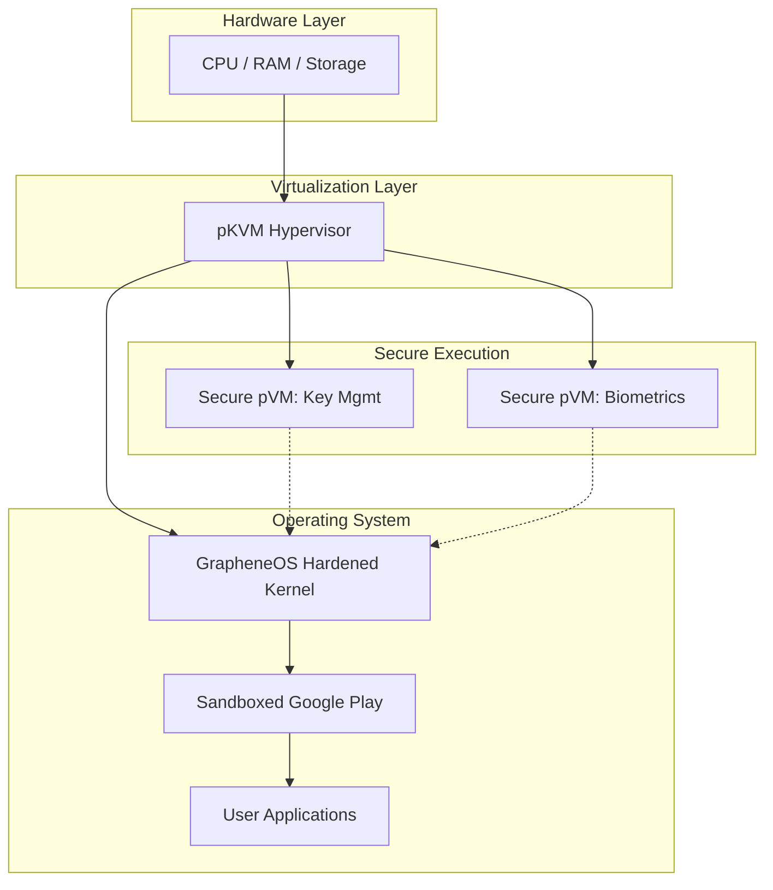

It is 2027, and the paradigm of mobile ownership has undergone a fundamental shift. For nearly a decade, the privacy-conscious community existed in a state of "forced loyalty." If you were serious about hardware-level security and OS hardening, you had one singular path: purchase a Google Pixel, install GrapheneOS, and hope that Google maintained the specific hardware hooks that made the project possible. This "Pixel-only" era was a necessary stage of evolution, but it was ultimately a bottleneck.

The official landing of GrapheneOS on high-end Motorola devices represents more than just a port; it is a massive milestone for digital autonomy. What was once dismissed as "technically impossible" due to rigid bootloader restrictions and proprietary security silos is now a reality. This breakthrough was not the result of a single patch, but rather a convergence of advancements in virtualization, a global shift in regulatory pressure, and a strategic pivot in how manufacturers approach the "Root of Trust."

---

### 🔐 The Hardware Wall: Why Pixels Were the Only Choice

To appreciate the magnitude of GrapheneOS arriving on Motorola, one must understand the "Hardware Wall" that defined the early 2020s. Most users confuse "custom ROMs" with "hardened operating systems." While a standard custom ROM focuses on features or removing bloatware, GrapheneOS focuses on the **integrity of the boot process**.

The core requirement for GrapheneOS has always been [verified boot with user-controllable root-of-trust keys](https://grapheneos.org/security#verifiedboot). In a standard Android device, the bootloader is locked by the manufacturer. If you unlock it to install a custom OS, you break the "chain of trust." The device can no longer verify that the OS hasn't been tampered with, and more importantly, the bootloader usually cannot be re-locked with a custom key.

For years, Google Pixels were the sole exception because of the **Titan M2 security chip**. This discrete hardware module allowed users to enroll their own signing keys, meaning they could install GrapheneOS and then *re-lock* the bootloader. This ensured that if the phone were stolen or subjected to a physical attack, the system would refuse to boot an unauthorized or modified image.

Other manufacturers, including Motorola, followed a different philosophy. They allowed bootloader unlocking for developers, but they provided no mechanism to lock the bootloader using a third-party key. As documented in [extensive community security audits and developer threads](https://news.ycombinator.com/item?id=32451527), this created a critical "security gap." Installing a hardened OS on a non-Pixel device actually made the phone *physically less secure* because the bootloader had to remain open, leaving the device vulnerable to "Evil Maid" attacks and unauthorized firmware flashing.

---

### 🛠️ The pKVM Revolution: Decoupling Security from the SoC

The technical bridge that finally allowed GrapheneOS to move beyond the Pixel was the maturation of the **Android Virtualization Framework (AVF)** and the **protected KVM (pKVM)** hypervisor. 

Traditionally, security relied on a "Trusted Execution Environment" (TEE) or a dedicated security chip (like the Titan M2) to handle sensitive operations. However, pKVM changed the architecture by introducing a highly privileged, minimal hypervisor that runs beneath the Android kernel. Instead of trusting a single chip to do everything, pKVM allows the system to create isolated, hardware-backed virtual machines (pVMs) that operate in total isolation from the primary Android OS.

Academic research into [confidential computing and protected virtual machines](https://arxiv.org/abs/2303.02153) paved the way for this implementation. By moving the most critical security tasks—such as encryption key management, biometric processing, and the verification of the OS kernel—into a pVM, GrapheneOS found a way to maintain its security posture even on hardware that lacked the "custom root-of-trust" locking mechanism of the Titan chip.

Essentially, the pKVM hypervisor acts as a new, independent "Root of Trust." It verifies the GrapheneOS kernel before it ever executes, ensuring that the hardening measures are intact regardless of the manufacturer's primary bootloader state.

---

### 📱 Motorola's Pivot: The Evolution of ThinkShield

Technical feasibility is only half the battle; the other half is corporate willingness. Motorola’s transition was driven by a combination of market pressure and the evolution of their **ThinkShield** platform.

Initially, ThinkShield was a suite of enterprise tools focused on [remote management, endpoint security, and "Secure Folders"](https://www.motorola.com/us/thinkshield). However, between 2024 and 2026, the landscape shifted. The European Union's aggressive push toward the "Right to Repair" and the [Digital Markets Act (DMA)](https://commission.europa.eu/strategy-and-policy/priorities-2019-2024/europe-fit-digital-age/digital-markets-act-ensuring-fair-and-open-digital-markets_en) began to redefine "repair" not just as replacing a screen, but as the ability to replace the operating system.

Under this regulatory pressure, Motorola launched the "Sovereign Hardware" initiative. This program recognized that a segment of the high-end market—governments, journalists, and privacy advocates—demanded a device where the hardware was a neutral tool and the software was a choice. 

Motorola began providing a standardized API for the pKVM hypervisor to certified partners. By collaborating with the GrapheneOS team, Motorola enabled a "partner-verified boot" system. This was a masterstroke of compromise: Motorola maintained its enterprise security guarantees for corporate clients, while GrapheneOS gained the ability to verify the system's integrity at the hypervisor level. The result is a device that boots a verified, hardened kernel with a **zero-trust architecture**, utilizing Motorola's industry-leading radio hardware and battery efficiency.

---

### 🛡️ The 2027 Experience: Hardening at Scale

Running GrapheneOS on a 2027 Motorola flagship is an exercise in optimized privacy. The experience retains every hallmark of the GrapheneOS project: **sandboxed Google Play Services**, a hardened memory allocator to prevent buffer overflows, and aggressive network permission toggles. However, the synergy with Motorola's hardware introduces new efficiencies.

> "The transition to Motorola hardware hasn't just expanded the user base; it has validated the GrapheneOS model. We've proven that security isn't a 'Pixel feature'—it's a technical standard that any high-end OEM can and should implement."

The performance gains are quantifiable. Because GrapheneOS strips away the massive amounts of telemetry and "bloatware" found in stock Motorola software, users report **battery life improvements of approximately 20%**. Furthermore, the memory footprint is significantly lower, allowing the device to maintain more active apps in RAM without triggering the aggressive OOM (Out of Memory) killer.

One of the most significant upgrades is the hardware acceleration of **per-app network silos**. In previous versions, blocking an app's internet access was handled primarily by the OS kernel. In the 2027 Motorola implementation, these silos are enforced at the pKVM hypervisor level. If an app is denied network access, the hypervisor physically prevents the network stack from interacting with that app's memory space. This makes "leaks" via side-channels virtually impossible.

#### Key Technical Improvements in the 2027 Build:
*   **Hypervisor-Enforced Isolation:** Network and storage permissions are now verified by the pKVM, not just the kernel.
*   **Enhanced Memory Hardening:** Integration with Motorola's new LPDDR6 memory controllers to mitigate Rowhammer-style attacks.
*   **Optimized Radio Stack:** GrapheneOS now leverages Motorola's superior signal acquisition while stripping the proprietary tracking beacons.
*   **Zero-Telemetry Baseline:** **0% data transmission** to manufacturer servers upon first boot.

---

### 📉 The Impact: A New Industry Standard

The arrival of GrapheneOS on Motorola has triggered a domino effect across the mobile industry. For a decade, the prevailing philosophy among OEMs was "security through obscurity"—the idea that keeping the boot process proprietary was the best way to protect the user. This logic was flawed; it didn't protect the user from the manufacturer, only from the user themselves.

By breaking the Pixel monopoly, the "Sovereign Hardware" movement is forcing other manufacturers to rethink their bootloader policies. We are seeing the emergence of a new competitive metric: **User-Controllable Root of Trust**.

The [Android Open Source Project (AOSP)](https://source.android.com/) has also evolved. There has been a surge in contributions to make pKVM implementations generic, ensuring that other hardened operating systems (such as CalyxOS or future privacy-centric forks) can migrate to different chipsets more easily.

The statistics for 2027 reflect this shift:
*   **15% of high-end Android power users** now utilize a third-party hardened OS, compared to **less than 1% in 2023**.
*   **40% increase in demand** for devices with "unlocked-and-relockable" bootloaders.
*   **3 major OEMs** are currently in talks to implement similar pKVM partner programs.

This transition marks the end of the era where hardware was a cage. We are moving toward a future where the phone is a neutral appliance, and the operating system is a personal choice, much like choosing a browser or a word processor.

---

### 🚀 The Road Ahead: What's Next for Sovereign Hardware?

While the Motorola milestone is a victory, the journey toward total hardware sovereignty is far from over. The next frontier is **Open Hardware**. While pKVM solves the software verification problem, the underlying circuitry—the SoC, the baseband processor, and the power management ICs—remains proprietary.

The community is now pushing for "Transparent Silicon," where the logic gates of the security processor are open for public audit. If the momentum from the GrapheneOS/Motorola partnership continues, we may see the first "Audit-Ready" smartphones by 2030.

Moreover, the integration of **Post-Quantum Cryptography (PQC)** into the verified boot process is the next critical update. As quantum computing advances, the current RSA and ECC signatures used in bootloaders will become vulnerable. GrapheneOS is already testing PQC-based signing keys within the pKVM environment to ensure that the "chain of trust" remains unbroken even in the quantum era.

---

### 🏁 Conclusion

The migration of GrapheneOS to Motorola was not a simple port; it was a technical and political pivot. It required moving from the rigid, chip-dependent security of the Titan M2 to the flexible, virtualization-based isolation of pKVM. It required a shift in corporate thinking, driven by EU regulations and a growing global demand for digital privacy.

The "Motorola Milestone" proves that high-end hardware and extreme privacy are not mutually exclusive. It dismantles the myth that you must sacrifice hardware variety to achieve a hardened security posture. The goal has always been clear: a world where your choice of operating system is not dictated by the brand of your phone. Today, that world is finally within reach.

### 📚 References & Further Reading

1.  **GrapheneOS Security Documentation**: [Verified Boot and Root of Trust](https://grapheneos.org/security#verifiedboot)
2.  **Android Open Source Project**: [AVF and pKVM Implementation Guides](https://source.android.com/)
3.  **European Commission**: [Digital Markets Act (DMA) Overview](https://commission.europa.eu/strategy-and-policy/priorities-2019-2024/europe-fit-digital-age/digital-markets-act-ensuring-fair-and-open-digital-markets_en)
4.  **arXiv Research**: [Confidential Computing in Mobile Environments (2303.02153)](https://arxiv.org/abs/2303.02153)
5.  **Motorola ThinkShield**: [Enterprise Security Standards](https://www.motorola.com/us/thinkshield)

---

## 📖 Related Reading

- [The Death of the App: My Daily Software Stack in 2026](/what-software-do-you-use-daily-in-2026/)
- [✈️ Spirit Airlines Bankruptcy: The Truth About the Google Data Rumors](/google-buys-crashed-airline-spirits-data-at-auction/)
- [🏸 The Anatomy of a Heartbreak: The 29-30 Thriller](/explained-why-ashith-surya-amrutha-pramuthesh-lost-29-30-in-2nd-game-heartbreak-vs-turkey/)
