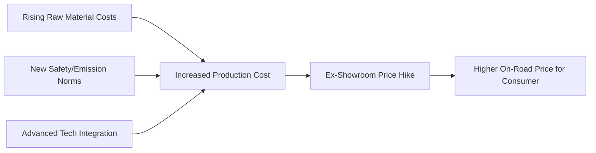

If you have been eyeing a new Hyundai for your driveway, the clock is ticking. Hyundai India has officially adjusted the pricing for several of its most sought-after models, sending a ripple through the mid-range automotive segment. According to reports from [RushLane](https://www.rushlane.com), this price correction is primarily a response to the volatile costs of raw materials and the persistent logistical challenges of global supply chain management. 

  
  
 <a href="https://unsplash.com/@zoshuacolah">Zoshua Colah</a> on <a href="https://unsplash.com/photos/a-red-suv-is-parked-on-a-street-E0F7YiXn3ZQ">Unsplash</a>

While price fluctuations are a common occurrence in the Indian automotive landscape, the timing of this hike—occurring just as consumers prepare for the festive season—is expected to significantly impact budget planning for SUV and sedan buyers.

---

### 📦 Which Models Are Getting More Expensive?

This is not a surgical strike on a single niche model; rather, it is a broad adjustment hitting the core of Hyundai's sales volume. Based on industry data via [RushLane](https://www.rushlane.com), the SUV lineup—currently the primary driver of growth for the brand—is bearing the brunt of the increase.

The most significant jumps are expected across the **Hyundai Creta**, **Hyundai Venue**, and the **Hyundai Alcazar**. While the exact delta varies by city and specific trim level (variant), the general consensus points to a price increase of approximately **1% to 3%** on the ex-showroom price. 

For a consumer eyeing a top-of-the-line Creta, this translation is stark: you could be looking at an additional **₹20,000 to ₹50,000** added to the final bill. When combined with registration fees and insurance, the "on-road" cost increase can feel even more substantial.

> "Price hikes in the automotive industry are rarely isolated events; they are usually a reaction to the volatile pricing of steel, aluminum, and precious metals used in catalytic converters."

---

### ⚙️ The Driving Forces Behind the Increase

Hyundai is not raising prices in a vacuum. The entire Indian automotive sector is currently wrestling with severe cost pressures. The primary culprit is the fluctuating price of **raw materials**. Steel and aluminum are the skeletal foundation of every vehicle; when global commodity prices swing upward, manufacturers are forced to adjust their margins or pass the cost to the consumer to maintain viability.

Beyond raw metals, vehicles are becoming fundamentally more expensive to build. Stricter emission norms and a heightened focus on passenger safety—such as making **6 airbags standard** across more variants—have increased the baseline manufacturing cost. [Autocar India](https://www.autocarindia.com) has highlighted that the integration of Advanced Driver Assistance Systems (ADAS) and high-resolution infotainment tech further inflates the production bill.

---

### 📅 Timing and Budgetary Impact

The timing of these adjustments is often a strategic, albeit frustrating, move. These hikes frequently precede the **festive season (September to November)**, the peak period for vehicle purchases in India. By adjusting prices now, manufacturers can protect their profit margins before the surge of holiday demand arrives.

For the average buyer, this shifts the financial calculus. A vehicle that previously sat just under a psychological price barrier—such as the **₹10 lakh** mark—may now cross it. This often forces consumers into one of two directions: settling for a lower-spec variant of their desired model or pivoting toward competitors like [Maruti Suzuki](https://www.marutisuzuki.com) or [Tata Motors](https://cars.tatamotors.com).

---

### 🏁 Industry Trends: The Shift to 'Premiumization'

Hyundai is not alone in this trend. Over the last 18 months, other major players, including Kia and Mahindra, have implemented similar "price corrections." The industry is currently in a transition phase, shifting focus from traditional internal combustion engines (ICE) toward **Hybrids and Electric Vehicles (EVs)**.

As Hyundai prepares to scale its EV offerings in India, it is strategically positioning its gasoline and diesel models as "premium" choices. This allow the company to maintain profitability while investing billions into EV infrastructure and battery technology. According to [Economic Times Auto](https://economictimes.indiatimes.com/industry/auto), the overarching trend is "premiumization"—a phenomenon where consumers are increasingly willing to pay a premium for superior technology, safety features, and brand prestige, even as base prices climb.

---

### 💡 Expert Advice for Prospective Buyers

If you were planning a purchase, the window to secure "old" pricing has likely slammed shut. However, the deal isn't necessarily dead. Here are three strategies to mitigate the impact:

1.  **Negotiate Dealer-Level Discounts:** While ex-showroom prices are fixed by the manufacturer, dealerships often have a margin for negotiation, especially on stock that has been sitting in the yard.
2.  **Monitor Year-End Clearance:** As the calendar year ends, manufacturers often push "clearance" deals to make room for new model years. This is the best time to offset a price hike.
3.  **Lock in Your Booking:** If you have your heart set on a specific Hyundai SUV, the safest move is to place a booking immediately. In the current economic climate, prices are fluid, and another adjustment could occur before your delivery date.

By staying informed and acting decisively, you can still navigate these price hikes without compromising on the vehicle you want.

---

## 📖 Related Reading

- [The Death of the App: My Daily Software Stack in 2026](/what-software-do-you-use-daily-in-2026/)
- [📱 The Great Expansion: How GrapheneOS Finally Landed on Motorola](/grapheneos-in-2027-available-on-high-end-motorola-phones/)
- [✈️ Spirit Airlines Bankruptcy: The Truth About the Google Data Rumors](/google-buys-crashed-airline-spirits-data-at-auction/)
