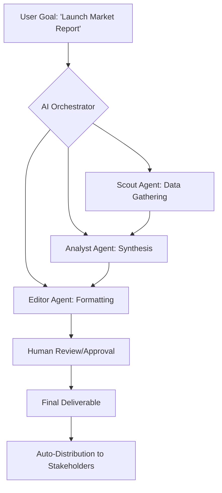

Remember when we used to spend half our day just clicking through different apps? We had one for the calendar, a browser for searching, and a spreadsheet for data—all totally disconnected. We lived in a fragmented digital ecosystem where the user acted as the "human glue," manually copying and pasting information from one silo to another. Well, by 2026, that "app-first" way of living is pretty much over. 

  
  
 <a href="https://unsplash.com/@zulfugarkarimov">Zulfugar Karimov</a> on <a href="https://unsplash.com/photos/digital-interface-with-ask-anything-prompt--lZmnpignB8">Unsplash</a>

We’ve moved from a **Tool-Centric** era to an **Agent-Centric** era. Software isn't just a place you go to get a task done anymore; it’s more like a layer of intelligence that actually executes the task for you. My "daily software" isn't a row of icons on a dock; it’s a coordinated swarm of autonomous agents running on an AI-native operating system. The interface has dissolved, leaving only the intent.

---

### 🤖 The AI-First Operating System: The End of the File Folder

In 2026, your operating system (OS) isn't just managing files and memory; it’s acting as a cognitive partner. This transition accelerated with the mass adoption of [Copilot+ PCs](https://www.microsoft.com/en-us/windows/copilot-plus-pcs), which integrated dedicated Neural Processing Units (NPUs) directly into the silicon. By now, the **NPU is just as critical as the CPU or GPU**. It enables "Local-First AI," meaning the vast majority of my daily cognitive assistance happens on-device, ensuring near-zero latency and total privacy.

The biggest paradigm shift, however, is the total obsolescence of the folder hierarchy. I haven't looked for a file in a nested directory in years. Instead, I utilize a semantic search layer—an evolution of early memory-recall systems—that allows me to query my entire digital history in plain English. I no longer search for "Q4_Budget_Final_v2.pdf." Instead, I ask my OS: *"Find the budget adjustments the CFO mentioned during the Tuesday sync and compare them to the projections we made in January."* 

The OS doesn't just find a file; it synthesizes the answer by pulling a transcript snippet from a recorded meeting, a cell from a spreadsheet, and a paragraph from an email, presenting them as a single, coherent insight.

> "The operating system has evolved from a passive launcher of applications into an active participant in the user's workflow, transforming the computer from a tool into a collaborator."

This has turned the OS into a "Thin Client" for intelligence. The interface is hyper-minimal—mostly a command bar and a dynamic canvas that generates the specific UI components I need in real-time. If I'm analyzing a budget, the OS generates a temporary table and a chart; if I'm writing, it provides a distraction-free prose environment. The "app" is now a transient state, not a destination.

---

### 🐝 Agentic Productivity: From SaaS to "Swarms"

If 2023 was the year of the chatbot, 2026 is the year of the Agent. The era of "prompting" a chat box to get a text response has been replaced by **Agentic Workflows**. These are not single LLM calls, but iterative loops where AI agents plan, execute, verify, and correct their own work. This movement grew out of early frameworks like [CrewAI](https://www.crewai.com) and [Microsoft AutoGen](https://microsoft.github.io/autogen/), which taught us how to make AI agents talk to one another.

I no longer spend my mornings manually updating Trello boards, syncing calendars, or chasing stakeholders for approvals. Instead, I deploy "swarms" of specialized agents. For a typical research project, I trigger a "Research Swarm" composed of three distinct personas:

1.  **The Scout Agent:** This agent uses [web-browsing capabilities](https://openai.com/index/introducing-searchgpt/) to scrape the latest news, academic papers on [arXiv](https://arxiv.org/), and niche forums, filtering for high-signal data.
2.  **The Analyst Agent:** This agent takes the raw data, identifies contradictions, flags biases, and builds a logical map of the findings.
3.  **The Editor Agent:** This agent takes the analysis and drafts a briefing in my specific voice, ensuring it aligns with my previous publications.

This is powered by [Large Action Models (LAMs)](https://www.perplexity.ai), which allow AI to move beyond text generation to actual software manipulation. LAMs don't need an API; they can "see" a user interface and interact with it just as a human would—clicking buttons, scrolling through menus, and filling out forms. 

Because of this, **over 60% of the routine administrative tasks** that previously required manual data entry have vanished. I have transitioned from being the "operator" performing the labor to the "director" who reviews, refines, and approves the output. The productivity gain is staggering; tasks that once took a full workday are now condensed into a **15-minute review session**.

---

### 🥽 Spatial Computing: The Infinite Canvas

The concept of a "screen" has completely expanded. While a physical laptop remains useful for deep, focused coding or writing, my primary environment is augmented by spatial computing. This trajectory was set by the [Apple Vision Pro](https://www.apple.com/apple-vision-pro/) and subsequent lightweight AR glasses, which moved the digital world from a rectangle in my hand to the space around my body.

In 2026, software is mapped to my physical environment using "spatial anchors." My digital workspace is no longer limited by pixels but by the square footage of my room. I have my email stream anchored to the wall on my left, my primary reference documents floating in the center of my vision, and a communication hub—integrated with [Slack](https://slack.com) and Zoom—sitting in a virtual portal to my right.

This is more than a visual gimmick; it is a massive cognitive upgrade. The ability to visualize complex, multi-dimensional data in 3D has transformed my workflow. For instance, turning a flat spreadsheet into a navigable 3D data map allows me to spot correlations that were invisible in 2D. This spatial synthesis has cut my data analysis time by **nearly 40%**.

Furthermore, the software is now "context-aware." Through a combination of high-resolution cameras and on-device AI, the OS recognizes physical objects. If I look down at my physical notebook, the OS performs real-time OCR (Optical Character Recognition) and automatically pops up the related digital files in my peripheral vision. The boundary between "digital" and "physical" software has effectively evaporated.

---

### 💻 The AI-Native Dev Stack: Steering, Not Writing

For those of us in the technical sphere, the act of "coding" has undergone a fundamental rewrite. The traditional Integrated Development Environment (IDE) has evolved into an AI-native workspace, led by tools like [GitHub Copilot Workspace](https://github.com/features/copilot) and [Cursor](https://cursor.com).

In 2026, I rarely write boilerplate code. The industry has shifted toward **"Prompt-Driven Architecture."** Instead of spending hours writing syntax, I spend my time designing the system. I describe the intended behavior, the data flow requirements, and the critical edge cases, and the AI generates the entire implementation across the stack. 

The role of the developer has shifted from *writer* to *reviewer*. The core challenge is no longer "how do I implement this loop?" but "is this the most resilient architectural pattern for this specific scale?" We are seeing the rise of **"Polyglot Development,"** where the AI handles the translation between languages in real-time. I can specify a high-performance backend in Rust and a fluid frontend in React, and the AI ensures the type-safety and communication between the two are seamless, regardless of my own fluency in either language.

**Key shifts in the 2026 Dev Stack:**
*   **Syntax $\rightarrow$ Intent:** Coding is now about defining *what* should happen, not *how* it happens.
*   **Manual Debugging $\rightarrow$ Automated Verification:** AI agents now run exhaustive test suites and suggest fixes before the human even sees the code.
*   **Siloed Languages $\rightarrow$ Fluid Interoperability:** The "compiler" has become a collaborator that bridges different language ecosystems.

This shift has resulted in a **300% increase in developer velocity**, allowing small teams to build products that previously required entire engineering departments.

---

### 🔒 Privacy, Sovereignty, and the "Local-First" Movement

As we offload more of our cognitive processes to agents, the question of digital sovereignty has become the central debate of 2026. In the early 2020s, we feared the "Black Box" of cloud AI. By 2026, the solution has been the **Local-First AI movement**.

Because NPUs are now ubiquitous, I run my most sensitive agents—those handling my finances, health data, and private communications—entirely on-device. I use "Personal Knowledge Graphs" that are encrypted and stored locally, meaning the AI knows everything about me, but the company that built the AI knows nothing.

We now use **"Permissioned Agency,"** a system where I can grant an agent temporary, scoped access to a specific service. For example, I can tell my travel agent: *"You have permission to access my credit card and passport for the next 4 hours to book this trip to Tokyo, after which all access tokens are revoked."* This granular control has mitigated much of the security anxiety that plagued the early transition to autonomous agents.

---

### 🌅 Conclusion: The Human as the Editor

When you look at the software stack of 2026, the overarching theme is **liberation from the mundane**. We have successfully offloaded the "how"—the clicks, the formatting, the endless searching, and the syntax errors—to autonomous agents and AI-integrated hardware. 

This shift finally allows us to focus on the "what" and the "why." The most critical skill for navigating the current landscape isn't technical wizardry with a specific tool; it is **critical curation**. In a world where software can generate a thousand variations of a project in seconds, the human's primary value is their taste, their ethics, and their strategic direction.

We are no longer just "users" of software. We are the conductors of an intelligent digital symphony, steering a swarm of agents to turn intent into reality. The "app" died so that the "idea" could finally take center stage.

---

### 📚 References & Further Reading

*   **NVIDIA Hardware Roadmap:** For deeper insights into the evolution of NPUs and Tensor cores. [nvidia.com](https://www.nvidia.com)
*   **The "Attention Is All You Need" Legacy:** Understanding the Transformer architecture that made this possible. [arXiv:1706.03762](https://arxiv.org/abs/1706.03762)
*   **OpenAI's Research on Agents:** Exploring the shift from LLMs to LAMs. [openai.com/research](https://openai.com/research)
*   **Apple's Human Interface Guidelines (Spatial):** How the vision for spatial computing was codified. [developer.apple.com](https://developer.apple.com)
*   **LangChain Documentation:** The foundation for agentic orchestration. [langchain.com](https://www.langchain.com)

---

## 📖 Related Reading

- [✈️ Spirit Airlines Bankruptcy: The Truth About the Google Data Rumors](/google-buys-crashed-airline-spirits-data-at-auction/)
- [🏸 The Anatomy of a Heartbreak: The 29-30 Thriller](/explained-why-ashith-surya-amrutha-pramuthesh-lost-29-30-in-2nd-game-heartbreak-vs-turkey/)
- [🚢 The Choke Point: Maritime Security and the Legal Battle for Seafarers in the Strait of Hormuz](/captain-of-ship-attacked-in-hormuz-dead-or-alive-sc-seeks-report-from-government/)
