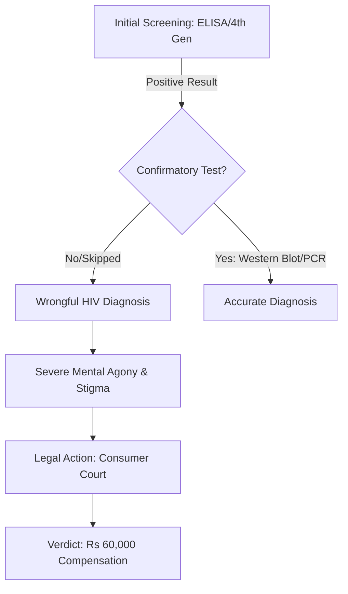

Imagine receiving news that fundamentally alters your perception of your future, your health, and your social standing, only to discover later that the entire premise was a clerical or clinical error. While it may seem like a scenario from a legal drama, this was the harrowing reality for a patient at one of India's premier medical institutions. 

  
  
 <a href="https://unsplash.com/@towfiqu999999">Towfiqu barbhuiya</a> on <a href="https://unsplash.com/photos/man-in-white-tank-top-mP8wEEaECYI">Unsplash</a>

In a significant ruling, the District Consumer Disputes Redressal Commission in Dehradun has ordered **AIIMS Rishikesh to pay Rs 60,000** in compensation to a man who was erroneously diagnosed as HIV positive. The case serves as a stark reminder of the devastating impact of diagnostic errors and the critical importance of patient advocacy and medical accountability in the Indian healthcare system.

---

### 😱 The Nightmare Diagnosis: More Than a Clinical Error

The ordeal began when the patient visited AIIMS Rishikesh—a cornerstone of tertiary healthcare in Uttarakhand—for routine testing. The hospital delivered a life-altering result: a positive HIV diagnosis. 

For the average individual, such a diagnosis is not merely a medical update; it is a psychological and social earthquake. In the Indian societal context, where the stigma surrounding Human Immunodeficiency Virus (HIV) remains profound, the diagnosis triggers immediate fear of social ostracization, familial rejection, and chronic illness. The patient was plunged into a state of severe emotional distress, exacerbated by the weight of a diagnosis delivered by a prestigious national institute, which typically commands absolute trust from its patients.

Often, in high-volume government hospitals, these results are communicated without sufficient psychological counseling or a clear roadmap for confirmatory testing, leaving the patient to process the trauma in isolation.

---

### 🔍 The Second Opinion: A Path to Relief

Driven by an intuition that something was amiss, or perhaps seeking the absolute certainty required for such a life-altering condition, the man sought a second opinion from another medical facility. The result of the retest was a complete reversal: **the test came back negative**.

This discrepancy revealed a catastrophic breakdown in the diagnostic protocol at AIIMS Rishikesh. While the negative result brought immediate physical relief, the psychological scarring remained. The realization that a premier national institute had failed in its primary duty of care prompted the patient to seek legal recourse. He argued that the hospital's negligence had caused him unnecessary mental agony and emotional trauma that no simple "correction" could erase.

---

### ⚖️ The Legal Battle for Accountability

The patient filed a formal complaint with the [District Consumer Disputes Redressal Commission](https://consumeraffairs.nic.in/) in Dehradun, citing a "deficiency in service" under the [Consumer Protection Act](https://consumeraffairs.nic.in/acts-and-rules/consumer-protection-act-2019). The legal proceedings focused on the hospital's failure to ensure the accuracy of a high-stakes diagnosis.

The Commission concluded that AIIMS Rishikesh had been negligent in its diagnostic process. To compensate for the patient's suffering, the court ordered the hospital to pay a total of **Rs 60,000**, structured as follows:
* **Rs 30,000** specifically for the mental agony and harassment endured.
* **Rs 30,000** to cover the legal expenditures incurred during the battle for justice.

> "A medical diagnosis of this magnitude requires absolute precision; any lapse is not just a clinical error but a violation of the patient's right to mental well-being and dignity."

---

### 🔬 The Science of the "False Positive"

To understand how a top-tier institution like AIIMS could fail, one must look at the biochemistry of HIV testing. Most initial screenings utilize the [ELISA (Enzyme-Linked Immunosorbent Assay)](https://en.wikipedia.org/wiki/ELISA) or 4th generation assays. While highly sensitive, these tests can occasionally produce **false positives** due to cross-reactivity with other antibodies or specific medical conditions (such as autoimmune diseases).

According to the [National AIDS Control Organisation (NACO)](https://naco.gov.in/), the standard medical protocol mandates that any positive screening *must* be followed by a confirmatory test—such as a [Western Blot](https://en.wikipedia.org/wiki/Western_blot) or a Nucleic Acid Test (NAT/PCR)—before a final diagnosis is communicated to the patient. The failure to either conduct these confirmatory tests or communicate the "preliminary" nature of the first result is where the clinical negligence occurred.

---

### 🛡️ Lessons for Patients and Providers

This case underscores a broader systemic issue in healthcare: the tension between high patient volume and diagnostic precision. For patients, it serves as a critical reminder that **seeking a second opinion** is not an act of distrust but a necessary safeguard when facing life-altering medical news.

For healthcare providers, especially those in prestigious institutions, this ruling is a warning. Prestige does not grant immunity from negligence. The prioritization of lab throughput over diagnostic verification can lead to irreparable human damage. 

**Key Takeaways for Patient Rights:**
1. **Request Documentation:** Always ask for the specific type of test performed (Screening vs. Confirmatory).
2. **Verify Protocols:** Ensure that "positive" results for chronic conditions are backed by the gold-standard confirmatory tests recommended by the [World Health Organization (WHO)](https://www.who.int/).
3. **Legal Recourse:** Understand that medical negligence is a punishable offense under consumer law in India.

---

### 📌 Conclusion

The ruling against AIIMS Rishikesh is a landmark for patient rights in Uttarakhand. While **Rs 60,000** cannot fully compensate for the terror of a false HIV diagnosis, the legal precedent establishes that medical accuracy is a non-negotiable right. It forces a conversation on the need for better communication protocols and stricter adherence to diagnostic guidelines in government hospitals. In the intersection of medicine and law, the message is clear: precision is the only acceptable standard when a human life is on the line.

### References
* District Consumer Disputes Redressal Commission, Dehradun.
* Consumer Protection Act, 2019, Government of India.
* National AIDS Control Organisation (NACO) Testing Guidelines.
* World Health Organization (WHO) HIV/AIDS Diagnostic Framework.

---

## 📖 Related Reading

- [From Pen-Testing to Prompt Injection: The Evolution of Cybersecurity at Anthropic](/mukul975anthropic-cybersecurity-skillsstargazers/)
- [The Death of the App: My Daily Software Stack in 2026](/what-software-do-you-use-daily-in-2026/)
- [📉 Hyundai India Price Hike: What You Need to Know](/hyundai-india-announces-car-price-hike-from-sep-2026-rushlane/)
