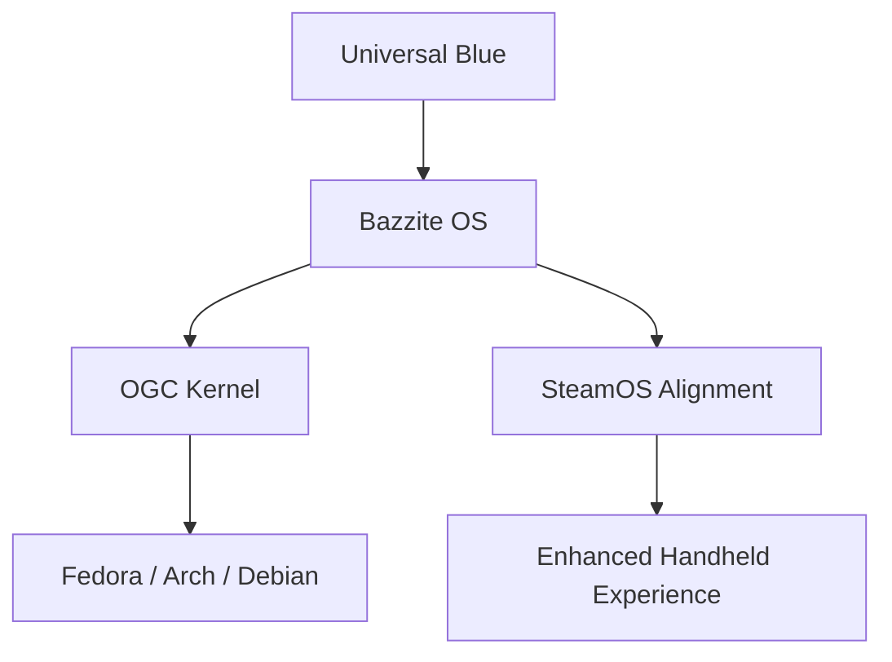

If you have been tracking the evolution of the Linux gaming landscape, you know that the quest for a "perfect" handheld OS usually leads to one of two places: the official SteamOS on the Steam Deck, or a community-driven powerhouse. For the latter, Bazzite has long been the gold standard for those running non-Valve hardware. Now, the stakes have been raised.

  
  
 <a href="https://unsplash.com/@3dottawa">Point3D Commercial Imaging Ltd.</a> on <a href="https://unsplash.com/photos/a-deck-with-chairs-and-tables-on-it-and-a-deck-with-plants-8c4kyStDeAE">Unsplash</a>

The team at [Universal Blue](https://universal-blue.discourse.group/t/bazzites-biggest-update-deck-44-has-launched-happy-birthday-to-universal-blue/12373) has officially released **Deck 44**, and it is far more than a routine version bump. This is the most significant architectural overhaul in the project's history, coinciding with the 5th anniversary of Universal Blue. With over **700 commits** integrated into this release, the goal is clear: bring the Bazzite experience into total alignment with SteamOS while maintaining the Fedora-based flexibility that makes it a favorite for power users.

---

### 🛠️ The Shift to SteamOS Alignment

For a long time, "SteamOS-like" experiences on Linux were achieved through a series of clever workarounds and separate image stacks. While functional, this often led to a fragmented update cycle where the handheld-specific features felt disconnected from the core OS. 

Deck 44 changes the game by replacing the legacy deck image stack with a fully aligned architecture. By mimicking the way SteamOS handles its system images, Bazzite now ensures that updates happen simultaneously across all images. This removes the "version drift" that plagued earlier iterations, resulting in a seamless, polished experience that feels native to the hardware.

#### Quality-of-Life Enhancements
The alignment isn't just under the hood; it's visible in the UI. Bazzite has introduced a new **GUI updater and changelog viewer** specifically designed for controller navigation. This means you no longer need to switch to a desktop mode or plug in a keyboard just to see what changed in the latest update—everything is accessible directly within Steam Game Mode.

Furthermore, Bazzite is expanding its reach beyond Valve hardware. For users on the **ROG Ally** or **Lenovo Legion Go**, the **OpenGamepadUI overlay** is now enabled by default. This provides a much more cohesive interface for managing handheld-specific settings without breaking the immersion of the gaming experience.

> "This is the largest rework the deck images have ever had, replacing our old stack with the full SteamOS-aligned stack. We are moving toward a sustainable, professional gaming platform."

---

### 🚀 The Open Gaming Collective (OGC) Kernel

One of the most technical—and most important—changes in Deck 44 is the migration to the **Open Gaming Collective (OGC) kernel**. 

In the past, many Linux gaming distributions relied on "gamer kernels"—heavily modified versions of the Linux kernel designed for low latency. While these provided short-term performance boosts, they were often nightmares to maintain and frequently broke when the main Linux kernel updated.

The OGC kernel takes a different approach. Based on the stable Linux repository (currently utilizing the 6.x stable branch), the OGC kernel is a community-managed standard. Rather than creating a fragmented "fork," it provides a shared baseline that builds across **Debian, Fedora, and Arch**. 

#### Why This Matters for the User:
1. **Stability:** By sticking closer to the mainline kernel, Bazzite avoids the crashes associated with unstable, experimental patches.
2. **Sustainability:** A community-run standard means that the burden of maintenance is shared, ensuring the OS doesn't die if a single lead developer steps away.
3. **Compatibility:** Hardware support is rolled out faster because the OGC kernel leverages the broader Linux ecosystem.

---

### ⚡ Performance, VRAM, and Hardware Wins

Gaming on handhelds is a constant battle for resources. With limited RAM and shared VRAM (Unified Memory Architecture), games frequently crash when they hit the ceiling of physical memory. Deck 44 tackles this head-on.

#### Solving the Memory Crash
Bazzite has implemented the **full VRAM overcommit series** and **dmem cgroups**. In simple terms, this allows the OS to be more flexible with how it allocates memory between the CPU and GPU. Instead of a hard crash when a game requests more VRAM than is physically available, the system can now prioritize and overcommit memory, significantly reducing the frequency of "Out of Memory" (OOM) crashes in demanding AAA titles. For those who want to dive into the technical weeds, the [VRAM Overcommit documentation](https://pixelcluster.dev/VRAM-Overcommit/) provides a deep dive into this mechanism.

#### The Hardware Checklist
Beyond memory management, Deck 44 delivers several critical hardware updates:
* **Mesa 24.x Drivers:** Updated graphics drivers ensure better compatibility with the latest Vulkan titles and improved performance on AMD RDNA architectures.
* **HDMI 2.1 Integration:** Support for **FRL (Fixed Rate Link), ALLM (Automatic Low Latency Mode), and VRR (Variable Refresh Rate)** is now available. These can be toggled via the `ujust` command, making Bazzite a viable OS for high-end docked gaming setups.
* **Scheduler Backports:** The team has backported scheduler improvements from the latest kernels to help mitigate "1% lows" (stuttering) on hybrid CPUs (like those found in the latest Intel and AMD chips).
* **Cardwire Support:** This modern GPU management tool is now integrated, simplifying MUX switching for laptop users who need to toggle between integrated and discrete graphics.

---

### 🛡️ An Expanding Ecosystem and Hardened Security

Bazzite isn't just a niche project anymore; it's becoming a pillar of the Linux gaming community. The statistics speak for themselves: Bazzite now accounts for **30% of all traffic on [Flathub](https://flathub.org/en/statistics)**. This massive adoption is a testament to the shift toward "Atomic" or immutable distributions, where the core system is read-only and apps are sandboxed via Flatpak.

#### Security and Trust
With over **110K weekly active users**, security cannot be an afterthought. Universal Blue has adopted **OpenSSF recommendations** to ensure the supply chain of their images is secure. Users can now verify the integrity of their system images using `cosign` and `gh attestation`. This means you can mathematically prove that the OS you are installing is exactly what the developers released, with no malicious injections in between.

#### Beyond X86: The ARM Future
The gaming world is shifting toward ARM architecture, and Bazzite is preparing for it. While Bazzite remains the king of X86 handhelds, the team now officially recommends [Armada OS](https://armadaos.dev/) for ARM-based handhelds. Armada OS provides a similar SteamOS-like experience but is optimized for the unique constraints of ARM chips.

For those looking to personalize their environment, the update highlights [Waywallen](https://flathub.org/en/apps/org.waywallen.waywallen), a powerful tool that allows users to bring their Wallpaper Engine favorites into the GNOME and KDE Plasma environments, bridging the gap between Windows aesthetics and Linux performance.

---

### 🏁 Final Verdict: A New Standard for Gaming Linux

Deck 44 represents a philosophical shift for Bazzite. It is no longer just about "making Linux work on a handheld"; it is about building a professional, sustainable, and industry-standard platform. 

By moving away from fragile custom patches and embracing the **Open Gaming Collective kernel** and **SteamOS alignment**, Bazzite has effectively future-proofed itself. The combination of **30% Flathub market share**, hardened security, and cutting-edge VRAM management makes it the most compelling alternative to SteamOS available today.

Whether you are a Steam Deck purist looking for more control, an ROG Ally owner tired of Windows bloat, or a Linux enthusiast building the ultimate gaming rig, Deck 44 is the update you've been waiting for. As the project looks toward Fedora 45 and the continued rise of ARM handhelds, Bazzite is no longer just following the leader—it's helping define the path forward.

---

## 📖 Related Reading

- [X.Org Server 26.1 Rc1 Prepares For First Feature Release In Five Years](/xorg-server-261-rc1-prepares-for-first-feature-release-in-five-years/)
- [⚖️ Justice Mantha Recuses from Sujit Bose Bail Case: A Deep Dive into Judicial Integrity and the SSC Scam](/high-court-judge-recuses-from-tmcs-sujit-bose-bail-plea-over-record-access-bid/)
- [Swine Flu is Back in Delhi: What 114 New Cases Actually Mean 🤒](/delhi-reports-114-new-h1n1-cases-jp-nadda-calls-on-health-officials-to-review-situation/)
