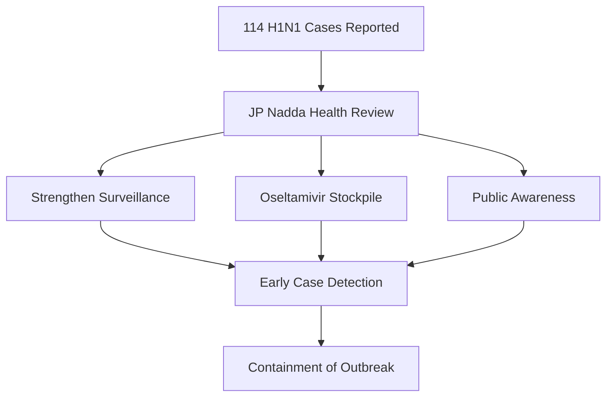

Delhi is currently on high alert. The emergence of **114 new cases of H1N1 (Swine Flu)** has prompted Union Health Minister JP Nadda to call for an urgent review of the city's healthcare preparedness. With the Health Ministry pushing for intensified surveillance and hospital readiness, the timing is particularly critical. The intersection of fluctuating seasonal temperatures and chronic air quality issues in the National Capital Region (NCR) creates a perfect storm for respiratory vulnerability.

  
  
 <a href="https://unsplash.com/@singhrupinder">Rupinder Singh</a> on <a href="https://unsplash.com/photos/a-man-walking-down-a-street-holding-a-sign-Bz66H6IIEoM">Unsplash</a>

---

### 🚨 What’s Happening in the Capital?

There is a concerning uptick in influenza A (H1N1) infections, with **114 new cases** reported in a concentrated window. While H1N1 is an endemic seasonal occurrence in India, the rapid cluster of infections has raised alarms among epidemiologists. Patients are primarily presenting with high-grade fever, severe dry cough, and acute respiratory distress.

Because of Delhi's extreme population density, respiratory droplets spread rapidly through public transport and crowded markets. Health officials are currently mapping "hotspots" to determine if the virus is localized in specific neighborhoods or spreading uniformly across the community. As the [World Health Organization (WHO)](https://www.who.int) notes, influenza viruses are highly contagious, and megacities often act as epicenters during seasonal transitions.

---

### 🏛️ The Government's Strategic Response

To mitigate a potential outbreak, JP Nadda met with senior health officials to audit the city's clinical infrastructure. The strategy centers on three primary pillars: **enhanced surveillance, stockpile management, and public communication.**

> "It is imperative that we strengthen our surveillance mechanisms to detect cases early and ensure that no patient is denied timely treatment," Nadda emphasized during the review.

The current action plan includes:
*   **Antiviral Stockpiling:** Ensuring a robust supply of **Oseltamivir (Tamiflu)**, the primary antiviral medication used to reduce the severity and duration of H1N1.
*   **Triage Systems:** Instructing government hospitals to implement dedicated flu clinics to prevent cross-contamination between H1N1 patients and those in general wards.
*   **Mandatory Reporting:** Implementing a stricter notification system requiring private diagnostic labs to report positive H1N1 results to the [Ministry of Health and Family Welfare (MoHFW)](https://www.mohfw.gov.in) immediately.

---

### 🧬 Understanding H1N1: More Than Just a Cold

It is a common misconception that H1N1 is a standard seasonal cold. H1N1 is a specific subtype of the [Influenza A virus](https://en.wikipedia.org/wiki/H1N1_influenza), a zoonotic virus that first gained global notoriety during the 2009 pandemic. Unlike the common cold, H1N1 can progress rapidly into severe viral pneumonia, leading to systemic organ failure in vulnerable patients.

According to [Mayo Clinic](https://www.mayoclinic.org) guidelines, certain populations are at a significantly higher risk for complications:
*   **Age Extremes:** Children under 5 and seniors over 65.
*   **Chronic Comorbidities:** Individuals with asthma, diabetes, or chronic heart disease.
*   **Immunocompromised Status:** Those with weakened immune systems are more susceptible to secondary bacterial infections.

#### 🔍 H1N1 vs. Common Cold vs. COVID-19
While symptoms overlap, the intensity differs. **H1N1 typically presents with a sudden onset of high fever (102°F+), severe muscle aches, and extreme fatigue**, whereas a common cold is usually gradual and milder.

---

### 😷 The "Pollution Factor" and Prevention

In Delhi, the battle against Swine Flu cannot be separated from the battle against smog. There is a scientifically documented link between high levels of **PM2.5 (fine particulate matter)** and respiratory susceptibility. When lungs are chronically irritated by pollution, the cilia (tiny hair-like structures that clear mucus) are damaged, weakening the body's first line of defense and allowing the H1N1 virus to penetrate deeper into the lungs.

To safeguard your health, medical experts recommend a multi-layered defense:

1.  **Annual Vaccination:** An [influenza vaccine](https://www.cdc.gov/flu/prevent/vaccine-benefits.htm) is the most effective way to prevent infection or reduce the severity of the illness.
2.  **Rigorous Hygiene:** Frequent handwashing and the use of alcohol-based sanitizers remain essential.
3.  **Respiratory Etiquette:** Wearing masks in crowded areas and covering coughs prevents the aerosolization of the virus.
4.  **Environmental Control:** On days when the [Central Pollution Control Board (CPCB)](https://cpcb.nic.in) reports "Poor" or "Severe" air quality, use N95 masks or air purifiers to reduce lung inflammation.

---

### 🚩 When to Seek Immediate Medical Help

While most H1N1 cases can be managed with rest and antivirals, some "red flag" symptoms require immediate hospitalization:
*   **Shortness of breath** or difficulty breathing.
*   **Bluish discoloration** of the lips or face (cyanosis).
*   **Chest pain** or persistent pressure.
*   **Confusion** or sudden mental disorientation.
*   **High fever** that does not respond to medication.

### The Bottom Line

The report of **114 new H1N1 cases** serves as a critical warning for Delhi residents. While the government's focus on surveillance and medicine stockpiling is a step in the right direction, individual vigilance is the final line of defense. By combining vaccination with pollution-mitigation strategies, the city can prevent this seasonal spike from escalating into a public health crisis.

---

## 📖 Related Reading

- [X.Org Server 26.1 Rc1 Prepares For First Feature Release In Five Years](/xorg-server-261-rc1-prepares-for-first-feature-release-in-five-years/)
- [⚖️ Justice Mantha Recuses from Sujit Bose Bail Case: A Deep Dive into Judicial Integrity and the SSC Scam](/high-court-judge-recuses-from-tmcs-sujit-bose-bail-plea-over-record-access-bid/)
- [From Pen-Testing to Prompt Injection: The Evolution of Cybersecurity at Anthropic](/mukul975anthropic-cybersecurity-skillsstargazers/)
