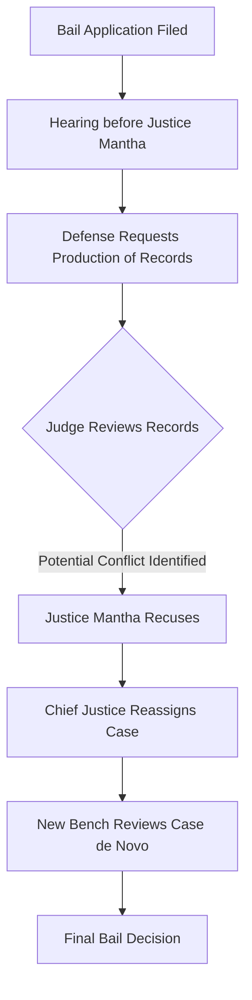

In a significant procedural turn at the Calcutta High Court, **Justice Rajasekhar Mantha** has recused himself from presiding over the bail application of Trinamool Congress (TMC) leader Sujit Bose. This decision, while seemingly a technicality of court administration, underscores a fundamental pillar of the Indian legal system: the necessity of an unbiased judiciary. The recusal occurred not due to a contested legal argument on the merits of the case, but as a direct result of a specific request to access particular court records.

  
  
 <a href="https://unsplash.com/@davidveksler">David Veksler</a> on <a href="https://unsplash.com/photos/architectural-photography-of-trial-court-interior-view-HpmDAS1Dozs">Unsplash</a>

By stepping aside, Justice Mantha has ensured that the proceedings remain above suspicion, preventing any future challenges to the verdict based on perceived bias. This development arrives amidst the high-stakes legal turbulence surrounding the West Bengal School Service Commission (SSC) recruitment scam—a scandal that has embroiled high-ranking political figures and sent shockwaves through the state's administrative machinery.

---

### 🔍 The Catalyst: What Triggered the Recusal?

The pivot occurred when the legal defense team representing Sujit Bose filed a request for the "production of records." In legal parlance, this is a bid to bring specific files, previous orders, or internal court documentation into the active record of the current case to support a legal argument.

Upon reviewing the nature of these records, Justice Rajasekhar Mantha determined that his continued presence on the bench could create a conflict of interest or the appearance of one. While the judge did not disclose the specific contents of the records in open court, the act of recusal is a proactive measure to protect the integrity of the judicial process.

> "Recusal is a voluntary act of a judge to disqualify themselves from participating in any legal proceeding because of a conflict of interest or a reason that could cast doubt on their impartiality. The core principle is that justice must not only be done but must be seen to be done."

Consequently, the bail plea has been transferred to a different bench. In the Indian judiciary, such shifts are common when a judge identifies a prior connection to the documents, a relationship with the parties involved, or a previous ruling in a related matter that might cloud the current deliberation.

---

### 📁 Understanding the SSC Recruitment Scam

To understand why the bail of Sujit Bose is so heavily scrutinized, one must examine the scale of the [West Bengal SSC Scam](https://www.indiatoday.in/india/story/wb-ssc-scam-sujit-bose-arrested-tmc-leader-2531234-2023-07-15). This is not a simple case of administrative error, but an alleged systemic fraud where teaching positions in state-run schools were traded for monetary bribes.

The investigation, led by the [Central Bureau of Investigation (CBI)](https://cbi.gov.in/) and the [Enforcement Directorate (ED)](https://enforcementdirectorate.gov.in/), suggests a sophisticated network of middlemen and political patrons. According to investigative reports, **thousands of qualified candidates** were bypassed in favor of those who paid illicit premiums.

**Key Statistics of the Scandal:**
*   **Estimated Fraud Scale:** Allegations suggest the scam impacted **over 20,000 teaching posts**.
*   **Financial Impact:** The ED has frozen assets and tracked money trails involving **crores of rupees** in illicit transactions.
*   **Political Fallout:** Multiple high-ranking officials, including former ministers and senior TMC leaders, have faced arrest or interrogation.
*   **Judicial Intervention:** The Calcutta High Court has previously ordered the [recovery of illegally appointed teachers](https://www.thehindu.com/news/national/other-states/calcutta-hc-orders-wb-govt-to-recover-money-from-illegally-appointed-teachers/article66833125.ece), a move that caused massive protests across the state.

---

### 👤 Who is Sujit Bose?

Sujit Bose is a prominent figure within the Trinamool Congress (TMC), the dominant political force in West Bengal. His role within the party and his influence in the state's political landscape made his arrest a focal point of the investigation.

Bose was apprehended as part of the central agencies' crackdown on the SSC fraud. For the TMC, his arrest—and those of other colleagues—is framed as a "politically motivated" campaign orchestrated by the central government to destabilize the state administration. Conversely, the prosecution argues that Bose was a key cog in the machinery that facilitated the illegal recruitment process.

The battle for his bail is not merely a legal quest for freedom; it is a symbolic struggle. For the prosecution, keeping him in custody is essential to prevent the tampering of evidence. For the defense, the prolonged detention is viewed as an overreach of agency power.

---

### 🛠️ The Legal Mechanism: Production of Records and Recusal

The "record access bid" that led to Justice Mantha's recusal is a critical tool in litigation. When a lawyer asks the court to produce records, they are often looking for a precedent or a contradiction in a previous order that could tip the scales of a bail plea.

However, this process can create a "judicial overlap." If a judge finds that they were the ones who authored the original order being produced, or if they were involved in a previous capacity that creates a bias (either for or against the petitioner), the ethical requirement is to step down.

#### The Process of Transfer
When a judge recuses themselves, the case doesn't disappear; it is reassigned. The process follows this flow:

This "de novo" review means the new judge must look at the case with fresh eyes, ensuring that no previous bias enters the decision-making process.

---

### 🏛️ The Calcutta High Court vs. West Bengal Government

The current atmosphere in the Calcutta High Court is one of palpable tension. For several years, the court has acted as a stringent watchdog over the West Bengal government's handling of public recruitment and administrative transparency.

The court has frequently expressed dissatisfaction with the state's response to the SSC scam, often issuing sharp rebukes to government lawyers. This adversarial relationship adds another layer of complexity to the recusal. In an environment where the state government and the judiciary are often at loggerheads, any hint of judicial bias—real or perceived—can be weaponized politically.

Justice Mantha's decision to recuse himself is, therefore, a strategic move to insulate the court from political criticism. By removing himself from the equation, he denies critics the opportunity to claim that the outcome was predetermined.

---

### ⚖️ The Broader Implications for Indian Law

The principle of recusal is central to the [Basic Structure Doctrine](https://en.wikipedia.org/wiki/Basic_structure_doctrine) of the Indian Constitution, which emphasizes the independence of the judiciary. When a judge steps down, it reinforces the belief that the law is supreme, not the individual presiding over the bench.

#### The "Perception of Bias" Standard
In Indian law, the standard for recusal is often not "actual bias" but the "reasonable apprehension of bias." If a reasonable person, knowing the facts, would believe that the judge might not be impartial, the judge should recuse.

**Comparison of Recusal Scenarios:**
| Scenario | Action | Legal Justification |
| :--- | :--- | :--- |
| Judge is related to the lawyer | Recusal | Direct conflict of interest |
| Judge previously heard the case in a lower court | Recusal | Pre-existing opinion on facts |
| Judge has expressed public views on the party | Recusal (often) | Apprehension of political bias |
| Judge reviews a record they previously signed | Recusal | Avoidance of "self-confirmation" bias |

---

### ⏳ What Happens Next for Sujit Bose?

The immediate effect of the recusal is a delay. The bail plea must now be listed before a new bench, and the new judge will likely require time to familiarize themselves with the extensive evidence gathered by the CBI and ED.

For Sujit Bose, this is a double-edged sword. While it prevents a potentially unfavorable ruling from a judge who felt conflicted, it also extends his period of incarceration. For the prosecution, it is a victory for procedural purity; it ensures that if bail is denied, the order will be virtually bulletproof against appeals based on judicial bias.

As the SSC scam continues to unfold, the eyes of the nation remain on the Calcutta High Court. The outcome of these cases will determine whether accountability can truly be enforced against high-ranking political figures in India.

---

### 🏁 Final Analysis: The Balance of Power

Justice Mantha's decision serves as a reminder that the courtroom is not just a place for arguing facts, but a sanctuary for the rule of law. In high-profile political cases, the *appearance* of neutrality is as vital as neutrality itself.

While the political machinery of the TMC and the central agencies continue to clash, the judiciary's role is to remain the neutral referee. Recusals, though they may slow down the wheels of justice, are the grease that prevents the machine from seizing up under the pressure of political polarization.

By stepping away, Justice Mantha has not abandoned the case; he has protected the integrity of the final verdict. In the long run, this ensures that the resolution of the SSC scam—and the fate of Sujit Bose—will be decided on the merits of evidence, not the perceptions of personality.

***

### 📚 References and Further Reading

1.  **India Today:** [Detailed coverage of the SSC Scam and Sujit Bose's arrest](https://www.indiatoday.in/india/story/wb-ssc-scam-sujit-bose-arrested-tmc-leader-2531234-2023-07-15)
2.  **The Hindu:** [Analysis of the Calcutta High Court's orders on illegal appointments](https://www.thehindu.com/news/national/other-states/calcutta-hc-orders-wb-govt-to-recover-money-from-illegally-appointed-teachers/article66833125.ece)
3.  **Central Bureau of Investigation (CBI):** [Official reports on central agency investigations](https://cbi.gov.in/)
4.  **Enforcement Directorate (ED):** [Guidelines on money laundering and asset freezing](https://enforcementdirectorate.gov.in/)
5.  **Live Law:** [Legal analysis of judicial recusal standards in India](https://www.livelaw.in/)
6.  **Bar and Bench:** [Updates on Calcutta High Court proceedings](https://www.barandbench.com/)
7.  **Constitution of India:** [Articles regarding the independence of the judiciary](https://www.india.gov.in/my-government/constitution-india)
8.  **Supreme Court of India:** [Guidelines on the transfer of cases and bench assignments](https://main.sci.gov.in/)

---

## 📖 Related Reading

- [From Pen-Testing to Prompt Injection: The Evolution of Cybersecurity at Anthropic](/mukul975anthropic-cybersecurity-skillsstargazers/)
- [Medical Malpractice or Human Error? AIIMS Rishikesh Penalized After Wrong HIV Diagnosis](/man-declared-hiv-positive-by-aiims-found-negative-after-retest-at-another-hospital-consumer-commission-orders-aiims-risihikesh-to-pay-rs-60000/)
- [🚀 The Rabbit Hole of `chaitanyagiri/munder-difflin`](/chaitanyagirimunder-difflinstargazers/)
