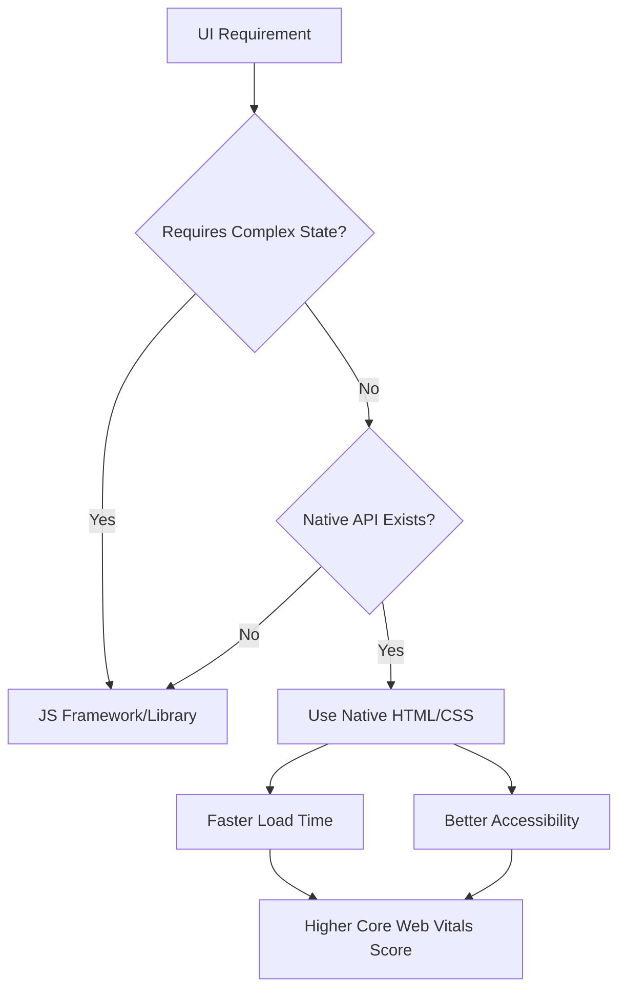

Ever feel like your `node_modules` folder is becoming a black hole of dependencies? For years, the prevailing wisdom in frontend development was to reach for a JavaScript library to solve every tiny UI problem—whether it was a simple modal, an accordion, or a layout tweak. This culture of "import first, think later" has led to what developers now call **dependency fatigue**.

The cost of this approach isn't just a slower `npm install`. Every single library adds to your bundle size, increasing the time to first byte (TTFB) and negatively impacting your Largest Contentful Paint (LCP). More critically, third-party libraries often ignore the nuances of accessibility (a11y), forcing developers to write *more* JavaScript just to make a library accessible.

The good news? The browser has undergone a massive evolution. We can now build faster, smoother, and more accessible interfaces using native CSS and HTML features that are already sitting right there in our toolkit.

---

### 🎨 CSS Power-Ups: Layouts That Actually Think

For the longest time, CSS had a strict "downward-only" limitation: you could style a child element based on its parent, but you couldn't style a parent based on its children. This forced us to rely on JavaScript to toggle classes based on the state of a child element.

#### The Magic of the `:has()` Selector
Enter the [ `:has()` selector](https://web.dev/css-has/), often referred to as the "parent selector." It is arguably the most significant addition to CSS in a decade. Instead of writing a `useEffect` hook in React to watch a checkbox and change a parent's background color, you can now do this:

`card:has(.checkbox:checked) { border: 2px solid blue; }`

This eliminates an entire category of "state-management" JavaScript. You can now change a card's style if it contains an image, shift a form layout if an input becomes invalid, or create complex interactive components without a single line of JS. **Browser support for `:has()` is now nearly universal**, appearing in the stable versions of Chrome, Safari, and Firefox.

#### Precision with Container Queries
While Media Queries have been our staple for years, they have a fundamental flaw: they look at the *viewport*, not the *component*. If you have a "Card" component that needs to look different in a narrow sidebar versus a wide main content area, a Media Query can't help you because the screen size remains the same.

[CSS Container Queries](https://web.dev/container-queries/) solve this by allowing an element to style itself based on the size of its parent container. This makes components truly modular. A card can now decide to stack vertically in a 300px sidebar or sit horizontally in a 1200px grid, regardless of the device screen size.

#### Fluid Typography and the Death of 20 Media Queries
If you're still writing five different `@media` blocks to scale your headers for mobile, tablet, and desktop, it's time to switch to [ `clamp()`, `min()`, and `max()`](https://developer.mozilla.org/en-US/docs/Web/CSS/clamp). 

By using `font-size: clamp(1.5rem, 5vw, 3rem);`, you tell the browser: "Keep the text at 1.5rem minimum, scale it at 5% of the viewport width, but never let it exceed 3rem." This creates a fluid, seamless transition that feels natural across all devices.

> "The transition from Media Queries to Container Queries is like moving from a map of the city to a map of the room. It gives developers precision where it actually matters: the component level."

---

### 🏗️ Built-in UI Components: Ditch the Modal Libraries

Many developers still import 20kb+ libraries just to handle popups and dropdowns. This is no longer necessary. The browser now provides native elements that handle the most difficult parts of UI development: **layering and focus management.**

#### The `<dialog>` Element
The [ `<dialog>` element](https://developer.mozilla.org/en-US/docs/Web/HTML/Element/dialog) is a game-changer for modals. When you call the `.showModal()` method, the browser does several things automatically:
1. It places the element in the **top layer**, meaning you can finally stop fighting with `z-index: 99999`.
2. It creates a native `::backdrop` pseudo-element for dimming the background.
3. It traps keyboard focus inside the modal, which is a critical requirement for WCAG accessibility compliance.

#### The Popover API
For tooltips, menus, and floating panels, the new [Popover API](https://developer.chrome.com/blog/popover-api/) is a lifesaver. Historically, the "click-away to close" behavior required custom JavaScript listeners on the `document` object. The Popover API introduces "light dismiss" behavior natively. By adding the `popover` attribute and a `popovertarget` to a button, the browser handles the opening, closing, and layering without a single line of custom logic.

#### Zero-JS Accordions
For FAQs and collapsible menus, the [ `
` and `
`](https://developer.mozilla.org/en-US/docs/Web/HTML/Element/details) tags provide a fully functional accordion. They are keyboard-accessible by default and require zero JavaScript to function, reducing the execution time of your page.

---

### ⚡ Performance-First APIs: Beyond the Scroll Event

One of the most common causes of "jank" (visual stuttering) is the misuse of the `scroll` event. Attaching a function to `window.onscroll` forces the browser to execute code every single time a pixel is moved, often choking the main thread.

#### Intersection Observer API
The [Intersection Observer API](https://developer.mozilla.org/en-US/docs/Web/API/Intersection_Observer_API) is the sophisticated alternative. Instead of constantly polling the element's position, the browser "observes" the element and pings your code only when it enters or leaves the viewport. 

This is the engine behind modern **lazy loading** and **infinite scrolling**. By offloading the intersection calculation to the browser's optimized internal engine, you can reduce main-thread activity by **up to 90%** in scroll-heavy applications.

#### View Transitions API
Animating page transitions usually requires heavy-duty libraries like Framer Motion or GSAP. However, the [View Transitions API](https://developer.chrome.com/blog/view-transitions-api/) allows the browser to take a snapshot of the current state and the new state, then automatically animate the difference. This allows for "app-like" transitions—such as an image expanding from a grid into a full-screen view—with minimal effort and maximum performance.

---

### 🌍 The Global Web: UX and Internationalization

Professional-grade websites aren't just about features; they are about inclusivity and global reach. Native APIs provide tools for this that libraries often overlook.

#### The Web Share API
Stop building cluttered social sharing menus with five different SVG icons. The [Web Share API](https://developer.mozilla.org/en-US/docs/Web/API/Navigator/share) allows you to trigger the native sharing dialog of the user's operating system. By calling `navigator.share()`, the user can send your content via WhatsApp, iMessage, or Email using the apps they already trust. It's faster, more secure, and feels native to the device.

#### CSS Logical Properties
If your site is translated into Right-to-Left (RTL) languages like Arabic or Hebrew, `margin-left` becomes a liability. You would traditionally have to write a separate CSS file for RTL layouts. 

[CSS Logical Properties](https://developer.mozilla.org/en-US/docs/Web/CSS/CSS_logical_properties) solve this. By using `margin-inline-start` instead of `margin-left`, the browser automatically flips the spacing based on the `dir` attribute of the HTML. This ensures your layout remains consistent globally without duplicating your stylesheets.

#### The `<template>` Element
Finally, the [ `<template>` element](https://developer.mozilla.org/en-US/docs/Web/HTML/Element/template) allows you to store HTML fragments that aren't rendered on page load. This is essentially the native version of the "component" pattern. You can clone the content of a template and inject it into the DOM using JavaScript, keeping your initial HTML payload lean and your DOM structure clean.

---

### ⚖️ When to Actually Use a Library

After reading this, you might wonder: *Are libraries dead?* Of course not. The key is knowing **when** the complexity of the problem justifies the weight of the dependency.

**Use Native APIs when:**
* You are building standard UI components (Modals, Accordions, Tooltips).
* You need to implement simple animations or transitions.
* You are optimizing for performance, LCP, and accessibility.
* Your goal is a lightweight, fast-loading landing page or content site.

**Use Libraries when:**
* You have a massive, highly dynamic state (e.g., a complex Dashboard or a Spreadsheet app).
* You need a standardized design system across a huge team (e.g., MUI or Tailwind UI).
* You require complex data synchronization in real-time (e.g., Socket.io).
* You are building a Full-Scale Web Application where the overhead of a framework is offset by developer productivity.

### Final Checklist for the Modern Developer

The next time you are tempted to run `npm install`, run through this checklist:

1. **Layout:** Can `:has()` or Container Queries solve this?
2. **UI Components:** Does `<dialog>`, `popover`, or `
` exist for this?
3. **Performance:** Can I replace this scroll listener with `IntersectionObserver`?
4. **Global Reach:** Am I using Logical Properties for my spacing?
5. **UX:** Can `navigator.share()` replace my social menu?

Being a senior developer isn't about knowing the most libraries; it's about knowing the platform. The web platform is now more powerful than ever. It's time we started using it.

---

### 📚 References & Further Reading

* [MDN Web Docs: HTML Elements](https://developer.mozilla.org/en-US/docs/Web/HTML)
* [Web.dev: Modern CSS Layouts](https://web.dev/learn/css/)
* [Chrome Developers Blog: The Popover API](https://developer.chrome.com/blog/)
* [W3C Accessibility Guidelines (WCAG)](https://www.w3.org/WAI/standards-guidelines/wcag/)
* [HTTP Archive: State of the Web](https://httparchive.org/)

---

## 📖 Related Reading

- [X.Org Server 26.1 Rc1 Prepares For First Feature Release In Five Years](/xorg-server-261-rc1-prepares-for-first-feature-release-in-five-years/)
- [⚖️ Justice Mantha Recuses from Sujit Bose Bail Case: A Deep Dive into Judicial Integrity and the SSC Scam](/high-court-judge-recuses-from-tmcs-sujit-bose-bail-plea-over-record-access-bid/)
- [Swine Flu is Back in Delhi: What 114 New Cases Actually Mean 🤒](/delhi-reports-114-new-h1n1-cases-jp-nadda-calls-on-health-officials-to-review-situation/)
