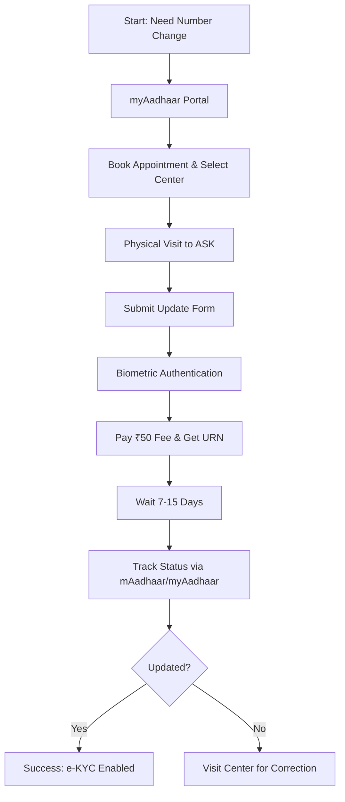

If you have spent the last hour scrolling through the mAadhaar app searching for a "Change Mobile Number" button, you are not alone. It is one of the most common frustrations for millions of Indian citizens. However, the reality is straightforward: **you cannot change your Aadhaar mobile number entirely online or through an app.** 

  
  
 <a href="https://unsplash.com/@fotospk">Fotos</a> on <a href="https://unsplash.com/photos/a-man-and-woman-posing-for-a-picture-DopK5NEqnwM">Unsplash</a>

While this might seem like an unnecessary hurdle in a "Digital India," the restriction is a critical security measure. Your registered mobile number is the primary gateway for **e-KYC, OTP-based authentication, and the distribution of government subsidies (DBT)**. Because your Aadhaar serves as your foundational digital identity, the [Unique Identification Authority of India (UIDAI)](https://uidai.gov.in/) mandates a physical presence for biometric verification to ensure that no unauthorized person can hijack your identity by simply changing a phone number remotely [Financial Express](https://www.financialexpress.com/money/banking-finance/aadhaar-card-mobile-number-update-process-step-by-step-guide/3124567/).

---

### 🚫 The "App Update" Misconception: Why It Is Not Digital

There is a persistent myth that the mAadhaar app or the myAadhaar portal allows for the modification of contact details. To be clear, while the app is an exceptional tool for carrying a digital version of your ID, locking your biometrics, or checking the status of a request, it does not possess the authority to alter your core demographic data.

#### The Security Architecture
The reason for this is **Identity Theft Prevention**. If the process were purely digital, a hacker who gained access to your email or a temporary SIM swap could change your Aadhaar mobile number to their own. Once they control the OTP (One-Time Password) flow, they could potentially:
* Access your linked bank accounts via Aadhaar-enabled Payment Systems (AePS).
* Divert government subsidies to a different account.
* File fraudulent tax returns or apply for loans in your name.

To prevent this, UIDAI requires **biometric authentication**—specifically a fingerprint or iris scan—which can only be performed using specialized hardware at an authorized physical center [Times of India](https://www.timesofindia.indiatimes.com/gadgets-news/how-to-update-aadhaar-card-mobile-number-step-by-step-guide/articleshow/108765432.cms).

> "A mobile number update cannot be done entirely online through a portal or app for security reasons... this is because a mobile number update requires biometric authentication to prevent unauthorized changes to a person's identity record." — [Financial Express](https://www.financialexpress.com/money/banking-finance/aadhaar-card-mobile-number-update-process-step-by-step-guide/3124567/)

---

### 🛠️ The Master Step-by-Step Guide to Updating Your Number

Since you cannot complete this process from your couch, the goal is to make your physical visit as efficient as possible. Following these steps will ensure you don't have to make a second trip.

#### 1. Book an Appointment (The Professional Approach)
Walking into an Aadhaar Seva Kendra (ASK) without an appointment often leads to hours of waiting. The smartest way to handle this is via the [myAadhaar portal](https://myaadhaar.uidai.gov.in/). 
* Navigate to the **"Book an Appointment"** section.
* Select your city and the most convenient Aadhaar Seva Kendra.
* Choose a date and a specific time slot.
* This generates a slot confirmation that usually allows you to skip the general queue.

#### 2. Prepare Your Documentation
Technically, you do not need a mountain of paperwork to change a phone number, as your biometrics serve as the primary proof of identity. However, it is highly recommended to carry:
* Your original Aadhaar card (or a clear printout).
* A valid government-issued photo ID (Passport, Voter ID, or PAN card) as a backup in case of biometric mismatch.

#### 3. Fill out the Aadhaar Update/Correction Form
Upon arrival, you will be provided with the **Aadhaar Update/Correction Form**. 
* **Crucial Tip:** Ensure you clearly check the box for "Mobile Number" update. 
* Write your new 10-digit mobile number in block letters to avoid any data entry errors by the operator.

#### 4. The Biometric Verification Process
This is the most critical step. The operator will use a registered biometric device to scan your fingerprints and/or iris. This creates a mathematical match against the data stored in the UIDAI central vault. If you have worn-out fingerprints (common in elderly citizens or manual laborers), the operator will rely on the iris scan to verify your identity.

#### 5. Payment and the URN Receipt
The official fee for a demographic update is **₹50**. After the process is complete, the operator will provide you with an acknowledgement slip containing an **Update Request Number (URN)**. 
**Do not lose this receipt.** The URN is the only way to track whether your request was accepted or rejected [UIDAI Official](https://www.uidai.gov.in/en/my-aadhaar/update-aadhaar).

---

### 📱 Leveraging the Digital Toolkit: mAadhaar vs. myAadhaar

While these tools cannot *perform* the update, they are indispensable for managing the process and verifying the result.

#### The Workflow Visualization

#### When to use the mAadhaar App:
* **Locating Centers:** Use the "Locate Center" feature to find the nearest authorized enrollment point if you prefer not to book an appointment.
* **Instant Tracking:** Once you have your URN, enter it into the app to see if the update is "Completed" or "Under Process."
* **Digital ID:** Use the app to show your Aadhaar digitally while at the center.

#### When to use the myAadhaar Portal:
* **Appointment Scheduling:** This is the only way to avoid the dreaded queues.
* **Document Verification:** Use the portal to check if your current Aadhaar details are correct before requesting a change.
* **Downloading e-Aadhaar:** Once the update is complete, you can download the updated digital copy immediately.

---

### ⏱️ Costs, Timelines, and the "No-OTP" Paradox

Understanding the logistics prevents you from falling for scams or getting anxious during the waiting period.

| Feature | Detail | Note |
| :--- | :--- | :--- |
| **Official Cost** | **₹50** | Non-refundable service fee. |
| **Processing Time** | **7 to 15 Days** | Can take up to 30 days in rare cases. |
| **Tracking Method** | **URN (Update Request Number)** | Found on your physical receipt. |
| **Verification** | **Biometric Only** | No OTP required for the update itself. |

#### Solving the "No-OTP" Paradox
A common question is: *"How can I update my number if I've lost my old SIM and cannot receive an OTP to log in?"* 
This is exactly why the physical visit is required. The biometric scan (fingerprint/iris) acts as a "Master Key." It overrides the need for an OTP, allowing the UIDAI system to verify your identity through your body rather than your device. This ensures that even if you lose your phone, your digital identity remains recoverable [NDTV](https://www.ndtv.com/tech/how-to-update-mobile-number-in-aadhaar-card-step-by-step-guide-4567890).

---

### ⚠️ Comprehensive Scam Prevention Guide

Because "Aadhaar update" is a high-volume search term, cybercriminals often create "phishing" sites that look identical to the official UIDAI portal.

#### Red Flags to Watch For:
1. **The "Online Update" Promise:** Any website, WhatsApp message, or advertisement claiming they can update your Aadhaar mobile number without a physical visit is a **scam**.
2. **OTP Requests over Phone:** UIDAI officials will **never** call you and ask for an OTP to "verify" or "update" your records. If someone asks for an OTP to update your number, hang up immediately.
3. **Third-Party Payment Links:** Never pay an "update fee" via a random UPI link sent through SMS. Only pay at the center or through the official government payment gateway during appointment booking.
4. **Unauthorized "Agents":** Be wary of agents who claim they have "inside contacts" to fast-track your update for a fee of ₹500 or more. There is no official fast-track service; all requests are processed in the order they are received.

If a service claims they can bypass the biometric requirement, they are likely attempting to steal your Aadhaar number and personal data for fraudulent activities. Stick exclusively to **official UIDAI channels** [NDTV](https://www.ndtv.com/tech/how-to-update-mobile-number-in-aadhaar-card-step-by-step-guide-4567890).

---

### 🔍 Deep Dive: Why the Mobile Number is the Linchpin of Digital India

To understand why this process is so rigorous, one must understand what the registered mobile number actually *does* in the Indian ecosystem. It is not just for receiving SMS alerts; it is the primary authentication factor for several critical services:

#### 1. Income Tax and PAN Linking
The [Income Tax Department](https://www.incometax.gov.in/) uses Aadhaar-based e-KYC for instant PAN verification and filing returns. Without a registered mobile number, you cannot e-verify your ITR, which means your tax returns remain "unverified" and invalid.

#### 2. EPFO and Pension Services
For employees, the [EPFO (Employees' Provident Fund Organisation)](https://www.epfindia.gov.in/) requires a mobile-linked Aadhaar for withdrawing funds or transferring accounts. An outdated number can lock you out of your own retirement savings.

#### 3. Banking and AePS
Aadhaar-enabled Payment Systems (AePS) allow people in rural areas to withdraw cash using only their Aadhaar number and fingerprint. The mobile number provides the secondary layer of security (OTP) for high-value transactions.

#### 4. DigiLocker Integration
[DigiLocker](https://digilocker.gov.in/) relies entirely on the Aadhaar-linked mobile number for authentication. Without it, you cannot access digital versions of your driving license, mark sheets, or insurance policies.

---

### ❓ Frequently Asked Questions (FAQ)

**Q: Can I update my Aadhaar mobile number at a Post Office?**
**A:** Yes. Many Post Offices in India act as Permanent Enrollment Centers. You can visit a designated Post Office, fill out the form, and undergo biometric verification just as you would at an Aadhaar Seva Kendra.

**Q: What happens if my biometric scan fails at the center?**
**A:** Biometric failure (especially fingerprints) is common. In such cases, the operator will perform an **Iris Scan**. If both fail, you may be required to provide additional identity proofs or visit a regional UIDAI office for manual verification.

**Q: I have updated my number, but I'm still not receiving OTPs. Why?**
**A:** It usually takes a few days for the updated number to sync across all government databases (like PAN or EPFO). Wait for **15 days** after the URN shows "Completed" before attempting e-KYC on other platforms.

**Q: Can I change my mobile number if I am an NRI?**
**A:** Yes, but you must visit an Indian Embassy or a designated Aadhaar center abroad (where available) or visit a center in India. The biometric requirement remains mandatory regardless of residency.

**Q: Is the mAadhaar app safe to use?**
**A:** Yes, as long as you download it from the official Google Play Store or Apple App Store. It uses encrypted communication and requires your device's own biometric or PIN lock for access.

---

### 🏁 Final Summary Checklist

To ensure a seamless update, follow this final checklist:
* [ ] **Appointment:** Booked via [myAadhaar portal](https://myaadhaar.uidai.gov.in/).
* [ ] **ID Proof:** Original Aadhaar and a backup photo ID in hand.
* [ ] **Payment:** ₹50 cash or digital payment ready for the operator.
* [ ] **Confirmation:** Received the physical receipt with the **URN**.
* [ ] **Tracking:** Downloaded the **mAadhaar app** to monitor the status.
* [ ] **Verification:** Confirmed the update by attempting a simple e-KYC or downloading a new e-Aadhaar.

Updating your Aadhaar mobile number is not a "one-tap" process, but the inconvenience is a small price to pay for the security of your digital identity. By following the official route and avoiding "online shortcuts," you ensure that your sensitive data remains protected and your access to essential government services remains uninterrupted.

---

## 📖 Related Reading

- [🦀 A Deep Dive into Rust's Next-Gen Trait Solver](/enabling-the-next-generation-trait-solver-on-nightly/)
- [Stop Installing Libraries: The Native Web Gems You Should Be Using 🚀](/small-native-web-tricks-worth-remembering/)
- [X.Org Server 26.1 Rc1 Prepares For First Feature Release In Five Years](/xorg-server-261-rc1-prepares-for-first-feature-release-in-five-years/)
