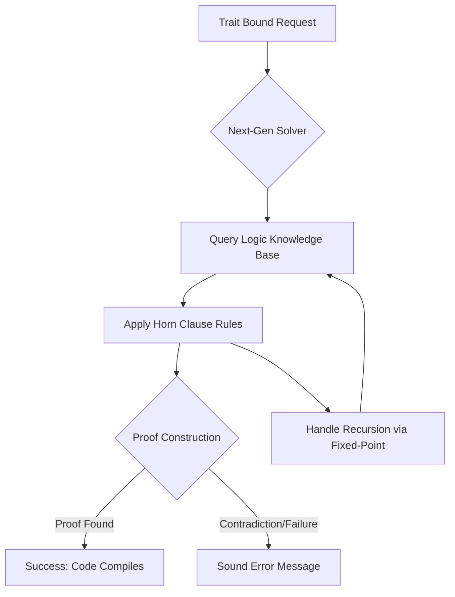

You know how Rust’s trait system is essentially its superpower? It is the engine that enables zero-cost abstractions and the rigorous type safety that defines the language. However, beneath the polished surface of `cargo build`, the mechanism that decides whether a type implements a trait—the trait solver—has historically relied on a collection of complex "heuristics." For years, these heuristics have served us well, but as the language evolves, they are hitting a theoretical and practical wall.

<div class="post-hero">
  
  <div class="post-hero-credit"> <a href="https://unsplash.com/@sasun1990">Sasun Bughdaryan</a> on <a href="https://unsplash.com/photos/white-letter-beads-spell-out-next-on-pink-background-jKIEe89BmlI">Unsplash</a></div>
</div>


That is where the **next-generation trait solver** enters the picture. Based on the [Chalk project](https://github.com/rust-lang/chalk), this architectural rewrite is transitioning Rust away from "best-effort" guessing and toward a formal logic system. If you are tracking the nightly channel, you are witnessing the birth of a more consistent, predictable, and mathematically sound version of the Rust compiler.

---

### 🧱 The Heuristic Wall: Why a Rewrite Was Mandatory

The current trait solver in `rustc` operates as an iterative engine. It attempts to resolve trait bounds by following a set of predefined rules and patterns. While remarkably efficient for the vast majority of code, it is fundamentally built on **heuristics**. In plain English: the compiler often makes "educated guesses" to resolve a trait. 

When the logic becomes too recursive or the trait bounds too tangled, the compiler doesn't have a formal proof to fall back on. Instead, it hits an arbitrary limit. This is why developers frequently encounter the infamous `recursion_limit` error. When you see a message suggesting you increase your `recursion_limit`, you aren't fixing a logic error in your code; you are simply giving a heuristic engine more room to guess before it gives up.

This becomes a critical bottleneck when working with advanced generics. Common pain points include:
*   **Cycle Detection:** The compiler may report a "cycle detected" error even when a valid resolution path exists, simply because the heuristic search entered a loop.
*   **GAT Complexity:** With the introduction of [Generic Associated Types (GATs)](https://doc.rust-lang.org/reference/generic-associated-types.html), the search space for trait resolution has expanded exponentially, making old heuristics unreliable.
*   **False Negatives:** The compiler may claim a trait is not implemented, despite the implementation being clearly visible to the human programmer.

> "The current trait solver is a complex beast of heuristics. The goal of the next-gen solver is to replace this with a system based on formal logic, ensuring that if a trait is implementable, the compiler will find that proof."

As Rust aims for **100% soundness** in its type system, "usually works" is no longer an acceptable standard. We need a solver that can provably determine the existence of an implementation.

---

### 🧠 The Logic Engine: Enter Chalk

The next-gen solver isn't a mere patch; it is a total paradigm shift. It is heavily inspired by **Chalk**, a project designed to treat Rust's trait system as a set of logical implications. Instead of following a procedural recipe, the new solver treats trait resolution as a problem for a **logic programming language**, akin to Prolog.

#### From Procedures to Horn Clauses
In the old system, the compiler asked: *"Do I have a rule that tells me how to find this trait?"* 
In the new system, the compiler asks: *"Can I construct a formal proof that this trait bound is satisfied?"*

This is achieved using **Horn clauses**—a restricted form of first-order logic. In this framework, a trait implementation is viewed as a logical rule. For example, the standard library implementation of `Clone` for tuples is no longer just a piece of code the compiler executes; it is a logical implication:
**IF** `T: Clone` **AND** `U: Clone`, **THEN** `(T, U): Clone`.

By treating the trait system as a database of logical facts and rules, the solver can use sophisticated techniques like **memoization** and **fixed-point iteration** to resolve bounds. This removes the "magic" and inconsistency. The solver doesn't "guess" its way through a recursive bound; it builds a proof tree. If the tree is complete, the code compiles. If the solver can prove that no such proof can possibly exist, it throws a sound error.



---

### 🛠️ Activating the Future: Enabling on Nightly

Because this rewrite modifies the fundamental reasoning engine of the compiler, it remains an experimental feature. It is currently available exclusively on the **Rust Nightly** channel. Enabling it allows library authors to verify if their complex generic architectures are sound and if they can eliminate reliance on `recursion_limit` hacks.

#### Installation and Setup
First, ensure you have the nightly toolchain installed via `rustup`:

```bash
rustup toolchain install nightly
```

To activate the next-gen solver, you must pass a specific unstable flag to the compiler. While you can use `rustc` directly, most developers will use `cargo` by setting the `RUSTFLAGS` environment variable:

```bash
RUSTFLAGS="-Z trait-solver=next" cargo build
```

**⚠️ Critical Warning:** This is bleeding-edge software. You are likely to encounter **Internal Compiler Errors (ICEs)**. An ICE is essentially a compiler crash where `rustc` admits it has encountered a state it doesn't know how to handle. If you trigger one, the Rust team encourages you to report it on the [Rust GitHub Issues](https://github.com/rust-lang/rust/issues) page. Providing the minimal reproducible example (MRE) is the fastest way to help stabilize the solver for everyone.

---

### 🎯 Soundness and Sanity: The Developer Impact

The primary goal of this transition is **soundness**. In a type system as complex as Rust's, there are rare "soundness holes"—edge cases where the current heuristic solver might accidentally allow code to compile that actually violates Rust's safety guarantees. The next-gen solver is **sound by construction**, meaning it adheres to strict mathematical rules that prevent these loopholes from existing.

#### Improving the Developer Experience (DX)
Beyond safety, the move to a proof-based system fundamentally changes error reporting. In the current solver, a "trait not implemented" error is often the end of the road. The compiler knows it failed, but it doesn't always know *why* the search failed.

Since the new solver operates via proof trees, it can pinpoint exactly where the proof broke down. Instead of a vague error, the next-gen solver can potentially provide a trace:
*"I attempted to prove `T: Clone`, which required `U: Clone`, but I found that `U` is defined as `NonZeroU32`, which explicitly does not implement `Clone`."*

#### Enabling Future Language Features
Many proposed enhancements to the Rust language have been sidelined because the current solver simply couldn't handle the added complexity. A logic-based engine opens the door for:
*   **More powerful Const Generics:** Handling complex expressions in trait bounds.
*   **Advanced GAT Patterns:** Allowing for more flexible asynchronous traits.
*   **Improved Specialization:** Providing a more robust way to specialize implementations without breaking soundness.

---

### 📉 The Performance Tax: Speed vs. Correctness

In software engineering, there is rarely a free lunch. The transition from heuristics to formal logic comes with a cost: **compilation speed**.

The old solver is fast precisely because it takes shortcuts. It doesn't try to prove everything; it tries to find a "good enough" path. The next-gen solver, by contrast, performs the heavy lifting of constructing and verifying formal proofs. This is computationally more expensive.

**The current performance landscape:**
*   **Small to Medium Projects:** The difference is negligible. Most developers will not notice any change in build times.
*   **Generic-Heavy Crates:** For foundational libraries like `serde`, `diesel`, or `tokio`, which utilize massive amounts of generic boilerplate and deeply nested trait bounds, compile times can increase. 

To mitigate this, the Rust team is implementing **aggressive memoization**. By caching the results of previous proofs, the compiler avoids re-proving the same trait bounds multiple times across different modules. The goal is to reach a state where the solver is **as fast as the heuristic engine but as correct as a mathematical proof**.

---

### 🚀 Conclusion: The Road to Stable

Replacing the trait solver is akin to replacing the engine of a jet while it is mid-flight. It is one of the most ambitious "under-the-hood" projects in Rust's history. By moving from the "best-guess" approach of heuristics to the formal logic of Chalk, Rust is ensuring that its type system remains a bedrock of reliability as the language scales.

While it remains hidden behind a `-Z` flag on nightly, the trajectory is clear. When the next-gen solver eventually hits the stable channel, it will mark the beginning of an era of unprecedented **predictability and soundness**. For library authors and power users, the invitation is open: enable it today, break things, and help the Rust team build a more robust future for the ecosystem.

### 📚 References & Further Reading

*   **The Chalk Project:** [Official GitHub Repository](https://github.com/rust-lang/chalk)
*   **Rust Reference:** [Traits and Implementations](https://doc.rust-lang.org/reference/traits.html)
*   **Rust Internals Forum:** [Discussion on Trait Solver Evolution](https://internals.rust-lang.org/)
*   **The Rust Blog:** [Updates on Compiler Performance and Soundness](https://blog.rust-lang.org/)
*   **RFCs:** [Search for Trait System Proposals](https://github.com/rust-lang/rfcs)

---

## 📖 Related Reading

- [Stop Installing Libraries: The Native Web Gems You Should Be Using 🚀](/small-native-web-tricks-worth-remembering/)
- [X.Org Server 26.1 Rc1 Prepares For First Feature Release In Five Years](/xorg-server-261-rc1-prepares-for-first-feature-release-in-five-years/)
- [⚖️ Justice Mantha Recuses from Sujit Bose Bail Case: A Deep Dive into Judicial Integrity and the SSC Scam](/high-court-judge-recuses-from-tmcs-sujit-bose-bail-plea-over-record-access-bid/)
