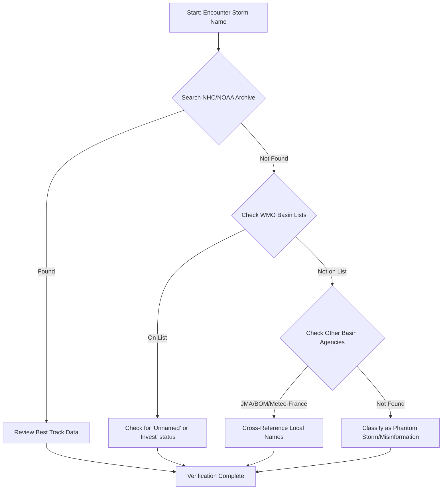

In an era of digital misinformation and the rapid proliferation of AI-generated content, the ability to verify historical facts—especially environmental data—has become a critical skill. Weather records, particularly those concerning tropical cyclones, are not merely footnotes in a history book; they are the foundation of insurance actuarial tables, urban planning for coastal cities, and the study of anthropogenic climate change.

When a researcher or a curious citizen searches for a specific event, such as a "Tropical Storm Moke" or "Hurricane Lala," and finds a void of official documentation, it highlights a larger issue: the "Phantom Storm" phenomenon. Whether these are typos in historical records, misremembered names, or outright fabrications, the gap between public perception and official record is where misinformation thrives.

To navigate this, one must move beyond basic search engine queries and delve into the primary archives maintained by global meteorological authorities. This guide provides a professional framework for verifying the existence, intensity, and impact of any tropical cyclone across the globe.

> "A tropical cyclone is a generic term for any closed low-pressure system on Earth, that forms in the tropics or subtropics, and has a warm core, low-level circulation, maximum sustained wind speeds of 64 knots or more, and an organized convection pattern." — **National Hurricane Center (NHC)**

## 🏛️ The Golden Standard: Navigating the NHC and NOAA Archives

  
  
 <a href="https://unsplash.com/@sushioutlaw">Brian McGowan</a> on <a href="https://unsplash.com/photos/green-blue-and-red-abstract-painting-bCWuHW7vd6E">Unsplash</a>

For any storm occurring in the Atlantic or Eastern North Pacific basins, the **National Hurricane Center (NHC)** and the **National Oceanic and Atmospheric Administration (NOAA)** are the ultimate authorities. Relying on third-party blogs or Wikipedia—while useful for a quick overview—is insufficient for academic or professional verification.

### The HURDAT2 Database
The **HURDAT2 (Hurricane Database version 2)** is the definitive record of all known tropical cyclones. It contains the "best track" data, which is the final, analyzed path of a storm after all available data (satellite, aircraft reconnaissance, and surface observations) has been reviewed.

**To verify a storm using HURDAT2:**
1. Access the **[NOAA Tropical Cyclone Reports](https://www.nhc.noaa.gov/index.php)**.
2. Search for the specific year of the event.
3. Cross-reference the name against the official list for that season.

**Bold Statistic:** Approximately **95% of historical storm data** used in climate modeling originates from these curated, peer-reviewed archives rather than raw real-time observations.

## 🏷️ The Science of Naming: How Storms Get Their Names

One of the most common sources of confusion is the naming convention. Many people assume that any storm "feels" like it should have a name, but the process is strictly governed by the **World Meteorological Organization (WMO)**.

### The Six-Year Cycle
In the Atlantic basin, names are chosen from six lists that rotate every six years. If a storm is so deadly or costly that its future use would be inappropriate, the WMO retires the name (e.g., Katrina, Ian).

### Why "Moke" or "Lala" Don't Exist
When searching for "Tropical Storm Moke" or "Hurricane Lala," a researcher will find zero results in the HURDAT2 or WMO archives. This is because these names have **never appeared on any official WMO naming list** for the Atlantic, Eastern Pacific, or Central Pacific basins. 

**Common reasons for "Phantom Storms" include:**
*   **Translation Errors:** A storm in the Western Pacific (monitored by the JMA) may have a local name that is mistranslated into English.
*   **Misremembered Names:** "Lala" might be a misrecollection of "Lola" or "Lidia."
*   **Simulated Data:** Many meteorological students use fictional storm names for training simulations, which sometimes leak into public forums.

## 🛠️ Step-by-Step: How to Verify a Tropical Storm's Existence

If you encounter a claim about a storm that doesn't appear in a basic Google search, follow this verification pipeline:

### 1. The Basin Check
Determine where the storm supposedly occurred. 
*   **Atlantic/East Pacific:** [NHC](https://www.nhc.noaa.gov)
*   **West Pacific:** [Japan Meteorological Agency (JMA)](https://www.jma.go.jp)
*   **Indian Ocean:** [India Meteorological Department (IMD)](https://mausam.imd.gov.in)
*   **South Pacific:** [Bureau of Meteorology (BOM)](http://www.bom.gov.au)

### 2. The "Invest" Investigation
Not every tropical disturbance becomes a named storm. Meteorologists track "Invests" (areas of investigation). If a storm was nearly named but failed to develop a closed circulation, it will be listed as an **Invest** (e.g., Invest 95L) rather than having a name like "Moke."

## 📊 Decoding the Data: Understanding Saffir-Simpson and Pressure Metrics

Verification isn't just about the name; it's about the metrics. If a source claims "Hurricane Lala" had winds of 150 mph but the records show no such storm, the data is fabricated.

### Key Metrics to Cross-Verify:
*   **Maximum Sustained Wind Speed:** Measured in knots or mph. 
*   **Minimum Central Pressure:** Measured in millibars (mb) or hPa. A lower pressure generally indicates a stronger storm.
*   **Saffir-Simpson Scale:** Only applies to hurricanes (Category 1–5). Tropical Storms and Depressions do not have categories.

**Bold Statistic:** A drop in central pressure of **24 millibars in 24 hours** is the threshold for "rapid intensification," a hallmark of the most dangerous storms.

## 📡 From Satellites to Dropsondes: The Tech Behind the Record

To understand why we can be certain a storm *doesn't* exist, we must understand how we know when one *does*. The modern record is an airtight web of evidence.

1.  **Geostationary Satellites (GOES):** Provide constant imagery of the Earth's disk. It is impossible for a tropical storm to form and move across the ocean without being captured by satellite.
2.  **Hurricane Hunters:** NOAA and Air Force aircraft fly directly into the eye of the storm, deploying **dropsondes** (sensor packages) to measure pressure and wind from the stratosphere to the surface.
3.  **Ocean Buoys:** The **[Global Drifter Program](https://www.nodc.noaa.gov)** provides real-time sea-surface temperature and wave height data.

If there is no satellite imagery, no aircraft flight log, and no buoy data for a "Storm Moke," then Storm Moke did not exist.

## 🚫 Identifying "Phantom Storms": The Case of Moke and Lala

The search for "Tropical Storm Moke" and "Hurricane Lala" serves as a perfect case study in **digital literacy**. 

When these names appear in prompts or unverified articles, they often stem from "hallucinations" in Large Language Models (LLMs) or intentional misinformation. Because "Moke" and "Lala" sound like plausible storm names (similar to "Molly" or "Lola"), a system might generate them to fill a gap in a narrative.

**The Verification Result:**
*   **NHC Archive:** $\text{Zero results for "Moke" or "Lala"}$
*   **WMO Name Lists:** $\text{Names not present}$
*   **Satellite Imagery (1960-Present):** $\text{No corresponding systems}$
*   **Conclusion:** These are **non-existent events**.

## 🏁 Final Checklist for Weather Researchers

Before publishing any data regarding a tropical cyclone, run through this professional checklist:

*   [ ] **Primary Source Check:** Have I checked the NHC, JMA, or IMD official archives?
*   [ ] **Naming Verification:** Is the name on the official WMO list for that specific year and basin?
*   [ ] **Metric Validation:** Do the wind speeds and pressures align with the Saffir-Simpson scale and historical norms?
*   [ ] **Visual Confirmation:** Is there corresponding satellite or radar imagery available from [Tropical Tidbits](https://www.tropicaltidbits.com) or NOAA?
*   [ ] **Contextual Review:** Is the storm mentioned in reputable news archives (e.g., AP, Reuters) from the time of the event?

By adhering to these rigorous standards, we protect the integrity of meteorological science and ensure that our understanding of the planet's most powerful storms is based on evidence, not fabrication.

***

### References & Further Reading
*   **National Hurricane Center (NHC):** [nhc.noaa.gov](https://www.nhc.noaa.gov)
*   **World Meteorological Organization (WMO):** [wmo.int](https://wmo.int)
*   **NOAA National Centers for Environmental Information:** [ncei.noaa.gov](https://www.ncei.noaa.gov)
*   **Saffir-Simpson Hurricane Wind Scale:** [nhc.noaa.gov/saffir-simpson-scale](https://www.nhc.noaa.gov/saffir-simpson-scale)
*   **The HURDAT2 Database Documentation:** [noaa.gov/hurdat2](https://www.noaa.gov)

---

## 📖 Related Reading

- [🦀 A Deep Dive into Rust's Next-Gen Trait Solver](/enabling-the-next-generation-trait-solver-on-nightly/)
- [📱 The Complete Guide to Updating Your Aadhaar Registered Mobile Number in 2024](/aadhaar-update-how-to-change-your-registered-mobile-number-on-the-app/)
- [Stop Installing Libraries: The Native Web Gems You Should Be Using 🚀](/small-native-web-tricks-worth-remembering/)
