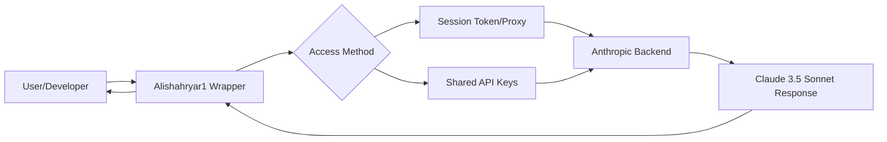

When an AI tool drops that can actually "think" inside your terminal, edit your files, and handle git commits, it’s a seismic shift for developers. Anthropic's [Claude Code](https://www.anthropic.com/news/claude-code) is exactly that—a high-agency assistant that lives right where you code. The problem? For many, the barrier to entry is a paid API key and token-based billing, which can scale in cost rapidly. 

That’s why [Alishahryar1/free-claude-code](https://github.com/Alishahryar1/free-claude-code) is blowing up on GitHub. It is a project claiming to offer a "free" path to the tool, becoming a symbol of the ongoing tug-of-war between big AI labs and the open-source community.

### 🚀 The Power of the Terminal Agent

To understand why a repo like `free-claude-code` gains traction, you have to understand the tool's utility. [Claude Code](https://docs.anthropic.com/en/docs/agents-and-tools/claude-code) isn't just another chatbot window; it’s a command-line interface (CLI) agent powered by **Claude 3.5 Sonnet**. Instead of the tedious cycle of copying and pasting code, Claude Code can execute shell commands, read local files, and resolve bugs in real-time.

For a professional developer, this is a massive productivity boost. You can essentially command: *"Find the bug in my authentication middleware and write a test to prove it's fixed,"* and the AI will perform the search, write the fix, and execute the test autonomously. 

However, this "agency" comes at a cost. Because the tool runs in agentic loops—reading files, attempting a fix, and verifying the result—it can consume tokens at an accelerated rate. This **"token burn"** makes the official tool a premium experience, which is precisely why developers are hunting for workarounds.

### 🛠️ Deconstructing the "Free" Promise

The [Alishahryar1/free-claude-code](https://github.com/Alishahryar1/free-claude-code) repository attempts to act as a bridge. In the AI ecosystem, "free" rarely means the model is open-source; usually, it means the access method has been rerouted. While these projects evolve to evade detection, they typically rely on one of three mechanisms:

1.  **Reverse Proxies**: Routing requests through a server that utilizes shared or "leaked" API keys.
2.  **Session Simulation**: Mimicking a browser session to exploit the [Claude.ai free tier](https://claude.ai), which is often more generous than the direct API.
3.  **API Wrappers**: Implementing a layer that rotates through multiple free-tier accounts to sustain access.

By removing the requirement for a credit card linked to Anthropic, Alishahryar1 has targeted a massive demographic: students, indie hackers, and curious coders who want to experiment with agentic AI without risking a surprise **$50 to $100 API bill** at the end of the month.

### ⭐ The Sociology of the "Stargazer"

On GitHub, a "Star" is more than a bookmark; it is social currency. When examining the [stargazers of a project](https://github.com/Alishahryar1/free-claude-code), you are seeing a heatmap of developer demand. The surge in stars for `free-claude-code` highlights a dominant trend in the AI era: **the hunger to democratize high-agency tools.**

> "The gap between those who can afford high-end AI agency and those who cannot is becoming a new digital divide. Tools that bridge this gap, even unofficially, become instant viral hits."

This cycle is predictable. First, a powerful tool is released. Next, the community identifies a cost barrier. Finally, a "bypass" or "free" version appears. For a developer, a high star count acts as a signal of viability—a belief that "this actually works"—which lowers the perceived risk of downloading an unofficial script. This creates a viral loop: visibility leads to stars, and stars lead to further visibility.

### ⚠️ The Hidden Cost of "Free"

Despite the allure, free access often carries invisible risks. In cybersecurity, the golden rule is simple: *If you aren't paying for the product, you are the product—or the target.*

Using an unofficial wrapper for a tool as powerful as Claude Code is inherently risky. Because the tool requires access to your local files and terminal to function, any wrapper sitting between you and the API could potentially act as a "Man-in-the-Middle" (MitM). A malicious actor could modify a wrapper to:

*   **Exfiltrate Secrets**: Scrape your `.env` files containing private [AWS or OpenAI keys](https://github.com/docs/security).
*   **Inject Malicious Code**: Modify the AI's output to include subtle vulnerabilities or backdoors in the code it writes for you.
*   **Spy on IP**: Log every line of proprietary source code sent to the AI.

Furthermore, Anthropic employs sophisticated detection for API abuse. Relying on these bypasses puts your account at risk of being flagged or permanently banned from the official platform.

### ⚖️ The Cat-and-Mouse Game of AI Access

The existence of `Alishahryar1/free-claude-code` is a symptom of the larger struggle in the AI industry. On one side, companies like Anthropic and OpenAI operate compute clusters costing **billions of dollars**, necessitating strict subscription and token models. On the other, the global developer community maintains a long tradition of breaking down walls to ensure software remains accessible.

This conflict mirrors the software "cracks" of the 1990s and the LLM "jailbreaks" of today. It underscores a fundamental tension: AI is rapidly becoming an essential utility for productivity, yet the most potent versions remain locked behind corporate paywalls.

As Anthropic refines [Claude Code](https://www.anthropic.com/news/claude-code), they will likely implement stricter authentication and hardware fingerprinting. In response, the community will find new loopholes. It is a cycle of innovation driven by the universal desire for access.

### 🏁 Conclusion: The Future of Agency

The rise of the [Alishahryar1/free-claude-code](https://github.com/Alishahryar1/free-claude-code) repository provides a fascinating glimpse into the economics of AI. It proves that the demand for agentic AI—tools that don't just chat, but actually *act*—is immense. 

While the official route remains the only way to ensure security and stability, the "stargazers" prove there is a massive, underserved audience eager to push the boundaries. Whether these unofficial tools eventually force companies to introduce cheaper tiers or simply get shut down, one thing is certain: the community will always find a way to access the best tools available.

---

## 📖 Related Reading

- [🌀 The Quest for Accuracy: Why Weather Verification Matters](/tropical-storm-moke-threatens-hawaii-as-big-island-reels-from-hurricane-lala/)
- [🦀 A Deep Dive into Rust's Next-Gen Trait Solver](/enabling-the-next-generation-trait-solver-on-nightly/)
- [📱 The Complete Guide to Updating Your Aadhaar Registered Mobile Number in 2024](/aadhaar-update-how-to-change-your-registered-mobile-number-on-the-app/)
