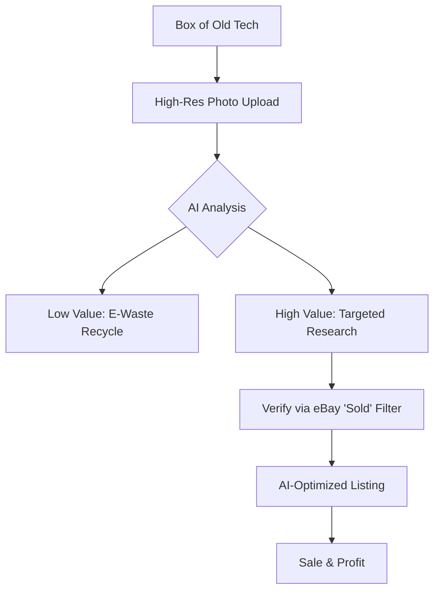

We all have that one spot—the "junk drawer" in the kitchen, the mysterious "cable box" in the closet, or that cardboard bin in the attic filled with old VGA cables, an iPod Nano from 2006, random proprietary chargers, and perhaps a digital camera that hasn't seen a battery in a decade. Historically, these items were too much of a hassle to research. The friction of identifying a model number, searching through defunct manufacturer websites, and comparing prices on eBay usually meant these gadgets stayed buried until the next house move.

  
  
 <a href="https://unsplash.com/@joszczepanska">Jo Szczepanska</a> on <a href="https://unsplash.com/photos/person-holding-red-box-Cp-b69OOyN4">Unsplash</a>

However, the barrier to selling old tech has effectively vanished. A [TechRadar research writer](https://www.techradar.com/computing/artificial-intelligence/got-a-box-of-old-tech-gathering-dust-i-gave-chatgpt-a-photo-of-mine-and-ended-up-130-richer) recently demonstrated this by taking a single photo of their tech hoard and feeding it into ChatGPT. By leveraging the AI's visual recognition capabilities, they identified high-value items they had previously ignored and walked away **$130 richer** in a matter of minutes.

---

### 👁️ How the AI "Sees" Your Stuff

Identifying old hardware used to be a tedious process of trial and error: you'd use Google Lens, hunt for a faded model number, and scroll through endless legacy forums. This has been revolutionized by **Multimodal AI**, specifically models like [GPT-4o](https://openai.com/index/hello-gpt-4o/) and Google's Gemini. 

Unlike traditional image recognition software that simply labels an object (e.g., "this is a camera"), multimodal models bridge the gap between visual perception and vast textual knowledge. According to research on [multimodal learning](https://arxiv.org/abs/2311.05694), these systems utilize "Vision Transformers" (ViT) to analyze an image not as a single entity, but as a series of patches that it can cross-reference with its training data.

When you upload a photo of a dusty piece of gear, the AI isn't just "looking" at the object; it is reasoning. It analyzes:
*   **Branding and Logos**: Identifying the manufacturer and era.
*   **Port Configuration**: Recognizing that a specific combination of FireWire and proprietary pins indicates a specific generation of hardware.
*   **Industrial Design**: Matching the chassis shape to specific product lines.

This enables "zero-shot" identification. You don't need to tell the AI you're looking at a 2004 Sony Handycam; the AI recognizes the silhouette and tells *you* exactly which model it is. For the average user, the AI acts as an instant, expert appraiser, removing the cognitive load of manual research.

---

### 🛠️ The "AI-to-Cash" Workflow: A Step-by-Step Guide

Turning a box of cables into actual currency isn't just about snapping one photo; it’s about orchestrating a strategic conversation with the AI. To maximize your profit and minimize errors, follow this optimized workflow:

**1. The Wide-Angle Inventory**
Start with a clear, well-lit "bird's eye view" photo of your entire collection. Spread the items out so they aren't overlapping.
> **Prompt:** *"I have a box of old electronics. Can you identify every distinct item in this photo and flag which ones are likely to be collectible or have significant resale value in the current market?"*

**2. The Precision Deep-Dive**
Once the AI flags a promising item—such as a vintage audio interface or a limited-edition gaming handheld—do not rely on the wide shot. Take a macro photo of the **serial number, the model sticker, or the FCC ID**. This is the most critical step; in the world of collectibles, a single letter difference (e.g., a "Revision A" vs. a "Revision B") can shift the value from **$20 to $200**.

**3. The Market Intelligence Phase**
AI is great at identification, but its internal pricing data can be outdated. Use the AI to generate the search parameters you need for real-time validation.
> **Prompt:** *"Based on this specific model number, what are the exact keywords I should use on eBay to find 'Sold' listings? Please provide a list of keywords that will filter out generic replacements and target the original hardware."*

**4. The Conversion (Listing)**
Writing a listing is where most sellers lose money by being too brief or too vague. Let the AI handle the copywriting.
> **Prompt:** *"I am selling this [Insert Model]. Using the specs you've identified and the photo of its current condition, write a professional, honest eBay listing. Highlight the technical specifications that collectors care about and include a clear 'Condition' section."*

---

### 🛒 Where Should You Actually Sell It?

Choosing the wrong platform can cost you **10-30% in fees** or result in your item sitting unsold for months. The "best" marketplace depends entirely on the nature of the gear.

| Item Type | Recommended Platform | Why? |
| :--- | :--- | :--- |
| **General Electronics** | [eBay](https://www.ebay.com) | Massive global reach and the best "Sold" data. |
| **Modern Gadgets** | [Back Market](https://www.backmarket.com) or [Swappa](https://swappa.com) | Faster turnover for iPhones, iPads, and laptops. |
| **Audio/Music Gear** | [Reverb](https://reverb.com) | Specialized buyers who understand vintage synth/amp value. |
| **Retro Gaming** | Specialized Forums / r/GameSale | Avoids high marketplace fees and reaches enthusiasts. |
| **Bulk/Low Value** | Local Marketplaces (Facebook/Craigslist) | Eliminates shipping costs for heavy, low-value items. |

**Pro Tip:** Never price your item based on "Active" listings. Active listings represent what sellers *hope* to get; "Sold" listings represent what buyers are *actually* paying. Always filter by **"Sold Items"** in the eBay sidebar to find the true market equilibrium.

---

### ⚠️ The "Hallucination" Trap: Proceed with Caution

Despite the power of multimodal AI, you must remain the final arbiter of truth. AI models operate on probabilistic patterns, not database lookups. This leads to **hallucinations**, where the AI confidently asserts a falsehood.

In tech collecting, the stakes are high. An AI might mistake a common 1990s workstation for a rare "Developer Edition," or conversely, tell you a rare prototype is just a generic piece of plastic. Users on [Hacker News](https://news.ycombinator.com) frequently warn that AI can be "over-confident" when it lacks specific visual data.

To protect your profit, employ the **Rule of Three**:
1.  **AI Identification**: Use GPT-4o to get the baseline model name.
2.  **Visual Verification**: Cross-reference the AI's claim with [Google Images](https://images.google.com) to ensure the port layout and chassis markings match perfectly.
3.  **Market Validation**: Find at least three distinct "Sold" listings from the last 90 days to confirm the price point.

If an AI claims your old router is a "rare collector's item" worth **$500**, treat that as a hypothesis to be tested, not a financial fact.

---

### ♻️ Why This Matters: The Circular Economy

Beyond the personal payday, the ability to instantly value old tech is a massive win for the **circular economy**. According to the [Global E-waste Monitor](https://ewastemonitor.info/), the world generated a staggering **62 million metric tons** of e-waste in 2022 alone, and only about **22.3%** of it was documented as properly collected and recycled.

Much of this waste happens because of "perceived obsolescence" and the "friction of effort." People throw away valuable components—gold, palladium, and rare earth metals—simply because they don't know what the item is or if it's worth the effort to sell.

By lowering the barrier to identification, AI is essentially helping us "mine" our own homes. When we realize that a dusty box contains a high-value legacy adapter or a collectible console, those items stay in the ecosystem rather than ending up in a landfill. This shift aligns with the goals of the [Ellen MacArthur Foundation](https://www.ellenmacarthurfoundation.org), which advocates for a system where products are kept in use at their highest value for as long as possible.

### ❓ Frequently Asked Questions

**Q: Can AI tell if the internal components are still working?**
**A:** No. AI can only analyze the external physical state. You must still perform a "power-on test" to verify functionality. An item that "Powers On" typically sells for **30-50% more** than one listed as "For Parts/Not Working."

**Q: Which AI is best for this?**
**A:** GPT-4o and Gemini 1.5 Pro are currently the leaders in multimodal reasoning. GPT-4o tends to be better at listing generation, while Gemini often handles larger batches of images more efficiently.

**Q: Is it safe to upload photos of my electronics to AI?**
**A:** Generally, yes. However, ensure you are not photographing sensitive information, such as passwords written on sticky notes attached to the device or private documents in the background.

### Final Thought

The tech in your junk drawer isn't just a collection of obsolete plastic and silicon; it is a repository of hidden value. With the advent of AI vision, the "treasure hunt" has moved from the attic to the smartphone screen. It's time to stop letting your old gear gather dust and start letting it gather interest.

---

## 📖 Related Reading

- [Alishahryar1/Free-Claude-Code/Stargazers](/alishahryar1free-claude-codestargazers/)
- [🌀 The Quest for Accuracy: Why Weather Verification Matters](/tropical-storm-moke-threatens-hawaii-as-big-island-reels-from-hurricane-lala/)
- [🦀 A Deep Dive into Rust's Next-Gen Trait Solver](/enabling-the-next-generation-trait-solver-on-nightly/)
