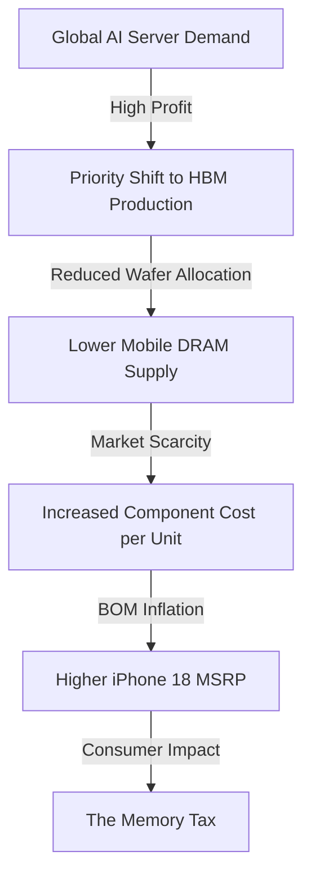

It turns out that having a super-smart, seamless AI in your pocket comes with a hidden cost. According to recent industry reports and supply chain leaks tracked by [GSMArena](https://www.gsmarena.com), the upcoming iPhone 18 series is staring down a likely price increase. While Apple typically maintains stable base pricing unless a generational redesign occurs, the confluence of **on-device Generative AI** and a volatile semiconductor market is forcing their hand.

  
  
 <a href="https://unsplash.com/@onurbinay">Onur Binay</a> on <a href="https://unsplash.com/photos/three-smartphones-on-a-desk-OKjJZNTl004">Unsplash</a>

For the average consumer, this means the "AI upgrade" isn't just a software feature delivered via an iOS update—it is a hardware requirement that will manifest as a higher number on the final receipt. This phenomenon is what analysts are calling the "Memory Tax."

---

### ⚡ The "AI Tax" and the RAM Bottleneck

The primary driver of this price jump is the sheer volume of memory required to run Large Language Models (LLMs) locally on a mobile device. To make "Apple Intelligence" feel instantaneous and maintain user privacy, the device must perform inference on-device rather than relying solely on the cloud. This requires a massive amount of available Random Access Memory (RAM) to keep the AI models resident and ready for immediate execution.

We already witnessed the first wave of this shift with the iPhone 15 Pro, which jumped to **8GB of RAM** specifically to support the baseline requirements of Apple Intelligence. However, as models grow more complex—incorporating better reasoning, multi-modal capabilities (voice, vision, and text), and longer context windows—**8GB is no longer the ceiling; it is the new floor**. 

Industry analysts suggest the iPhone 18 series may need to push toward **12GB or even 16GB of RAM** to handle advanced on-device reasoning. 

> "The transition from cloud-reliant AI to local, on-device execution shifts the burden from the server to the silicon. In the smartphone world, the most expensive part of that shift isn't the processor—it's the memory."

Beyond simple capacity, Apple is moving toward faster, more power-efficient standards like **LPDDR5X**. While this ensures the NPU (Neural Processing Unit) isn't starved for data, these chips carry a significant premium over older LPDDR5 standards.

---

### 📉 The Great Memory Shift: HBM vs. Mobile DRAM

To understand why a few extra gigabytes of RAM lead to a price hike, we have to look at the global semiconductor fabrication landscape. The world's dominant memory manufacturers—[Samsung](https://www.samsung.com), [Micron](https://www.micron.com), and [SK Hynix](https://www.skhynix.com)—are currently embroiled in an "AI gold rush."

The industry is shifting production capacity toward **High Bandwidth Memory (HBM3e)**. HBM is a specialized, vertically stacked RAM used in massive AI GPUs, such as [NVIDIA's](https://www.nvidia.com) H100 and B200 clusters. Because HBM is exponentially more profitable per wafer than standard mobile DRAM, manufacturers are prioritizing these high-margin chips over the LPDDR5X used in iPhones.

**The economic ripple effect is clear:**
1. **Capacity Diversion:** More silicon wafers are dedicated to HBM.
2. **Supply Crunch:** The available supply of mobile-grade DRAM shrinks.
3. **Price Inflation:** Lower supply + steady demand = higher component costs for OEMs.

Apple cannot simply "negotiate away" these costs because they are facing the same market pressures as [Samsung Mobile](https://www.samsung.com/global/galaxy/) and Google. When the raw cost of the bill of materials (BOM) rises across the board, the retail price inevitably follows.

---

### ⚙️ The Cost Logic Flow

The price increase isn't a random decision; it's a systemic result of the current tech transition. The following diagram illustrates how a demand for AI servers in a data center in Virginia eventually leads to a more expensive iPhone in your hand.

---

### 🔬 Deep Dive: Why Local AI Needs More RAM

To appreciate why **12GB+ of RAM** is non-negotiable for the iPhone 18, we need to understand how LLMs actually work on a device. When you ask Siri to summarize a long email, the model doesn't just "run"; it must be loaded into the RAM.

**1. Model Weights and Quantization**
AI models consist of billions of parameters (weights). To fit these on a phone, Apple uses "quantization"—a process that shrinks the precision of these weights (e.g., from 16-bit to 4-bit). Even a heavily quantized 7-billion parameter model requires roughly **3.5GB to 5GB of RAM** just to exist in memory.

**2. The KV Cache (Key-Value Cache)**
As the AI generates a response, it stores the "context" of the conversation in a KV cache. The longer the conversation or the larger the document being analyzed, the more RAM is consumed. If the phone runs out of RAM, the system must "swap" data to the slower NAND storage, leading to the dreaded AI "lag."

**3. OS Overhead**
The RAM isn't just for AI. iOS itself, background apps, and the camera system all require memory. If a model takes **6GB** and iOS takes **3GB**, an **8GB device** is already crashing. To ensure a "seamless" experience, Apple must over-provision the RAM, pushing the hardware requirements higher.

---

### 💰 What This Means for Your Wallet

Apple has a masterclass history of using tiered pricing to mask cost increases. However, the memory crunch is a "horizontal" problem—it affects the base model as much as the Pro Max.

According to trends tracked by [MacRumors](https://www.macrumors.com) and [9to5Mac](https://9to5mac.com), we can expect a few different pricing strategies:

*   **The Flat Hike:** A baseline increase of **$50 to $100** across all models to cover the LPDDR5X cost increase.
*   **The Storage Squeeze:** Raising the price of the lowest storage tier (e.g., 128GB/256GB) to nudge users toward higher-margin 512GB models.
*   **The "AI Edition" Tier:** Introducing a new "Pro AI" tier with significantly more RAM, creating a wider gap between the standard and professional models.

**Predicted Price Shifts:**
| Model | Current Est. Price | iPhone 18 Predicted Price | Delta |
| :--- | :--- | :--- | :--- |
| iPhone 18 | $799 | **$849 - $899** | +$50 - $100 |
| iPhone 18 Pro | $999 | **$1,049 - $1,099** | +$50 - $100 |
| iPhone 18 Pro Max | $1,199 | **$1,249 - $1,299** | +$50 - $100 |

---

### 🌐 Industry Context: The Arms Race

Apple isn't fighting this battle alone. The entire smartphone industry is currently grappling with the "Memory Tax." 

*   **Google Pixel:** With the Gemini Nano model, Google has already pushed RAM requirements higher in the Pixel 8 and 9 series to ensure on-device fluidity.
*   **Samsung Galaxy:** The Galaxy AI suite relies heavily on a mix of cloud and local processing. Samsung, benefiting from owning its own chip factories, has a slight advantage but is still seeing LPDDR5X costs rise globally.

Technical analysis from [AnandTech](https://www.anandtech.com) and [Tom's Hardware](https://www.tomshardware.com) suggests that we are entering a period of "Hardware Inflation," where the software's appetite for resources is growing faster than the hardware's ability to scale efficiently.

---

### 🏁 Final Verdict: Is It Worth It?

The potential price hike for the iPhone 18 is a symptom of a fundamental shift in computing. We are moving from the "App Era"—where the phone was a portal to the cloud—into the "AI Era," where the phone is the actual engine of intelligence.

While a **$100 price jump** is frustrating, the trade-off is a device that can handle truly local, private, and powerful intelligence without needing a constant internet connection. A phone that doesn't just "send your data to a server," but actually *thinks* in your hand.

For the power user, **12GB of RAM** is a massive quality-of-life upgrade. For the casual user, it's an invisible cost for a feature they might only use occasionally. The real question is no longer "what can the software do?" but rather "how much are we willing to pay for the silicon that makes it possible?"

**Bottom Line:** Prepare your budgets. The "Memory Tax" is coming, and it is the price of entry for the AI revolution.

---

## 📖 Related Reading

- [From Scrolling to Hired: Why AI-Driven Job Hunting is Picking Up Steam](/madslorentzenai-job-searchstargazers/)
- [From Dust to Dollars: How AI Vision is Turning Your Junk Drawer into a Payday](/got-a-box-of-old-tech-gathering-dust-i-gave-chatgpt-a-photo-of-mine-and-ended-up-30-richer-techradar/)
- [Alishahryar1/Free-Claude-Code/Stargazers](/alishahryar1free-claude-codestargazers/)
