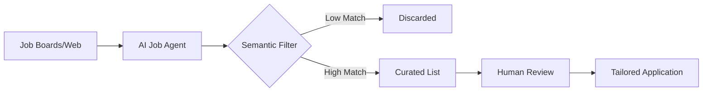

Let's be real: job hunting in the current economic climate feels like a full-time job that nobody actually wants. You spend hours meticulously tailoring resumes, tweaking a few bullet points to match a job description, only to send your application into a total black hole. These "black holes" are the [Applicant Tracking Systems (ATS)](https://www.greenhouse.io/blog/what-is-an-applicant-tracking-system), the gatekeeper software that filters out the vast majority of candidates before a human recruiter ever lays eyes on a PDF.

  
  
 <a href="https://unsplash.com/@dentistozkanguner">Ozkan Guner</a> on <a href="https://unsplash.com/photos/a-person-lying-on-the-back-MGJTcAPmGW8">Unsplash</a>

The statistics are sobering: **roughly 75% of resumes are rejected by ATS software** before they even reach a human recruiter. For the modern job seeker, this creates a cycle of burnout and invisibility. However, a new wave of open-source tools is fighting back. Specifically, the [MadsLorentzen/ai-job-search](https://github.com/MadsLorentzen/ai-job-search) project is attempting to flip the script by utilizing Large Language Models (LLMs) to handle the most tedious parts of the search. Instead of the candidate doing all the heavy lifting, an AI agent takes over the searching, filtering, and matching.

---

### 🤖 How the Modern Hunt Actually Works: The Shift to Semantic Search

For decades, searching for a job meant typing in rigid keywords like "Python," "Remote," or "Project Manager" and simply hoping for the best. This is known as keyword matching, and it is fundamentally flawed because it ignores context. If a job description asks for "experience in building scalable backend systems" and your resume says "developed high-traffic server architectures," a basic ATS might miss the connection because the words don't match exactly.

Thanks to the evolution of LLMs, we have moved into the era of **semantic search**. Unlike keyword matching, semantic search focuses on the *intent* and *context* behind the words. It uses [vector embeddings](https://platform.openai.com/docs/guides/embeddings)—mathematical representations of text—to find meaning. 

Research on [LLM-based matching](https://arxiv.org/abs/2305.13113) demonstrates that AI can now analyze the nuances of a candidate's experience and map it to a role with far greater accuracy than traditional filters. The `ai-job-search` project taps into this capability. Instead of spending four hours a day scrolling through LinkedIn or Indeed, you can task an AI agent with scanning thousands of listings. It can filter them based on complex, qualitative preferences—such as "companies with a documented culture of engineering excellence" or "roles that prioritize asynchronous communication"—and hand you a curated shortlist. 

This transforms the job search from a **manual grind** into a **curation task**, allowing you to spend your limited cognitive energy on the things that actually lead to offers: interviewing and networking.

---

### 🌟 The "Stargazer" Effect: Why Open Source is the Career Equalizer

If you look at the [stargazers](https://github.com/MadsLorentzen/ai-job-search/stargazers) on GitHub, it is clear that this isn't just a niche developer project; it is a signal of widespread frustration. The surge of interest in Mads Lorentzen's repository highlights a systemic problem in the 2024 job market: the asymmetry of power between the employer and the employee.

Corporations have spent millions optimizing their recruitment AI to filter *out* people. Open-source projects like `ai-job-search` are the counter-move, giving the power of automation back to the individual. When developers "star" a project like this, they are voting for a decentralized approach to hiring.

> "The democratization of AI tools means that the 'filtering power' is no longer exclusive to the corporation. When the candidate owns the agent, the candidate owns the discovery process."

By moving the intelligence to the **client-side** (using your own AI agent and API keys), you bypass the curated "promoted" posts that job boards prioritize for profit. You define the logic. You decide what a "good match" looks like. This ensures you only see roles that align with your actual life goals, rather than whatever algorithm a platform wants you to click on to increase their ad impressions.

---

### ⚔️ The Digital Arms Race: AI Agents vs. ATS

We are currently witnessing a digital arms race. On one side, candidates are using AI to find and apply for jobs at an unprecedented scale. On the other, companies are deploying increasingly sophisticated AI-powered systems to filter out "AI-generated noise." It is a paradoxical loop: **AI is being used to block AI.**

This cycle has significant implications for the workforce. Academic discussions on [automated recruitment](https://arxiv.org/abs/2106.02161) suggest that this can lead to "algorithmic bias." If every candidate uses the same AI to "optimize" their resume for a specific ATS, the ATS simply raises the bar, looking for even more obscure patterns to differentiate candidates. This often results in highly qualified people being filtered out simply because they didn't trigger a specific, invisible pattern.

To counter this, the `ai-job-search` approach emphasizes *quality* over *quantity*. Rather than using AI to spam 500 applications a day (which is a fast track to being blacklisted), the goal is to use LLMs to ensure a high-fidelity match before the application is even sent. When you apply to five roles that are a 95% semantic match rather than 500 roles that are a 20% match, you stop looking like a bot and start looking like a top-tier candidate.

---

### 💼 Beyond the Code: The "Hidden" Job Market

While automating the search is a massive win for productivity, the most successful users of these tools understand that AI is a **force multiplier**, not a replacement for human connection. Even in an AI-driven world, the [hidden job market](https://www.forbes.com/advisor/business/hidden-job-market/)—the roles filled through referrals, internal moves, and networking—still accounts for a huge percentage of high-quality hires.

The real value of automating the "top of the funnel" (discovery and filtering) is that it frees up your mental bandwidth. Job hunting is emotionally draining; by removing the logistics of the search, you can reinvest that energy into high-leverage activities:

*   **Strategic Networking**: Instead of browsing, you can spend your time reaching out to engineers or managers at the specific companies the AI identified as a perfect match.
*   **Public Proof of Work**: You can use the reclaimed hours to contribute to [Hugging Face](https://huggingface.co/) models or open-source projects that prove the skills the AI highlighted in your profile.
*   **Deep Interview Prep**: Instead of generic prep, you can perform deep-dive research into the specific problems a company is solving, using the AI-curated list as your roadmap.

As we transition toward a future of "Autonomous Agents," the competitive advantage will not belong to the person who can *find* the most jobs, but to the person who can *win* the human conversation once the AI has opened the door.

---

### 🚀 Conclusion: The Future of Work Discovery

The [MadsLorentzen/ai-job-search](https://github.com/MadsLorentzen/ai-job-search) project is more than just a script; it is part of a fundamental shift in the labor market. By making AI-driven discovery available to everyone, it levels the playing field against massive corporate recruitment engines. 

We will likely see the "AI vs. AI" battle continue in our inboxes and portals for the foreseeable future. However, the trajectory is clear: the move toward tools that serve the *user* rather than the *platform* is inevitable. The goal of the modern job search is no longer to apply to everything—it is to apply to the *right* things, with surgical precision and a regained sense of sanity.

For those looking to implement these strategies, the best path forward is a hybrid approach: use [LLM agents](https://github.com/AutoGPT/AutoGPT) for the heavy lifting of discovery, but maintain a rigorously human touch for the final mile. In the age of automation, authenticity is the only thing that cannot be spoofed.

---

## 📖 Related Reading

- [From Dust to Dollars: How AI Vision is Turning Your Junk Drawer into a Payday](/got-a-box-of-old-tech-gathering-dust-i-gave-chatgpt-a-photo-of-mine-and-ended-up-30-richer-techradar/)
- [Alishahryar1/Free-Claude-Code/Stargazers](/alishahryar1free-claude-codestargazers/)
- [🌀 The Quest for Accuracy: Why Weather Verification Matters](/tropical-storm-moke-threatens-hawaii-as-big-island-reels-from-hurricane-lala/)
