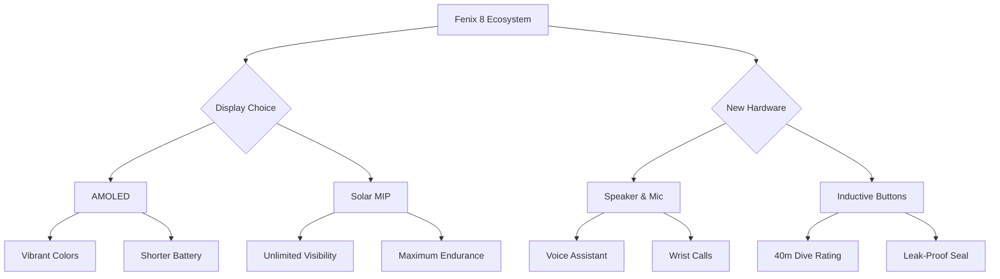

For years, the Garmin ecosystem forced a difficult choice upon its most dedicated users: the rugged, battery-sipping endurance of the Fenix series or the vibrant, high-contrast brilliance of the Epix. It was a divide between those who trekked through the wilderness for weeks and those who wanted a modern, high-resolution interface for their daily metrics. With the release of the **Garmin Fenix 8**, that divide has finally vanished.

  
  
 <a href="https://unsplash.com/@maquilingskiswifty">Daniel Maquiling</a> on <a href="https://unsplash.com/photos/a-smart-watch-sitting-on-top-of-a-black-surface-vfAQkN3WbwU">Unsplash</a>

Garmin has effectively merged these two distinct philosophies into a single, powerhouse lineup. The Fenix 8 doesn't just offer a choice of screens; it integrates a suite of hardware upgrades—including a microphone, speaker, and dive-rated sealing—that transform it from a dedicated sports tool into a versatile "do-everything" wearable. But does the convergence of these features create a masterpiece, or a jack-of-all-trades that masters none?

---

### 🌅 The Display Dilemma: AMOLED vs. Solar MIP

The most immediate change in the Fenix 8 is the availability of two vastly different display technologies. This isn't just about aesthetics; it’s about how you interact with your data in different environments.

#### The AMOLED Experience
The AMOLED version is designed for those who want a "smartwatch" feel. The colors are deep, the blacks are absolute, and the maps are stunningly vivid. When you are navigating a complex city street or checking your heart rate in a dim gym, the AMOLED screen provides an instant, legible snapshot of your status. However, the trade-off is power. While Garmin has optimized the efficiency, AMOLED pixels require more energy to stay lit, which is why "Always-On" mode is a critical setting to manage.

#### The Solar MIP Tradition
For the ultra-endurance athlete, the Memory-in-Pixel (MIP) Solar display remains the gold standard. Unlike AMOLED, which pushes light through the screen, MIP reflects ambient light. The brighter the sun, the easier it is to read. By integrating a solar charging ring, the Fenix 8 Solar extends battery life to levels that make the Apple Watch Ultra 2 look like a toy. If you are spending **14 days** in the backcountry without access to a wall outlet, Solar is the only logical choice.

As noted by [Tom's Guide](https://www.tomsguide.com/wearables/garmin-fenix-8), this strategic move essentially absorbs the Epix brand into the Fenix family, simplifying a product stack that had become confusing for new buyers.

---

### 🎙️ Beyond Tracking: Voice and Connectivity

The most surprising addition to the Fenix 8 is the integration of a **speaker and microphone**. For a long time, Garmin ignored "smart" communication in favor of "deep" data. The Fenix 8 changes that narrative.

By adding voice capabilities, Garmin allows users to take phone calls directly from the wrist (provided the phone is connected via Bluetooth) and interact with their smartphone's native voice assistant (Siri, Google Assistant, or Bixby). This removes the friction of digging a phone out of a hiking pack or a gym bag.

> "The addition of a microphone and speaker transforms the Fenix from a passive data collector into an active communication tool, making it far more viable for urban daily wear without sacrificing its outdoor soul."

Beyond calls, the **voice command** functionality is a game-changer for athletes. Imagine being mid-climb on a rock face or cycling at **30 km/h** in freezing temperatures; being able to tell your watch to "Start Workout" or "Set a Timer for 10 Minutes" without breaking your grip or removing gloves is a genuine utility upgrade. This puts Garmin in direct competition with the [Apple Watch Ultra 2](https://www.apple.com/apple-watch-ultra-2/) and the Samsung Galaxy Watch Ultra, offering a similar "smart" experience but with vastly superior health and recovery metrics.

---

### 🌊 Going Deep: Professional Diver Capabilities

Until now, if you wanted a Garmin that could handle serious diving, you had to buy the Descent series. The Fenix 8 blurs this line by introducing legitimate diving hardware.

The secret lies in the **leak-proof inductive buttons**. Traditional mechanical buttons, which rely on a physical seal to keep water out, can fail under the immense pressure of the deep ocean. Inductive buttons use magnetic sensors to detect presses, meaning the watch casing can be completely sealed.

The Fenix 8 is now rated for **dives up to 40 meters**, making it suitable for recreational scuba diving. It includes a dedicated dive app that tracks:
*   **Current Depth:** Real-time monitoring of your position in the water column.
*   **Ascent/Descent Rate:** Critical safety alerts to prevent decompression sickness.
*   **Dive Time:** Precise tracking of your bottom time and safety stops.

This evolution means the Fenix 8 is no longer just a "swimming watch" with a high water-resistance rating; it is a professional-grade instrument. Whether you are trekking across a desert or diving a reef, the same piece of hardware handles both with ease.

---

### 📈 Health, Recovery, and the "Garmin Brain"

While the hardware is flashy, the software is where the Fenix 8 truly justifies its premium price tag. Garmin has doubled down on "Readiness" metrics, moving away from simple step counting toward holistic physiological analysis.

**Key Health Metrics Integrated:**
*   **Training Readiness:** A score that combines your sleep, recovery time, and acute load to tell you if today is a day for a PR or a day for a walk.
*   **Body Battery:** Using heart rate variability (HRV), the watch monitors your energy reserves in real-time.
*   **Multi-band GNSS:** By utilizing multiple satellite frequencies (L1 and L5), the Fenix 8 maintains a lock in "urban canyons" or under dense forest canopies where other watches often drift.

For those obsessed with data, the integration of **TopoActive maps** provides an unparalleled navigation experience. The maps are not just lines on a screen; they are detailed topographical renderings that allow for on-device route planning and turn-by-turn navigation without needing a cellular connection.

---

### 🔋 Power and Performance: The Hard Stats

Battery life is the hill Garmin is willing to die on. Even with the power-hungry AMOLED screen, the Fenix 8 outperforms almost every other "smart" rugged watch on the market.

**Battery Life Comparison (Smartwatch Mode):**
*   **Fenix 8 (47mm AMOLED):** Up to **16 days**
*   **Fenix 8 (51mm AMOLED):** Up to **29 days**
*   **Fenix 8 Solar (MIP):** **20+ days** (extendable with sunlight)

To put this in perspective, most high-end smartwatches require a charge every **2 to 3 days**. The Fenix 8 allows you to travel for two weeks without even packing a charging cable.

---

### 🛠️ Build Quality: Titanium and Sapphire

Garmin hasn't compromised on the "tank" feel of the Fenix line. The watch is available in various configurations, typically featuring a **Titanium bezel** and **Sapphire crystal** lens. Sapphire is essentially scratch-proof, which is non-negotiable for a watch designed to be scraped against granite or bumped into gym equipment.

The weight distribution is balanced, though the 51mm version is undeniably bulky. It’s a statement piece that signals "outdoor enthusiast" before you even speak. The physical buttons remain a core part of the experience; while the touchscreen is great for scrolling through maps, buttons are the only reliable way to interact with a watch when your hands are wet or you're wearing gloves.

---

### ⚖️ Final Verdict: The Only Watch You Need?

The Garmin Fenix 8 is an ambitious piece of engineering. By merging the Epix and Fenix lines, Garmin has removed the "decision paralysis" that previously plagued its customers. You no longer have to choose between a beautiful screen and a rugged build—you can have both.

**Who is the Fenix 8 for?**
1.  **The Poly-Athlete:** If you run marathons, cycle 100km, and dive on your vacations, this is the first watch that doesn't force you to switch devices.
2.  **The Tech-Forward Adventurer:** If you want the ruggedness of a Garmin but the convenience of an Apple Watch (voice calls, vivid screens), the AMOLED Fenix 8 is the answer.
3.  **The Survivalist:** If you prioritize battery life and sunlight readability above all else, the Solar MIP version remains an unbeatable tool.

It is not a cheap device, and for the casual user, it may be overkill. However, for those who push their limits, the Fenix 8 isn't just a watch—it's a piece of survival gear. For further deep dives into the technical sensor accuracy, we highly recommend the comprehensive benchmarks at [DC Rainmaker](https://www.dcrainmaker.com) and the ecosystem comparisons at [Wareable](https://www.wareable.com).

The Fenix 8 has officially set a new standard for what a rugged smartwatch can be. It doesn't just track your life; it empowers you to live it more adventurously.

---

## 📖 Related Reading

- [Accuracy Over Everything: Why Thomson Reuters is Betting on Specialized AI](/thomson-reuters-launches-its-own-frontier-model/)
- [From Scrolling to Hired: Why AI-Driven Job Hunting is Picking Up Steam](/madslorentzenai-job-searchstargazers/)
- [🧠 The Memory Tax: Why the iPhone 18 is Set for a Price Hike](/iphone-18-series-prices-confirmed-to-go-up-due-to-rising-memory-chip-cost-gsmarenacom-news-gsmarenacom/)
