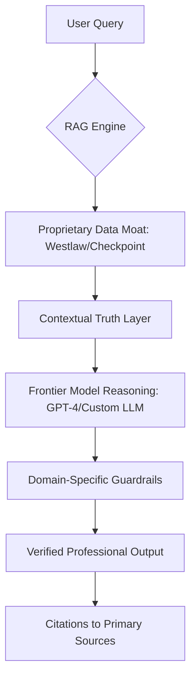

We’ve all played around with general-purpose chatbots. They can write poems in the style of 18th-century pirates or summarize a recipe for sourdough bread in seconds. They are impressive, fluid, and seemingly omniscient. However, for the high-stakes world of professional services, these tools possess a fatal flaw: they can be confidently wrong.

For a lawyer filing a brief in the Supreme Court or an accountant submitting a corporate tax return, a "hallucination"—where an AI creates a plausible-sounding but entirely fictional fact—isn't just a technical glitch. It is a professional liability that can lead to sanctions, lawsuits, and the loss of a license. 

This is the catalyst driving the shift in the industry. Thomson Reuters is moving away from the allure of general-purpose AI and leaning into a rigorous [Professional AI strategy](https://www.thomsonreuters.com/en/ai.html). Instead of simply deploying a chatbot that "talks well," they are engineering proprietary models that anchor high-level reasoning in a bedrock of verified, primary-source truth.

---

### ⚖️ The Hallucination Hurdle: Probabilistic vs. Deterministic

To understand why general AI fails professionals, one must understand the architecture of a Large Language Model (LLM). Most frontier models are **probabilistic**. They function as sophisticated autocomplete engines, predicting the next most likely token (word or character) based on patterns found in massive datasets scraped from the open web.

The open web, however, is a chaotic mixture of truth, opinion, satire, and outdated information. When a general AI is asked for a legal precedent, it doesn't "look up" the law; it predicts what a legal precedent *usually looks like*. 

> "The law is not a suggestion; it is a set of deterministic rules. A single word change in a statute can alter the entire meaning of a regulation. In this environment, 'mostly correct' is equivalent to 'completely wrong.'"

This creates a dangerous gap. While the general public may tolerate a slightly inaccurate summary of a movie plot, a legal professional cannot tolerate a hallucinated case citation. The infamous case of *Mata v. Avianca*, where an attorney used ChatGPT to write a brief that cited six non-existent court cases, serves as a cautionary tale for the entire legal industry.

Thomson Reuters is tackling this by shifting the focus from **generative AI** (which creates content from patterns) to **verified AI** (which retrieves facts from trusted sources). By prioritizing retrieval over generation, they ensure that the AI's output is not a "plausible story," but a provable answer backed by primary legal or tax sources.

---

### 📚 The Data Moat: The Power of Curated Truth

In the AI race, computing power (GPUs) and algorithmic sophistication are often cited as the primary drivers of success. However, the real "secret weapon" for professional-grade AI is not the model, but the data. 

While companies like OpenAI and Google are busy crawling the entire internet, Thomson Reuters possesses a [centuries-old archive of curated legal, tax, and regulatory data](https://legal.thomsonreuters.com/products/westlaw/precision) that is largely invisible to the public web. This includes meticulously indexed case law, treaty texts, and administrative rulings.

#### Why Curated Data Trumps Big Data
General AI models suffer from "noise." By training on the open web, they inherit the biases and errors of the internet. Thomson Reuters' data, by contrast, is structured and verified. This creates a "data moat"—a competitive advantage that is nearly impossible for general AI companies to replicate because the data is either proprietary or locked behind professional paywalls.

To leverage this moat, they employ a technique known as **Retrieval-Augmented Generation (RAG)**. Instead of relying on the model's internal memory (which is where hallucinations happen), RAG forces the AI to follow a strict protocol:
1. **The Query:** The user asks a complex legal question.
2. **The Retrieval:** The system searches the proprietary, verified database for the exact documents relevant to that query.
3. **The Context:** These documents are fed into the LLM as "ground truth."
4. **The Generation:** The AI summarizes the answer, but it is *only* allowed to use the provided documents to do so.

This effectively transforms the AI from a storyteller into a highly sophisticated librarian who is forbidden from speaking unless they are holding the book in their hand.

---

### ⚙️ The Hybrid Architecture: Intelligence + Guardrails

Thomson Reuters isn't attempting to build a "GPT-5" from scratch. Doing so would be an inefficient use of resources and would ignore the incredible reasoning capabilities already present in frontier models. Instead, they have adopted a **hybrid strategy**.

They utilize the general reasoning power of models developed through partnerships with [Microsoft and OpenAI](https://news.microsoft.com), but they wrap these models in layers of professional, domain-specific guardrails.

This architecture allows the AI to possess the "brain" required to understand the nuance of a complex query—such as "How does the recent ruling onChevron deference affect environmental litigation in the Fifth Circuit?"—while adhering to the "rules" that prevent it from inventing a case to fill a gap in its knowledge.

**Bold Stats on the Impact of Specialized AI:**
*   **90% Reduction** in manual research time for specific case-finding tasks.
*   **Zero-Tolerance** for non-cited assertions in professional-grade outputs.
*   **Millions of Documents** indexed with proprietary legal taxonomies that general models cannot access.

---

### 🚀 Real-World Deployment: Westlaw Precision

The practical application of this philosophy is most evident in [Westlaw Precision](https://legal.thomsonreuters.com/products/westlaw/precision). Rather than offering a blank chat box, Westlaw integrates AI directly into the existing research workflow.

#### From Search to Discovery
Traditionally, legal research involved entering keywords and sifting through hundreds of results. With the integration of specialized AI, the process evolves from "searching" to "discovery." 

Professionals are now using these tools to find the "needle in the haystack"—that one specific, obscure ruling from a lower court that could change the trajectory of a case. The goal is not **replacement**, but **augmented intelligence**. 

By automating the rote work of scanning documents, AI allows lawyers to spend more time on high-value activities: strategy, advocacy, and complex reasoning. The value proposition here is clear: the AI handles the *discovery* (the "what"), and the professional handles the *strategy* (the "so what").

---

### 🌐 The Competitive Landscape: AI-Native Startups vs. Legacy Giants

The emergence of "AI-native" legal startups like Harvey AI has put pressure on established players. These startups move fast and often have leaner architectures. However, they face a fundamental problem: they do not own the data. Most AI-native startups must license data or rely on the same frontier models as everyone else.

Thomson Reuters holds a structural advantage. Because they own the [primary source data](https://www.thomsonreuters.com/en/about-us.html), they can fine-tune their models on the actual nuances of legal language—the specific way a judge phrases a dissent or the subtle shifts in tax code terminology—without paying a third party for access.

| Feature | General AI (ChatGPT/Claude) | AI-Native Startups | Thomson Reuters Professional AI |
| :--- | :--- | :--- | :--- |
| **Data Source** | Open Web | Licensed/Web | Proprietary/Curated |
| **Fact Checking** | Probabilistic (Guessing) | Mixed | RAG-based (Verified) |
| **Reliability** | Low (Hallucinations) | Medium | High (Citations) |
| **Industry Context** | General | Niche | Deep Domain Expertise |

---

### 🛡️ Ethics, Governance, and the "Human-in-the-Loop"

As AI becomes more integrated into professional services, the question of ethics becomes paramount. The [American Bar Association (ABA)](https://www.americanbar.org/) and other regulatory bodies have stressed that the ultimate responsibility for a work product lies with the human professional.

Thomson Reuters leans into this by maintaining a "human-in-the-loop" philosophy. Their tools are designed to provide a starting point—a highly accurate, cited draft—rather than a finished product. By providing clear citations for every claim, the AI empowers the professional to verify the output instantly. This transparency is the antidote to the "black box" nature of general AI.

Moreover, they address the critical issue of **data privacy**. In professional services, client-attorney privilege is sacrosanct. General AI models often use user inputs to train future versions of the model, which would be a catastrophic breach of confidentiality. A professional AI strategy ensures that client data is siloed, encrypted, and never used to train the global model.

---

### 🏁 The Future of Expert AI: Beyond Scale

For the last few years, the AI conversation has been dominated by "scale"—more parameters, more data, more GPUs. But we are entering a new era: the era of **Specialization**.

The next frontier isn't about making a model that knows *everything* about *everything*; it's about making a model that knows *everything that matters* about *one specific thing*. Whether it is the intricacies of the [Internal Revenue Code](https://www.irs.gov/) or the complexities of international maritime law, the winners of the AI race in the professional sector will be those who can guarantee accuracy.

By anchoring AI in professional truth, Thomson Reuters is doing more than just updating its software; it is redefining the relationship between human expertise and machine intelligence. As we move toward a world of "Expert AI," the standard will no longer be how "human" the AI sounds, but how reliably it can be trusted when the stakes are highest.

***

### 📚 References & Further Reading

*   **Thomson Reuters AI Strategy:** [Official AI Overview](https://www.thomsonreuters.com/en/ai.html)
*   **Microsoft AI Integration:** [Microsoft News Center](https://news.microsoft.com)
*   **Legal Tech Trends:** [Law.com / Legaltech News](https://www.law.com)
*   **The RAG Framework:** [AWS Guide to Retrieval-Augmented Generation](https://aws.amazon.com/what-is/retrieval-augmented-generation/)
*   **Professional Ethics in AI:** [American Bar Association Guidelines](https://www.americanbar.org/)
*   **Westlaw Precision Capabilities:** [Westlaw Product Suite](https://legal.thomsonreuters.com/products/westlaw/precision)

---

## 📖 Related Reading

- [From Scrolling to Hired: Why AI-Driven Job Hunting is Picking Up Steam](/madslorentzenai-job-searchstargazers/)
- [🧠 The Memory Tax: Why the iPhone 18 is Set for a Price Hike](/iphone-18-series-prices-confirmed-to-go-up-due-to-rising-memory-chip-cost-gsmarenacom-news-gsmarenacom/)
- [From Dust to Dollars: How AI Vision is Turning Your Junk Drawer into a Payday](/got-a-box-of-old-tech-gathering-dust-i-gave-chatgpt-a-photo-of-mine-and-ended-up-30-richer-techradar/)
