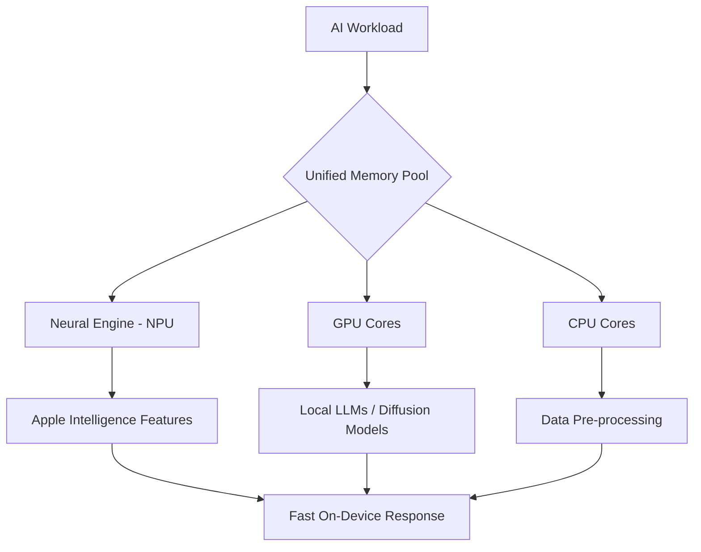

Apple is orchestrating a fundamental shift in its desktop strategy, and the catalyst is the generative AI revolution. With the launch of the **M4-powered Mac mini**, the company is no longer simply selling a compact desktop; it is deploying a localized AI workstation. By substantially enhancing the Neural Engine and—crucially—establishing **16GB of Unified Memory** as the standard baseline, Apple is preparing its entire ecosystem for the heavy computational lifting required by "Apple Intelligence" and the deployment of local Large Language Models (LLMs).

  
  
 <a href="https://unsplash.com/@lagommedia">Laurenz Heymann</a> on <a href="https://unsplash.com/photos/apple-store-shop-front-VkfhJLz5SMQ">Unsplash</a>

This transition marks a departure from the "cloud-first" AI approach, moving toward a "device-first" philosophy where privacy, latency, and efficiency are paramount.

---

### ⚡ The M4 Silicon: Engineered for Intelligence

The M4 chip family is not merely an incremental speed bump; it is a structural redesign optimized for the AI era. While the CPU and GPU improvements provide a snappier experience for traditional productivity, the real innovation lies within the **Neural Engine (NPU)**. 

The M4's Neural Engine is specifically tuned to accelerate the on-device processing required for [Apple Intelligence](https://www.apple.com/apple-intelligence/), enabling tasks like semantic index creation, text summarization, and image generation to happen without a round-trip to a remote server. This architecture significantly reduces the attack surface for data breaches, ensuring that sensitive user data remains within the secure enclave of the Mac.

For power users, the **M4 Pro** represents a quantum leap in performance. Offering up to a **14-core CPU and 20-core GPU**, the M4 Pro transforms the Mac mini from a home office tool into a serious development rig. This allows engineers to perform moderate AI training and complex data manipulation—tasks that previously mandated a leap to the significantly more expensive Mac Studio.

**Key Performance Metrics:**
*   **Neural Engine Performance:** Capable of **38 trillion operations per second (TOPS)**, drastically reducing inference time for local models.
*   **Memory Bandwidth:** Significant increases in bandwidth allow the GPU and NPU to access data with near-zero latency.
*   **Efficiency:** Built on a **second-generation 3nm process**, providing a higher performance-per-watt ratio than nearly any x86 competitor.

---

### 🧠 The Unified Memory Advantage: Breaking the VRAM Bottleneck

In the world of AI, memory is the primary currency. If you have ever attempted to run a local LLM, you know that the size of the model is limited by the available Video RAM (VRAM). In traditional PC architectures, this requires investing in expensive NVIDIA GPUs with dedicated VRAM (e.g., 24GB on an RTX 4090).

Apple’s **Unified Memory Architecture (UMA)** disrupts this paradigm. By placing the CPU, GPU, and NPU on a single fabric, the GPU can access the system's entire pool of RAM. When Apple bumped the starting memory to **16GB**, they didn't just do it for multitasking—they did it to make the Mac mini a viable entry point for AI.

> "The shift to a 16GB minimum is the most critical update for the AI era. Local models like Llama 3, Mistral, or Phi-3 require significant memory overhead just to load their weights into memory. The old 8GB baseline was a hard bottleneck that rendered many modern open-source models unusable on entry-level Macs."

With the M4 series, developers can leverage the [MLX framework](https://github.com/ml-explore/mlx), a machine learning library specifically designed for Apple Silicon. MLX allows users to run models that would typically require an enterprise-grade A100 GPU by efficiently utilizing the unified memory pool.

---

### ⚔️ The "AI PC" War: Apple vs. The World

Apple is not operating in a vacuum. The industry is currently witnessing a fierce battle for the "AI PC" crown, with Microsoft's [Copilot+ PCs](https://www.microsoft.com/en-us/windows/copilot-plus-pcs) and Qualcomm's Snapdragon X Elite posing significant threats. These competitors boast impressive NPU performance and long battery life.

However, Apple possesses a "vertical integration" advantage that neither Microsoft nor Qualcomm can fully replicate. Because Apple designs the **silicon (M4)**, the **operating system (macOS Sequoia)**, and the **AI frameworks (Core ML)**, they can optimize the entire stack. 

While a Windows laptop might rely on a mix of Qualcomm hardware and Microsoft software, Apple can tune the M4's instructions specifically for the way Apple Intelligence handles "on-device" vs. "private cloud" compute. This synergy results in higher perceived performance and better energy efficiency.

**Comparative Landscape:**
| Feature | Apple M4 Series | Qualcomm Snapdragon X | Intel Core Ultra (Lunar Lake) |
| :--- | :--- | :--- | :--- |
| **Architecture** | ARM-based Unified | ARM-based | x86 Hybrid |
| **Memory** | Unified (UMA) | LPDDR5x | LPDDR5x |
| **Ecosystem** | Tight (Hardware $\rightarrow$ OS) | Fragmented (OEM $\rightarrow$ OS) | Fragmented (OEM $\rightarrow$ OS) |
| **AI Focus** | Privacy/On-Device | Cloud Hybrid | Cloud Hybrid |

---

### 🛠️ Segmenting the Market: Who is the M4 Mac mini For?

The M4 refresh effectively bifurcates the user base into two distinct categories: the AI Consumer and the AI Developer.

#### 1. The AI Consumer 🎨
These users aren't writing Python code; they are using AI to enhance their daily workflow. They rely on [Apple Intelligence](https://www.apple.com/newsroom/) for:
*   **Writing Tools:** System-wide rewriting, proofreading, and summarization.
*   **Siri Evolution:** A more context-aware Siri that can take actions across different apps.
*   **Image Playground:** Generating images and "Genmoji" locally without needing a subscription to Midjourney or DALL-E.
*   **Priority Notifications:** AI-driven sorting of alerts to reduce digital noise.

#### 2. The AI Developer 💻
For the engineer, the M4 Pro Mac mini is a powerhouse prototyping station. The integration of **Thunderbolt 5** is a game-changer here, supporting transfer speeds up to **120Gbps**. This allows developers to connect massive external NVMe arrays to feed data into their models at speeds that were previously impossible on a small-form-factor Mac.

Developers are increasingly turning to [PyTorch](https://pytorch.org/) and Core ML to optimize their weights for the M4's Neural Engine, making the Mac mini a preferred choice for those who want a silent, power-efficient machine for running local vector databases and RAG (Retrieval-Augmented Generation) pipelines.

---

### 🌐 The Philosophy of Edge AI and Privacy

The overarching theme of the M4 refresh is the push toward **Edge AI**. Traditionally, AI has been centralized in massive data centers (like those run by OpenAI or Google), meaning every prompt you write is sent across the internet, processed on a server, and sent back.

Apple is betting that the future of AI is decentralized. By moving the compute to the "edge" (your device), Apple achieves three goals:
1.  **Latency:** Responses are near-instant because there is no network lag.
2.  **Availability:** AI features work offline.
3.  **Privacy:** Using [Private Cloud Compute](https://www.apple.com/privacy/), Apple ensures that even when a task is too big for the M4 and needs the cloud, the data is never stored and is cryptographically inaccessible to Apple itself.

This positioning is a strategic masterstroke. In an era of growing distrust toward how Big Tech handles personal data, a "Privacy-First AI" is a powerful marketing and functional differentiator.

---

### 🏁 Wrapping Up: The Gateway to the AI Boom

Apple's M4 refresh is far more than a hardware update; it is a strategic alignment with the future of computing. By upgrading the Mac mini and paving the way for an M4 Max/Ultra powered Mac Studio, Apple is ensuring that its hardware does not become the bottleneck for its software ambitions.

As local AI transitions from a niche hobby for developers to a standard expectation for every computer user, the M4 lineup provides a scalable path forward. Whether you are a student using AI to summarize lectures or a data scientist fine-tuning a model, the M4 Mac mini offers a compelling blend of power, efficiency, and privacy.

The "Small Box" has officially become a big deal.

---

### 📚 References & Further Reading

*   **Apple Newsroom:** Official announcements regarding [Apple Intelligence](https://www.apple.com/newsroom/).
*   **MLX Documentation:** Explore how to run LLMs on Apple Silicon via the [MLX GitHub repository](https://github.com/ml-explore/mlx).
*   **Core ML Framework:** Technical details on deploying models via [Apple's Developer Portal](https://developer.apple.com/machine-learning/).
*   **Thunderbolt 5 Specs:** Understanding the new **120Gbps** bandwidth standards for external storage.
*   **Llama 3 / Mistral:** Documentation on open-source weights optimized for ARM architectures.

---

## 📖 Related Reading

- [⚖️ The Legal Paradox: Judge Rebukes USPS for Illegal Rulemaking but Refuses to Block It](/us-judge-rebukes-postal-service-over-mail-in-voting-rule-but-wont-block-it/)
- [Rohitg00/Ai-Engineering-From-Scratch/Stargazers](/rohitg00ai-engineering-from-scratchstargazers/)
- [Accuracy Over Everything: Why Thomson Reuters is Betting on Specialized AI](/thomson-reuters-launches-its-own-frontier-model/)
