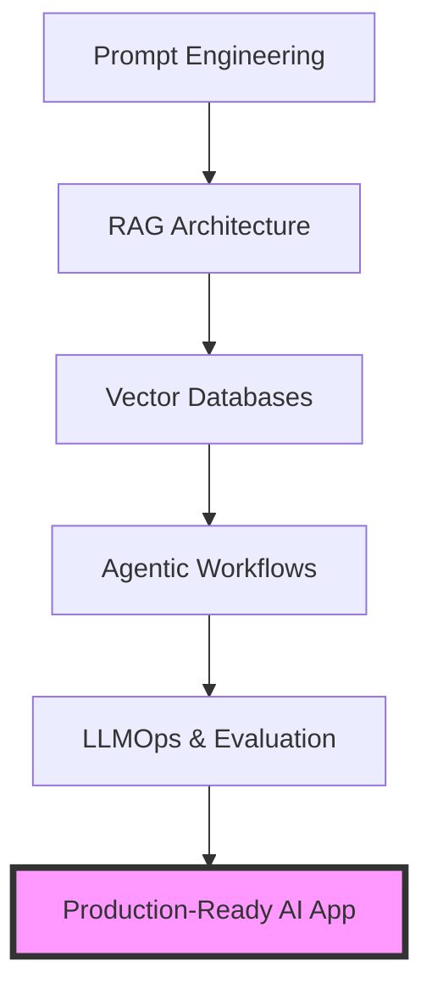

For a long time, the barrier to entry for working in Artificial Intelligence was an academic fortress. If you wanted to build something meaningful, you essentially needed a PhD in mathematics, a deep mastery of calculus and linear algebra, or a decade spent in the trenches of deep learning research. The world of AI was reserved for those who could derive backpropagation on a whiteboard.

But the landscape has shifted violently. With the emergence of Large Language Models (LLMs) and accessible APIs, we have entered the era of the **"AI Engineer."** This is a role defined not by the ability to train a model from scratch, but by the ability to orchestrate existing models to solve complex, real-world problems. 

At the heart of this professional pivot is the [rohitg00/ai-engineering-from-scratch](https://github.com/rohitg00/ai-engineering-from-scratch) repository. This resource has rapidly become a definitive roadmap for software developers, providing a structured path through the noise of a thousand competing libraries and a hundred new "AI wrappers" launched every week.

### 🏗️ What Exactly is an AI Engineer?

The rise of the AI Engineer represents a fundamental decoupling: the separation of *making* models from *using* them. 

While an ML Researcher is focused on the "black box"—optimizing weights, adjusting biases, and refining loss functions to improve a model's base capability—the AI Engineer operates at the application layer. As industry pioneer [Shawn Wang (swyx)](https://www.latitud.sh) has argued, the AI Engineer is a software engineer who treats the LLM as a primary building block, similar to how a web developer treats a database or an API.

This distinction is why the `ai-engineering-from-scratch` repository is gaining such massive traction. It recognizes that a developer doesn't need to understand the internal tensor mathematics of a Transformer to build a world-class AI application. Instead, they need to master the **cognitive architecture** around the model.

The AI Engineer focuses on:
*   **Context Window Management:** Optimizing what information is fed to the model to maximize accuracy and minimize cost.
*   **Non-Deterministic Output Handling:** Building guardrails to manage the inherent unpredictability of LLM responses.
*   **Latency Optimization:** Ensuring that the "thinking" time of a model doesn't destroy the user experience.
*   **System Integration:** Connecting the LLM to real-world data sources and external tools.

> "The AI Engineer is the new full-stack developer. They don't just build the UI and the database; they build the cognitive layer of the application, translating human intent into machine execution."

### 📚 The Roadmap: A Disciplined Path to Mastery

The strength of the `rohitg00` roadmap lies in its refusal to follow the hype cycle. Rather than listing every trending library on Twitter, it follows a logical progression of complexity:

#### 1. LLM Fundamentals & Prompting
The journey begins with understanding the "atoms" of AI: **Tokens**. Developers learn that models don't see words, but numerical representations. Mastering prompting isn't about "magic words"; it's about structured communication. This includes techniques like **Few-Shot Prompting** (providing examples) and **Chain-of-Thought (CoT)** (asking the model to reason step-by-step), which significantly improve logical performance.

#### 2. Retrieval Augmented Generation (RAG)
Once a developer can steer a model, they must learn how to give it a "brain" of external data. RAG is the process of retrieving relevant documents from a database and inserting them into the prompt. This solves the two biggest problems in LLMs: **knowledge cutoff** (the model only knows what it was trained on) and **hallucinations**.

#### 3. Vector Databases
RAG requires a specialized type of infrastructure. You cannot use a standard SQL query to find "meaning." Instead, you use **Embeddings**—mathematical vectors that represent the semantic meaning of text. The roadmap introduces essential tools like [Pinecone](https://www.pinecone.io/), [Weaviate](https://weaviate.io/), and [Chroma](https://www.trychroma.com/), which allow for high-dimensional similarity searches.

#### 4. Agentic Workflows
The final frontier is moving from "chains" to "agents." A chain is a linear sequence (Input $\rightarrow$ Prompt $\rightarrow$ Output). An agent, however, uses the LLM as a reasoning engine to decide which tools to call, observe the result, and loop back until the goal is achieved. This often utilizes the **ReAct (Reason + Act)** pattern.

#### 5. LLMOps & Evaluation
The hardest part of AI engineering is knowing if your app actually works. Because LLMs are non-deterministic, a prompt that works today might fail tomorrow. The roadmap emphasizes "Evals"—creating a "golden dataset" of inputs and expected outputs to measure performance using frameworks like [Ragas](https://docs.ragas.io/) or [LangSmith](https://www.langchain.com/langsmith).

### 🔍 The RAG Revolution: Solving the Truth Problem

Retrieval Augmented Generation is perhaps the most critical pillar of the entire roadmap. In a corporate environment, a hallucination isn't just a quirk—it's a liability. 

Academic research, including the [seminal work on RAG](https://arxiv.org/abs/2005.11401), demonstrates that providing a model with a relevant snippet of a document immediately before the question drastically increases factual accuracy. This shifts the model's reliance from **parametric memory** (what it learned during its multi-billion dollar training phase) to **non-parametric memory** (the specific PDF or database entry you provide in real-time).

**The technical flow of a RAG system is typically:**
1.  **Ingestion:** Load documents $\rightarrow$ Split into chunks $\rightarrow$ Convert to embeddings $\rightarrow$ Store in Vector DB.
2.  **Retrieval:** User query $\rightarrow$ Convert query to embedding $\rightarrow$ Find most similar chunks in Vector DB.
3.  **Generation:** User query + Retrieved chunks $\rightarrow$ LLM $\rightarrow$ Grounded Answer.

By implementing this, developers can create bots that know a company's internal HR policies or a 500-page technical manual without spending **millions of dollars** on fine-tuning a custom model.

### 🌟 Why the Community is Leaning In

On GitHub, a "star" is a signal of trust. The surge in popularity for `rohitg00/ai-engineering-from-scratch` highlights a growing frustration with the current state of AI education. 

Most learners find themselves trapped between two extremes:
*   **Academic Papers:** Too dense, focusing on the "how the neurons fire" rather than "how to build the app."
*   **Hype Tutorials:** "Build a SaaS in 5 minutes" videos that teach you how to build a basic API wrapper but leave you completely stranded when you encounter rate limits, token overflows, or accuracy drift.

The community is gravitating toward this roadmap because it treats AI as a **software engineering discipline**. It emphasizes Python and TypeScript—tools developers already know—and focuses on the "how" of implementation. **Stats suggest that the demand for AI-capable software engineers has grown by over 40% in the last year**, yet the supply of developers who actually understand RAG and Agentic patterns remains low.

### 🚀 The Path Forward: From Chains to Agents

As we look toward the future, the roadmap points toward a significant shift: the transition from **linear pipelines to iterative agents**. 

Early AI applications were essentially glorified autocomplete. We are now seeing the rise of "Reasoning Loops," where the LLM is given a goal (e.g., "Research the current price of Nvidia stock and compare it to the 5-year average, then write a summary report"). The agent doesn't just guess the answer; it:
1.  Searches for the current price.
2.  Searches for historical data.
3.  Calculates the average.
4.  Critiques its own draft.
5.  Produces the final output.

For the aspiring AI Engineer, the ultimate goal is **Evaluation-Driven Development**. In traditional software, we have unit tests. In AI engineering, we have "evals." Learning how to build a robust evaluation pipeline is what separates the hobbyists from the professionals.

Eventually, the distinction between a "Software Engineer" and an "AI Engineer" will likely vanish. Much like "Web Developer" eventually just became "Developer," AI orchestration will become a standard requirement for anyone writing code.

### Conclusion

The `rohitg00/ai-engineering-from-scratch` repository is more than a curated list of links; it is a blueprint for the democratization of AI. By lowering the barrier to entry and providing a clear, logical path, it empowers developers to stop being passive consumers of AI and start becoming the architects of it. 

Whether you are a senior architect or a junior developer, the transition is clear: the value is no longer in knowing how the model works, but in knowing how to make the model work for the user.

**References & Further Reading:**
*   [OpenAI API Documentation](https://platform.openai.com/docs/) - The gold standard for LLM integration.
*   [Hugging Face](https://huggingface.co/) - The central hub for open-source models and datasets.
*   [DeepLearning.ai](https://www.deeplearning.ai/) - Short courses on prompt engineering and AI agents.
*   [LlamaIndex](https://www.llamaindex.ai/) - A powerful framework for connecting data to LLMs.
*   [LangChain](https://www.langchain.com/) - The most popular framework for building LLM applications.

---

## 📖 Related Reading

- [The Death of the App: My Daily Software Stack in 2026](/what-software-do-you-use-daily-in-2026/)
- [⚖️ The Legal Paradox: Judge Rebukes USPS for Illegal Rulemaking but Refuses to Block It](/us-judge-rebukes-postal-service-over-mail-in-voting-rule-but-wont-block-it/)
- [Accuracy Over Everything: Why Thomson Reuters is Betting on Specialized AI](/thomson-reuters-launches-its-own-frontier-model/)
