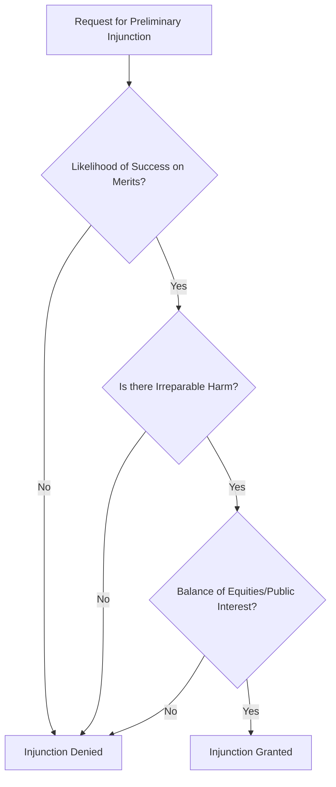

A federal judge has issued a stinging rebuke to the U.S. Postal Service (USPS), ruling that the agency effectively "ignored" the mandatory legal protocols required when implementing new rules for the handling of mail-in ballots. However, in a twist of judicial logic that has left legal observers perplexed, the court declined to block those very rules from being implemented.

  
  
 <a href="https://unsplash.com/@tzielonka">Tomasz Zielonka</a> on <a href="https://unsplash.com/photos/a-large-building-with-columns-and-pillars-on-a-cloudy-day-OqQXH3W42JQ">Unsplash</a>

This creates a striking legal paradox: a government agency can be found to have bypassed federal law, yet continues to operate under those illegal guidelines because the court determined that the immediate harm was not "irreparable." This distinction highlights the rigorous—and often frustrating—gap between proving a legal violation and securing an immediate remedy.

---

### 🚩 The Problem: Skipping the "Notice-and-Comment" Process

The core of the dispute centers on the [Administrative Procedure Act (APA)](https://www.archives.gov/federal-register/laws/administrative-procedure-act), the foundational federal law that governs how agencies create and change regulations. The APA is designed to prevent "government by surprise" by mandating a **notice-and-comment** process. Under this framework, agencies must notify the public of proposed changes and allow a window for stakeholders to provide feedback before a rule becomes official.

In this instance, the court found that the USPS unilaterally altered how it prioritizes and processes mail-in ballots. By bypassing the [Federal Register](https://www.federalregister.gov/) and omitting public notice, the USPS denied election officials and voting rights advocates the opportunity to identify potential systemic flaws. The judge noted that the agency cannot simply treat transparency requirements as optional suggestions when they are inconvenient to operational speed.

---

### 🛑 The High Bar: Why the Rules Stay in Place

Given that the USPS was found to have violated the APA, many expected the court to issue a preliminary injunction. However, securing such an order requires meeting a strict **four-prong test** under [standard judicial review](https://www.uscourts.gov/about-federal-courts/court-role-and-structure).

To stop a rule before a full trial concludes, the plaintiffs must prove not only that they are likely to win the case, but that staying the course will cause "irreparable harm"—damage that cannot be undone by a later court order or monetary compensation.

While the judge agreed that the plaintiffs would likely prevail on the merits (because the USPS did indeed break the law), the court ruled that the evidence of *immediate* damage was insufficient. The judge characterized the potential for ballot delays as a "speculative risk" rather than a certainty. In the eyes of the court, the possibility that some ballots might be delayed does not meet the legal threshold of "irreparable" damage required to freeze agency operations.

---

### 🗳️ The Stakes: The "Black Box" of Ballot Delivery

Voting rights organizations, including advocates from the [Brennan Center for Justice](https://www.brennancenter.org) and the [ACLU](https://www.aclu.org), argue that this creates a dangerous "black box" surrounding the electoral process. In many jurisdictions, ballots must be received by a strict deadline to be counted. In such environments, a delay of just **48 to 72 hours** can lead to the disenfranchisement of thousands of voters.

> "The USPS cannot be allowed to unilaterally change the rules of the game without public scrutiny, especially when those rules determine whether a citizen's voice is heard," argued the plaintiffs in their legal filings.

The primary concern is that without transparent, public-facing rules, the USPS might prioritize commercial packages or "priority mail" over election materials during peak volume periods. This operational opacity shifts the power from legal oversight to internal agency discretion, potentially compromising [election integrity](https://www.eac.gov).

---

### 📦 The USPS Defense: Guidance vs. Rulemaking

The USPS defended its actions by claiming "operational discretion." Their legal team argued that the changes were not "legislative rules"—which require the APA's notice-and-comment process—but were instead "internal guidance" for employees. According to the [Legal Information Institute](https://www.law.cornell.edu/wex/administrative_procedure_act), internal guidance is generally exempt from the APA if it does not create new legal rights or obligations.

The judge rejected this argument, ruling that the changes were significant enough to impact the public's right to vote, thereby qualifying them as official rules. However, by refusing to block the rules, the court took a cautious middle path: it declared the *process* illegal while allowing the *outcome* to persist to avoid disrupting postal operations during a critical window.

---

### 🏁 The Bottom Line

This ruling underscores a significant tension within [administrative law](https://en.wikipedia.org/wiki/Administrative_law). The USPS was caught flouting the law, yet it faces no immediate operational consequences. For the legal community, it serves as a reminder that the "irreparable harm" standard is an incredibly high hurdle to clear.

For the American voter, the result is a systemic vulnerability. The delivery of ballots will continue under a mandate created in secret, leaving the integrity of the process dependent on the internal efficiency of the Postal Service rather than the transparent oversight of the law.

### References
* **Administrative Procedure Act (APA)** - National Archives
* **Preliminary Injunction Standards** - Cornell Law School / LII
* **Election Mail Guidelines** - [USPS Official Site](https://www.usps.com)
* **Federal Court Role** - United States Courts (uscourts.gov)
* **Voting Rights Framework** - Election Assistance Commission (EAC)

---

## 📖 Related Reading

- [Accuracy Over Everything: Why Thomson Reuters is Betting on Specialized AI](/thomson-reuters-launches-its-own-frontier-model/)
- [⌚ AMOLED, Voice, and Diving: Is the Garmin Fenix 8 the Only Watch You Actually Need?](/garmin-play-harder-live-fenix-9-expected-to-be-announced-today-toms-guide/)
- [More Than Just Prompts: How GitHub’s “Awesome Lists” Are Mapping the AI Image Revolution 🌌](/freestyleflyawesome-gpt-image-2stargazers/)
