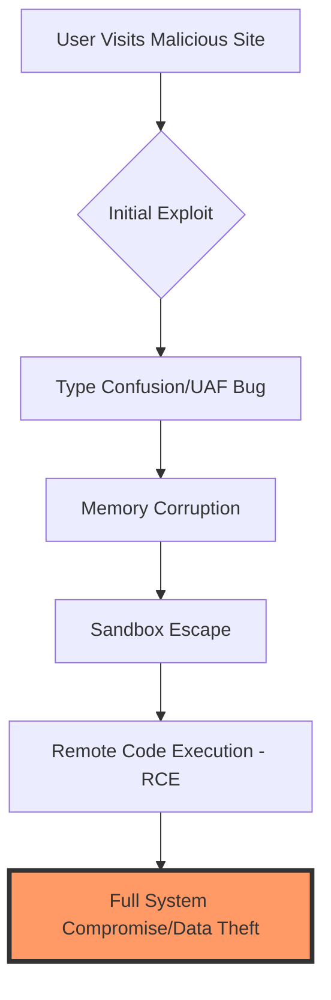

The digital gateway for billions of users, Google Chrome, has recently come under intense scrutiny following reports of a massive security overhaul. According to detailed analysis and reports from sources like **ETV Bharat**, a staggering **327 security flaws** were identified, with **10 of these classified as critical bugs**. In an era where the browser is no longer just a tool for viewing pages but a full-fledged operating system for web applications, such a high volume of vulnerabilities represents a significant attack surface for malicious actors.

For the average user, a "Chrome Update" notification is often a nuisance to be postponed. However, when the update addresses hundreds of vulnerabilities—including high-severity memory corruption and type confusion issues—the update becomes a critical line of defense against data theft and system compromise.

> "The complexity of modern browsers like Chrome makes them inevitable targets. With millions of lines of code and constant integration of new web standards, the surface area for potential exploits grows exponentially." — *Cybersecurity Analyst Report*

## 🔍 Breakdown of the Vulnerabilities

  
  
 <a href="https://unsplash.com/@growtika">Growtika</a> on <a href="https://unsplash.com/photos/a-group-of-colorful-circles-rzv8T2Yvu6M">Unsplash</a>

To understand the scale of this update, we must categorize the types of flaws discovered. Most of the **327 flaws** fall under several recurring technical categories that are common in Chromium-based browsers.

### 1. Use-After-Free (UAF) Errors
A significant portion of the critical bugs are "Use-After-Free" vulnerabilities. This occurs when a program continues to use a pointer after the memory it points to has been freed. Attackers can exploit this to execute arbitrary code on the victim's machine.

### 2. Type Confusion
Type confusion happens when the browser allocates a piece of memory for one data type but accesses it as another. This often leads to memory corruption, allowing hackers to bypass security sandboxes.

### 3. Heap Buffer Overflows
When data exceeds the boundary of a fixed-length buffer, it "overflows" into adjacent memory. In the context of Chrome, this can be used to crash the browser or, more dangerously, inject malicious scripts.

**Key Statistics at a Glance:**
*   **Total Flaws Patched:** **327**
*   **Critical Severity Bugs:** **10**
*   **Affected Component:** Primarily **V8 JavaScript Engine** and **Blink Rendering Engine**.
*   **Primary Risk:** Remote Code Execution (RCE).

## 🛠️ How an Exploit Chain Works

A single bug is rarely enough to take over a computer. Instead, hackers use an "exploit chain." The process usually follows a specific sequence to move from a simple website visit to full system control.

## ⚠️ The Danger of the "Zero-Day"

Among the reported flaws, the most concerning are **Zero-Day vulnerabilities**. These are bugs that were known to attackers and exploited in the wild *before* Google was aware of them or had a patch ready. 

When **10 critical bugs** are highlighted, the probability that some were utilized as zero-days is high. The risk is amplified because Chrome's market share (roughly **65% of all browsers**) makes it the most lucrative target for state-sponsored hacking groups and cyber-criminal syndicates.

## 🚀 Immediate Actions for Users

Given the severity of these **327 security flaws**, manual updates are strongly recommended rather than waiting for the browser to restart automatically.

### Step-by-Step Update Guide:
1.  Open Google Chrome.
2.  Click the **three vertical dots** (Menu) in the top right corner.
3.  Navigate to **Help** $\rightarrow$ **About Google Chrome**.
4.  Chrome will automatically check for updates. If one is available, it will download.
5.  Click **Relaunch** to apply the patches.

### Beyond the Update: Hardening Your Browser
Updating is the first step, but a "defense-in-depth" strategy is necessary for total security:
*   **Enable Enhanced Protection:** Go to `Settings` $\rightarrow$ `Privacy and security` $\rightarrow$ `Security` and select **Enhanced Protection**. This provides proactive warnings about dangerous websites and downloads.
*   **Audit Extensions:** Many browser extensions have permissions to read all your data. Remove any that aren't essential.
*   **Use a Password Manager:** Since browser vulnerabilities can lead to session hijacking, using a dedicated password manager with 2FA (Two-Factor Authentication) adds a layer of security that persists even if the browser is compromised.

## 🌐 The Broader Chromium Ecosystem

It is important to note that Google Chrome is built on the **Chromium open-source project**. This means that the **327 flaws** identified aren't just "Chrome problems"—they potentially affect every browser based on Chromium, including:
*   **Microsoft Edge**
*   **Opera**
*   **Brave**
*   **Vivaldi**

While these browsers implement their own UI and some specific features, the core rendering and JavaScript engines (Blink and V8) are shared. Therefore, users of Edge or Brave must also ensure their browsers are updated to the latest version to patch these specific CVEs (Common Vulnerabilities and Exposures).

## 📋 Summary Table of Risk Levels

| Severity Level | Number of Bugs | Potential Impact | Action Required |
| :--- | :--- | :--- | :--- |
| **Critical** | **10** | Full system takeover, data theft | Immediate Update |
| **High** | **~45** | Sandbox escape, sensitive data leak | Update within 24 hours |
| **Medium/Low** | **~272** | Browser crash, limited info leak | Regular Update Cycle |

## 📚 References and Further Reading

For those seeking technical deep-dives into the specific CVE IDs associated with these patches, the following resources are indispensable:

1.  [Chrome Releases Blog](https://chromereleases.googleblog.com/) - The official source for all version updates and security fixes.
2.  [CVE MITRE Database](https://cve.mitre.org/) - The global standard for identifying and naming vulnerabilities.
3.  [NIST National Vulnerability Database](https://nvd.nist.gov/) - Detailed analysis of vulnerability severity scores (CVSS).
4.  [Google Security Blog](https://security.googleblog.com/) - In-depth posts on how Google handles emerging threats.
5.  [Chromium Issue Tracker](https://bugs.chromium.org/) - Publicly available (mostly) logs of bugs being tracked and fixed.
6.  [OWASP Top Ten](https://owasp.org/www-project-top-ten/) - Guidance on the most critical web application security risks.
7.  [Bleeping Computer](https://www.bleepingcomputer.com/) - Real-time reporting on zero-day exploits and browser patches.
8.  [The Hacker News](https://thehackernews.com/) - Analysis of cyber-attacks targeting browser vulnerabilities.
9.  [Mozilla Security Advisories](https://www.mozilla.org/en-US/security/) - For comparison on how non-Chromium browsers handle similar flaws.
10. [ETV Bharat Tech Reports](https://www.etvbharat.com/) - Initial reporting on the volume of flaws in recent Chrome iterations.

By maintaining a rigorous update schedule and employing basic security hygiene, users can mitigate the risks posed by these **327 vulnerabilities**. The battle between browser developers and exploit writers is a permanent arms race; staying updated is the only way to remain on the winning side.

---

## 📖 Related Reading

- [Could Motorola and GrapheneOS Actually Team Up by 2027? 🛡️](/motorolas-grapheneos-phones-will-launch-in-2027-priced-higher-than-pixels/)
- ["If I Release It, You Won’t Get the Same Experience": The Invisible Gap Between Builder and User](/if-i-release-it-you-wont-get-the-same-experience-i-get/)
- [⚖️ The Legal Paradox: Judge Rebukes USPS for Illegal Rulemaking but Refuses to Block It](/us-judge-rebukes-postal-service-over-mail-in-voting-rule-but-wont-block-it/)
