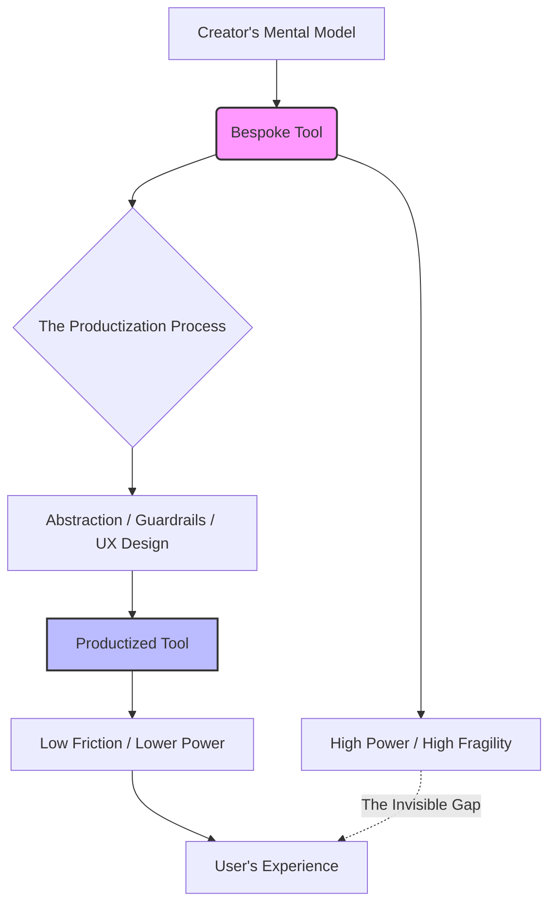

You’ve probably seen those threads on X (Twitter), Reddit, or niche tech forums. A developer mentions a custom script that handles their entire content pipeline, or a quantitative researcher hints at a private dashboard that crunches market data in seconds. When people inevitably ask for a link or the open-source repository, the response is usually a hesitant, *"I could, but if I release it, you won’t get the same experience I get."*

  
  
 <a href="https://unsplash.com/@martz90">Martin Martz</a> on <a href="https://unsplash.com/photos/a-black-and-white-photo-of-a-piece-of-paper-with-the-letter-h-on-it-hygoLHatH3M">Unsplash</a>

At first glance, this sounds like classic "gatekeeping" or a convenient excuse for messy, unoptimized code. However, there is a profound psychological and technical reality behind this statement. The "experience" of a tool isn't just about the buttons, the UI, or the feature set; it’s about the alignment between the tool's logic and the user's cognitive framework. For the creator, the fit is surgical. For everyone else, it’s like trying to read a map written in a language they’ve never studied.

---

### 🧠 The Curse of Knowledge: Why "Intuitive" is a Lie

The primary driver of this gap is a cognitive bias known as the [Curse of Knowledge](https://en.wikipedia.org/wiki/Curse_of_knowledge). This occurs when an individual, communicating with other individuals, unknowingly assumes that the others have the background to understand.

When a builder creates a tool, they aren't just writing lines of code; they are externalizing their own thought process. By the time a tool is "functional," the creator has spent hundreds of hours navigating its idiosyncrasies. They know exactly how to phrase a prompt to avoid a specific AI hallucination; they know that a certain lag in the UI actually means the data is still fetching; they know that clicking "Refresh" twice is the only way to clear a specific cache.

To the creator, the tool feels "intuitive" because they defined the intuition. But for a new user, the tool is a black box. What the creator calls a "powerful shortcut," a new user perceives as a "confusing interface" or a critical bug. 

**Stats show that in many software projects, up to 80% of the "friction" reported by new users stems from a mismatch between the developer's mental model and the user's expectations.** The creator isn't trying to hide a secret; they are acknowledging that without a massive, exhaustive manual, the tool will feel broken to anyone who didn't build it.

---

### 🛠️ The Invisible Manual and the Mental Model

In the field of Human-Computer Interaction (HCI), the concept of a [Mental Model](https://www.interaction-design.org/literature/topics/mental-model) is central. A mental model is an internal representation of how a system works. The "experience" the builder refers to is the perfect synchronization between the software and their own highly specific mental model.

Consider a power user who builds a custom AI agent for research. They might discover that the agent performs better if they provide a "negative constraint" at the very end of the prompt. This "magic trick" isn't documented—it's an implicit part of their workflow. 

When that tool is released to the public, the magic evaporates. The new user doesn't know the magic words, so they experience the AI failing. This creates a divergent perception of the tool's utility:

> **The Creator's Experience:** "This is a superpower that increases my productivity by **10x**."
> **The User's Experience:** "This thing is buggy, unpredictable, and a headache to use."

This is why many "god-tier" tools never leave the local machine. Bridging this gap requires moving from **implicit knowledge** (things the builder just "knows") to **explicit knowledge** (things written in a manual). As Don Norman explains in [The Design of Everyday Things](https://www.nngroup.com/articles/design-everyday-things/), when the "Gulf of Execution"—the gap between a user's goal and the means to execute it—is too wide, the product fails regardless of its raw power.

---

### 📉 The Cost of Abstraction: Bespoke vs. Productized

There is a fundamental tug-of-war between a "bespoke tool" (built for one) and a "product" (built for many). A bespoke tool is optimized for a sample size of **n=1**. It can be fragile, it can lack error handling, and it can rely on a very specific environment (e.g., a specific version of Python on a specific MacOS build).

To move from a bespoke tool to a product, the creator must apply **abstraction**. Abstraction is the process of removing specific details to create a more general interface. In practice, this means:

1.  **Implementing Guardrails:** Ensuring the user cannot accidentally delete their entire database with one wrong keystroke.
2.  **Simplifying the UI:** Hiding the "knobs and dials" that only the creator knows how to use, so the average user isn't overwhelmed.
3.  **Standardization:** Ensuring the tool runs on Windows, Linux, and Mac without crashing.

The catch is that **abstraction is a tax on power**. According to the principle of [Leaky Abstractions](https://joelonsoftware.com/2002/11/02/leaky-abstractions/), all non-trivial abstractions, to some degree, leak. Every guardrail added to protect a beginner is a potential limitation for the expert. The "experience" the creator loves is often the absence of these walls—they can push the tool to the absolute limit because they know exactly where the cliff edge is.

As illustrated, the path from the "Creator's Experience" to the "User's Experience" requires a filter. This filter thins out the raw capability of the original tool to make it palatable for the masses. The creator knows that by making it usable for others, they are effectively making it less powerful for themselves.

---

### 🤫 The Psychology of the "Secret Superpower"

Beyond the technical constraints, there is a psychological component: the "Secret Superpower" effect. Many developers derive a sense of identity and a competitive edge from their private toolkit. On platforms like [Hacker News](https://news.ycombinator.com), there is a culture of "dogfooding" (using your own product), but there is also a quiet pride in owning a tool that no one else has.

When you use a tool tuned specifically to your own brain, it feels less like software and more like a cognitive prosthetic. There is immense satisfaction in knowing your efficiency comes from a unique advantage that cannot be bought or downloaded.

Furthermore, releasing a tool changes the creator's role. They stop being a **Builder** and start being a **Support Agent**. Instead of using the tool to solve problems, they spend their time answering tickets and explaining basic concepts to strangers. For many, the trade-off is simple: **the joy of creation is higher than the joy of maintenance.**

---

### 🚀 Closing the Gap: The Future of Bespoke Software

Can this gap ever be fully closed? Traditionally, the answer was "no" without sacrificing power. However, we are entering a new era of software interaction.

The rise of Large Language Models (LLMs) suggests a third path. Instead of the developer building a rigid UI (the abstraction tax), the LLM can act as a **dynamic translator**. An LLM could potentially read the builder's "messy" code and the builder's implicit notes, then provide the user with a natural language interface that translates their intent into the tool's specific logic.

In this scenario:
*   The tool remains **bespoke and powerful**.
*   The user doesn't need the **builder's mental model**.
*   The AI bridges the **Gulf of Execution** in real-time.

Until that becomes the standard, the "Invisible Gap" will remain. We must recognize that some of the most innovative work happens in these private, fragile playgrounds.

### Conclusion: Embracing the Gap

When a developer says, "If I release it, you won’t get the same experience I get," they aren't being arrogant—they are being honest. They are admitting that the most potent tools are those perfectly tuned to a single human mind.

While the industry pushes for the "open-source everything" mentality, there is a legitimate place for private, bespoke tools. These tools are the laboratories of the mind, where creators can experiment without the burden of accessibility. The gap between the builder and the user isn't a bug to be fixed; it is a natural byproduct of the creative process. Sometimes, the most valuable tools are the ones that only work for the person who dreamt them up.

***

**References & Further Reading:**
*   *The Design of Everyday Things* by Don Norman.
*   [Nielsen Norman Group](https://www.nngroup.com/) - Research on User Experience and Cognitive Load.
*   [MDN Web Docs](https://developer.mozilla.org/) - Guidelines on creating accessible and intuitive software interfaces.
*   *Thinking, Fast and Slow* by Daniel Kahneman (on cognitive biases and the Curse of Knowledge).

---

## 📖 Related Reading

- [Could Motorola and GrapheneOS Actually Team Up by 2027? 🛡️](/motorolas-grapheneos-phones-will-launch-in-2027-priced-higher-than-pixels/)
- [⚖️ The Legal Paradox: Judge Rebukes USPS for Illegal Rulemaking but Refuses to Block It](/us-judge-rebukes-postal-service-over-mail-in-voting-rule-but-wont-block-it/)
- [Rohitg00/Ai-Engineering-From-Scratch/Stargazers](/rohitg00ai-engineering-from-scratchstargazers/)
