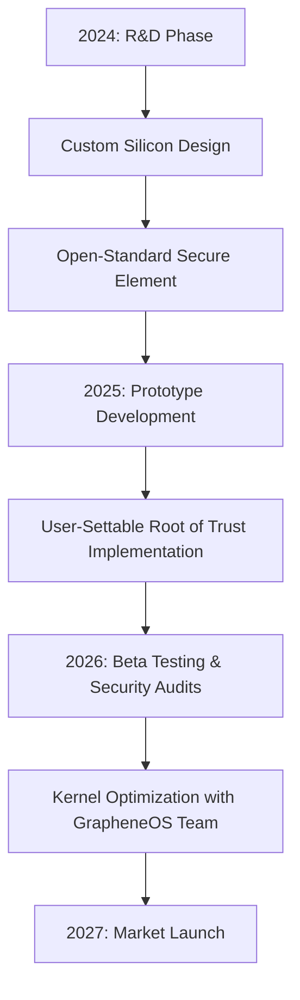

There has been a persistent hum within the cybersecurity community regarding the future of mobile privacy. The central question sparking debate is a tantalizing "what if": What if Motorola partnered with GrapheneOS for a flagship launch in 2027? 

  
  
 <a href="https://unsplash.com/@akbardotkhan">Akbar Khan</a> on <a href="https://unsplash.com/photos/a-cardboard-box-sitting-on-top-of-a-bed-8LlnnqRRL_o">Unsplash</a>

On the surface, this appears to be a logical business evolution. A high-end, "hardened" Motorola device—priced at a premium—could target the lucrative intersection of corporate executives, investigative journalists, and privacy enthusiasts who find the Google Pixel too "Google-centric" but want the security of GrapheneOS. However, transforming this speculation into a product requires more than a simple software license. To make a GrapheneOS-certified Motorola phone a reality, the company would need to dismantle and rebuild its hardware philosophy from the silicon up.

---

### 🔒 Understanding the GrapheneOS Philosophy

To understand why a Motorola partnership is so difficult, one must first understand that GrapheneOS is not a "Custom ROM" in the traditional sense. Unlike LineageOS, which aims for broad compatibility across hundreds of devices, GrapheneOS is a **security-hardened operating system** designed for a very narrow set of hardware.

GrapheneOS focuses on **attack surface reduction**. It doesn't just remove Google apps; it modifies the Android kernel to mitigate entire classes of exploits. Features like the **Hardened Malloc** (a memory allocator that prevents heap overflows) and the implementation of **Sandboxed Google Play Services** allow users to run necessary apps without granting them system-level permissions.

For these software protections to work, they must be anchored in hardware. If the hardware is compromised, the software is irrelevant. This is the "Hardware Root of Trust" problem.

---

### 📱 The Pixel Monopoly: Why GrapheneOS is Exclusive

Many users ask why GrapheneOS cannot be installed on a Motorola Razr or a Samsung Galaxy. The answer isn't corporate greed—it is technical necessity. Currently, GrapheneOS exclusively supports [Google Pixel devices](https://grapheneos.org/security#hardware) because of two non-negotiable requirements: **Verified Boot** and the **Secure Element**.

#### 1. Verified Boot with User-Settable Root of Trust
Most smartphones have a "locked bootloader" to prevent unauthorized software from booting. While some allow you to unlock the bootloader, doing so usually disables **Verified Boot**. Once the bootloader is unlocked, the chain of trust is broken; a malicious actor could potentially install a rootkit before the OS even loads.

GrapheneOS requires a device that allows the user to **re-lock the bootloader with their own custom security keys**. This creates a "User-Settable Root of Trust." It means the phone will only boot an OS that the user has personally signed, ensuring that the system has not been tampered with since installation. Motorola, like most OEMs, currently treats the bootloader as a closed gate, offering no such flexibility to the end-user.

#### 2. The Titan M2 Security Chip
The [Titan M2 security chip](https://blog.google/products/pixel/pixel-7-security/) acts as an isolated fortress. It is a discrete microcontroller (Secure Element) that handles the most sensitive operations:
*   **Key Management:** Storing cryptographic keys where the main CPU cannot access them directly.
*   **Password Verification:** Handling the "rate-limiting" of password attempts to prevent brute-force attacks.
*   **Attestation:** Proving to other services that the device is running a genuine, untampered OS.

If Motorola wants to enter this arena by 2027, they cannot simply use a standard Qualcomm Snapdragon chip. They would need to integrate a dedicated, open-standard secure element that grants the user—not the manufacturer—ultimate control.

---

### 🏢 Motorola’s Current Path: The ThinkPhone Experiment

Motorola has already signaled an interest in the "professional" market through the [ThinkPhone](https://www.motorola.com/us/thinkphone). The ThinkPhone is a masterclass in corporate integration, offering seamless connectivity with Windows and robust MDM (Mobile Device Management) support. However, from a security standpoint, it is still a consumer-grade device.

> "The ThinkPhone is designed for the professional, but it remains a consumer-grade device in terms of its bootloader and OS flexibility. It provides 'Enterprise Security,' which is fundamentally different from 'Privacy Hardening'." — Technical analysis shared via [Hacker News](https://news.ycombinator.com).

To move from "Enterprise Security" to "Hardened Privacy," Motorola would need to bridge a massive technical gap. The difference lies in **who holds the keys**. Enterprise security is about the *company* controlling the *employee's* device. GrapheneOS is about the *user* controlling the *hardware*.

---

### 🛠️ The Road to 2027: A Technical Blueprint

If Motorola intends to launch a GrapheneOS-compatible device by 2027, the R&D phase must begin immediately. The development cycle for secure hardware is significantly longer than that of standard consumer electronics.

#### The Hardware Evolution Roadmap

#### The RISC-V Wildcard
The **2027 timeline** is particularly interesting because it coincides with the projected maturation of **RISC-V**. Currently, almost all smartphones rely on ARM architecture. ARM is proprietary, meaning the exact blueprints of the CPU are secret. For true privacy advocates, "security through obscurity" is a failure.

By adopting RISC-V—an open-standard instruction set architecture—Motorola could potentially offer a phone where the hardware itself is auditable. This would be a paradigm shift, moving Motorola from a "closed-box" manufacturer to a "transparent platform" provider.

---

### 💰 The Economics of Privacy: Why It Will Be Expensive

A GrapheneOS Motorola phone will not be a budget device. We are looking at a predicted price point of **$1,200 to $1,800**. This premium is driven by four critical factors:

**1. Low Volume, High Unit Cost**
This is not a mass-market product. The target audience includes journalists in hostile environments, government officials, and high-net-worth individuals. Because the production volume will be a fraction of the Moto G series, the cost per unit will skyrocket.

**2. Specialized Hardened Components**
Standard flagships use components optimized for speed and power efficiency. A privacy phone requires components optimized for **side-channel attack resistance**. This includes high-grade electromagnetic shielding and specialized capacitors to prevent "power analysis" attacks where hackers deduce encryption keys by monitoring power consumption.

**3. Third-Party Auditing Costs**
The privacy community does not trust marketing brochures; they trust audits. To be viable, Motorola would need to pay independent security firms (like Trail of Bits or NCC Group) to perform deep-dive audits of their firmware and hardware. These audits often cost **$100,000 to $500,000 per cycle**.

**4. The "Anti-Bloatware" Premium**
As seen with the [Purism Librem](https://purism.com/) and the PinePhone, there is a proven market of users willing to pay a premium for hardware that is guaranteed to be free of manufacturer backdoors and "phone-home" telemetry.

---

### ⚖️ Vision vs. Reality: The Corporate Conflict

The primary obstacle to this partnership isn't actually technical—it's corporate. Motorola is owned by **Lenovo**. To truly embrace GrapheneOS, Motorola would have to concede control over the device.

In the current business model, OEMs make money through:
*   **Data Harvesting:** Collecting telemetry on user behavior.
*   **Ecosystem Lock-in:** Forcing users into proprietary app stores.
*   **Planned Obsolescence:** Providing 2-3 years of updates to trigger a new purchase.

GrapheneOS demands the opposite. It requires **total transparency**, **zero telemetry**, and **long-term support (potentially 10+ years)**. For Lenovo to allow this, they would have to view the "Privacy Phone" not as a consumer product, but as a "Security Service" with a high-margin hardware fee.

---

### 🏁 Final Verdict: Is it Probable?

The idea of a Motorola GrapheneOS phone in 2027 is a compelling vision of a future where the "Right to Privacy" is built into the silicon. If Motorola can pivot from being a device seller to a trust provider, they could capture a market that Google currently dominates by default.

However, until we see a Motorola device that supports **user-settable root of trust** and a **transparent secure element**, this remains a hopeful speculation. For now, the Google Pixel remains the only viable gateway to the GrapheneOS ecosystem. But as the global demand for privacy grows, the pressure on OEMs to open their hardware has never been higher.

#### Summary Checklist for the "Ideal" 2027 Motorola Privacy Phone:
*   [ ] **User-Settable Root of Trust** (Ability to lock bootloader with custom keys)
*   [ ] **Open-Source Firmware** (Modem and Bootloader)
*   [ ] **Discrete Secure Element** (Equivalent to or better than Titan M2)
*   [ ] **RISC-V Architecture** (For hardware-level transparency)
*   [ ] **10-Year Security Patch Commitment**
*   [ ] **Zero Factory-Installed Bloatware**

### References & Further Reading
*   [GrapheneOS Documentation on Hardware Security](https://grapheneos.org/security)
*   [The Android Open Source Project (AOSP) Guidelines](https://source.android.com/)
*   [RISC-V International: The Future of Open ISA](https://riscv.org/)
*   [Purism: Hardware Privacy Standards](https://purism.com/)
*   [Google Security Blog: Titan M2 Architecture](https://blog.google/products/pixel/pixel-7-security/)

---

## 📖 Related Reading

- [📱 The Great Expansion: How GrapheneOS Finally Landed on Motorola](/grapheneos-in-2027-available-on-high-end-motorola-phones/)
- [⚖️ The Legal Paradox: Judge Rebukes USPS for Illegal Rulemaking but Refuses to Block It](/us-judge-rebukes-postal-service-over-mail-in-voting-rule-but-wont-block-it/)
- [Rohitg00/Ai-Engineering-From-Scratch/Stargazers](/rohitg00ai-engineering-from-scratchstargazers/)
