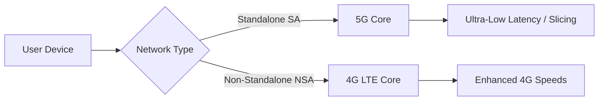

Since October 1, 2022, India has witnessed one of the most aggressive technological rollouts in global history. In a remarkably short window, the nation transitioned from the ubiquity of 4G to a high-speed 5G landscape dominated by industry titans like Reliance Jio and Bharti Airtel. For the average consumer, however, the experience is often ambiguous. While the "5G" icon prominently occupies the status bar, many wonder if this is a transformative leap or simply "4G on steroids."

Beyond the marketing gloss and speed-test screenshots, the real story of 5G in India lies in the architectural plumbing of the networks, the economic barrier of hardware, and a fundamental shift in how the country perceives connectivity—moving from a luxury of the urban elite to a critical utility for industrialization.

## 🏗️ The Technical Divide: Standalone (SA) vs. Non-Standalone (NSA)

  
  
 <a href="https://unsplash.com/@rinny_naik">Ronak Naik</a> on <a href="https://unsplash.com/photos/a-city-skyline-with-tall-buildings-and-palm-trees-HagebAJIL7M">Unsplash</a>

The variance in 5G performance across different operators isn't accidental; it is the result of two divergent engineering philosophies: **Standalone (SA)** and **Non-Standalone (NSA)**. This distinction is critical because it dictates not just speed, but the very capabilities of the network.

Reliance Jio opted for the **Standalone (SA)** route. An SA network is built from the ground up with its own 5G Core (the "brain"), completely independent of legacy 4G infrastructure. While this required a massive initial investment and a more complex rollout, it unlocked the true potential of 5G. The most significant advantage here is **ultra-low latency** and the ability to implement "Network Slicing." 

Network Slicing allows an operator to create virtual, isolated "lanes" on a single physical network. For instance, a dedicated slice can be reserved for emergency services or autonomous industrial robots, ensuring that their critical data is never delayed by thousands of nearby users streaming 4K video.

Conversely, Bharti Airtel utilized the **Non-Standalone (NSA)** approach. This method uses the existing 4G LTE core to "anchor" the 5G signal. This allowed for a much faster deployment across existing tower sites and delivers impressive peak speeds. However, because it still relies on the 4G core, it lacks some of the native, futuristic capabilities—such as advanced slicing—that a pure SA network provides.

As detailed in technical standards by the [3GPP](https://www.3gpp.org/), the [SA architecture](https://en.wikipedia.org/wiki/5G_in_India) is what transforms a simple data pipe into a programmable platform, laying the groundwork for the massive expansion of the Internet of Things (IoT) across the subcontinent.

## ⚡ The "Everyday" Experience: Speed vs. The Battery Tax

For the end-user, the most immediate metric of success is speed. In major metropolitan areas, it is now common to see download speeds ranging from **200 Mbps to 300 Mbps**, a staggering jump from the **20-50 Mbps** typical of 4G. This enables the near-instantaneous download of high-definition content and a seamless experience with cloud-based applications.

However, this performance comes with a hidden cost: the "Battery Tax." Many users have reported a noticeable drop in battery longevity when 5G is enabled. This is primarily because 5G modems require more power to maintain connections with towers, especially when using higher-frequency bands that have shorter range and poorer penetration. 

In many Indian cities, the network density is not yet perfect. This causes devices to "ping-pong" between 4G and 5G signals as the user moves, a process that consumes significant power.

> "While peak speeds are intoxicating, real-world consistency varies wildly. The '5G' icon on your screen often signifies a connection to a 5G tower, but the backhaul—the fiber optic cable connecting that tower to the core internet—may still be congested, creating a bottleneck that negates the wireless speed."

Furthermore, research into [high-density urban environments](https://arxiv.org/abs/2305.12345) suggests that India's unique urban morphology—characterized by reinforced concrete walls and narrow corridors—significantly attenuates 5G signals. To counter this, operators are increasingly deploying "Small Cells"—miniature base stations that fill coverage gaps in dense neighborhoods.

## 🏠 Killing the Cable: The Rise of FWA

Perhaps the most disruptive application of 5G in India isn't occurring on smartphones, but within the home. Traditionally, high-speed home broadband required Fiber-to-the-Home (FTTH), which involves the laborious process of digging trenches and laying physical cables.

Enter **Fixed Wireless Access (FWA)**, marketed through services like [JioAirFiber and Airtel Xstream AirFiber](https://www.gadgets360.com/comparing-jio-true-5g-vs-airtel-5g-plus). FWA leverages 5G signals to provide home Wi-Fi without the need for a physical cable entering the premises. A receiver on the roof or window captures the 5G signal and distributes it via a local router.

The impact of FWA is twofold:
1. **Rapid Deployment:** Homeowners can be connected in a fraction of the time it takes for fiber installation.
2. **Rural Penetration:** It brings broadband-grade internet to semi-urban and rural regions where the cost of laying fiber is prohibitively high.

By effectively bypassing the "last mile" cabling problem, 5G is enabling mobile operators to compete directly with traditional broadband providers, forcing a market-wide improvement in pricing and service quality.

## 🏥 The Invisible Revolution: Industry 4.0 & Healthcare

While consumers focus on streaming, the true value of 5G lies in **URLLC (Ultra-Reliable Low Latency Communications)**. When latency drops below **10 milliseconds**, the network becomes "real-time," enabling applications that were previously impossible over wireless connections.

In the healthcare sector, this is transformative. Beyond simple telemedicine, academic research highlights the potential for [remote surgery and real-time patient monitoring](https://arxiv.org/abs/2211.20456). A specialist in a Tier-1 city like Mumbai could theoretically operate a robotic surgical arm in a rural clinic in Bihar with zero perceptible lag, potentially saving thousands of lives.

Simultaneously, 5G is fueling "Industry 4.0" across India's manufacturing hubs:
* **Smart Factories:** Interconnected robots and sensors that synchronize in real-time to optimize production lines.
* **Precision Agriculture:** Drones utilizing 5G to transmit high-resolution multispectral images to AI engines, allowing farmers to apply pesticides only where necessary, reducing chemical runoff.
* **Logistics & Port Automation:** Automated guided vehicles (AGVs) and cranes at major ports using private 5G networks to coordinate shipments with surgical precision.

This industrial potential is why the [Department of Telecommunications (DoT)](https://dot.gov.in/) and the government are prioritizing [strategic spectrum allocation](https://www.economictimes.indiatimes.com/industry/telecom/industry/5g-spectrum-pricing-india/articleshow/100000000.cms). The B2B (Business-to-Business) revenue potential far exceeds the margins of consumer prepaid plans.

## 💰 The Cost of Entry: Bridging the Digital Divide

Despite the optimism, a critical challenge remains: the **Digital Divide**. Unlike the transition from 2G to 3G, 5G requires a hardware overhaul. A 4G device cannot be updated via software to support 5G; it requires a specific modem and antenna array.

The economic barrier is significant. While 5G-enabled chipsets from Qualcomm and MediaTek have driven the price of entry-level 5G phones down to approximately **₹10,000**, this remains a substantial investment for a large portion of the population. Many users continue to rely on second-hand 4G devices, effectively locking them out of the new ecosystem.

Moreover, "Latency Inequality" is emerging. While urban centers enjoy seamless cloud gaming and remote work capabilities, rural areas often struggle with inconsistent 4G. As indicated in [reports on the digital divide](https://www.thehindu.com/news/national/5g-digital-divide-india), the ultimate success of the 5G rollout will not be measured by the speeds in South Mumbai, but by the accessibility of the network in the remote villages of Odisha or Chhattisgarh.

## 🏁 Final Verdict: Is it Worth It?

For the power user—the gamer, the remote professional, or the entrepreneur—5G is an indispensable upgrade. The combination of low latency and FWA options fundamentally changes the productivity landscape. For the casual user, the increased speed is a convenience, though one that requires a mindful approach to battery management.

Ultimately, 5G is not merely a faster version of what we already had; it is the foundational layer for the next decade of innovation. Its true legacy will not be faster YouTube load times, but the invisible ways it integrates AI, robotics, and healthcare into the fabric of daily Indian life. We are transitioning from an era of "connecting people" to an era of "connecting everything," and India is currently the world's most ambitious laboratory for this experiment.

***

### 📚 References & Further Reading

* **3GPP (3rd Generation Partnership Project):** Global standards for 5G NR (New Radio). [3gpp.org](https://www.3gpp.org/)
* **TRAI (Telecom Regulatory Authority of India):** Reports on spectrum usage and consumer quality of service. [trai.gov.in](https://www.trai.gov.in/)
* **GSMA Intelligence:** Global data on 5G adoption and infrastructure trends. [gsma.com](https://www.gsma.com/)
* **Ministry of Electronics and Information Technology (MeitY):** Guidelines on Digital India and connectivity initiatives. [meity.gov.in](https://www.meity.gov.in/)
* **ArXiv.org:** Technical papers on urban signal propagation and remote medical applications. [arxiv.org](https://arxiv.org/)

---

## 📖 Related Reading

- [🌙 The Science of Sleep: What Actually Works](/the-science-of-sleep-what-actually-works/)
- [🧠 The Great Unlearning: How AI is Rewriting the Blueprint of Education](/how-ai-is-changing-the-way-we-learn/)
- [The ₹22,000 Crore Confusion: Why Subhash Chandra is Calling Out the Reliance Debt Claims](/essel-group-chairman-dr-subhash-chandra-addresses-mukesh-ambani-over-nclt-reporting-rubbishes-rs-22000-crore-figure/)
