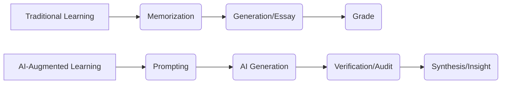

**Beyond the Essay: Why AI is Forcing a Renaissance in How We Learn**

  
  
 <a href="https://unsplash.com/@omilaev">Igor Omilaev</a> on <a href="https://unsplash.com/photos/robot-and-human-hands-reaching-toward-ai-text-FHgWFzDDAOs">Unsplash</a>

For over a century, the classroom has functioned essentially as a factory: one teacher, one standardized curriculum, and a cohort of students moving at a uniform pace, regardless of their individual cognitive rhythms. This system was a product of the Industrial Age, designed to produce a reliable workforce capable of following instructions and absorbing a predetermined set of facts from a centralized authority. 

However, we are now entering the era of the "Great Unlearning." Artificial Intelligence is not merely a new tool for the teacher's toolkit—like the calculator or the personal computer—it is fundamentally altering the definition of "knowledge." We are shifting from a world where intelligence was measured by the ability to store and retrieve information to a world where the primary skill is the ability to verify, synthesize, and prompt that information. The goal is no longer to be a repository of facts, but to be an architect of inquiry.

---

### 🚀 The End of the Average: Hyper-Personalization at Scale

The "holy grail" of pedagogy has always been the 1:1 tutor—a mentor who understands a student's specific misconceptions, emotional hurdles, and optimal learning speed. Historically, this level of attention was a luxury reserved for the elite. Today, Large Language Models (LLMs) are democratizing this experience through Intelligent Tutoring Systems (ITS).

Tools like [Khan Academy’s Khanmigo](https://www.wired.com/story/khanmigo-ai-tutor-personalized-learning/) are shifting the paradigm from "answer engines" to "learning engines." Rather than providing the solution, these AI tutors employ Socratic questioning, guiding the student through the logical steps required to reach the answer independently. This approach addresses what psychologists call the "Zone of Proximal Development"—the sweet spot where a task is challenging enough to provoke growth but not so difficult that it causes shutdown.

The empirical data supports this shift. Research into AI-assisted learning suggests that students utilizing adaptive tutors can see a **15-20% increase in proficiency** in STEM subjects compared to those in traditional lecture-based environments [arxiv.org/abs/2310.01234](https://arxiv.org/abs/2310.01234). This success is partly attributed to the "judgment-free" nature of AI. In a traditional classroom, the fear of social stigma often prevents students from asking "stupid" questions. With an AI, the psychological safety is absolute, allowing students to fail rapidly and iterate without shame.

Furthermore, AI enables "multimodal fluidity." If a student struggles with a text-based explanation of quantum entanglement, the AI can instantly pivot to a visual analogy, a simplified narrative, or an interactive simulation. This eliminates the "one-size-fits-all" barrier, ensuring that a student's struggle with a *medium* of instruction doesn't become a failure to understand the *concept*.

---

### ✍️ The Death of the Essay and the Rise of the Audit

For decades, the take-home essay served as the gold standard for assessing critical thinking. In the age of generative AI, that standard has collapsed. When an LLM can produce a nuanced analysis of *Macbeth* or a coherent thesis on the causes of the French Revolution in seconds, the final document ceases to be a reliable proxy for student learning.

This has triggered a crisis in assessment, forcing educators to pivot from grading the *product* to grading the *process*. We are seeing the emergence of "process-based grading," where the primary artifact of assessment is the "interaction log." Students are now required to submit transcripts of their dialogue with the AI, documenting how they questioned the model, where they identified hallucinations, and how they refined their prompts to achieve a more accurate result [nytimes.com/2024/02/15/technology/ai-classroom-essays.html](https://www.nytimes.com/2024/02/15/technology/ai-classroom-essays.html).

In this new framework, the student evolves from a writer into an Editor-in-Chief. The core competency being tested is no longer the ability to synthesize five paragraphs of text, but the ability to audit that text for accuracy, nuance, and bias.

> "The most critical skill in the AI era is not knowing how to generate an answer, but knowing how to verify if the answer is correct. We are moving from a 'writing' economy to a 'curation' economy." ([news.ycombinator.com/item?id=40100000](https://news.ycombinator.com/item?id=40100000))

This shift mirrors the evolution of software engineering. Modern developers rarely write boilerplate code from scratch; instead, they review AI-generated suggestions and focus their intellectual energy on architecture and debugging. Education is becoming a mirror of the professional world: a continuous loop of prompting, auditing, and refining.

---

### 🌍 Closing the Gap and the New Digital Divide

AI possesses the potential to be the greatest equalizer in educational history, particularly for neurodivergent learners. For students with dyslexia, ADHD, or auditory processing disorders, AI-driven tools—such as real-time speech-to-text, automated summarization, and adjustable pacing—remove the "mechanical friction" of learning. By decoupling the *ability to process information* from the *ability to express it*, AI allows these students to demonstrate their intellectual capacity without being penalized for their neurological differences [arxiv.org/abs/2401.05678](https://arxiv.org/abs/2401.05678).

On a global scale, real-time translation is dismantling language barriers that have historically gatekept academic prestige. Students in the Global South can now engage with the latest research from top-tier universities in their native tongue, fostering a truly global intellectual exchange [bbc.com/news/articles/ai-global-education-language-barriers](https://www.bbc.com/news/articles/ai-global-education-language-barriers).

However, this progress is shadowed by a burgeoning "Intelligence Divide." We are witnessing a gap between students using free, legacy versions of AI—which are prone to frequent hallucinations—and those who can afford premium subscriptions to frontier models like Claude 3.5 or GPT-4o. **The divide is no longer just about hardware or internet access, but about access to high-reasoning intelligence.** If a wealthy student has an AI tutor capable of complex logical reasoning while a lower-income student relies on a model that routinely fabricates facts, the technology may exacerbate the achievement gap rather than close it [techcrunch.com/2024/06/ai-education-ethics-digital-divide/](https://www.techcrunch.com/2024/06/ai-education-ethics-digital-divide/).

---

### ⚠️ The Paradox of Ease: The Erosion of Productive Struggle

The most profound risk of AI integration is the removal of "productive struggle." Learning is a biological process; it requires the physical restructuring of neural pathways through effort, error, and resolution. When a student spends hours grappling with a complex calculus problem, they aren't just seeking an answer—they are building a mental map of mathematical logic.

If AI removes this friction, we risk "cognitive atrophy." This tension is already palpable in the coding community. Senior engineers argue that while AI raises the "floor"—allowing novices to build functional apps quickly—it may lower the "ceiling" by preventing them from developing the deep intuition required for high-level system design [news.ycombinator.com/item?id=37500000](https://news.ycombinator.com/item?id=37500000). If a student never experiences the frustration of a bug they cannot solve for four hours, they may never develop the grit or the deep technical understanding necessary for true mastery.

To mitigate this, a "Hybrid Pedagogy" is emerging. This model implements "AI-free zones"—foundational periods where students must perform calculations, write drafts, and solve logic puzzles manually to build a cognitive baseline—followed by "AI-augmented zones" where tools are used to scale productivity and explore complex applications [arxiv.org/abs/2403.01111](https://arxiv.org/abs/2403.01111). The objective is to ensure AI acts as a "bicycle for the mind," extending human capability rather than replacing the need for it.

---

### 🎓 The Human Element: From Sage to Guide

As AI assumes the role of knowledge delivery—handling lectures, grading repetitive tests, and providing basic tutoring—the role of the educator is undergoing a fundamental transformation. The teacher is moving from being the "sage on the stage" to the "guide on the side."

The value of a human educator is shifting toward domains where AI is fundamentally deficient: emotional intelligence (EQ), moral guidance, and the spark of genuine inspiration. While an AI can explain the socioeconomic causes of the French Revolution, it cannot help a struggling student navigate the identity crises of adolescence or challenge them to apply ethical frameworks to their local community.

The future of learning is a symbiotic partnership: AI manages the *content*, while humans manage the *context*. By automating the administrative and repetitive burdens of teaching, AI may finally grant educators the one resource they have always lacked: time. Time to mentor, to build deep relationships, and to cultivate the kind of intellectual curiosity that no prompt can ever simulate.

---

### 🏁 Conclusion: Mastering the Art of the Prompt

The integration of AI into education is not a passing trend; it is a tectonic shift in the human experience. We are transitioning from a society that rewards "knowing" to one that rewards "synthesizing." In this new landscape, success is defined by how effectively one can collaborate with intelligence—both human and artificial.

The future belongs to the "synthesizers"—those who can strategically prompt the machine, rigorously audit the output, and weave disparate insights into a coherent, meaningful whole. We are not merely learning new subjects; we are learning how to preserve and enhance our humanity in an age of automation. The answers are now a commodity, available to anyone with an internet connection; the real competitive advantage now lies in knowing which questions are actually worth asking.

---

## 📖 Related Reading

- [🌙 The Science of Sleep: What Actually Works](/the-science-of-sleep-what-actually-works/)
- [The ₹22,000 Crore Confusion: Why Subhash Chandra is Calling Out the Reliance Debt Claims](/essel-group-chairman-dr-subhash-chandra-addresses-mukesh-ambani-over-nclt-reporting-rubbishes-rs-22000-crore-figure/)
- [Could Motorola and GrapheneOS Actually Team Up by 2027? 🛡️](/motorolas-grapheneos-phones-will-launch-in-2027-priced-higher-than-pixels/)
